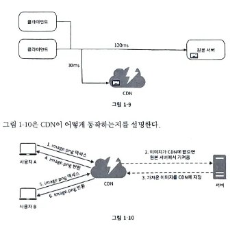
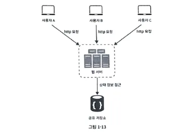
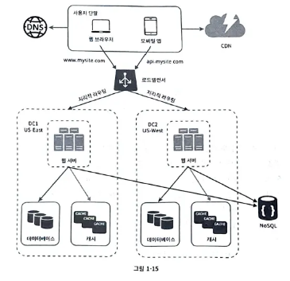
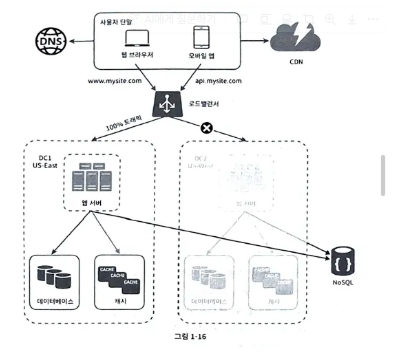
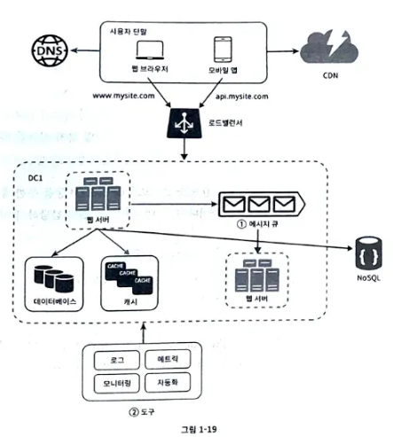
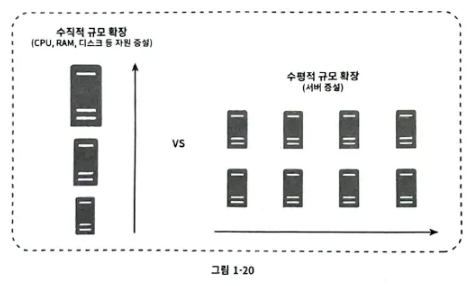
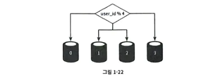

# 1장 사용자 수에 따른 규모 확장성

- 데이터베이스 이중화

  대부분의 애플리케이션은 읽기 연산의 비중이 쓰기 연산보다 훨씬 높다. 따라서 통상 부 데이터베이스의 수가

  주 데이터베이스의 수보다 많다

  데이터베이스를 다중화하면서, 더 나은 성능 안정성 ,가용성을 확보할 수 있다

- 캐시

  캐시는 값비싼 연산 결과 또는 자주 참조되는 데이터를 메모리 안에 두고, 뒤이은 요청이 보다 빨리 처리될 수 있도록 하는 저장소다

  케시 서버를 한 대만 두는 경우 해당 서버는 단일 장애 지점(Single Point of Failure, SPOF)이 되어버릴 가능성이 있다.

  위키피디아에 따르면 단일 장애 지점의 정의는 다음과 같다. "어떤 특정지점에서의 장애가 전체 시스템의 동작을 중단시켜버릴 수 있는 경우, 우리는 해당 지점을 단일 장애 지점이라고 부른다. "결과적으로, SPOF를 피하
  려면 여러 지역에 걸쳐 캐시 서버를 분산시켜야 한다.

  데이터 방출(eviction) 정책은 무엇인가? 캐시가 꽉 차버리면 추가로 캐시에 데이터를 넣어야 할 경우 기존 데이터를 내보내야 한다. 이것을 캐시 데이터 방출 정책이라 하는데, 그 가운데 가장 널리 쓰이는 것은 LRU(Least Recently Used - 마지막으로 사용된 시점이 가장 오래된 데이터를 내보내는 정책)이다.

- cdn

  사용자에게 가장 가까운 CDN 서버가 정적 콘텐츠를 전달하게 된다. 직관적으로도 당연하겠지만, 사용자가 CDN 서버로부터 멀면 멀수록 웹사이트는 천천히 로드될 것이다.

    

  cdn 사용시 고려해야 할 사항

    - 비용
        - 데이터 전송 야에 따라 과금되므로 자주 사용하지 않는 콘텐츠는 빼자
    - 적절한 만료 시한 설정
    - cdn 장애에 대한 대처
        - cdn 장애가 발생했을때 원본 서버로부터 직접 콘텐츠를 가져오자
    - 콘텐츠 무효화
        - cdn api 활용
        - 오브젝트 버저닝 이용, url 마지막에 버전 번호를 인자로, image.png?v=2
        -
- 무상태stateless 웹 계층

  웹 계층을 수평적으로 확장하려면 상태 정보(사용자 세션 데이터와 같은)를 웹 계층에서 제거하여야 한다.

  상태 정보를 관계형 데이터베이스나 NoSQL 같은 지속성 저장소에 보관하고, 필요할 때 가져오는 것이 베스트

  상태 의존적인 아키텍처의 경우 같은 클라이언트의 요청은 같은 서버로 전송되어야 한다.

  이를 위해 로드밸런서의 경우 stick session 기능을 제공하는데 이는 로드밸런서에 부담을 주고 뒷단에 서버를 추가하거나 제거하기도 까다로워진다.

    
  여기서 사용되는 공유 저장소는 관계형 db일수도, redis/memcached같은 캐시 시스템일수도, nosql일수도 있다.

- 데이터 센터

  장애가 없는 상태에서 사용자는 가장 가까운 데이터 센터로 안내되는데 이 절차를 **지리적 라우팅이**라고 한다

  지리적 라우팅에서의 geoDNS는 사용자의 위치에 따라 도메인 이름을 어떤 IP 주소로 변환할지 결
  정할 수 있도록 해 주는 DNS 서비스다.

  

  데이터 센터 중 하나에 심각한 장애가 발생하면 모든 트래픽은 장애가 없는 데이터 센터로 전송된다

    
  이 사례와 같은 다중 데이터센터 아키텍처를 만들려면 몇가지를 해결해야 한다.

    - 트래필 우회 : 올바른 데이터 센터로 트래픽을 보내는 효과적인 방법을 찾아야 한다. GeoDNS는 사용자에게서 가장 가까운 데이터센터로 트래픽을 보낼 수 있도록 해 준다.
    - 데이터 동기화 : 데이터 센터마다 별도의 데이터베이스를 사용하고 있는 상황이라면, 장애가 자동으로 복구되어(failover) 트래픽이 다른 데이터베이스로 우회된다 해도, 해당 데이터센터에는 찾는 데이터가 없을 수 있다. 이를 막기 위해서는 여러 데이터센터에 걸쳐 다중화가 필요하다.
    - 테스트와 배포 : 여러 데이터 센터를 사용해야 한다면 서비스를 여러 위치에서 테스트해봐야 한다.
- 메시지 큐

  메시지의 무손실을 보장하는 비공기 통신 컴포넌트이다. 메시지 큐의 기본 아키텍처는 생산자,발행자라 불리는 입력 서비스가 메시지를 만들어 메시지 큐에 발행하고 소비자,구독자라 불리는 서비가 해당 메시지를 받아 동작을 수행한다.

    
- 로그, 메트릭, 자동화

  규모가 작을때는 선택이었던 로그, 메트릭, 자동화가 규모가 커지면 필수가 된다

    - 로그
        - 에러로그 모니터링, 서버 단위로 모니터링 할 수도 있지만, 로그를 단일 서비스로 합쳐주는 서비스를 활용하면 더 편리하게 검색할 수 있다.
    - 메트릭
        - 호스트 단위 메트릭 :  cpu,메모리, 디스크 io
        - 종합 메트릭: 데이터베이스 계층의 성능, 캐시 계층의 성능
        - 핵심 비즈니스 메트릭 : 일별 능동사용자, 수익, 재방문
    - 자동화
        - ci,cd

    
- 데이터베이스 규모 확장

  수직 확장, 수평 확장 2가지 방법

    - 수직 확장
        - 스케일 업, 기존 서버에 더 많은 고성능의 자원(cpu,ram,디스크)을 증설하는 방법
        - 스택오버플로는 천만 명의 사용자를 마스터 데이터 베이스로 처리했었음
        - 그러나 몇가지 약점이 존재
            - 하드웨어에는 한계가 있으므로 cpu,ram등을 무한 증설할 수는 없음
            - spof 로 인한 위험 존재
            - 비용이 많이 듦
    - 수평적 확장
        - 데이터베이스의 수평적 확장을 샤딩이라고 함

     

     샤딩은 대규모 데이터베이스를 샤드라고 불리는 작은 단위로 분할하는 기술

     모든 샤드는 같은 스키마를 쓰지만 샤드에 보관되는 데이터 사이에는 중복이 없음

    - 스키마?

      데이터베이스의 구조(개체, 속성, 관계)와 제약 조건에 대한 정의

    사용자 데이터를 어느 샤드에 넣을지는 사용자id에 따라 정한다
    

    이 경우에 각 샤드 노드에는 사용자 데이터가 다음과 같이 보관된다 
     
    

    샤딩 전략을 구현할때 가장 중요한 것은 샤딩키(파티션키)를 어떻게 정하는가이다.
    
    샤딩 키를 통해 올바른 데이터베이스에 질의를 보내어 데이터 조회, 변경 효율을 높일 수 있다.
    
    또한, 샤딩키를 정할 때는 데이터를 고르게 분할 할 수 있도록 하는게 가장 중요하다.
    
    다만, 샤딩을 도입하면 새로운 문제도 생긴다
    
    - 데이터의 재샤딩
        - 데이터가 너무 많아져서 하나의 샤드로는 더 이상 감당하기 어려울때, 샤드간 데이 분포가 균등하지 못하여 특정 샤드의 공간 소모가 빨리 진행될때(샤드 소진)
        - 샤드 키를 계산하는 함수를 변경하고 데이터를 재배치해야 한다
    - 유명인사 문제
        - 핫프팟 키 문제, 특정 샤드에 질의가 집중되어 서버에 과부하가 걸리는 문제
        - 유명인사들을 하나의 샤드에 저장하는 db는 결국 read 연산 때문에 과부하가 걸리게 될 것
    - 조인과 비정규화
        - 여러 샤드 서버로 쪼개고 나면 여러 샤드에 걸친 데이터를 조인하기 어려워진다.
        - 이를 해결하기 위해서는 데이터베이스를 비정규화하여 하나의 테이블에서 질의가 수행될 수 있도록 해야 한다.
        - **샤딩**: 데이터베이스 자체를 여러 서버로 나눔 → “여러 DB를 쓴다.”
        - **파티셔닝**: 하나의 DB 안에서 테이블을 나눔 → “한 DB 안에서만 분리된다.”
    
    생산자와 소비자는  별도의 서버로 두는게 일반적
    
    - **생산자(Producer)** = 웹 서버 → 사용자의 요청을 빠르게 받아서 메시지를 큐에 넣고 바로 응답 반환 (처리를 직접 안 함)
    - **소비자(Consumer)** = Worker 서버 → 큐에서 메시지를 꺼내 실제 무거운 작업(예: 이미지 변환, 이메일 발송, 결제 처리 등)을 수행
- 정리
    - 웹 계층은 무상태 계층으로
    - 모든 계층에 다중화 도입
    - 가능한 한 많은 데이터를 캐시할 것
    - 여러 데이터 센터를 지원할 것
    - 정적 콘텐츠는 CDN을 통해 서비스할 것
    - 데이터 계층은 샤딩을 통해 그 규모를 확장할 것
    - 각 계층은 독립적 서비스로 분할할 것
    - 시스템을 지속적으로 모니터링하고, 자동화 도구들을 활용할 것