# 1. 사용자 수에 따른 규모 확장성

---

## 1.1 단일 서버

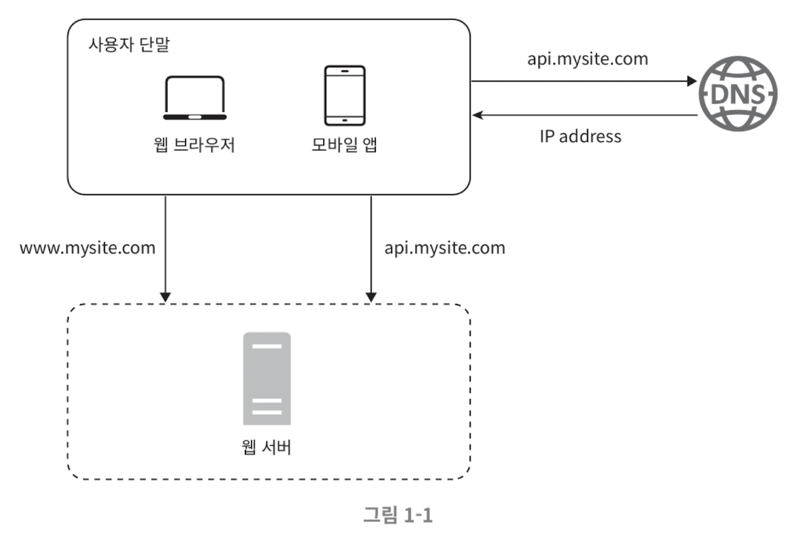

- 그림 1-1은 모든 컴포넌트가 단 한대의 서버에서 실행되는 시스템의 실제 사례이다.
- 웹 앱, 데이터베이스, 캐시 등이 전부 서버 한 대에서 실행된다.

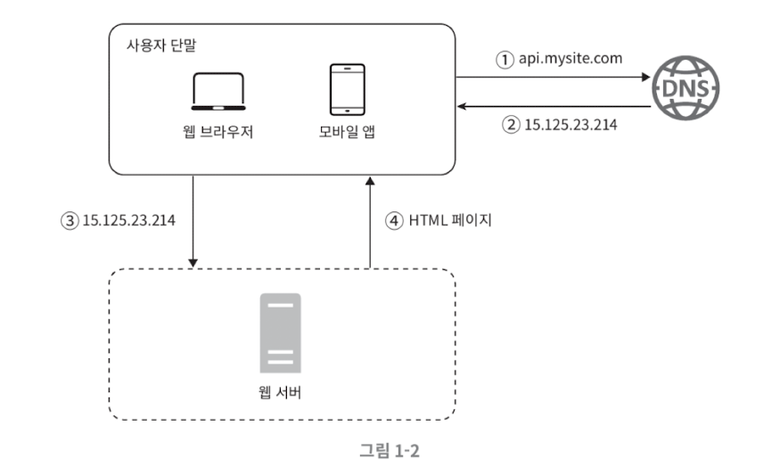

### 1.1.1 사용자 요청이 처리되는 과정

1. **사용자는 도메인 이름(api.mysite.com)을 이용하여 웹 사이트에 접속한다.**
    - DNS에 질의하여 도메인 이름을 IP 주소로 변환하는 과정이 필요하다.
    - DNS 자체는 우리 서비스의 일부는 아니다.
2. **DNS 조회 결과로 IP 주소(15.125.23.214)가 반환된다.**
3. **해당 IP 주소로 HTTP 요청이 전달된다.**
4. **요청을 받은 웹 서버는 HTML 페이지나 JSON 형태의 응답을 반환한다.**

### 1.1.2 요청을 만드는 단말

- 웹 애플리케이션
    - 비즈니스 로직, 데이터 저장 등을 처리하기 위해서는 서버 구현용 언어(자바, 파이썬 등) 사용
    - 프레젠테이션용으로는 클라이언트 구현용 언어(HTML, JS 등) 사용
- 모바일 앱
    - 모바일 앱과 웹 서버 간 통신을 위해서는 HTTP 프로토콜을 이용
    - HTTP 프로토콜을 통해서 반환될 응답 데이터의 포맷으로는 보통 JSON 이용

## 1.2 데이터 베이스

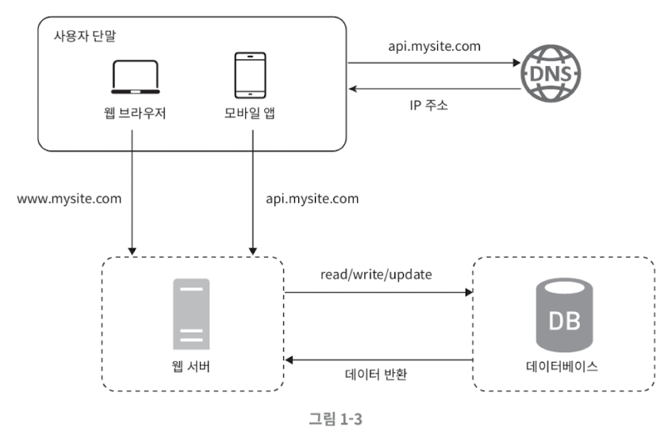

- 사용자가 늘면 서버 하나로는 충분하지 않아서 여러 서버를 두어야 한다.
    - 하나는 웹/모바일 트래픽 처리용 (웹 계층)
    - 다른 하나는 데이터베이스용 (데이터 계층)
- 위처럼 분리하면 그 각각을 독립적으로 확장해나갈 수 있다.

### 1.2.1 어떤 데이터베이스를 사용할 것인가?

- 관계형 데이터베이스 (RDBMS)
    - MySQL, Oracle, PostgreSQL 등
    - 자료를 테이블과 열, 칼럼으로 표현
    - 여러 테이블에 있는 데이터를 그 관계에 따라 조인하여 합치기 가능
- 비-관계형 데이터베이스 (NoSQL)
    - CouchDB, Neo4j, Cassandra, HBase, Amazon DynamoDB 등
    - 키-값 저장소, 그래프 저장소, 칼럼 저장소, 문서 저장소로 분류할 수 있다.
    - 조인 연산 지원 X

### 1.2.2 NoSQL이 바람직한 선택일 경우

- 아주 낮은 응답 지연시간이 요구된다.
- 다루는 데이터가 비정형이라 관계형 데이터가 아니다.
- 데이터(JSON, YAML, XML 등)를 직렬화하거나 역직렬화 할 수 있기만 하면 된다.
- 아주 많은 양의 데이터를 저장할 필요가 없다.

## 1.3 수직적 규모 확장 vs 수평적 규모 확장

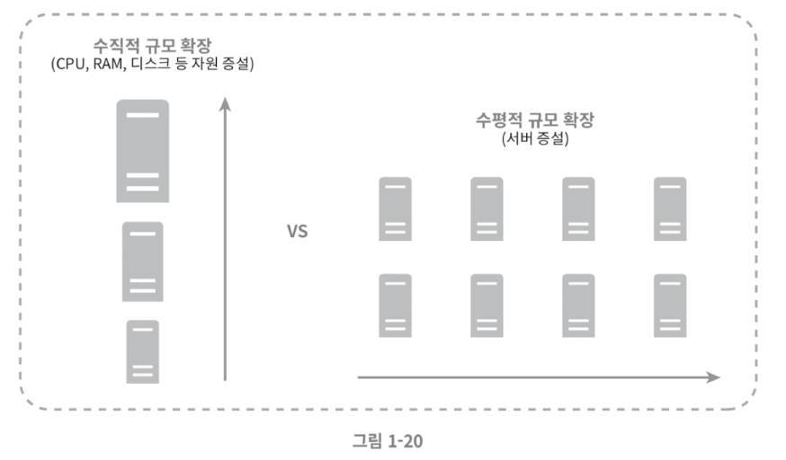

### 1.3.1 수직적 규모 확장 (스케일 업)

- 서버에 고사양 자원을 추가하는 행위
- 서버로 유입되는 트래픽 양이 적을 때 좋은 선택
- 장점
    - 단순하다
- 단점
    - 한계가 있다. 한 대의 서버에 CPU나 메모리(RAM)를 무한대로 증설할 방법은 없다. 사용자가 계속 늘어나면 한 대 서버로는 결국 감당하기 어렵다.
    - SPOF로 인한 위험성이 크다.
        - 장애에 대한 자동복구 방안이나 다중화 방안을 제시하지 않는다. 즉, 서버에 장애가 발생하면 웹사이트/앱은 완전히 중단된다.
    - 비용이 많이 든다.

### 1.3.2 수평적 규모 확장 (스케일 아웃)

- 샤딩(sharding)이라고도 부른다.
- 더 많은 서버를 추가하여 성능을 개선하는 행위
- 대규모 애플리케이션을 지원할 때 적절하다.
- 로드밸런서, 데이터베이스 다중화 등
- 샤딩은 대규모 데이터베이스를 샤드(shard)라고 부르는 작은 단위로 분할하는 기술을 일컫는다.
    - 모든 샤드는 같은 스키마를 쓰지만, 샤드에 보관되는 데이터 사이에는 중복이 없다.

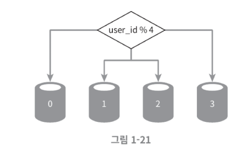

- 그림 1-21은 샤드로 분할된 데이터베이스의 예다.
- 사용자 데이터를 어느 샤드에 넣을지는 사용자 ID에 따라 정한다.
    - 이 사례에서는 `user_id % 4`를 해서 함수로 사용하여 데이터가 보관되는 샤드를 정한다.
        - 결과가 0 → 0번 샤드, 1 → 1번 샤드

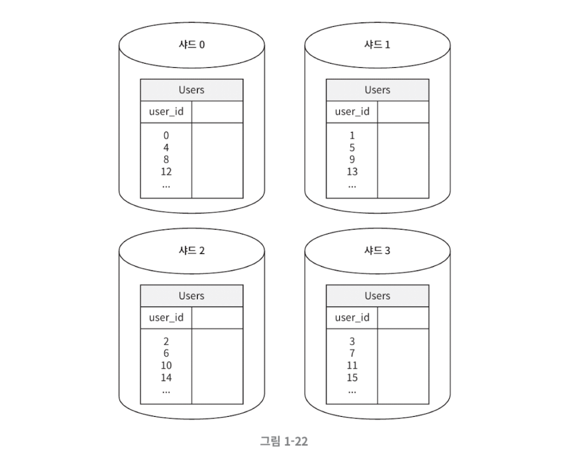

- 그림 1-22는 각 샤드 노드에 사용자 데이터가 어떻게 보관되는 지를 보여준다.
- 샤딩 전략을 구현할 때 고려해야 할 가장 중요한 것은 **샤딩 키를 어떻게 정하느냐**이다.
    - 샤딩 키는 파티션 키라고도 부른다.
    - 데이터가 어떻게 분산될 지 정하는 하나 이상의 칼럼으로 구성된다.
    - 그림 1-22의 경우, 샤딩 키는 user_id이다.
    - 샤딩 키를 통해 올바른 데이터베이스에 질의를 보내 데이터 조회나 변경을 처리 → 효율을 높일 수 있다.
    - 샤딩 키를 정할 때는 **데이터를 고르게 분할 할 수 있도록**하는게 가장 중요하다.
- 샤딩을 도입했을 때 발생하는 문제점
    - 데이터의 재 샤딩: 재 샤딩이 필요한 경우는 다음과 같다.
        - 데이터가 너무 많아져서 하나의 샤드로는 더 이상 감당하기 어려울 때
        - 샤드 간 데이터 분포가 균등하지 못하여 어떤 샤드에 할당된 공간 소모가 다른 샤드에 비해 빨리 진행될 때 (샤드 소진)
        - 해결 방법: 안정 해시 기법 활용 (5장)
    - 유명인사 문제
        - 핫스팟 키 문제라고도 부른다.
        - 특정 샤드에 질의가 집중되어 서버에 과부하가 걸리는 문제
        - 해결 방법: 유명인사 각각에 샤드 하나씩을 할당, 더 잘게 쪼개기
    - 조인과 비정규화
        - 하나의 데이터베이스를 여러 샤드 서버로 쪼개고 나면, **여러 샤드에 걸친 데이터를 조인하기가 힘들어진다.**
        - 해결 방법: 데이터베이스를 비정규화하여 하나의 테이블에서 질의가 수행될 수 있도록 한다.

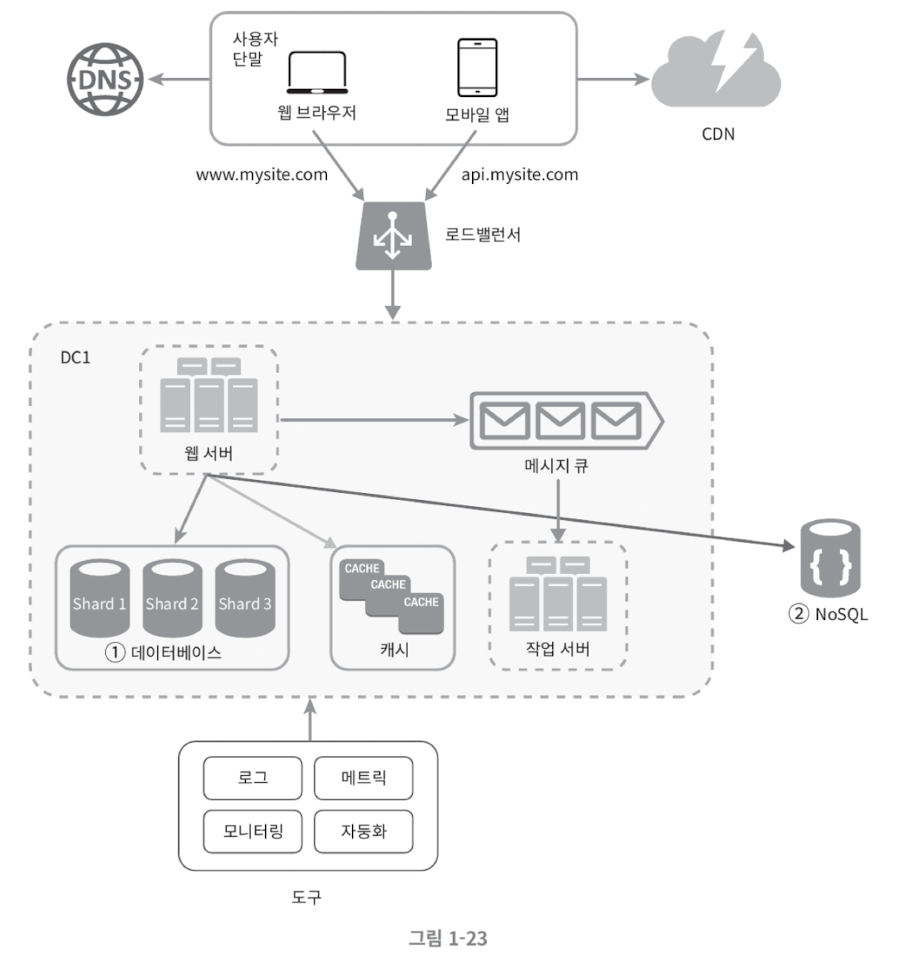

- 그림 1-23은 데이터베이스 샤딩을 적용한 아키텍처

### 1.3.3 로드밸런서

- 부하 분산 집합에 속한 웹 서버들에게 트래픽 부하를 고르게 분산하는 역할

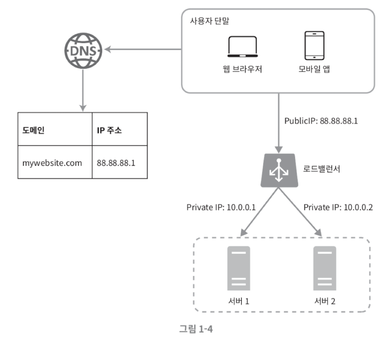

- 로드밸런서의 동작 과정
    - 사용자는 로드밸런서의 공개 IP 주소로 접속한다.
    - 따라서 웹 서버는 클라이언트의 접속을 직접 처리하지 않는다.
    - 더 나은 보안을 위해, 서버 간 통신에는 사설 IP 주소가 이용된다.
        - 같은 네트워크에 속한 서버 사이의 통신에서만 쓰이는 주소이므로, 인터넷을 통해서는 접속할 수 없다.
    - 로드밸런서는 웹 서버와 통신하기 위해 이 사설 주소를 이용한다.
    - 부하 분산 집합에 또 하나의 웹 서버를 추가하고 나면 장애를 자동 복구하지 못하는 문제가 해소 되며, 웹 계층의 가용성이 향상된다.
        - 서버 1이 다운되면 모든 트래픽은 서버 2로 전송된다. 따라서 웹 사이트 전체가 다운되는 일이 방지된다. 부하를 나누기 위해 새로운 서버를 추가할 수도 있다.
        - 웹 사이트로 유입되는 트래픽이 가파르게 증가하면 두 대의 서버로 트래픽을 감당할 수 없는 시점이 오는데, 로드밸런서가 있으므로 대처할 수 있다. 웹 서버 계층에 더 많은 서버를 추가하기만 하면 된다. 그러면 로드밸런스가 자동적으로 트래픽을 분산하기 시작할 것이다.

### 1.3.4 데이터베이스 다중화

- 많은 데이터베이스 관리 시스템이 **다중화**를 지원한다.
    - 서버 사이에 **주(master)-부(slave) 관계**를 설정하고 **데이터 원본은 주 서버**에, **사본은 부 서버**에 저장하는 방식이다.
- 쓰기 연산은 마스터에서만 지원한다.
- 부 데이터베이스는 그 사본을 전달 받으며, 읽기 연산만을 지원한다.
- DML 명령어들은 주 데이터베이스로만 전달되어야 한다.

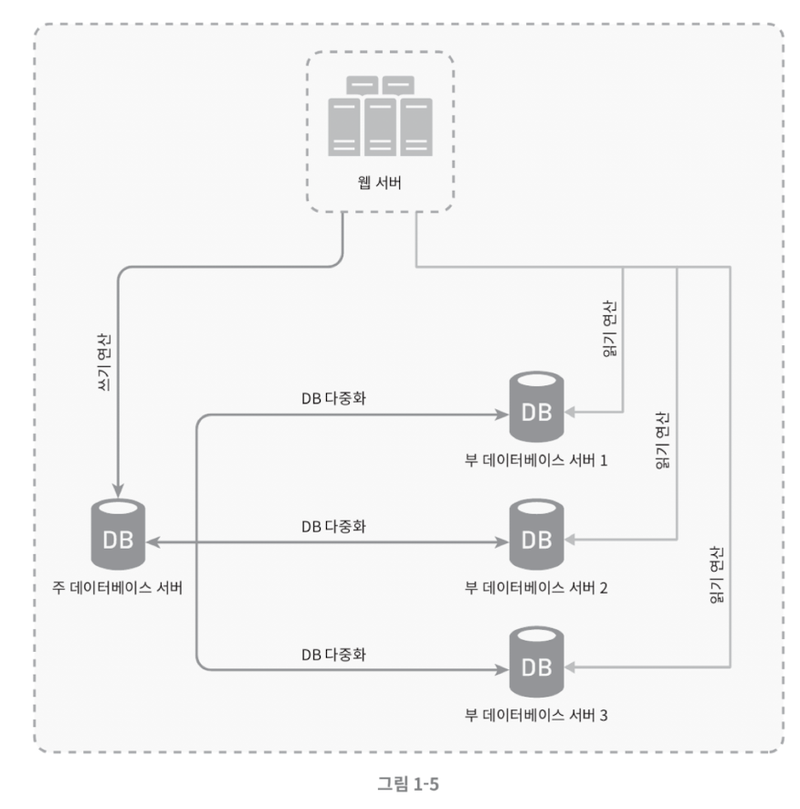

- 대부분의 애플리케이션들은 읽기 연산이 쓰기 연산보다 훨씬 많다.
    - 따라서 보통 부 데이터베이스 수가 주 데이터베이스 수보다 많다.
- 다중화의 이점
    - 더 나은 성능: 데이터 변경 연산과 읽기 연산이 분산되므로 병렬 처리할 수 있는 질의 수가 늘어난다. 따라서 성능이 좋아진다.
    - 안정성: 데이터를 지역적으로 떨어진 여러 장소에 다중화 시켜 놓을 수 있으므로 자연 재해 등이 발생해도 데이터가 보존된다
    - 가용성: 데이터를 여러 지역에 복제해 둠으로써, 하나의 데이터베이스 서버에 장애가 발생하더라도 다른 서버에 있는 데이터를 가져와 계속 서비스할 수 있게 된다.
- 데이터베이스 서버 가운데 하나가 다운되면 무슨 일이 벌어질까?
    - 그림 1-5에 제시한 설계는 이런 상황을 감당할 수 있다.
    - **부 서버가 한 대 뿐인데 다운된 경우**
        - 읽기 연산은 한시적으로 모두 주 데이터베이스로 전달된다.
        - 즉시 새로운 부 데이터베이스 서버가 장애 서버를 대체할 것이다.
    - **부 서버가 여러 대인데 다운된 경우**
        - 읽기 연산은 나머지 부 데이터베이스 서버들로 분산된다.
        - 새로운 부 데이터베이스 서버가 장애 서버를 대체할 것이다.
    - **주 데이터베이스 서버가 다운된 경우**
        - 한 대의 부 데이터베이스만 있는 경우
            - 해당 부 데이터베이스 서버가 새로운 주 서버가 된다.
            - 모든 데이터베이스 연산은 일시적으로 여기서 수행된다.
            - 그리고 새로운 부 서버가 추가된다.
        - 프로덕션 환경(실제 사용자에게 서비스하는 환경)에서 벌어지는 일은 훨씬 복잡하다.
            - 부 서버에 보관된 데이터가 최신 상태가 아닐 수 있기 때문.
                - 이 경우는 **복제 지연**이 발생된 경우를 말한다.
                    1. 데이터 손실: 주 서버가 다운되었는데 아직 주 서버의 최근 10초간의 트랜잭션(데이터 변경 사항)을 전달받아 반영하지 못한 상태.
                    2. 데이터 불일치 및 혼란: 두 서버에서 동일한 정보를 조회한 사용자들이 서로 다른 결과를 보게 된다. (어떤 서버에서는 최신 상태 반영, 어떤 서버에서는 미반영)
                - 복제 지연은 어떤 경우에 발생할까?
                    - 비동기 복제 방식의 채택, 물리적 및 시스템적 한계 등
            - 없는 데이터는 복구 스크립트를 돌려서 추가해야 한다.
            - 다중 마스터나 원형 다중화 방식을 도입하면 이런 상황에 대체하는 데 도움이 될 수 있다.

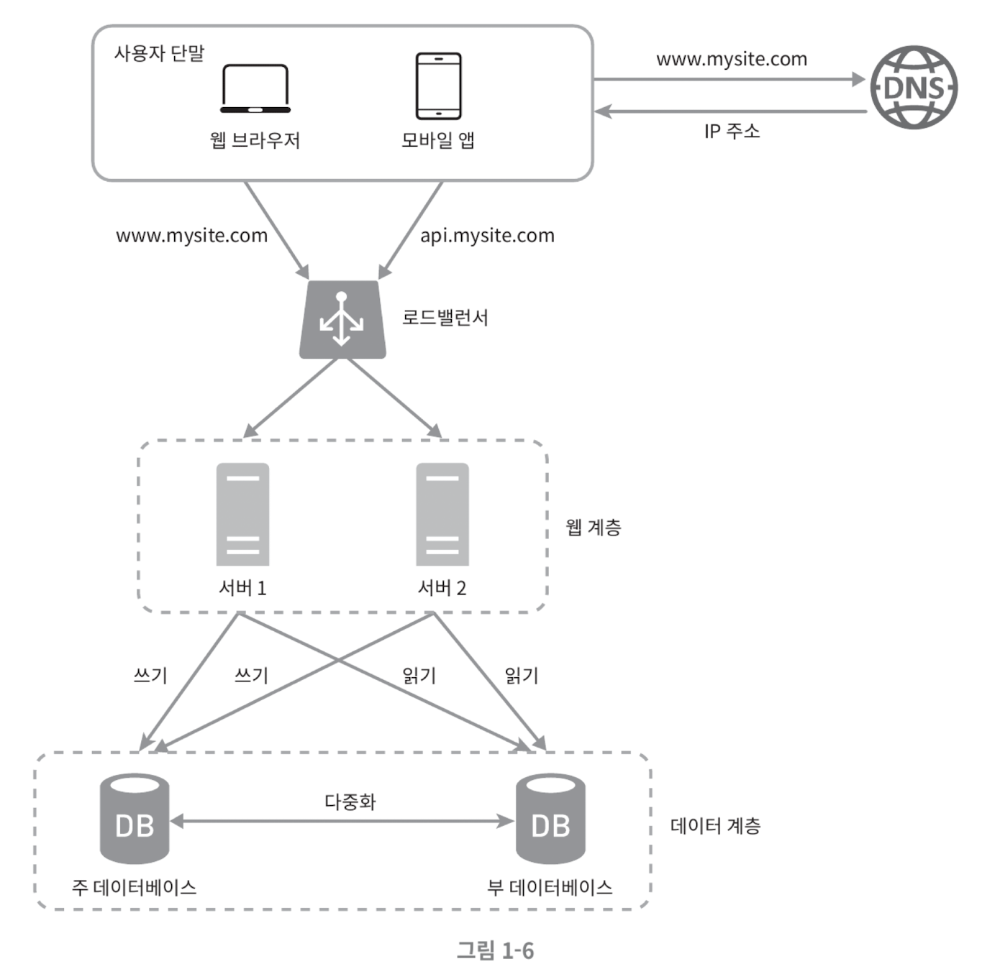

- 위 그림은 로드밸런서와 데이터베이스 다중화를 고려한 설계이다.
- 동작 과정
    - 사용자는 DNS로부터 로드 밸런서의 공개 IP 주소를 받는다.
    - 사용자는 해당 IP 주소를 사용해 로드밸런서에 접속한다.
    - HTTP 요청은 서버 1이나 서버 2로 전달된다.
    - 웹 서버는 사용자의 데이터를 부 데이터베이스 서버에서 읽는다.
    - 웹 서버는 데이터 변경 연산은 주 데이터베이스로 전달한다. DML 연산이 이에 해당한다.

### 1.3.5 응답 시간

- 응답 시간을 개선하는 방법
    - 캐시를 붙인다.
    - 정적 콘텐츠를 콘텐츠 전송 네트워크(CDN)로 옮긴다.

## 1.4 캐시

- 캐시는 값비싼 연산 결과 또는 자주 참조되는 데이터를 메모리 안에 두고, 뒤 이은 요청이 보다 빨리 처리될 수 있도록 하는 저장소다.
- 웹 페이지를 새로고침 할 때마다 표시할 데이터를 가져오기 위해 한 번 이상의 데이터베이스 호출이 발생한다.
- 애플리케이션 성능은 DB를 얼마나 자주 호출하냐에 크게 좌우되는데, 캐시는 그런 문제를 완화할 수 있다.

### 1.4.1 캐시 계층

- 데이터가 잠시 보관되는 곳. 데이터베이스보다 훨씬 빠르다.
- 별도의 캐시 계층을 두면 성능 개선, 데이터베이스의 부하 감소, 캐시 계층의 규모를 독립적으로 확장하는 것이 가능하다.

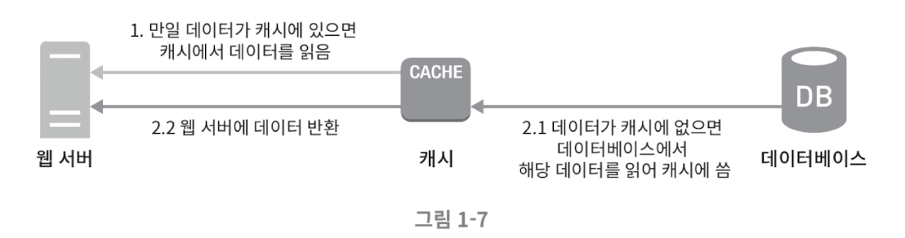

- **읽기 주도형 캐시 전략**
    - 요청을 받은 웹 서버는 캐시에 응답이 저장되어 있는지 확인.
    - 만일 저장되어 있다면 해당 데이터를 클라이언트에게 반환
    - 없는 경우에는 데이터베이스 질의를 통해 데이터를 찾아 캐시에 저장한 뒤 클라이언트에 반환
- 이것 외에도 다양한 캐시 전략이 있는데, 캐시할 데이터 종류, 크기, 액세스 패턴에 맞는 캐시 전략을 선택하면 된다.
- 캐시 서버를 이용하는 방법은 간단한데 대부분의 캐시 서버들이 일반적으로 널리 쓰이는 프로그래밍 언어로 API를 제공하기 때문이다.

### 1.4.2 캐시 사용 시 유의할 점

- **캐시는 어떤 상황에서 바람직한가?**
    - 데이터 갱신은 자주 일어나지 않지만 참조는 빈번하게 일어난다면 고려해볼 만 하다.
- **어떤 데이터를 캐시에 두어야 하는가?**
    - 캐시는 데이터를 휘발성 메모리에 둔다.
        - 캐시 서버 재시작 → 캐시 내에 모든 데이터는 사라짐
    - 따라서 영속적으로 보관할 데이터를 캐시에 두는 것은 바람직하지 않다.
- **캐시에 보관된 데이터는 어떻게 만료되는가?**
    - 즉, 따로 만료 정책을 마련해 둬야 한다.
    - 만료된 데이터는 캐시에서 삭제되어야 한다.
    - 만료 기간은 너무 짧지도, 길지도 않은 적당한 기간을 정해야 한다.
- **일관성은 어떻게 유지되는가?**
    - 일관성이란? `데이터 저장소의 원본 = 캐시 내의 사본`인지의 여부
    - 저장소의 원본을 갱신하는 연산과 캐시를 갱신하는 연산이 단일 트랜잭션으로 처리되지 않는 경우 이 일관성은 깨질 수 있다.
    - 시스템 확장 시 이게 어려운 문제가 된다.
        - 페이스북 논문 참조
- 장애에는 어떻게 대처할 것인가?
    - 캐시 서버를 한 대만 두는 경우 해당 서버는 단일 장애 지점(SPOF)이 되어버릴 가능성이 있따.
        - 단일 장애 지점: 어떤 특정 지점에서의 장애가 전체 시스템의 동작을 중단시켜버릴 수 있는 경우, 해당 지점
    - SPOF를 피하려면 여러 지역에 걸쳐 캐시 서버를 분산시켜야 한다.
- 캐시 메모리는 얼마나 크게 잡을 것인가?
    - 캐시 메모리가 너무 작으면 액세스 패턴에 따라서는 데이터가 너무 자주 캐시에서 밀려나버려 캐시의 성능이 떨어지게 된다.
    - 캐시 메모리를 과할당하는 것이 이를 막을 방법 중 하나이다.
        - 캐시에 보관될 데이터가 갑자기 늘어났을 때 생길 문제도 방지 가능.
- 데이터 방출 정책은 무엇인가?
    - **캐시 데이터 방출 정책**: 캐시가 꽉 차버리면 추가로 캐시에 데이터를 넣어야 할 경우 기존 데이터를 내보내야 한다.
        - LRU: 마지막으로 사용된 시점이 가장 오래된 데이터를 내보내는 정책
        - LFU: 사용된 빈도가 가장 낮은 데이터를 내보내는 정책
        - FIFO: 가장 먼저 캐시에 들어온 데이터를 가장 먼저 내보내는 정책

## 1.5 콘텐츠 전송 네트워크(CDN)

- CDN은 정적 콘텐츠를 전송하는 데 쓰이는, 지리적으로 분산된 서버의 네트워크이다.
    - 이미지, 비디오, CSS, JS 파일 등을 캐시할 수 있다.
- 동적 콘텐츠 캐싱은 상대적으로 새로운 개념 → 이 책에서는 다루지 않는다.
    - 간단하게 요약하면, 요청 경로, 질의 문자열, 쿠키, 요청 헤더 등의 정보에 기반하여 HTML 페이지를 캐시하는 것.
- 어떤 사용자가 웹사이트를 방문하면, 그 사용자에게 가장 가까운 CDN 서버가 정적 콘텐츠를 전달하게 된다.
    - 사용자가 CDN 서버로부터 멀면 멀수록 웹 사이트는 천천히 로드될 것이다.

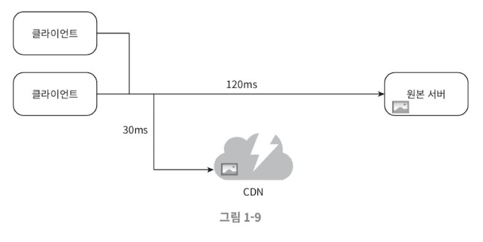

- 그림 1-9는 CDN이 사이트 로딩 시간을 어떻게 개선하는지 보여주는 예이다.

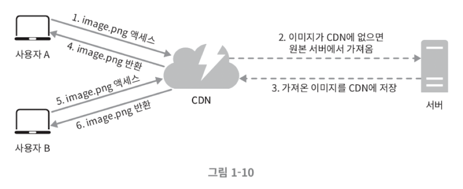

- 그림 1-10은 CDN의 동작 방식을 나타낸다.
    1. 사용자 A가 이미지 URL을 이용해 `image.png`에 접근한다. URL의 도메인은 CDN 서비스 사업자가 제공한 것이다.
    2. CDN 서버의 캐시에 해당 이미지가 없는 경우, 서버는 원본 서버에 요청하여 파일을 가져온다. 원본 서버는 웹 서버일 수도 있고, 아마존 S3 같은 온라인 저장소일 수도 있다.
    3. 원본 서버가 파일을 CDN 서버에 반환한다. 응답의 HTTP 헤더에는 해당 파일이 얼마나 오래 캐시될 수 있는지를 설명하는 TTL 값이 들어 있다.
    4. CDN 서버는 파일을 캐시하고 사용자 A에게 반환한다. 이미지는 TTL에 명시된 시간이 끝날 때까지 캐시된다.
    5. 사용자 B가 같은 이미지에 대한 요청을 CDN 서버에 전송한다.
    6. 만료되지 않은 이미지에 대한 요청을 캐시를 통해 처리된다.

### 1.5.1 CDN 사용 시 고려해야 할 사항

- 비용: CDN은 보통 제3 사업자에 의해 운영되며, CDN으로 들어가고 나가는 데이터 전송 양에 따라 요금을 내게 된다. 자주 사용되지 않는 콘텐츠를 캐싱하는 것은 이득이 크지 않으므로 빼는 것을 고려한다.
- 적절한 만료 시한 설정: 시의성이 중요한 콘텐츠의 경우 만료 시점을 잘 정해야 한다. 너무 길지도 않고 짧지도 않아야 하는데, 너무 길면 콘텐츠의 신선도는 떨어지고, 너무 짧으면 원본 서버에 빈번히 접속하게 되어서 좋지 않다.
- CDN 장애에 대한 대처 방안: CDN 자체가 죽었을 경우 웹사이트/애플리케이션이 어떻게 동작해야 하는지 고려해야 한다.
    - ex) 일시적으로 CDN이 응답하지 않을 경우, 해당 문제를 감지하여 원본 서버로부터 직접 콘텐츠를 가져오도록 클라이언트를 구성하는 것이 필요하다.
- 콘텐츠 무효화 방법: 아직 만료되지 않은 콘텐츠라 하더라도 아래 방법 가운데 하나를 쓰면 CDN에서 제거할 수 있다.
    - CDN 서비스 사업자가 제공하는 API를 이용하여 콘텐츠 무효화
    - 콘텐츠의 다른 버전을 서비스하도록 오브젝트 버저닝 이용.
    - 콘텐츠의 새로운 버전을 지정하기 위해서는 URL 마지막에 버전 번호를 인자로 주면 된다.

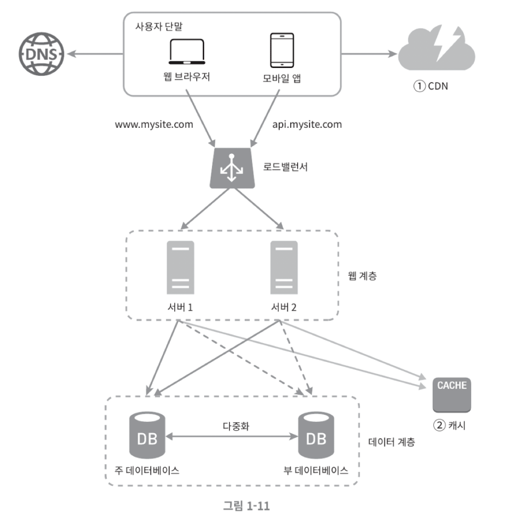

- 그림 1-11은 CDN과 캐시가 추가된 설계이다.
- 변화된 부분
    1. 정적 콘텐츠(JS, CSS, 이미지 등)는 더 이상 웹 서버를 통해 서비스하지 않으며, CDN을 통해 제공하여 더 나은 성능을 보장한다.
    2. 캐시가 데이터베이스 부하를 줄여준다.

## 1.6 무상태(stateless) 웹 계층

- 웹 계층을 수평적으로 확장하는 방법
    - 상태 정보(사용자 세션 데이터와 같은)를 웹 계층에서 제거하여야 한다.
    - 바람직한 전략은 상태 정보를 관계형 데이터베이스나 NoSQL 같은 지속성 저장소에 보관하고, 필요할 때 가져오도록 하는 것이다.
    - 이렇게 구성된 웹 계층을 무상태 웹 계층이라 부른다.

### 1.6.1 상태 정보 의존적인 아키텍처

- 상태 정보를 보관하는 서버는 클라이언트 정보, 즉 상태를 유지하여 요청들 사이에 공유되도록 한다. 무상태 서버에는 이런 장치가 없다.
    
    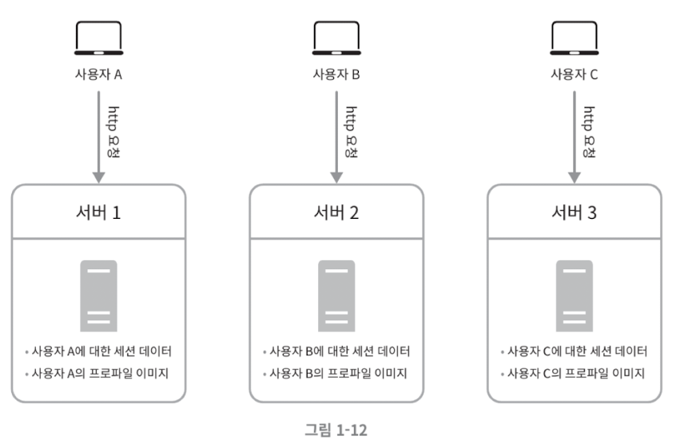
    
- 위 그림 1-12는 상태 정보 의존적인 아키텍처
    - 사용자 A의 세션 정보나 프로파일 이미지 같은 상태 정보는 서버 1에 저장된다.
    - 사용자 A를 인증하기 위해 HTTP 요청은 반드시 서버 1로 전송되어야 한다.
    - 요청이 서버 2로 전송되면 인증을 실패할 것인데, 서버 2에 사용자 A에 관한 데이터는 보관되어 있지 않기 때문이다.
    - 마찬가지로, 사용자 B로부터의 HTTP 요청을 전부 서버 2로 전송되어야 하고, 사용자 C로부터의 요청을 전부 서버 3으로 전송되어야 한다.
- 문제는 같은 클라이언트로부터의 요청은 항상 같은 서버로 전송되어야 한다는 것이다.
    - 대부분의 로드밸런서가 이를 지원하기 위해 고정 세션이라는 기능을 제공하고 있는데, 이는 로드밸런서에 부담을 준다.
    - 게다가 로드밸런서 뒷단에 서버를 추가하거나 제거하기도 까다로워진다.
    - 이들 서버의 장애를 처리하기도 복잡해진다.

### 1.6.2 무상태 아키텍처

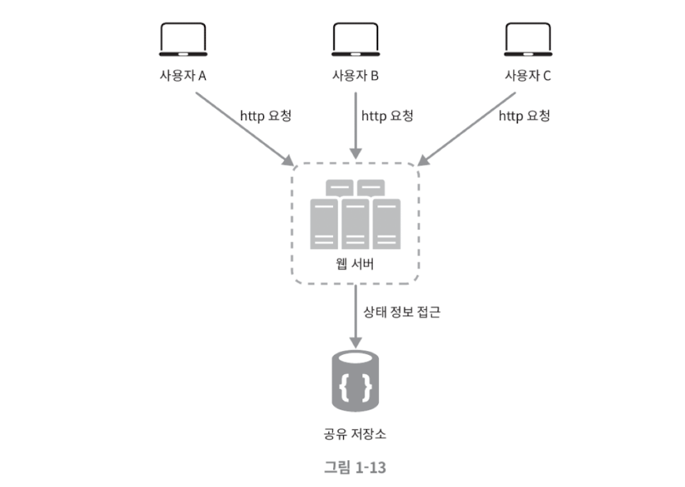

- 그림 1-13은 무상태 아키텍처를 보여준다.
- 이 구조에서 사용자로부터의 HTTP 요청은 어떤 웹 서버로도 전달될 수 있다.
- 웹 서버는 상태 정보가 필요할 경우 공유 저장소로부터 데이터를 가져온다.
- 따라서 **상태 정보는 웹 서버로부터 물리적으로 분리되어 있다.**
- 이런 구조는 단순하고, 안정적이며, 규모 확장이 쉽다.

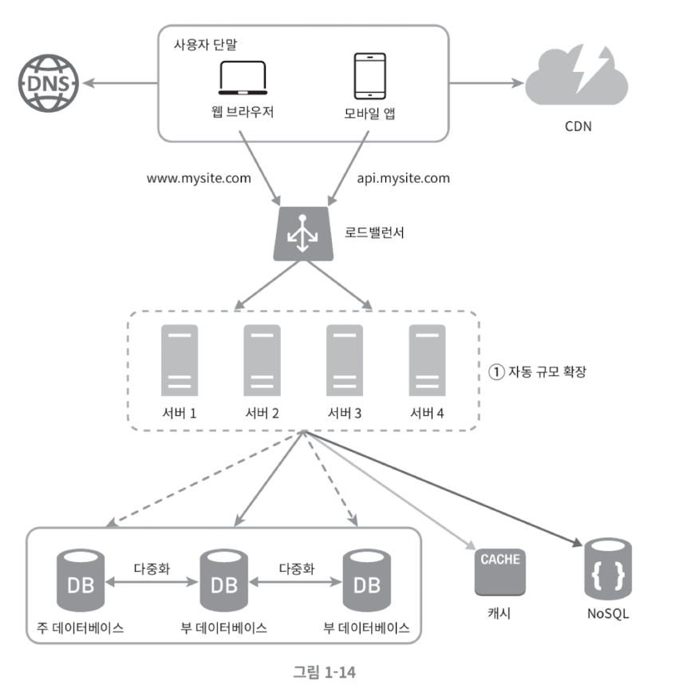

- 그림 1-14는 무상태 웹 계층을 갖도록 기존 설계를 변경한 결과이다.
    - 세션 데이터를 웹 계층에서 분리하고 지속성 데이터 보관소에 저장한다.
        - 이 공유 저장소는 관계형 데이터베이스일 수도 있고, Memcached/Redis 같은 캐시 시스템일 수도 있으며, NoSQL일 수도 있따.
    - 여기서는 NoSQL을 사용했다. (규모 확장이 간편하기 때문에)
    - 자동 규모 확장은 트래픽 양에 따라 웹 서벌르 자동으로 추가하거나 삭제하는 기능을 뜻한다.
        - 상태 정보가 웹 서버들로부터 제거되었으므로, 트래픽 양에 따라 웹 서버를 넣거나 빼기만 하면 자동으로 규모를 확장할 수 있다.

## 1.7 데이터 센터

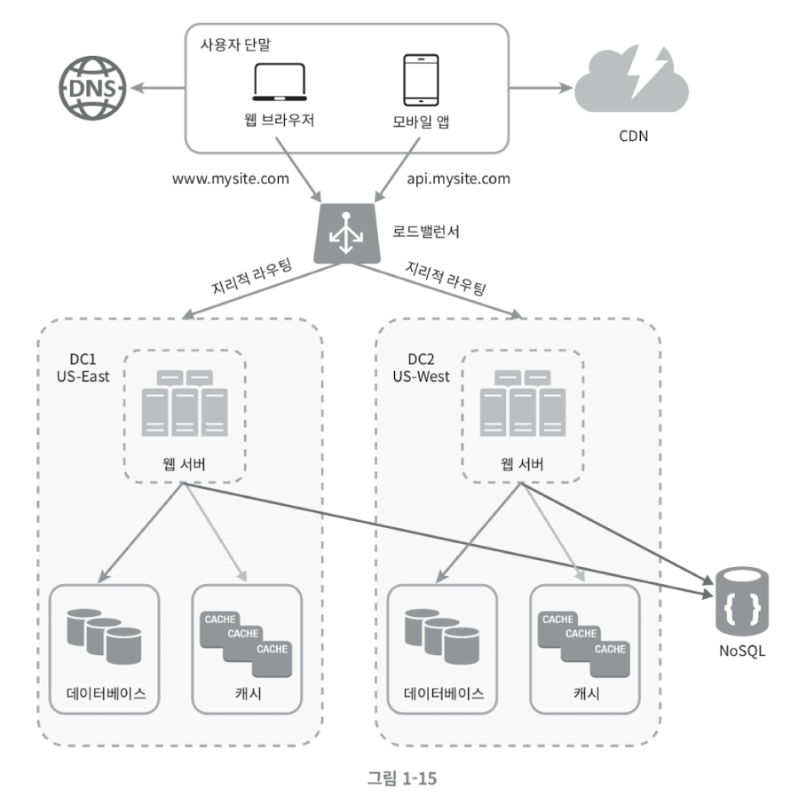

- 그림 1-15는 두 개의 데이터 센터를 이용하는 사례다.
- 장애가 없는 상황에서 사용자는 가장 가까운 데이터 센터로 안내되는데, 이 절차를 **지리적 라우팅**이라고 부른다.
    - 지리적 라우팅에서의 geoDNS는 사용자의 위치에 따라 도메인 이름을 어떤 IP 주소로 변환할 지 결정할 수 있도록 해 주는 DNS 서비스다.
- 이 예제의 경우, 그 결과로 x% 사용자는 US-East 센터로, 그리고 (100-x)%의 사용자는 US-West 센터로 안내된다고 하자.
    - 이들 데이터 센터 중 하나에 심각한 장애가 발생하면 모든 트래픽은 장애가 없는 데이터 센터로 전송된다.
    - 그림 1-16은 데이터센터2(US-West)에 장애가 발생하여 모든 트래픽이 데이터센터1(US-East)로 전송되는 상황을 보여준다.
        
        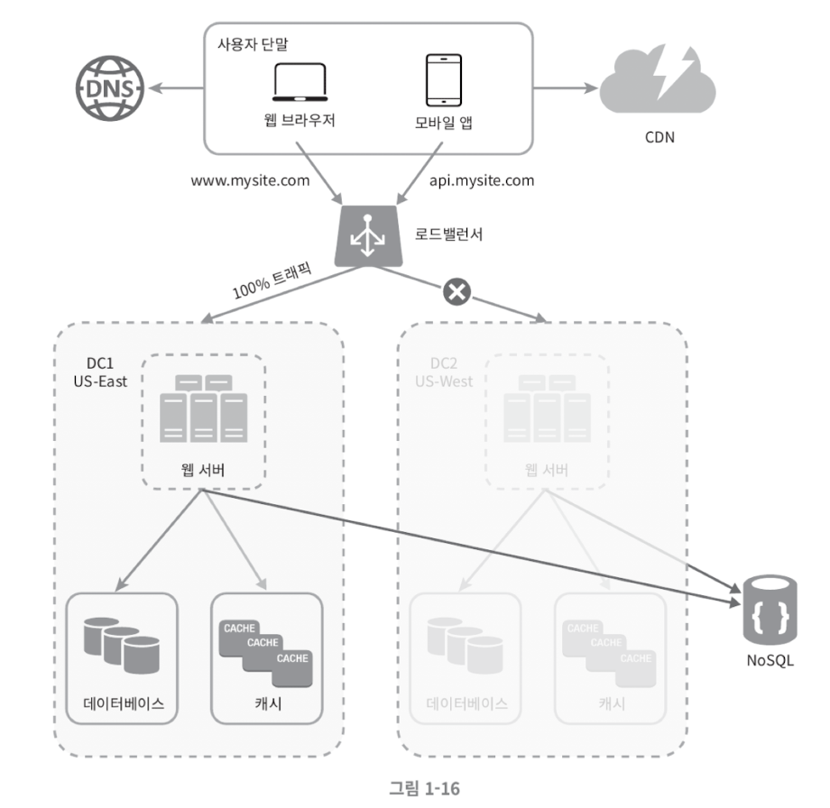
        
- 이 사례와 같은 다중 데이터센터 아키텍처를 만들려면 몇 가지 기술적 난제를 해결해야 한다.
    - 트래픽 우회: 올바른 데이터 센터로 트래픽을 보내는 효과적인 방법을 찾아야 한다. **GeoDNS는 사용자에게서 가장 가까운 데이터센터로 트래픽을 보낼 수 있도록** 해준다.
    - 데이터 동기화: 데이터 센터마다 별도의 데이터베이스를 사용하고 있는 상황이라면, 장애가 자동으로 복구되어 트래픽이 다른 데이터베이스로 우회된다 해도, 해당 데이터센터에는 찾는 데이터가 없을 수 있다. 이런 상황을 막는 보편적 전략은 **데이터를 여러 데이터센터에 걸쳐 다중화하는 것이다.**
    - 테스트와 배포: 여러 데이터 센터를 사용하도록 시스템이 구성된 상황이라면 웹 사이트 또는 애플리케이션을 여러 위치에서 테스트해 보는 것이 중요하다. 자동화된 배포 도구는 모든 데이터 센터에 동일한 서비스가 설치되도록 하는 데 중요한 역할을 한다.
- 시스템을 더 큰 규모로 확장하기 위해서는 시스템의 컴포넌트를 분리하여 각기 독립적으로 확장될 수 있도록 해야 한다.
    - **메세지 큐**는 많은 실제 분산 시스템이 이 문제를 해결하기 위해 채택하는 핵심 전략 중 하나다.

## 1.8 메세지 큐

- 메세지 큐는 메세지의 **무손실**(메세지 큐에 일단 보관된 메세지는 소비자가 꺼낼 때까지 안전히 보관된 다는 특성)을 보장하는 **비동기 통신**을 지원하는 컴포넌트다.
- 메세지의 버퍼 역할을 하며 비동기적으로 전송한다.

### 1.6.1 메시지 큐의 아키텍처

- 생산자 또는 발행자라고 불리는 **입력 서비스가 메세지를 만들어 메세지 큐에 발행**한다.
- 큐에는 보통 소비자/구독자라 불리는 서비스/서버가 연결되어 있는데, **메세지를 받아 그에 맞는 동작을 수행**하는 역할을 한다.

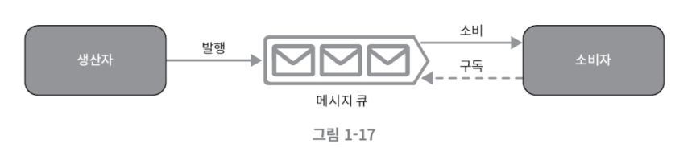

- 메세지 큐를 이용하면 서비스 또는 서버 간 결합이 느슨해져서, 규모 확장성이 보장되어야 하는 안정적 애플리케이션을 구성하기 좋다.
    - 생산자는 소비자 프로세스가 다운되어 있어도 메세지를 발행할 수 있고, 소비자는 생산자 서비스가 가용한 상태가 아니더라도 메세지를 수신할 수 있다.
- 사용 예
    
    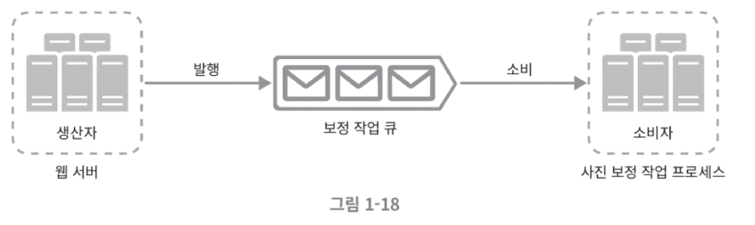
    
    - 이미지의 크로핑, 샤프닝, 블러링 등을 지원하는 사진 보정 애플리케이션 → 시간 오래 걸림 → 비동기 처리가 편리
    - 그림 1-18에서 웹 서버는 사진 보정 작업(job)을 메세지 큐에 넣는다.
    - 사진 보정 작업(worker) 프로세스들은 이 작업을 메세지 큐에서 꺼내어 비동기적으로 완료한다.
    - 이렇게 하면 생산자와 소비자 서비스의 규모는 각기 독립적으로 확장될 수 있다.
    - 큐의 크기가 커지면 더 많은 작업 프로세스(worker)를 추가해야 처리 시간을 줄일 수 있다.
    - 하지만 큐가 거의 항상 비어있는 상태(즉, job 별로 안 들어오는 상태)라면, 작업 프로세스의 수는 줄일 수 있을 것이다.

## 1.9 로그, 메트릭 그리고 자동화

- 몇 개 서버에서 실행되는 소규모 웹 사이트를 만들 때는 로그나 메트릭, 자동화 같은 것은 하면 좋지만 꼭 할 필요는 없었다.
- 하지만 웹 사이트와 함께 사업 규모가 커지고 나면, 그런 도구에 필수적으로 투자해야 한다.
    - 로그: 에러 로그를 모니터링 하는 것은 중요하다. 에러 로그는 서버 단위로 모니터링 할 수도 있지만, 로그를 단일 서비스로 모아주는 도구를 활용하면 더 편리하게 검색하고 조회할 수 있다.
    - 메트릭: 메트릭을 잘 수집하면 사업 현황에 관한 유용한 정보를 얻을 수도 있고, 시스템의 현재 상태를 손쉽게 파악할 수도 있다. 메트릭 가운데 특히 유용한 것을 몇 가지 살펴보자.
        - host 단위 metric: CPU, 메모리, disk I/O에 관한 메트릭
        - 종합 metric: DB 계층의 성능, 캐시 계층의 성능
        - 핵심 비즈니스 metirc: 일별 능동 사용자, 재방문
    - 자동화: 시스템이 크고 복잡해지면 생산성을 높이기 위해 자동화 도구를 활용해야 한다. 지속적 통합(CI)을 도와주는 도구를 활용하면 개발자가 만드는 코드가 어떤 검증 절차를 자동으로 거치도록 할 수 있어서 문제를 쉽게 감지할 수 있다. 이 외에도 빌드, 테스트, 배포 등의 절차를 자동화할 수 있어서 개발 생산성을 크게 향상시킬 수 있다.

### 1.9.1 메시지 큐, 로그, 메트릭, 자동화 등을 반영하여 수정한 설계안

- 그림 1-19는 이들 도구들과 메세지 큐를 적용하여 수정한 설계다. 지면 관계상 하나의 데이터센터만 그림에 포함시켰다.
    1. 메세지 큐는 각 컴포넌트가 보다 느슨한 결합될 수 있도록 하고, 결함에 대한 내성을 높인다.
    2. 로그, 모니터링, 메트릭, 자동화 등을 지원하기 위한 장치를 추가한다.
    
    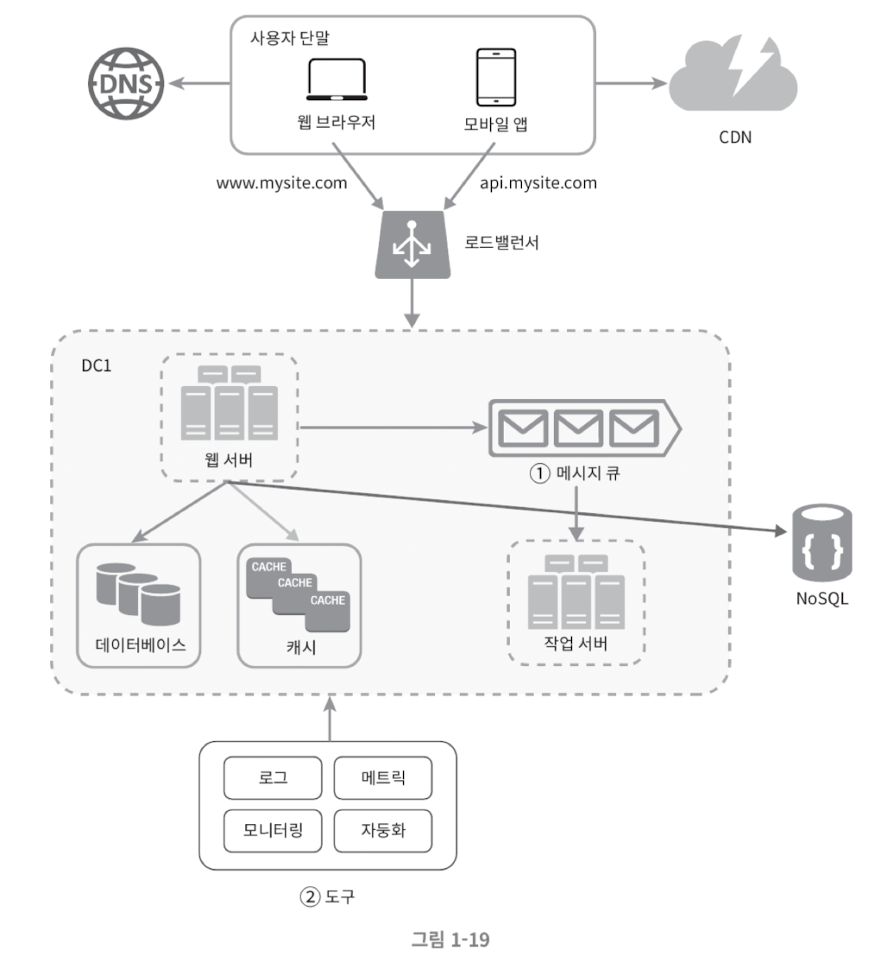
    

# 4. 처리율 제한 장치의 설계

---

- 네트워크 시스템에서 처리율 제한 장치는 클라이언트 또는 서비스가 보내는 트래픽의 처리율을 제어하기 위한 장치다.
    - HTTP를 예로 들면 이 장치는 특정 기간 내에 전송되는 클라이언트의 요청 횟수(트래픽 처리율)를 제한한다.
- API 요청 횟수가 제한 장치에 정의된 임계치를 넘어서면 추가로 도달한 모든 호출은 처리가 중단된다.
    - 사례들
        - 사용자는 초당 2회 이상 새 글을 올릴 수 없다.
        - 같은 IP 주소로는 하루에 10개 이상의 계정을 생성할 수 없다.
        - 같은 디바이스로는 주당 5회 이상 리워드를 요청할 수 없다.
- 그렇다면, API에 이러한 처리율 제한 장치를 두면 좋은점?
    - DoS 공격에 의한 자원 고갈을 방지할 수 있다.
    - 비용을 절감한다.
    - 서버 과부하를 막는다.

## 4.1 1단계: 문제 이해 및 설계 범위 확정

- 처리율 제한 장치를 구현하는 데는 여러가지 알고리즘을 사용할 수 있는데, 그 각각은 고유한 장단점을 가지고 있다.
    - 어떤 종류의 처리율 제한 장치를 설계해야 할까? → 클라이언트 측 제한 장치/서버 측 제한장치?
    - 어떤 기준을 사용해서 API 호출을 제어해야 할까? → IP 주소/사용자 ID/아니면 다른 기준?
    - 시스템 규모는 어느 정도여야 할까? → 스타트업/대기업?
    - 시스템이 분산 환경에서 동작해야 할까?
    - 독립된 서비스/애플리케이션 코드에 포함?
    - 사용자의 요청이 처리율 제한 장치에 의해 걸러진 경우 사용자에게 그 사실을 알려야 하나요?

## 4.2 2단계: 개략적 설계안 제시 및 동의 구하기

### 4.2.1 처리율 제한 장치는 어디에 둘 것인가?

- 클라이언트 측에 둔다면: 클라이언트 요청은 쉽게 위변조가 가능하다. 부적합.
- 서버 측에 둔다면:
    - 그림 4-1: 처리율 제한 장치를 API 서버와 분리
    
    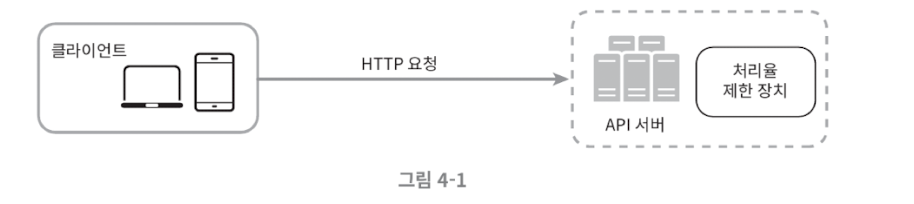
    
    - 그림 4-2: 처리율 제한 장치를 API 서버에 두는 대신, 처리율 제한 미들웨어를 만들어 해당 미들웨어로 하여금 API 서버로 가능 요청을 통제.
        
        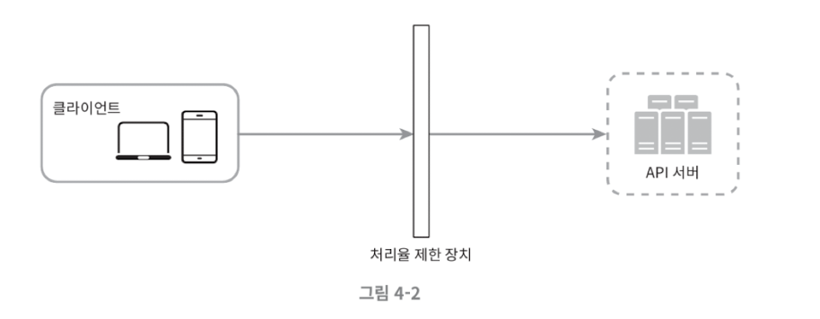
        
    - 그림 4-2의 설계에서 처리율 제한이 어떻게 동작하는지는 그림 4-3에 있다.
        
        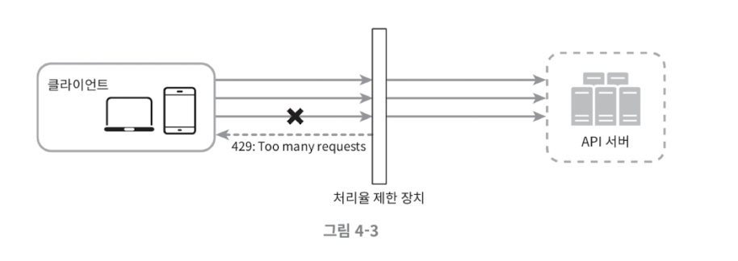
        
    - 예제의 API 서버의 처리율이 초당 2개의 요청으로 제한된 상황에서, 클라이언트가 3번째 요청을 앞의 두 요청과 같은 초 범위 내에서 전송하였다고 해보자. 앞선 두 요청은 API 서버로 전송될 것이다.
    - 하지만 세 번째 요청은 처리율 제한 미들웨어에 의해 가로막히고 클라이언트로는 HTTP 상태코드 429가 반환된다. HTTP 상태 코드 429는 사용자가 너무 많은 요청을 보내려고 했음을 알린다.
    - 클라우드 마이크로서비스의 경우, 처리율 제한 장치는 보통 API 게이트웨이라 불리는 컴포넌트에 구현된다. API 게이트웨이는 처리율 제한, SSL 종단, 사용자 인증, IP 허용 목록 관리 등을 지원하는 완전 위탁관리형 서비스, 즉 클라우드 업체가 유지 보수를 담당하는 서비스다.
    - 하지만 일단은 **API 게이트웨이가 처리율 제한을 지원하는 미들웨어**라는 점만 기억하자.
    - 처리율 제한 기능을 설계할 때 중요하게 따져야 하는 것
        - 처리율 제한 정치는 어디 두어야 하나? → 서버? 게이트웨이?
            - 정답은 없다. 회사의 현재 기술 스택이나 엔지니어링 인력, 우선순위, 목표에 따라 달라질 수 있기 때문.
            - 일반적으로 적용될 수 있는 몇 가지 지침을 나열해 보면 다음과 같다.
                1. 프로그래밍 언어, 캐시 서비스 등 현재 사용하고 있는 기술 스택을 점검
                2. 현재 사용하는 프로그래밍 언어가 서버 측 구현을 지원하기 충분할 정도로 효율이 높은지 확인
                3. 사업 필요에 맞는 처리율 제한 알고리즘을 찾아라.
                    - 서버 측에서 모든 것 구현 → 알고리즘 자유롭게 선택 가능
                    - 제3 사업자가 제공하는 게이트웨이 사용 → 선택지 제한될 수도
                4. MSA 기반이고 사용자 인증이나 IP 허용목록 관리 등을 처리하기 위해 API 게이트웨이를 이미 설계에 포함시켰을 경우 → 처리율 제한 기능 또한 API 게이트웨이에 포함
                5. 처리율 제한 서비스를 직접 만드는 데는 시간이 든다. 인력이 부족하면 상용 API 게이트웨이를 쓰는 것을 추천한다.

### 4.2.2 처리율 제한 알고리즘

- **토큰 버킷(token bucket) 알고리즘**
    - 토큰 버킷은 지정된 용량을 갖는 컨테이너.
    - 이 버킷에는 사전 설정된 양의 토큰이 주기적으로 채워진다. 토큰이 꽉 찬 버킷에는 더 이상의 토큰은 추가되지 않는다.
    - 그림 4-4의 예제는 용량이 4인 버킷이다.
        - 토큰 공급기(refiller)는 이 버킷에 매초 2개의 토큰을 추가한다.
        - 버킷이 가득 차면 추가로 공급된 토큰은 버려진다.(overflow)
        
        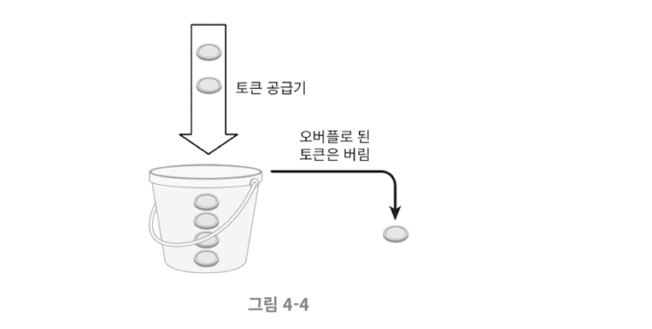
        
    - 각 요청은 처리될 때마다 하나의 토큰을 사용하고, 요청이 도착하면 버킷에 충분한 토큰이 있는지 검사하게 된다. 그림 4-5는 그 과정을 보여준다.
        - 충분한 토큰이 있는 경우, 버킷에서 토큰 하나를 꺼낸 후 요청을 시스템에 전달하고, 꺼낸 토큰도 dropped.
        - 충분한 토큰이 없는 경우, 해당 요청은 버려진다(dropped).
    
    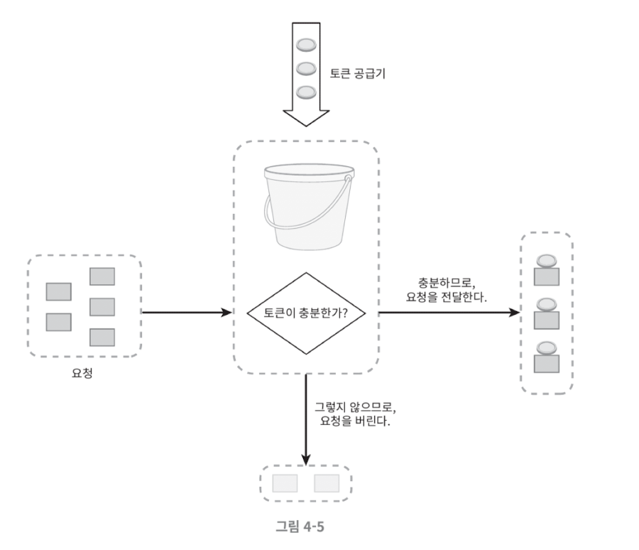
    
    - 그림 4-6은 토큰을 어떻게 버킷에서 꺼내고, 토큰 공급기는 어떻게 동작하며, 처리 제한 로직은 어떻게 작동하는지를 보여준다.
        - 이 토큰 버킷 알고리즘은 2개 인자를 받는다.
            - 버킷 크기: 버킷에 담을 수 있는 토큰의 최대 개수 (ex. 4)
            - 토큰 공급률(refill rate): 초당 몇 개의 토큰이 버킷에 공급되는가 (ex. 60초당 4)
        - 버킷은 몇 개나 사용해야 하나?
            - 공급 제한 규칙에 따라 달라진다.
            - [사례1] 통상적으로 API 엔드포인트마다 별도 버킷을 둔다.
                - ex. 사용자가 하루에 한 번만 포스팅 할 수 있고, 친구는 150명까지 추가할 수 있고, 좋아요 버튼은 5번까지만 누를 수 있다. → 사용자마다 3개의 버킷 두어야 함!
            - [사례2] IP 주소별로 처리율 제한을 적용해야 한다.
                - IP 주소마다 버킷을 하나씩 할당.
            - [사례3] 시스템의 처리율을 초당 10,000개 요청으로 제한하고 싶다.
                - 모든 요청이 하나의 버킷을 공유하도록 해야한다.
                - 모든 요청을 하나로 묶기 위해 단일 버킷을 공유하고, Refill Rate를 초당 10,000개로 설정한다.
    
    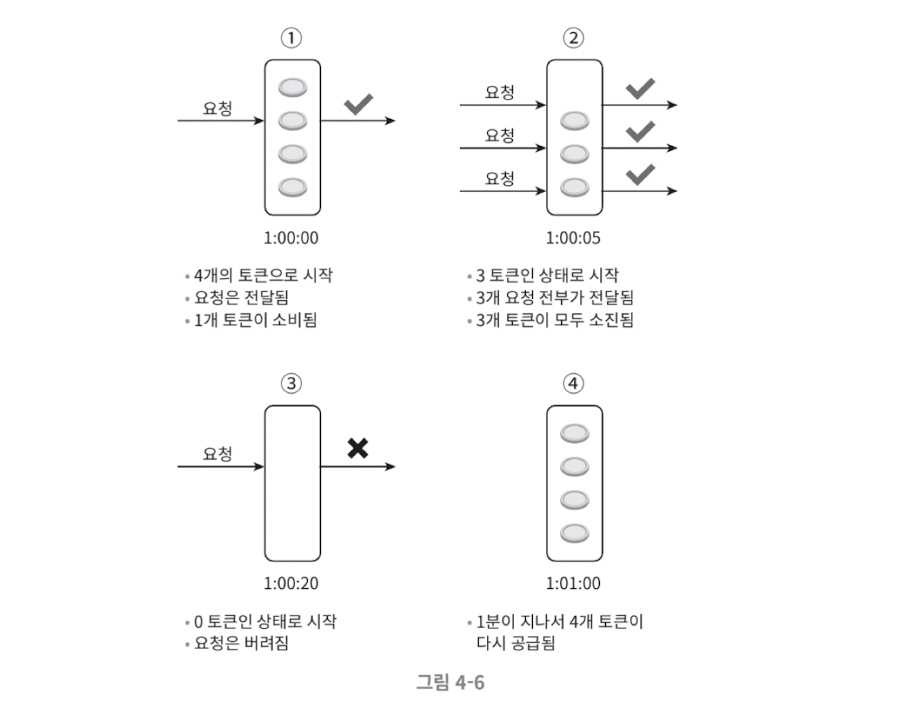
    
    - 장점:
        - 구현이 쉽다
        - 메모리 사용 측면에서 효율적이다
        - 짧은 시간에 집중되는 트래픽도 처리 가능하다. 버킷에 남은 토큰이 있기만 하면 요청은 시스템에 전달된다.
    - 단점:
        - 버킷 크기, 토큰 공급률이라는 두 개 인자를 가지고 있는데, 이 값을 적절하게 튜닝하는 것은 까다롭다.
- **누출 버킷(leaky bucket) 알고리즘**
    - 토큰 버킷 알고리즘과 비슷하지만 요청 처리율이 고정되어 있다는 점이 다르다.
    - 보통 FIFO 큐로 구현한다.
        - 요청이 도착하면 큐가 가득 차 있는지 본다. 빈자리가 있는 경우에는 큐에 요청을 추가한다.
        - 큐가 가득 차 있는 경우에는 새 요청은 버린다.
        - 지정된 시간마다 큐에서 요청을 꺼내 처리한다.
        
        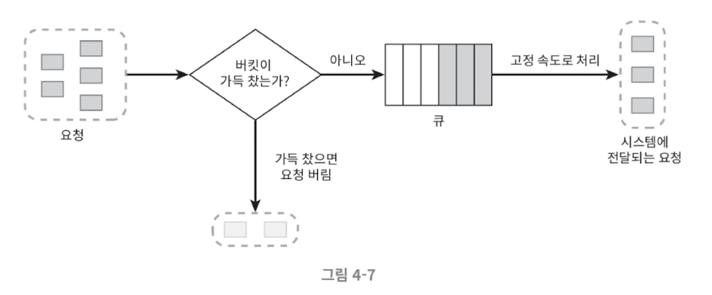
        
    - 누출 버킷 알고리즘은 다음의 두 인자를 사용한다.
        - 버킷 크기: 큐 사이즈와 같은 값이다. 큐에는 처리될 항목들이 보관된다.
        - 처리율(outflow rate): 지정된 시간당 몇 개의 항목을 처리할지 지정하는 값이다. 보통 초 단위로 표현된다.
    - 장점:
        - 큐의 크기가 제한되어 있어 메모리 사용량 측면에서 효율적이다.
        - 고정된 처리율을 갖고 있기 때문에 안정적 출력이 필요한 경우에 적합하다.
    - 단점:
        - 단시간에 많은 트래픽이 몰리는 경우 큐에는 오래된 요청들이 쌓이게 되고, 그 요청들을 제때 처리 못하면 최신 요청들은 버려지게 된다.
        - 두 개 인자를 갖고 있는데, 이들을 올바르게 튜닝하기가 까다로울 수 있다.
- **고정 윈도 카운터(fixed window counter) 알고리즘**
    - 타임라인(timeline)을 고정된 간격의 윈도(window)로 나누고, 각 윈도마다 카운터(counter)를 붙인다.
    - 요청이 접수될 때마다 이 카운터의 값은 1씩 증가한다.
    - 이 카운터의 값이 사전에 설정된 임계치(threshold)에 도달하면 새로운 요청은 새 윈도가 열릴 때까지 버려진다.
    - 동작 원리
        
        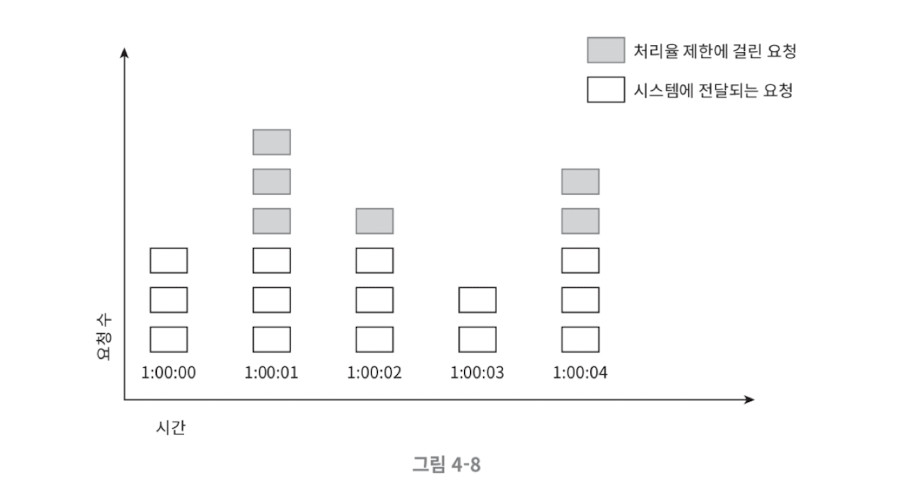
        
        - 타임라인의 시간 단위는 1초다.
        - 시스템은 초당 3개까지의 요청만을 허용한다.
        - 매초마다 열리는 윈도에 3개 이상의 요청이 밀려오면 초과분은 그림 4-8에 보인 대로 버려진다.
        
        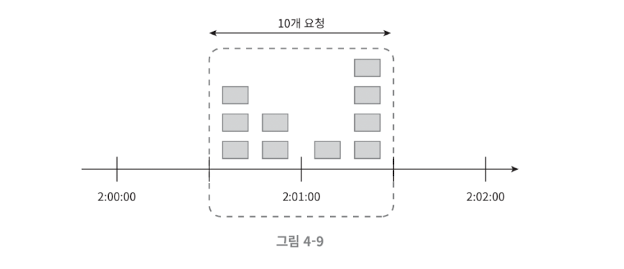
        
        - 윈도 경계 부근에 순간적으로 많은 트래픽이 집중될 경우 윈도에 할당된 양보다 더 많은 요청이 처리될 수 있다.
            - 그림 4-9는 최대 5개의 요청만을 허용하는 시스템이다. 카운터는 매분마다 초기화된다.
            - 2:00:00와 2:01:00 사이에 5개의 요청이 들어왔고,
            - 2:01:00과 2:02:00 사이에 또 5개의 요청이 들어왔다.
            - 2:00:30 ~ 2:01:30까지의 1분 동안을 살펴보면, 이 1분 동안 시스템이 처리한 요청은 10개이다. 허용 한도의 2배인 것이다.
    - 장점:
        - 메모리 효율이 좋다.
        - 이해하기 쉽다.
        - 윈도가 닫히는 시점에 카운터를 초기화하는 방식은 특정한 트래픽 패턴을 처리하기에 적합하다.
    - 단점:
        - 윈도 경계 부근에서 일시적으로 많은 트래픽이 몰려드는 경우, 기대했던 시스템의 처리 한도보다 많은 양의 요청을 처리하게 된다. (시스템 과부화 위험, 일관성 없는 서비스)
- **이동 윈도 로깅 알고리즘(sliding window log)**
    - 윈도 경계 부근에서 일시적으로 많은 트래픽이 몰려드는 경우, 시스템에 설정된 한도보다 많은 양의 요청을 처리하게 되는 고정 윈도 카운터의 문제를 해결한다.
    - 동작 원리
        - 요청의 타임스탬프를 추적한다. 타임스탬프 데이터는 보통 레디스의 정렬 집합같은 캐시에 보관한다.
        - 새 요청이 오면 만료된 타임스탬프는 제거한다. 만료된 타임스탬프는 그 값이 현재 윈도의 시작 시점보다 오래된 타임스탬프를 말한다.
        - 새 요청의 타임스탬프를 로그에 추가한다.
        - 로그의 크기가 허용치보다 같거나 작으면 요청을 시스템에 전달한다. 그렇지 않은 경우에는 처리를 거부한다.
    
    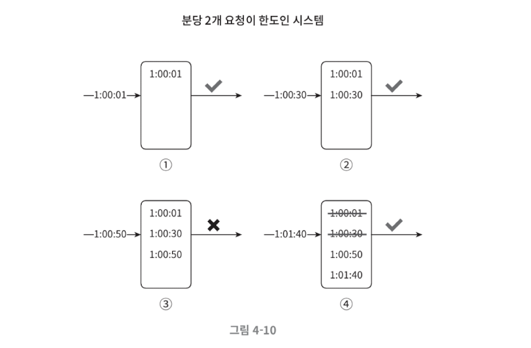
    
    - 이 예제의 처리율 제한기는 분당 최대 2회의 요청만을 처리하도록 설정되었다.
        - 요청이 1:00:01에 도착 → 로그 비어있음 → 요청 허용
        - 새로운 요청 1:00:30에 도착 → 타임스탬프 로그에 추가 → 로그 크기 2(허용 한도보다 작음) → 요청 허용
        - 새로운 요청 1:00:50에 도착 → 타임스탬프 로그에 추가 → 로그 크기 3(허용 한도보다 큼) → 타임스탬프는 로그에 남지만 요청은 거부
        - 새로운 요청 1:01:40에 도착 → [1:00:40, 1:01:40) 범위 안에 있는 요청은 1분 윈도 안에 있는 요청이지만, 1:00:40 이전의 타임스탬프는 전부 만료된 값 → 1:00:01, 1:00:30 로그에서 삭제 → 로그 크기 2(허용 한도보다 작음) → 요청 허용
    - 장점
        - 정교하다. 어느 순간의 윈도를 보더라도 허용되는 요청의 개수는 시스템의 처리율 한도를 넘지 않는다.
    - 단점:
        - 다량의 메모리 사용(거부된 요청의 타임스탬프도 보관하기 때문)
- **이동 윈도 카운터(sliding window counter) 알고리즘**
    
    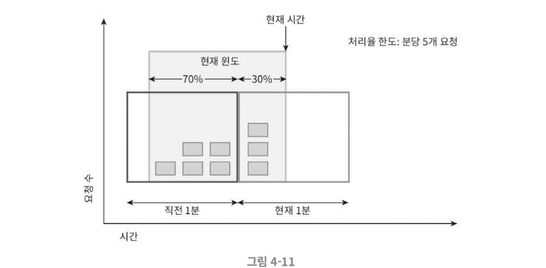
    
    - 고정 윈도 카운터 알고리즘 + 이동 윈도 로깅 알고리즘 결합
    - 처리율 제한 장치의 한도가 분당 7개 요청으로 설정
    - 이전 1분동안 5개의 요청, 현재 1분동안 3개의 요청 들어옴
    - 현재 1분의 30% 시점에 도착한 새 요청의 경우, 현재 윈도에 몇 개의 요청이 온 것으로 보고 처리해야할까?
        - 현재 1분간 요청 수 + 직전 1분간 요청 수 x 이동 윈도와 직전 1분이 겹치는 비율
            - 3+5x70%=6.5개 → 내림하여 6
        - 따라서, 해당 요청은 시스템으로 전달
        - 하지만 그 직후에는 한도에 도달하였으므로 더 이상의 요청은 받을 수 없다.
    - 장점:
        - 이전 시간대의 평균 처리율에 따라 현재 윈도의 상태를 계산하므로 짧은 시간에 몰리는 트래픽에도 잘 대응한다
        - 메모리 효율이 좋다.
    - 단점:
        - 다소 느슨하다. 하지만 심각한 정도는 아니다.

### 4.2.3 개략적인 아키텍처

- 처리율 제한 알고리즘의 기본 아이디어는 단순하다.
    - 얼마나 많은 요청이 접수되었는지를 추적할 수 있는 카운터를 추적 대상별로 두고, 이 카운터의 값이 어떤 한도를 넘어서면 한도를 넘어 도착한 요청은 거부하는 것.
- 카운터는 어디 보관할 것인가?
    - 데이터베이스는 디스크 접근 때문에 느리니까 사용 X
    - 메모리상에서 동작하는 캐시가 바람직
        - 특히 레디스
            - INCR: 메모리에 저장된 카운터의 값을 1만큼 증가시킨다.
            - EXPIRE: 카운터에 타임아웃 값을 설정한다. 설정된 시간이 지나면 카운터는 자동으로 삭제된다.
- 처리율 제한 장치의 개략적 구조
    
    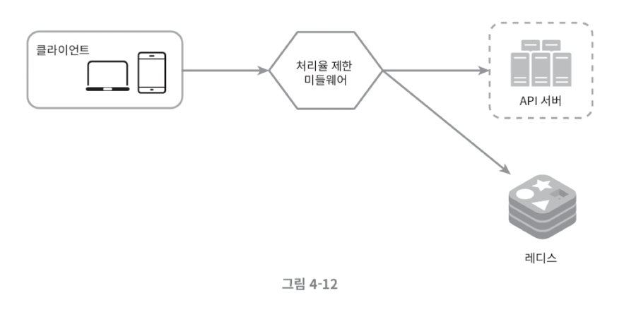
    
    - 동작 원리
        - 클라이언트가 처리율 제한 미들웨어에게 요청을 보낸다.
        - 처리율 제한 미들웨어는 레디스의 지정 버킷에서 카운터를 가져와서 한도에 도달했는지 아닌지를 검사한다.
            - 한도에 도달했다면 요청은 거부된다.
            - 한도에 도달하지 않았다면 요청은 API 서버로 전달된다. 미들웨어는 카운터의 값을 증가시킨 후 다시 레디스에 저장한다.

## 4.3 3단계: 상세 설계

### 4.3.1 처리율 제한 규칙

- 리프트(Lyft)는 처리율 제한에 오픈 소스를 사용하고 있다.
    
    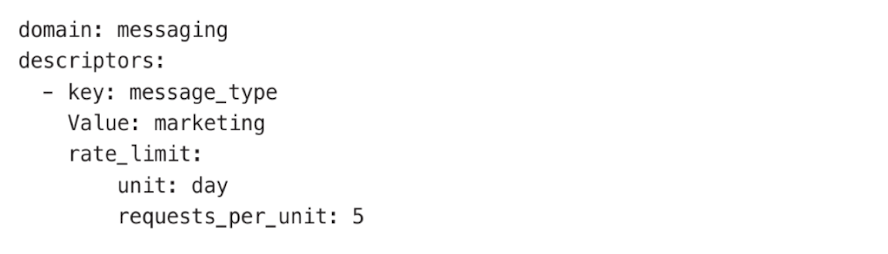
    
    - 시스템이 처리할 수 있는 마케팅 메세지의 최대치 하루 5개로 제한.
    - 이런 규칙들은 보통 설정파일 형태로 디스크에 저장된다.

### 4.3.2 처리율 한도 초과 트래픽의 처리

- 요청이 한도 제한에 걸리면 → API는 HTTP 429 응답을 클라이언트에게 보낸다.
    - 한도 제한에 걸린 메세지를 나중에 처리하기 위해 큐에 보관할 수도 있다.
- 처리율 제한 장치가 사용하는 HTTP 헤더
    - 클라이언트는 자기 요청이 처리율 제한에 걸리고 있는지를 어떻게 감지할 수 있나?
    - 자기 요청이 처리율 제한에 걸리기까지 얼마나 많은 요청을 보낼 수 있는지 어떻게 알 수 있나?
        - HTTP 응답헤더
            - X-Ratelimit-Remaining: 윈도 내에 남은 처리 가능 요청의 수
            - X-Ratelimit-Limit: 매 윈도마다 클라이언트가 전송할 수 있는 요청의 수
            - X-Ratelimit-Retry-After: 한도 제한에 걸리지 않으려면 몇 초 뒤에 요청을 다시 보내야 하는지 알림.

### 4.3.3 상세 설계

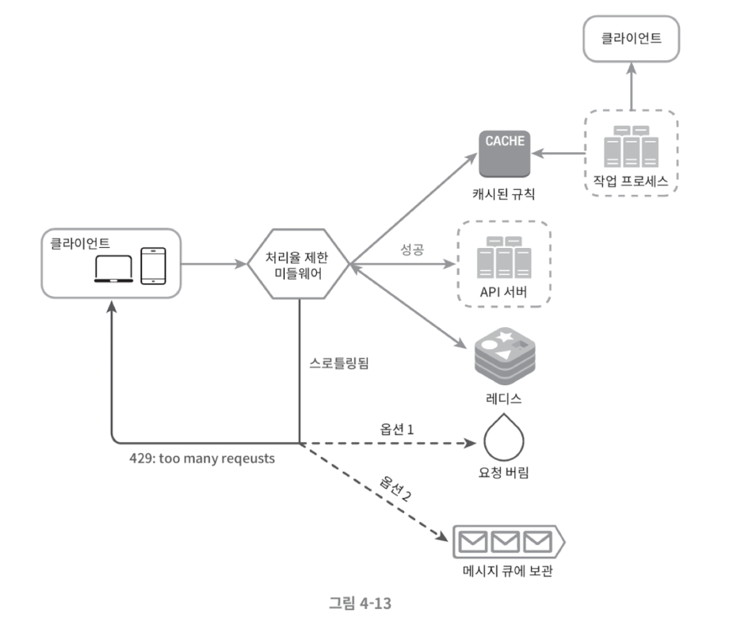

- 처리율 제한 규칙은 디스크에 보관한다. 작업 프로세스는 수시로 규칙을 디스크에서 읽어 캐시에 저장한다.
- 클라이언트가 요청을 서버에 보내면 요청은 먼저 처리율 제한 미들웨어에 도달한다.
- 처리율 제한 미들웨어는 제한 규칙을 캐시에서 가져온다. 카운터 및 마지막 요청의 타임스탬프를 레디스 캐시에서 가져온다. 가져온 값들에 근거하여 미들웨어는 다음과 같은 결정을 내힌다.
    - 해당 요청이 처리율 제한에 걸리지 않은 경우: API 서버로 보낸다.
    - 해당 요청이 처리율 제한에 걸린 경우: 429 too many requests 에러를 클라이언트에게 보낸다. 해당 요청은 그대로 버릴 수도 있고, 메세지 큐에 보관할 수도 있다.

### 4.3.4 분산 환경에서의 처리율 제한 장치의 구현

- 여러 대의 서버와 병렬 스레드를 지원하도록 시스템을 확장할 때, 다음과 같은 문제 해결해야 한다.
    - **경쟁 조건(race condition)**
        - 처리율 제한 장치의 동작 과정
            - 레디스에서 카운터의 값을 읽는다.
            - `counter+1` 값이 임계치를 넘는지 본다.
            - 넘지 않는다면 레디스에 보관된 카운터 값을 1만큼 증가시킨다.
        
        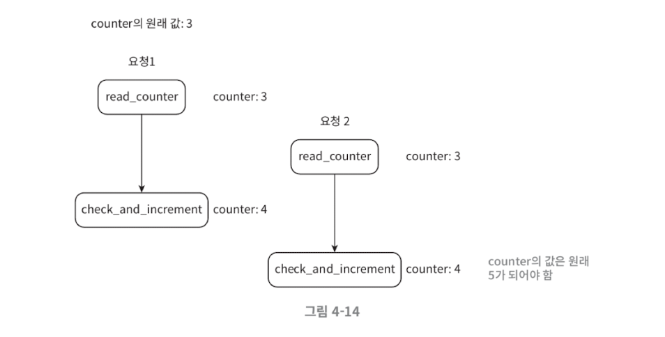
        
        - 레디스에 저장된 변수 counter = 3
        - 두 개 요청을 처리하는 스레드가 각각 병렬로 counter 값을 읽었다.
            - 둘 다 counter + 1 레디스에 기록.
            - counter의 값은 원래는 5가 되어야 한다.
        - 락을 통해 해결
            - 시스템의 성능을 떨어뜨리는 문제 존재 → 락 대신 쓸 수 있는 해결책
                - 루아 스크립트
                - 정렬 집합(레디스 자료 구조)
    - **동기화**
        
        
        
        - 클라이언트 1 → 제한 장치 1에 요청 보냄
        - 클라이언트 2 → 제한 장치 2에 요청 보냄
        - 웹 계층은 무상태이므로 클라이언트는 4-15의 오른쪽 그림처럼 각기 다른 제한 장치로 보내게 될 수 있음.
            - 이때 동기화를 하지 않으면 제한 장치 1은 클라이언트 2에 대해서는 아무것도 모르므로 처리율 제한을 올바르게 수행할 수 없음.
        - [해결책1] 고정 세션 활용
            - 같은 클라이언트로부터의 요청은 항상 같은 처리율 제한 장치로 보낼 수 있도록 하는 것
            - 하지만 추천X (확장 가능X, 유연X)
        - [해결책2] 레디스와 같은 중앙 집중형 데이터 저장소 이용
            
            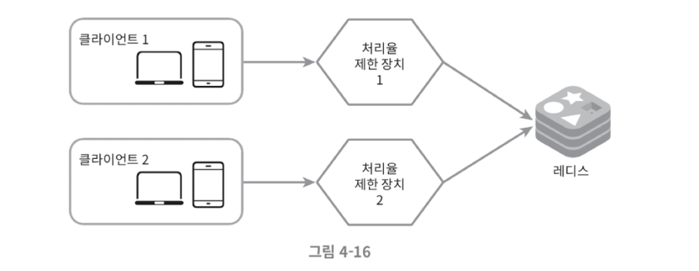
            
- 성능 최적화
    - 여러 데이터 센터 지원하는 문제 → 처리율 제한 장치에 매우 중요한 문제
        - 데이터센터에서 멀리 떨어진 사용자를 지원하려다보면 지연시간이 증가할 수 밖에 없기 때문.
        - 대부분의 클라우드 서비스 사업자는 세계 곳곳에 에지 서버를 심어놓고 있다.
            - 사용자의 트래픽을 가장 가까운 에지 서버로 전달하여 지연시간을 줄인다.
    - 제한 장치 간에 데이터를 동기화할 때 최종 일관성 모델을 사용하는 것.
        - 일관성 모델 6장 참고
- 모니터링
    - 모니터링을 통해 확인하려는 것
        - 채택된 처리율 제한 알고리즘이 효과적인가?
        - 정의한 처리율 제한 규칙이 효과적인가?

## 4.4 4단계: 마무리

- 경성 또는 연성 처리율 제한
    - 경성 처리율 제한: 요청의 개수는 임계치를 절대 넘어설 수 없다.
    - 연성 처리율 제한: 요청 개수는 잠시 동안은 임계치를 넘어설 수 없다.
- 다양한 계층에서의 처리율 제한
    - 다른 OSI 계층에서도 처리율 제한이 가능하다.
        - 예를 들어, iptables를 사용하면 IP 주소에 처리율 제한을 적용하는 것이 가능하다.
- 처리율 제한을 회피하는 방법. 클라이언트를 어떻게 설계하는 것이 최신인가?
    - 클라이언트 측 캐시를 사용하여 API 호출 횟수를 줄인다.
    - 처리율 제한의 임계치를 이해하고, 짧은 시간 동안 너무 많은 메세지를 보내지 않도록 한다.
    - 예외나 에러를 처리하는 코드를 도입하여 클라이언트가 예외적 상황으로부터 우아하게 복구될 수 있도록 한다.
    - 재시도 로직을 구현할 때는 충분한 백오프 시간을 둔다.