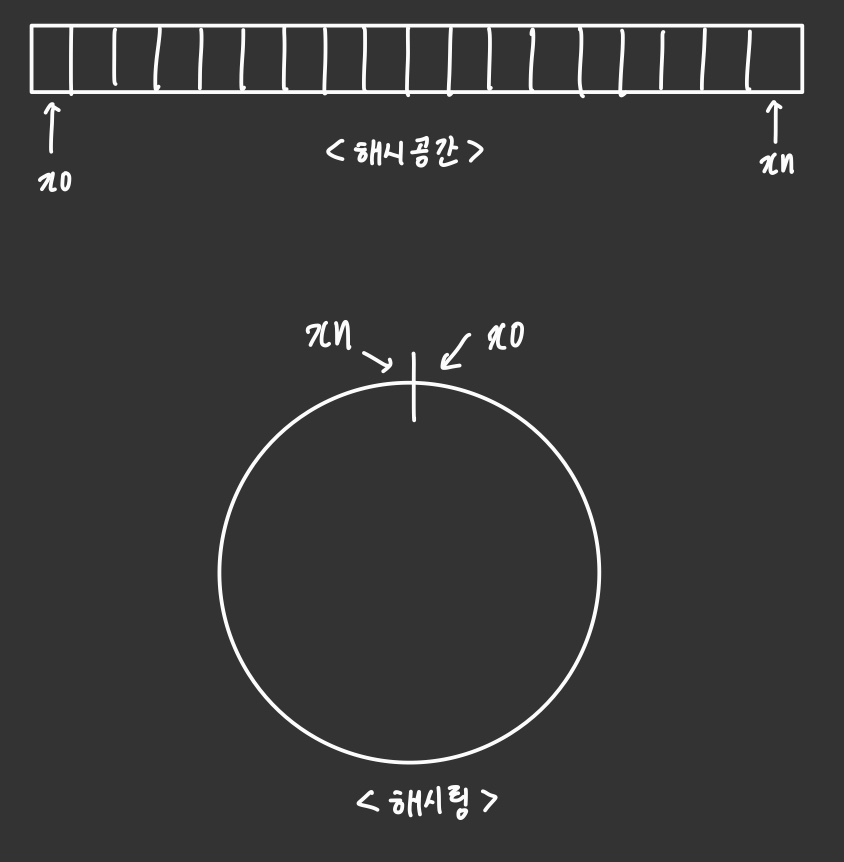

# 5장. 안정 해시 설계
- 수평적 규모 확장성을 달성하기 위해 요청or데이터를 서버에 균등하게 나누는 것이 중요하다.
➡️ 이 목표를 달성하기 위해 **안정 해시**를 보편적으로 사용
---

### 해시 키 재배치(rehash) 문제
✅ **_serverIndex=hash(key)%N (N=서버 개수)_**
- server pool의 크기가 고정되어 있을때, 데이터 분포가 균등할 때 잘 동작
- 서버 추가or기존 서버 삭제되면 문제 발생 ➡️ 나머지 연산 적용 결과 서버 인덱스 값이 모두 달라지게 됨 ➡️ **대부분 캐시 클라이언트가 데이터가 없는 엉뚱한 서버에 접속**

∴ **안정 해시** 통해 해결 가능

---
### 안정 해시
> 해시 테이블의 크기가 조정될 때 **평균적으로 오직 k/n개의 키만 재배치**하는 해시 기술
<br/>_(k=키의 개수, n=슬롯의 개수)_

> **해시 공간과 해시 링**
- (ex.) 해시 함수=```SHA-1``` 사용, 함수의 출력 값의 범위는 ```x0,x1,x2,...,xn``` 이라고 가정. 
  - ```SHA-1```의 해시 공간의 범위=0~2^{160}-1 
  -> x0=0, xn=2^{160}-1
<br/>


<br/><br/>
> **해시 서버**
- 해시 함수 f를 사용해서 서버 IP,이름을 **링 위의 어떤 위치에 대응**시킬 수 있다. 
<br/><br/>
> **해시 키**

<br/><br/>
> **서버 조회**

- 어떤 키가 저장되는 서버는 해당 키의 위치로부터 시계 방향으로 링을 탐색해 나가면서 만나는 첫 번째 서버

<br/><br/>
> **서버 추가**

- 서버를 추가하더라도 키 가운데 일부만 재배치하면 됨 

<br/><br/>
> **서버 제거**

- 하나의 서버가 제거되면 키 가운데 일부만 재배치됨 

<br/><br/>
> **기본 구현법의 두 가지 문제**<br/><br/>
a. 서버와 키를 균등 분포 해시 함수를 사용해 해시 링에 배치<br/>
b. 키의 위치에서 링을 시계 방향으로 탐색하다 만나는 최초의 서버가 키가 저장될 서버이다 

**🚨문제점**
1. 파티션의 크기를 균등하게 유지하는 게 불가능하다
    - 파티션 = 인접한 서버 사이의 해시 공간
    
    - _위의 ```서버 제거```같은 경우도 s1이 삭제되는 바람에 s2의 파티션이 다른 파티션 대비 거의 2배로 커지게 됨_
2. 키의 균등 분포를 달성하기 어렵다. 
    - _아래 그림에서 서버 1,서버 3은 아무 데이터도 갖지 않은 반면 대부분의 키는 서버 2에 보관됨_

    ✔️ ```가상 노드``` or ```복제 기법```을 통해 해결

<br/><br/>
> **가상 노드**<br/>
 
 실제 노드or서버를 가리키는 노드. 하나의 서버는 링 위에 여러 개의 가상 노드를 가질 수 있음
 
 ➡️ 각 서버는 하나가 아닌 여러 개의 파티션을 관리해야 
 - 가상 노드의 개수 ⬆️ -> 키의 분포는 점점 균등해짐 
 ( ∵표준 편차가 작아져서 데이터가 고르게 분포되기 때문)
- 가상 노드의 개수가 너무 많아지면 가상 노드 데이터를 저장할 공간이 더 많이 필요 -> ```tradeoff```

<br/><br/>
> **재배치할 키 결정**
>  - 특정 서버가 삭제되면 삭제된 노드 반시계 방향에 있는 최초 서버 사이에 있는 키들이 재배치 되어야 함 

<br/><br/>
### 안정 해시의 이점 
- 서버가 추가/삭제될 때 재배치되는 키의 수가 최소화됨 
- 데이터가 균등하게 분포 -> 수평적 규모 확장을 달성하기 쉬움
- 핫스팟 키문제를 줄임. 특정한 샤드에 대한 접근이 지나치게 빈번하면 서버 과부하 문제 발생 가능 -> 안정 해시는 데이터를 균등하게 분배 -> 이런 문제의 가능성을 줄임 


# 6장. 키-값 저장소 설계
- ```키-값 저장소```=비 관계형 데이터 베이스. 저장소에서 저장되느 값은 '고유 식별자'를 키로 가져야 함
  - (ex.) Amazon DynamoDB, memcached, Redis
- ```put(key,value)```: 키-값 쌍을 저장소에 저장
- ```get(key)```: 인자로 주어진 키에 매달린 값을 꺼낸다
---
### 문제 이해 및 설계 범위 확정
> - 키-값 쌍의 크기는 10KB 이하이다
> - 큰 데이터를 저장할 수 있어야 한다
> - 높은 가용성을 제공해야 -> 시스템은 장애가 있더라도 빠르게 응답해야 한다
> - 높은 규모 확장성을 제공 해야 -> 트래픽 양에 따라 자동적으로 서버 증설/삭제가 이루어져야 함
> - 데이터 일관성 수준은 조정이 가능해야 함
> - 응답 지연시간이 짧아야 함
---
### 단일 서버 키-값 저장소
- 단일 서버 -> **키-값 쌍 전부를 메모리에 해시 테이블로 저장**
  - 단점 : 모든 데이터를 메모리 안에 두는 것이 불가능함 
  - **개선책**:
    - 데이터 압축
    - 자주 쓰이는 데이터만 메모리에 두고 나머지는 디스크에 저장 
- 이렇게 해도 한 대 서버가 부족하다면? ➡️ **분산 키-값 저장소**를 만들어야 
---
### 분산 키-값 저장소
(=분산 해시 테이블)
- 키-값 쌍을 여러 서버에 분산 시킴

> **CAP정리**
> - 분산 시스템 설계 시 꼭 알고 있어야 함
> 
> ✔️ **데이터 일관성, 가용성, 파티션 감내라는 세 가지 요구사항을 동시에 만족하는 분산 시스템을 설계하는 것은 불가능하다는 정리**
> - **데이터 일관성** : 분산 시스템에 접속하는 모든 클라이언트는 어떤 노드에 접속했느냐에 관계없이 언제나 같은 데이터를 보게 되어야 함
> - **가용성** : 분산 시스템에 접속하는 클라이언트는 일부 노드에 장애가 발생하더라도 항상 응답을 받을 수 있어야 함
> - **파티션 감내** : 네트워크에 파티션이 생기더라도 시스템은 계속 동작하여야 한다는 뜻 
>   - 파티션 = 두 노드 사이에 통신 장애가 발생하였음을 의미
>
> 
> - CA 시스템은 존재하지 X 
>
> ✅ **이상적 상태**
> 
> - 네트워크가 파티션되는 상황은 절대로 일어나지 않는다 
> - _n1에 기록된 데이터는 자동적으로 n2와 n3에 복제됨_
>
> ✅ **실세계의 분산 시스템**
> 
> - 분산 시스템은 "파티션 문제"를 피할 수 없음 -> 가용성or일관성 사이에서 하나를 선택해야
> 1. 일관성 선택(CP시스템)
>   - 세 서버 사이에 생길 수 있는 데이터 불일치 문제를 피하기 위해 n1,n2의 쓰기 연산을 중단시켜야 함 
>   - (ex.) 은행권 시스템-온라인 뱅킹 시스템
> 2. 가용성 선택(AP시스템)
>   - 계속 읽기 연산 허용 
>   - n1,n2는 계속 쓰기 연산 허용 -> 파티션 문제 해결 -> 새 데이터를 n3에 전송
---
### 시스템 컴포넌트
> **데이터 파티션**
- 데이터를 작은 파티션들로 분할 -> 여러 서버에 저장<br/>

✔️ **데이터를 파티션 단위로 나눌 때 따져봐야 할 점**
  - 데이터를 여러 서버에 고르게 분산할 수 있는가
  - 노드가 추가/삭제될 때 데이터의 이동을 최소화할 수 있는가
    <br/>∴ 안정 해시 활용 ‼️

✔️ **데이터 파티션하면 좋은 점**
- 규모 확장 자동화 : 시스템 부하에 따라 서버가 자동으로 추가/삭제되도록 만들 수 있음
- 다양성 : 각 서버의 용량에 맞게 가상 노드의 수를 조정 가능. 고성능 서버는 더많은 가상 노드를 갖도록 설정할 수 있음 
---
> **데이터 다중화**
- 높은 가용성/안정성 확보 위해 데이터를 N개 서버에 비동기적으로 다중화(replication)할 필요가 있음 
- 시계 방향으로 링 순회 -> 첫 N개의 서버에 데이터 사본을 보관 
- 가상 노드 사용 시, 선택한 N개의 노드가 대응될 실제 물리 서버의 개수가 N보다 작아질 수 있음 -> 물리서버를 중복 선택하지 않도록 해야 함 
---
> **데이터 일관성**

✔️ **"정족수 합의 프로토콜"**: 읽기/쓰기 연산 모두에 일관성 보장 가능 
- N=사본 개수
- W=쓰기 연산에 대한 정족수
- R=읽기 연산에 대한 정족수
- _(ex.) W=1 : 쓰기 연산이 성공했다고 판단하기 위해 중재자는 최소 한 대 서버로부터 쓰기 성공 응답을 받아야함_

- **중재자** : **클라이언트와 노드 사이에서 proxy 역할을 한다**
<br/><br/>

**➡️ W, R, N 정하는 기준**
- R=1,W=N : 빠른 읽기 연산에 최적화
- W=1,R=N: 빠른 쓰기 연산에 최적화
- W+R>N : 강한 일관성이 보장됨 (일관성을 보증할 최신 데이터를 가진 노드가 최소 하나는 겹치기 때문)
---
> **일관성 모델**
- 데이터 일관성의 수준을 결정 
1. **강한 일관성** : 모든 읽기 연산은 가장 최근에 갱신된 결과를 반환. 클라이언트는 낡은 데이터를 볼 수 X
2. **약한 일관성** : 읽기 연산은 가장 최근 갱신된 결과를 반환하지 못할 수도 O
3. **결과적 일관성** : 약한 일관성의 한 형태. 갱신 겨로가가 결국에는 모든 사본에 동기화되는 모델
    - 다이나모, 카산드라 -> "결과적 일관성 모델" 채택
    - 쓰기 연산이 병렬적으로 발생 ➡️ 시스템에 저장된 값의 일관성이 깨질 수 O ➡️ 이 문제를 클라이언트가 해결해야 
---
> **비 일관성 해소 기법:데이터 버저닝**

✅ ```버저닝``` & ```벡터 시계```를 통해 사본 간 일관성 깨지는 문제 해소하도록 함 
- ```버저닝``` : 데이터를 변경할 때마다 해당 데이터의 새로운 버전을 만드는 것을 의미. 각 버전의 데이터는 immutable
- (ex.)
    
  - 마지막 두 버전 v1,v2의 충돌을 어떻게 해소해야 할까? 
  - **충돌을 발견하고 자동으로 해결해 낼 버저닝 시스템이 필요** ‼️ 
    -> ✔️ **```벡터 시계```**

- ```벡터 시계```=**[서버,버전]의 순서쌍을 데이터에 매단 것**. 어떤 버전이 선행 버전인지, 후행 버전인지, 다른 버전과 충돌이 있는지 판별하는데 쓰임 
- _(ex.) D([S1,v1], [S2,v2],...,[Sn,vn])_
- D=데이터, vi=버전 카운터, Si=서버 번호 
- 데이터 D를 서버 Si에 기록 -> 시스템은 위 작업 가운데 하나를 수행해야 함
    1. [Si,vi]가 있으면 **vi를 증가**시킴
    2. 그렇지 않으면 **새 항목 [Si,1]를 만듦**

- **수행 방식**<br/>
    
    5. 어떤 클라이언트가 D3과 D4를 읽으면 데이터 간 충돌이 있다는 것을 알게 된다. D2를 Sy,Sz가 각각 다른 값으로 바꾸었기 때문. 이 충돌은 클라이언트가 해소한 후에 서버에 기록한다. 이 쓰기 연산을 처리한 서버가 Sx라고 하면, 다음과 같이 벡터시계가 바뀐다. 
<br/>

- 🚨**버전 X가 버전 Y의 이전 버전인지(=충돌이 없는지) 판단하는 방법**
    - 버전Y에 포함된 모든 구성요소의 값이 X에 포함된 모든 구성요소 값보다 같거나 큰지만 보면 됨 
    - _(ex.) ```D1([s0,1],[s1,1])```은 ```D1([s0,1],[s1,2])```의 이전 버전 -> 두 데이터 사이에 충돌은 없음_

- 🚨**버전 X와 Y사이에 충돌이 있는지(=두 버전이 같은 이전 버전에서 파생된 다른 버전들인지) 판단하는 방법**
    - Y의 벡터 시계 구성요소 가운데 X의 벡터 시계 동일 서버 구성요소보다 작은 값을 갖는 것이 있는지 보면 됨 
    - _(ex.) ```D1([s0,1],[s1,2])```, ```D1([s0,2],[s1,1])```-> **서로 충돌**_

- **😧벡터 시계를 사용해 충돌 감지/해소 방법의 단점**
    1. 충돌 감지/해소 로직이 클라이언트에 들어감 -> ```클라이언트 구현이 복잡```해짐
    2. ```[서버:버전]의 순서쌍 개수가 굉장히 빨리 늘어남```<br/>
        -> 길이에 임계치를 설정해야 -> 충돌 해소 과정 효율성 낮아짐 
---
> **장애 감지**
- 분산 시스템 : 서버 두 대이상이 똑같이 서버A의 장애를 보고 해야 "실제 장애 발생"했다고 간주
- **멀티캐스팅 채널 구축** ➡️ 서버 장애 감지하는 가장 손쉬운 방법 
    
    - 서버가 많을 때 비효율적
- ✅```가십 프로토콜(=분산형 장애 감지 솔루션)```
    
    > **동작원리**
    > - 각 노드는 멤버십 목록을 유지. 멤버십 목록은 각 멤버 ID와 그 heartbeat counter 쌍의 목록
    > - 각 노드는 주기적으로 자신의 hearbeat counter를 증가시킴 
    > - 각 노드는 무작위로 선정된 노드들에게 주기적으로 자기 heartbeat counter 목록을 보냄
    > - hearbeat counter 목록을 받은 노드는 멤버십 목록을 최신 값으로 갱신
    > - 어떤 멤버의 heartbeat counter 값이 지정된 시간동안 갱신 X -> 해당 멤버는 장애 상태로 간주

(ex.)

- 노드 s0은 노드 s2(memberID=2)의 hearbeat counter가 오랫동안 증가되지 않았다는 것을 발견
- 노드 s0은 노드 s2를 포함하는 heartbeat counter 목록을 무작위로 선택된 다른 노드에게 전달
- s2의 heartbeat counter가 오랫동안 증가되지 않았음을 발견한 모든 노드는 해당 노드를 장애 노드로 표시 
---
> **일시적 장애 처리**
1. ```엄격한 정족수 접근법``` : 읽기,쓰기 연산 금지
   
2. ```느슨한 정족수 접근법``` : 조건 완화 -> 가용성을 높임 
    - W개/R개의 건강한 서버를 해시 링에서 고름 
- ```단서 후 임시 위탁기법(hinted handoff)``` : 네트워크/서버 문제로 장애 상태인 서버로 가는 요청은 다른 서버가 잠시 맡아서 처리 ➡️ 변경사항은 해당 서버가 복구되었을 때 일괄 반영하여 데이터 일관성 보존
---
> **영구 장애 처리**
- ✅ **```반-엔트로피(anti-entropy) 프로토콜```** : 사본 동기화
  - 사본들을 비교하여 최신 버전으로 갱신하는 과정을 포함 
  - ```머클 트리``` 사용 ➡️ 사본 간의 일관성이 망가진 상태를 탐지, 전송 데이터의 양을 줄임 

- ```머클 트리``` = 해시 트리. 각 노드에 그 자식 노드들에 보관된 값의 해시or자식 노드들의 레이블로부터 계산된 해시 값을 레이블로 붙여두는 트리<br/>
➡️ **대규모 자료 구조의 내용을 효과적 & 보안상 안전한 방법으로 검증 가능** 


> (ex.) 키 공간:1~12, 머클 트리를 만드는 예제
> 1. 키 공간을 버킷으로 나눈다.(예제에서는 4개의 버킷으로 나눔)

> 2. 버킷에 포함된 각 키에 균등 분포 해시 함수 적용 -> 해시 값 계산

> 3. 버킷별로 해시값 계산 -> 해당 해시 값을 레이블로 갖는 노드를 만든다

> 4. 자식 노드의 레이블로부터 새로운 해시 값 계산 -> 이진 트리를 상향식으로 구성


- 루트 노드의 해시값부터 비교 시작 
- 루트 노드 해시 값 일치=두 서버는 같은 데이터를 가짐
- 값이 다름 = 왼쪽 자식 노드 해시 값 비교 -> 오른쪽 비교<br/>

➡️ **아래쪽으로 탐색하면서 다른 데이터를 갖는 버킷 찾음 -> 그 버킷들만 동기화**

👍머클 트리 사용 시, **동기화해야 하는 데이터의 양은 실제로 존재하는 차이의 크기에 비례 O**, 데이터의 총량과는 무관

---
> 데이터 센터 장애 처리
- 다중화

---
### 시스템 아키텍처 다이어그램
- **아키텍처의 주된 기능**
    
  - 클라이언트는 키-값 저장소가 제공하는 두 가지 단순한 API(get,put)와 통신
  - 중재자는 클라이언트에게 키-값 저장소에 대한 proxy 역할을 하는 노드
  - 노드는 안정 해시의 해시 링 위에 분포 
  - 노드를 자동으로 추가/삭제할 수 있도록 시스템은 완전히 분산됨
  - 다중화
  - 앞서 언급한 내용들을 모두 지원해야
  (클라이언트API, 장애 감지, 데이터 충돌 해소, 장애 복구 매커니즘, 다중화, 저장소 엔진....)
---
> **쓰기 경로**

> (ex.) 카산드라

> 1. 쓰기 요청이 commit log 파일에 기록됨
> 2. 데이터가 메모리 캐시에 기록됨
> 3. 메모리 캐시가 가득차거나 사전에 정의된 어떤 임계치에 도달하면 데이터는 디스크에 있는 SSTable에 기록됨. 
    - SSTable(=Sorted-String Table) : <키,값>의 순서쌍을 정렬된 리스트 형태로 관리하는 테이블

<br/><br/>

> **읽기 경로**
1. 메모리 캐시에 데이터가 있는 경우
    


2. 메모리에 없는 경우 = 디스크에서 가져와야 함 <br/>
   **⭐ 어느 SSTable에 찾는 키가 있는지 알아낼 효율적인 방법이 필요함 = "Bloom Filter"** 
> 

> 1. 데이터가 메모리에 있는지 검사. 없으면 2로 간다.
> 2. 데이터가 메모리에 없으므로 블룸 필터 검사
> 3. 블룸 필터를 통해 어떤 SSTable에 키가 보관되어 있는지 알아낸다
> 4. SSTable에서 데이터를 가져온다
> 5. 해당 데이터를 클라이언트에게 반환한다
