# 5️⃣ 안정 해시 설계
- 수평적 규모의 확장 : 여러 개의 서버를 배치시켜 시스템을 키우는 것
- 이를 달성하기 위해서는 서버에 요청이 균등하게 배치되어야하며, 데이터 또한 균등하게 저장되어야 함 -> 목표
- **안정 해시** : 위의 목표를 달성하기 위한 보편적인 기술

## 해시 키 재배치 문제
- N개의 캐시 서버가 있다고 가정
- 해시 함수를 사용하여 여러 대의 서버에 데이터를 균등하게 나눌 수 있음
```
serverIndex = hash(key) % N (N은 서버의 개수)
```

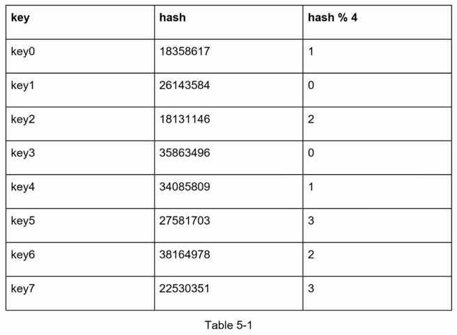
- 위 그림과 같이 서버 4대가 있을 때 다음과 같이 hash % 4를 계산할수 있음

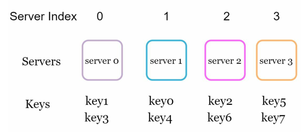
- 각 2개의 key값이 균등하게 서버에 배치됨을 확인할 수 있음

- 위 방식은 서버의 개수가 고정되어있을 때, 그리고 데이터 분포가 균등할 때 잘 동작함
- 하지만 서버가 추가되거나, 삭제되는 경우에 문제가 발생함
- 하나의 서버에 장애가 생겨 가용 가능한 서버가 3대가 된다면, 

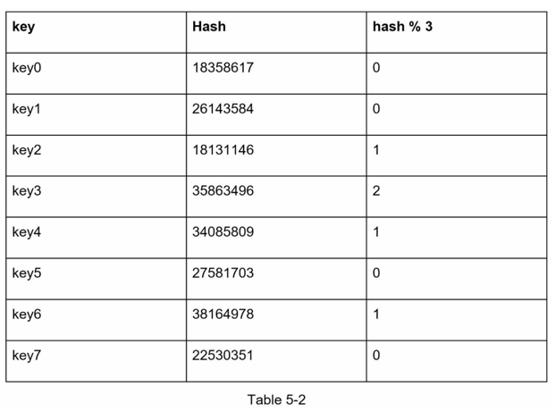
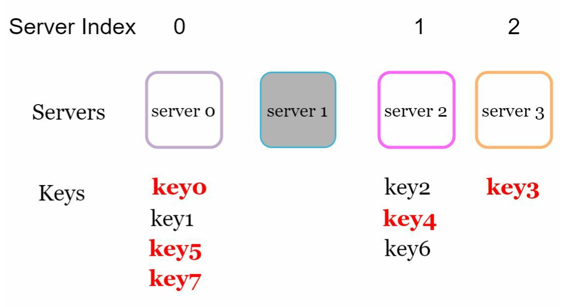

- 계산한 해시 값에 따른 index가 위 그림처럼 바뀐다.
- 즉, 빨간 글씨처럼 데이터가 없는 엉뚱한 서버에 접속하게 되어 데이터 miss가 발생한다.
- 이러한 **해시 키 재배치 문제**를 해결하기 위해, 안정 해시를 도입할 수 있다.

## 안정 해시
- **안정 해시**는 해시 테이블 크기가 조정될 때, 모든 키를 재배치는 것이 아닌 k/n개만 재배치하는 기술이다.
- 이때 k: 키의 개수, n: 서버 개수이다. 즉, 최소한의 키를 재배치할 수 있게 해준다.


## 해시 공간과 해시 링
- 해시 함수 SHA-1에 대해, $X_0$부터 $X_n$까지의 값을 반환한다 가정하자
- SHA-1에 따라, $X_0$은 0이고, $X_n$은 $2^{160}-1$이다.

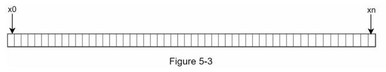

- 다음과 같이 해시 공간을 표현할 수 있으며, 해당 띠의 끝과 끝을 붙여 **해시 링**을 만들 수 있다.

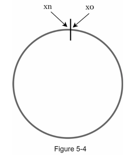


## 해시 서버
- 해당 해시 링에 서버를 배치시킬 수 있다.
- 서버IP, 혹은 이름을 해시함수에 넣어 나온 결괏값을 해시 링에 배치시킨다.

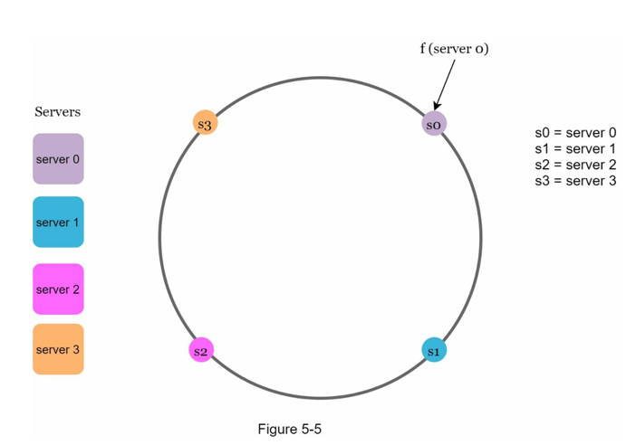


## 해시 키
- 위와 같이 서버를 매핑한 상황에서, 캐시하고자 하는 키를 해시 함수에 넣어 동일하게 매핑할 수 있다.

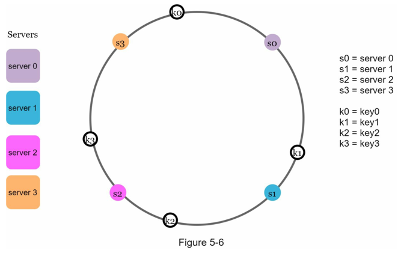
- 위 그림과 같이 key0, 1, 2, 3가 배치된다.


## 서버 조회
- 이때 배치된 키가 저장되는 서버는, 특정 키에서 시계방향으로 해시 링을 돌면서 만나는 첫 번째 서버이다.


- 위 그림에 따라 `k0 -> s0`, `k1 -> s1`, `k2 -> s2`, k3 -> s3`에 저장됨을 확인할 수 있다.


## 서버 추가
- 위 설명에 따라, 서버가 추가된다는 가정 하에, 일부 키만 재배치된다.
- 새로운 서버4가 추가된다고 가정하자

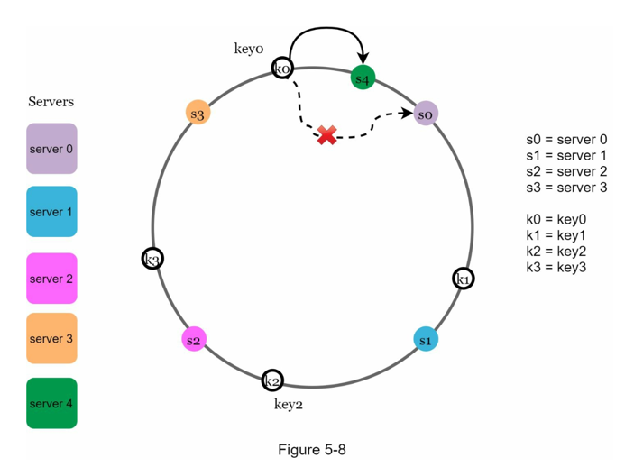
- 위 그림처럼 서버4가 추가되면, k0가 시계방향으로 돌 때 만나는 첫 번째 서버는 s4가 된다.
- 즉, s0에 저장된 k0은 s4에 저장되게 된다.
- k0를 제외한 나머지 키들은 변경되지 않는다.

## 서버 제거
- 서버의 제거도 비슷한 맥락으로 진행된다.


- 위 그림과 같이 서버1이 삭제되었을 때, 서버1에 저장되었던 key1은 시계방향으로 돌았을 때 처음 만나게 되는 서버2에 저장되는 것으로 변경된다.


## 기본 구현법의 두 가지 문제
- 이러한 방식의 안정 해시 알고리즘은 MIT에서 제안되었다.
- 기본 절차는 아래와 같다.
> ### 안정 해시 알고리즘
> 1. 서버와 키를 해시 함수를 통해 해시 링에 배치한다.
> 2. 키의 위치에서 시계방향으로 돌다 만나는 첫 번째 서버가 키의 저장위치가 된다.

- 하지만 이러한 안정 해시 알고리즘은 두 가지 문제를 가진다.
### 1. 서버가 할당받는 해시 공간이 달라짐
- 처음 해시 함수를 통해 균등하게 해시 공간을 할당했지만,
- 서버의 추가 및 삭제로 인해 키가 재배치되어 해시 공간이 달라진다.

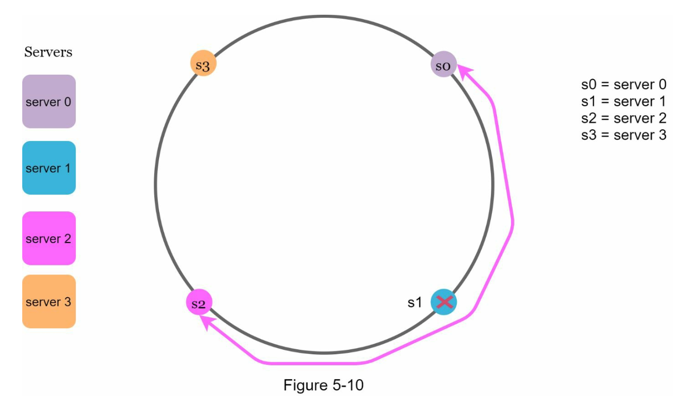
- 위 예시 처럼 서버1이 삭제되면 서버2는 다른 서버의 두 배의 해시 공간을 할당받는다.

### 2. 키의 균등 분포가 깨진다.
- 처음엔 균등하게 키데이터를 할당하지만, 서버의 할당된 해시 공간이 달라져 분포가 달라지게 된다.


- 위처럼 서버2가 대부분의 키값들을 할당받고 있다.

> 이러한 안정 해시 알고리즘의 문제를 해결하기 위해, **가상 노드**를 도입할 수 있다.

## 가상 노드
- 한 서버에 대해 여러 개의 노드를 가상으로 할당한다.
- 즉, 서버1에 대해 가상노드1, 가상노드2, 가상노드3 ... 같은 여러 대의 노드를 설정하는 것이다.

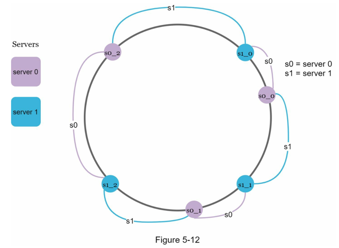
- 위 그림처럼 두 개의 서버에 대해 각각 3개의 가상 노드를 설정한다.
- 가상노드가 커질수록 서버가 할당받는 해시 공간의 크기는 점점 균등해진다.
- [균등 해시](https://tom-e-white.com/2007/11/consistent-hashing.html)
- 위 링크에 다르면, 100~200개의 가상노드를 사용했을 때, 표준편차값이 평균의 5% ~ 10%사이라는 균등성을 보여준다.


> #### 🔑 안정 해시의 장점
> 1. 서버가 추가되거나 삭제될 때 재배치되는 키의 수가 최소화됨
> 2. 데이터가 균등하게 분포되어 수평적 규모 확장을 지원함
> 3. 샤드의 핫스팟 문제를 해결함

> #### 안정 해시의 사용 예시
> 1. 아마존 DynamoDB
> 2. Cassandra 클러스터
> 3. 디스코드 채팅 어플리케이션
> 4. 아마카이 CDN
> 5. 매그레프 네트워크 부하 분산기


---

# 6️⃣ 키-값 저장소 설계
- 키-값 저장소는 비관계형 데이터베이스읻.
- 고유식별자를 통해, 값을 가져오거나 등록한다.
- 값으로는 어떤 자료형이든 가능하다.
- 대표적 키-값 저장소로 DynamoDB, memcached, redis 등이 있다.

## 문제 이해 및 설계 범위 확정
1. 키-값 쌍의 크기는 10KB이하이다.
2. 큰 데이터를 저장할 수 있어야 한다.
3. 높은 가용성 제공 -> 장애에 대해 빠른 응답
4. 높은 규모 확장성 -> 트래픽 양에 따라 자동으로 증설 혹은 축소
5. 데이터 일관성 수준은 조정 가능
6. 응답 지연시간을 줄여야함

## 단일 서버 키-값 저장소
- 가장 직관적인 키-값 쌍 전부를 메모리에 해시 테이블로 저장하는 것
- 모든 데이터를 메모리에 넣을 수 없으므로,
1. 데이터 압축
2. 자주 hit되는 데이터만 메모리에 두고 나머지는 디스크에 옮기는 방법
- 결국 해당 방식도 언젠가는 한계를 마주치게 됨
- 즉, 분산 키-값 저장소의 필요성이 나타남


## 분산 키-값 저장소
- 해당 저장소를 분산 해시 테이블이라고 부르기도 함
- CAP 정리를 분명하게 이해해야함


### CAP 정리
- CAP정리는 `데이터 일관성`, `가용성`, `파티션 감내`라는 세 가지 요구사항을 동시에 만족하는 것은 불가능하다는 정리이다.

| 데이터 일관성 | 분산 시스템에 접속하는 모든 클라이언트는 어떤 노드에 접속하든 같은 데이터를 봐야함 (데이터가 어떨때는 A고 어떨때는 B여서는 안됨) |
|---------|----------------------------------------------------------------------------|
| 가용성     | 분산 시스템에 접속하는 클라이언트는 일부 노드에 장애가 있어도 정상적으로 사용할 수 있어야함                        |
| 파티션 감내  | 두 노드 사이에 장애가 발생한 상황. 네트워크에 장애가 발생하더라도 시스템은 계속 동작해야함                        |

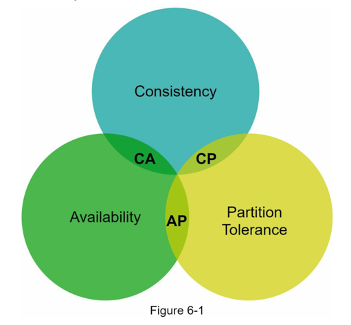
- 즉, 두 가지를 충족하려면 반드시 한 가지는 포기해야한다는 정리이다.
- 이때 파티션 감내는 모든 네트워크 아키텍처에서 발생하는 문제이므로, 해당 문제를 포기할 수 없다.
- 즉, 데이터 일관성, 가용성 둘 중 하나를 포기해야한다.

#### 이상적 상태
- 각 노드에 데이터가 복제되어 보관한 상태에서, 네트워크 에러(파티션 감내)상황은 발생하지 않으며,
- 한 노드에 데이터가 변경되었을 때, 즉시 다른 노드들에도 자동적으로 데이터가 복제되는 상태
- 가용성, 일관성이 만족되는 이상적 상태 의미

#### 실세계의 분산 시스템
- 이상적 상태와 다르게, 현실세계에서는 네트워크 에러는 꼭 발생하는 문제이므로, 파티션 감내를 만족시킬 수 없다.
- 즉, 일관성, 가용성 둘 중 하나를 선택해야함
- 대체적으로 일관성과 가용성은 반비례 관계를 가짐
1. 일관성 선택 시,
- 여러 서버 간에 발생할 수 있는 데이터 불일치 문제를 해결하기 위해 다른 노드에 대해 쓰기 연산을 중단시켜야함
- 이는 가용성을 깨드리는 행위

2. 가용성 선택 시,
- 항상 모든 노드에 대해 읽기 쓰기 연산이 가능해야함
- 하지만 모든 노드에 대해 변경 데이터가 즉시 반영되지 않으므로 일관성이 깨짐

### 시스템 컴포넌트
- 키-값 저장소 구현에 사용될 다양한 핵심 컴포넌트를 밑에 나열한다.

#### 대규모 파티션
- 대규모 애플리케이션의 경우, 한 대의 서버에 데이터를 모조리 넣는 것은 불가능하므로 이를 여러 대의 서버에 저장하는 보편적인 방법을 사용함
- 이때 두 가지의 요소를 고려해야한다.
1. 데이터를 여러 서버에 고르게 분산할 수 있는가?
2. 서버가 추가되거나 삭제될 때 데이터의 이동을 최소화 할 수 있는가?

- 위 요소에 대한 해결책은 5장의 안정 해시 알고리즘을 통해 해결할 수 있다.

#### 데이터 다중화
- 높은 안정성과 가용성을 위해 여러 서버에 데이터를 동기화하여 다중화할 필요가 있음
- 이에 N개의 서버에 데이터 사본을 배치한다 가정할 때,


- 데이터 키가 시계방향으로 해시 링을 순회하며 만나는 N개의 서버에 데이터를 저장한다. 위 그림은 N = 3일때의 예시이다.


#### 일관성
- 여러 서버에 다중화된 데이터는 모든 서버에서 조회할 때 동일한 데이터가 조회되어야한다. 즉, 데이터 동기화의 문제이다.
- 이를 해결하기 위해 정족수 합의 프로토콜을 사용하여 읽기/쓰기 연산에 일관성을 부여할 수 있다.

> #### 정족수 합의 프로토콜
> - N = 사본 개수 (서버 개수)
> - W = 쓰기 연산에 대한 정족수 (적어도 W개의 서버에서 쓰기 연산이 성공했다는 응답을 받으면, 쓰기 연산 성공으로 간주)
> - R = 읽기 연산에 대한 정족수 (적어도 R개의 서버에서 읽기 연산이 성공했다는 응답을 받으면, 읽기 연산 성공으로 간주)
> 
> 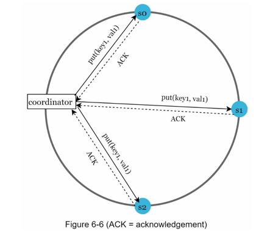
> - 중재자(coordinator)는 각 노드로부터 읽기/쓰기 연산을 보내고 응답(ACK)를 받는다.
> - 만약 N = 3, W = 1이라면 : 3대의 노드에 쓰기 연산을 보냈을 때, 1개의 서버에서 응답이 오면 성공으로 간주하는 것이다.
> - 여기서 W이 커지면 여러 서버에서 응답을 받아야하므로 응답속도는 느릴 것이다.
>
> #### 일관성 모델
> - R = 1, W = N : 빠른 읽기 연산에 최적화된 시스템
> - W = 1, R = N : 빠른 쓰기 연산에 최적화된 시스템
> - W + R > N : 강한 일관성이 보장됨
> - W + R <= N : 강한 일관성이 보장되지 않음
>
> #### 강한 일관성 : 모든 읽기 연산은 가장 최근의 데이터를 반환함
> #### 약한 일관성 : 읽기 연산이 가장 최근의 데이터를 반환하지 못할 수 있음
> #### 결과적 일관성 : 약한 일관성의 한 형태이지만, 결국엔 모든 사본에 최신 데이터가 반영됨
> - 강한 일관성을 달성하는 방법은, 모든 사본에 읽기/쓰기 연산을 금지하는 것이지만, 이는 가용성을 해치는 방법이다.
> - 가용성도 만족시키고자, 결과적 일관성을 통해 모든 사본에 최신 데이터가 반영되도록 함 (but 시간이 좀 걸릴수도)
> - 이때 해당 문제를 클라이언트에서 해결할 수 있음


#### 일관성 불일치 해소 : 데이터 버저닝
- 위에서 언급한, 가용성을 만족시키고자 일관성이 해쳐지는 문제를 해결하기 위한 방법으로 **데이터 버저닝(벡터시계)**이 있다.
- 버저닝을 통해, 데이터가 변경될 때 새로운 버전을 만들 수 있다.
- 이때 각 버전의 데이터는 변경되지 않는다. 데이터가 변경되면 새로운 버전의 데이터가 생길 뿐이다.

> #### 데이터 일관성이 깨지는 법
> - 
> - 위는 노드 n1, n2에서 동일하게 'join'을 반환하는 예제이다.
> - 이때 n1에서는 `johnSanFrancisco`로 변경하고, n2에는 `johnNewYork`으로 바꾼다 가정하자.
> - 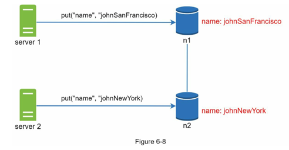
> - 그럼 위와 같이 각 서버(노드)마다 데이터가 불일치하게 된다.
> - 각 노드의 데이터가 동기화될 때 일관성이 깨지는 것이다.

##### 벡터시계
- 이를 해결하기 위해 벡터시계로 문제를 해결한다.
- 벡터시계는 `D([S1, v1], [S2, v2], [S3, v3] ... , [Sn, vn])`와 같은 형태로 이루어져 있다.
- 이때 `D`는 데이터, `Sn`는 서버 번호, `vn`는 버전 카운터이다.
- 데이터 `D`를 서버 `Si`에 기록할 때,
  - `[Si, vi]`가 존재하면 `vi`를 증가시킨다.
  - `[Si, vi]`가 존재하지 않는다면 `[Si, 1]`를 만든다.


- `데이터 일관성이 깨지는 법`에서 언급한 시나리오에서의 버저닝 예시이다.
- `3번`과 `4번`에서 각각 데이터가 변경되어 데이터 불일치가 발생한다.
- 이때 해당 충돌은 클라이언트에서 해소한 후, 서버에 기록하게 된다. (추후 설명)
- 이때 벡터시계를 통해 어떤 버전이 이전 버전인지 판단할 수 있다.
- 벡터시계를 통한 충돌 감지는, 버전이 겹칠때를 통해 판단할 수 있다.

#### 단점
- 클라이언트의 구현이 복잡해짐
- `[Si, vi]`라는 순서쌍이 빨리 늘어남
  - 이를 해결하기 위해서는 특정 임계치보다 길이가 늘어나면 삭제하는 방법 채택 가능

#### 장애 처리
- 장애는 애플리케이션 시스템에서 무조건 일어날 수 밖에 없는 현상이다.
- 이에 장애를 막는 것이 아닌, 장애 발생 시 어떻게 처리할 것이냐에 초점을 맞춰야 함

> #### 장애 감지
> - 여러 서버가 운용되는 분산 처리 시스템에서는 장애 판별에 대해 특정 서버 한 대가 '한 서버가 죽었다'라고 하는것 가지고 장애처리를 하지 않는다.
> - 두 대 이상의 서버가 '특정 서버가 죽었다'라고 해야 해당 서버에 대해 장애라고 판별한다.
> - 이에 모든 서버 사이에 응답을 주고받는 방식이 서버 장애를 감지하기 쉬운 방법이지만, 서버가 많을 때는 비효율적인다.
> 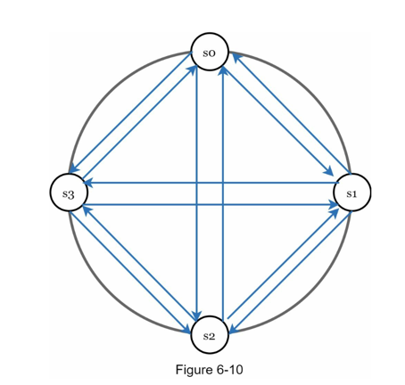
> 
> - 이에 `가십 프로토콜`을 통해 장애를 감지한다.
> #### 가십 프로토콜
> - 각 서버는 본인의 카운터를 주기적으로 증가시키며, 각 서버는 무작위 서버에 본인의 카운터 목록을 전송한다.
> - 이때 카운터 목록을 받으면 받은 서버는 카운터 값을 갱신한다.
> - 이에 지정된 시간 동안 특정 서버의 카운터 값이 갱신되지 않으면 해당 서버를 장애로 판단한다.
> 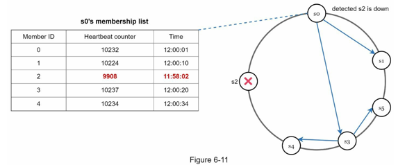

#### 일시적 장애 처리
- 위에서 언급한 가십 프로토콜로 장애를 감지했으면, 가용성을 보장하기 위해 해당 서버를 일시적으로 제외하는 방법을 채택할 수 있다.
- 장태 상태의 서버로 가능 요청은 다른 서버가 일시적으로 맡아 처리한다.
- 해당 서버가 복구되었을 때 일괄 반영하여 데이터의 일관성을 보존한다.
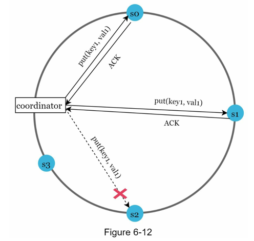
- 위 예시에서, s2에 요청에 대해 s3이 해당 요청을 처리한다.
- s2가 복구되면, s3은 갱신된 데이터를 s2로 인계한다.

#### 영구 장애 처리
- `반 엔트로피`프로토콜을 통해 영구 장애 처리를 지원한다.
- 머클 트리를 통해 이루어진다.
- 머클 트리는 인덱스와 비슷한 개념으로, 자식 노드들의 레이블로부터 계산된 해시값을 부모 노드로 사용하는 트리다.

- 위와 같이 각 서버에 4개의 버킷으로 나눈다.

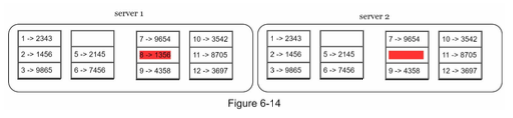
- 각 버킷에 포함된 키에 균등 해시 함수를 적용하여 해시 값을 계산한다.


- 버킷 별로 해시 값을 계산한 후, 해당 해시 값을 부모 노드(레이블)를 만든다.

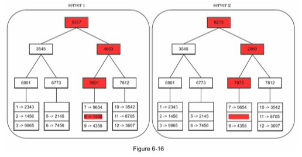
- 이후 재귀적으로 자식 노드의 레이블로부터 새로운 해시 값을 만들며 이진 트리를 만든다.

- 이후 두 서버의 머클 트리를 비교하여, 루트 노드의 해시 값이 일치한다면 두 서버는 같은 데이터를 갖는 것으로 간주
- 다른 경우에는 왼쪽 -> 오른쪽 순서로 해시값을 비교한다.
- 재귀적으로 점점 작은 범위의 버킷을 담당하는 노드를 순회하며 다른 데이터를 가진 부분을 찾는다.
- 즉, 해당 버킷만 업데이트할 수 있다.
- 머클 트리를 통해 비교 및 동기화해야하는 데이터의 양은 획기적으로 줄어든다.

#### 시스템 아키텍처 다이어그램
- 키-값 저장소의 고려사항을 통해 아키텍처 다이어그램을 작성할 수 있다.

- 클라이언트는 단순 API(GET, PUT)으로 통신하며,
- 중재자는 프록시 역할을 한다.
- 노드(서버)는 안정 해시의 해시 링에 존재한다.
- 노드를 자동으로 추가, 삭제할 수 잇는 분산 환경이다.
- 데이터는 여러 노드에 다중화되어 저장된다.
- 모든 노드가 같은 책임을 지기 때문에 단일 실패 지점이 존재하지 않는다.

#### 쓰기 경로
- 쓰기 요청이 노드로 전달되었을 때의 시나리오이다.

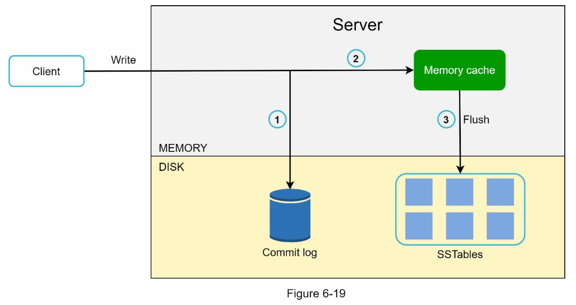
1. 먼저 디스크의 커밋 로그에 로그를 기록한다.
2. 이후 데이터를 메모리 캐시에 작성한다.
3. 메모리 캐시가 가득 차면 디스크의 SSTable에 기록한다.


#### 읽기 경로
- 읽기 요청이 노드로 전달되었을 때의 시나리오이다.

> #### 데이터가 캐시에 있는 경우
> 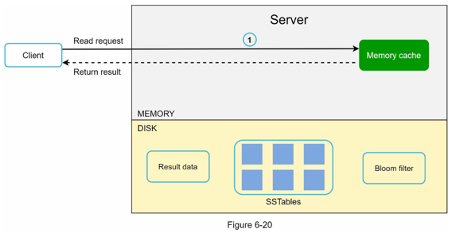
> 
> #### 데이터가 캐시에 없는 경우
> 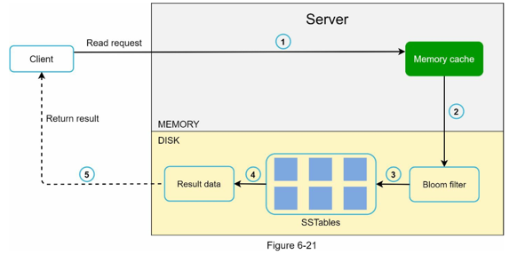
> 1. 데이터에 메모리가 있는지 검사
> 2. 없으면 블룸 필터를 검사
> 3. 블룸 필터를 통해 어떤 SSTable에 키가 보관되어잇는지 알아냄
> 4. SSTable에서 데이터를 가져온 후
> 5. 해당 데이터를 클라이언트에게 반환함


