# 5. 안정 해시 설계

- 수평적 규모 확장을 달성하기 위해서는 요청 또는 데이터를 서버에 균등하게 나누는 게 중요하다.
    - 서버가 여러 대 있어도 일이 한쪽에 몰리면 전체 성능은 병목 난 서버에 의해 결정되기 때문.
- **안정 해시**는 이 목표를 달성하기 위해 보편적으로 사용하는 기술이다.
    - 우선 이 해시 기술이 풀려고 하는 문제부터 살펴보자.

## 5.1 해시 키 재배치(rehash) 문제

- N개의 캐시 서버가 있다고 하자. 이 서버들에 부하를 균등하게 나누는 보편적 방법은 아래 해시 함수를 사용하는 것이다.
    - `serverIndex = hash(key) % N (N은 서버의 개수이다)`
- 예제를 통해 어떻게 동작하는지 알아보자.
    - 총 4대의 서버를 사용한다고 하자.
    - 아래의 표는 주어진 각각의 키에 대해서 해시 값과 서버 인덱스를 계산한 예제다.
        
        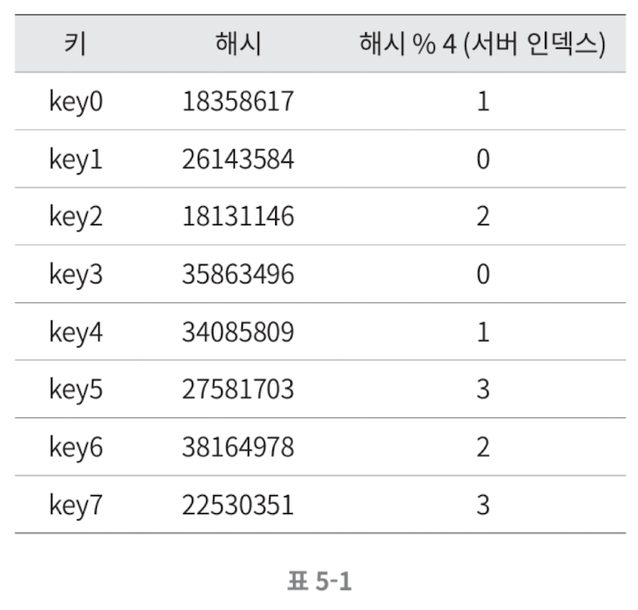
        
    - 특정한 키가 보관된 서버를 알아내기 위해, 나머지 연산을 f(key) % 4와 같이 적용하였다.
        - 예를 들어 hash(key0) % 4 = 1이면, 클라이언트는 캐시에 보관된 데이터를 가져오기 위해 서버 1에 접속하여야 한다.
    - 아래 그림은 본 예제에서 키 값이 서버에 어떻게 분산되는지 보여준다.
        
        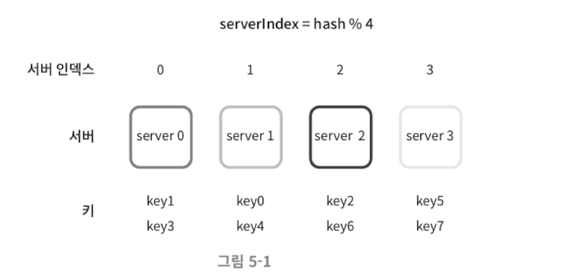
        
- 이 방법은 서버 풀(server pool)의 크기가 고정되어 있을 때, 그리고 데이터 분포가 균등할 때는 잘 동작한다.
- 하지만 서버가 추가되거나 기존 서버가 삭제되면 문제가 생긴다.
    - 예를 들어 1번 서버가 장애를 일으켜 동작을 중단했다고 하자.
    - 그러면 서버 풀의 크기는 3으로 변한다.
    - 그 결과로, 키에 대한 해시 값은 변하지 않지만 나머지 연산을 적용하여 계산한 서버 인덱스 값은 달라질 것이다. 서버 수가 1만큼 줄었기 때문이다.
    - 따라서 아래 표와 같은 결과를 얻는다. (해시 % 3)
        
        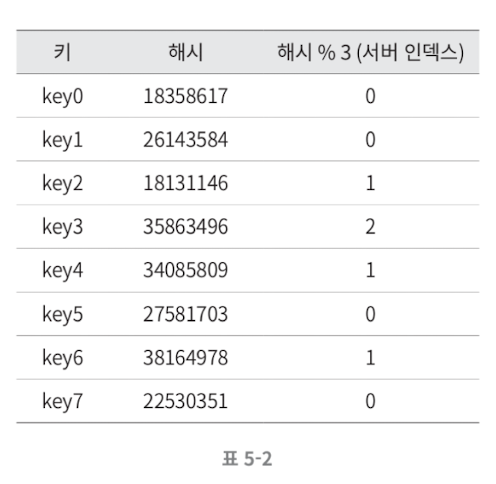
        
    - 아래 그림은 변화된 키 분포를 보여준다.
        
        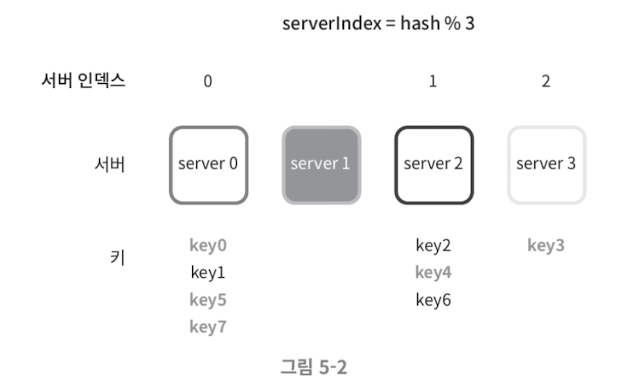
        
        - 장애가 발생한 1번 서버에 보관되어 있는 키 뿐만 아닌 대부분의 키가 재분배되었다. **1번 서버가 죽으면 대부분 캐시 클라이언트가 데이터가 없는 엉뚱한 서버에 접속하게 된다는 뜻이다.**
        - 그 결과로 대규모 캐시 미스가 발생하게 될 것이다.
        - 안정 해시는 이 문제를 효과적으로 해결하는 기술이다.

## 5.2 안정 해시

- 안정 해시는 해시 테이블 크기가 조정될 때 **평균적으로 오직 k/n개의 키만 재배치하는 해시 기술**이다. 여기서 k는 키의 개수이고, n은 슬롯(slot)의 개수이다.

### 5.2.1 해시 공간과 해시 링

- 안정 해시의 동작 원리를 살펴보자. 해시 함수 f로는 SHA-1을 사용한다고 하고, 그 함수의 출력 값 범위는 x0, x1, x2, x3, … xn과 같다고 하자. SHA-1의 해시 공간 범위는 0부터 2^160-1이다.
- 따라서 x0은 0, xn은 2^160-1이고, x1부터 xn-1까지는 그 사이의 값을 갖게 될 것이다.
    
    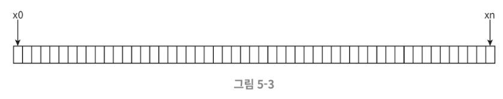
    
    - 위 그림은 이 해시 공간을 그림으로 표현한 것이다.
    - 이 해시 공간의 양쪽을 구부려 접으면 아래 그림과 같은 해시 링(hash ring)이 만들어진다.
        
        
        

### 5.2.2 해시 서버

- 이 해시 함수 f를 사용하면 서버 IP나 이름을 이 링 위의 어떤 위치에 대응시킬 수 있다. 아래 그림은 4개의 서버를 이 해시 링 위에 배치한 결과다.
    
    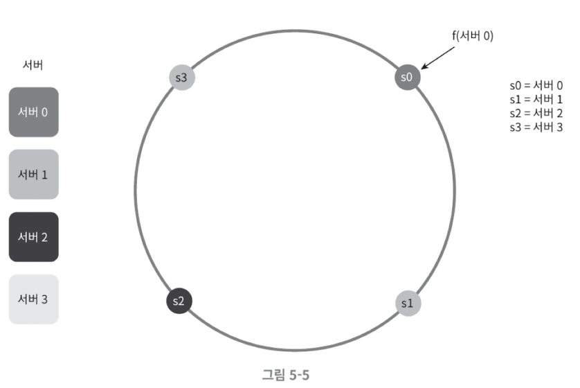
    

### 5.2.3 해시 키

- 여기 사용된 해시 함수는 “해시 키 재배치 문제”에 언급된 함수와는 다르며, 나머지 연산은 사용하지 않고 있음에 유의하자.
- 아래 그림과 같이, 캐시할 키 key0, key1, key2, key3 또한 해시 링 위의 어느 지점에 배치할 수 있다.
    
    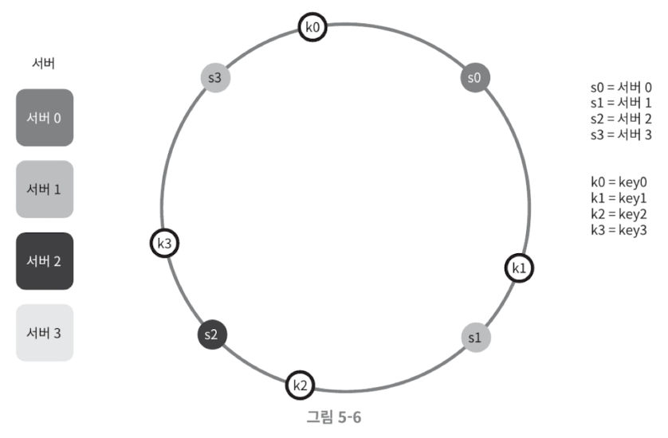
    

### 5.2.4 서버 조회

- 어떤 키가 저장되는 서버는, 해당 키의 위치로부터 시계 방향으로 링을 탐색해 나가면서 만나는 첫 번째 서버다. 아래 그림이 이 과정을 보여준다. 따라서 key0은 서버 0에 저장되고, key1은 서버 1에 저장되며, key2는 서버 2, key3은 서버 3에 저장된다.
    
    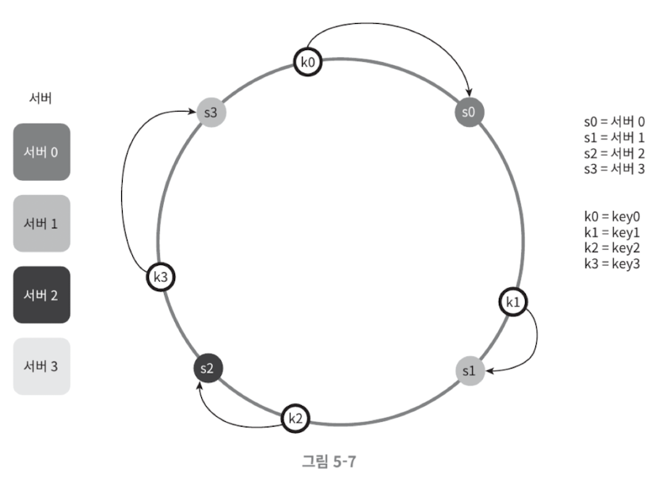
    

### 5.2.5 서버 추가

- 서버를 추가하더라도 키 가운데 일부만 재배치하면 된다.
- 아래 그림을 보면 새로운 서버 4가 추가된 뒤에 key0만 재배치됨을 알 수 있다. k1, k2, k3은 같은 서버에 남는다.
    
    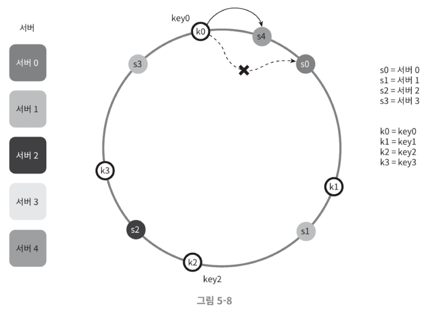
    
    - 왜? 서버 4가 추가되기 전, key0은 서버 0에 저장되어 있었다. 하지만 서버 4가 추가된 뒤에 key0은 서버 4에 저장될 것이다.
        - 왜냐하면 key0의 위치에서 시계 방향으로 순회했을 때 처음으로 만나게 되는 서버가 서버 4이기 때문이다. 다른 키들은 재배치되지 않는다.

### 5.2.6 서버 제거

- 하나의 서버가 제거되면 키 가운데 일부만 재배치된다. 아래 그림을 보면 서버 1이 삭제되었을 때 key1만이 서버 2로 재배치됨을 알 수 있다. 나머지 키에는 영향이 없다.
    
    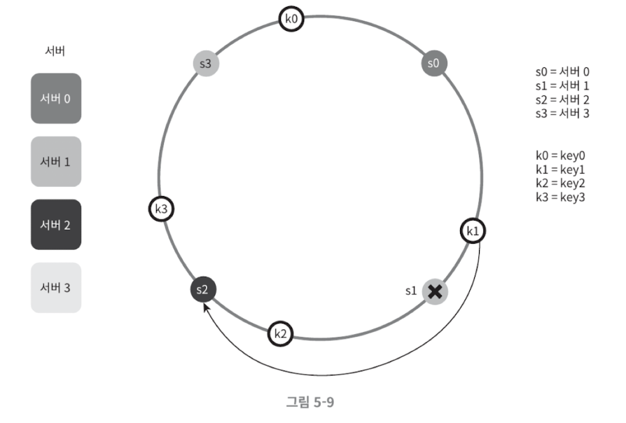
    

### 5.2.7 기본 구현법의 두 가지 문제

- 안정 해시 알고리즘은 MIT에서 처음 제안되었다. 그 기본 절차는 다음과 같다.
    - 서버와 키를 균등 분포 해시 함수를 사용해 해시 링에 배치한다.
    - 키의 위치에서 링을 시계 방향으로 탐색하다 만나는 최초의 서버가 키가 저장될 서버다.
- 이 접근법에는 두가지 문제가 있다.
    1. **서버가 추가되거나 삭제되는 상황을 감안하면 파티션의 크기를 균등하게 유지하는 게 불가능하다.** 어떤 서버는 굉장히 작은 해시 공간을 할당 받고, 어떤 서버는 굉장히 큰 해시 공간을 할당 받는 상황이 가능해진다. 아래 그림은 s1이 삭제되는 바람에 s2의 파티션이 다른 파티션 대비 거의 두 배로 커지는 상황을 보여준다.
        - 파티션: 인접한 서버 사이의 해시 공간
            
            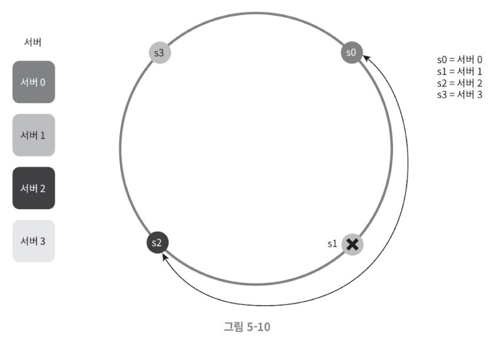
            
        
    2. **키의 균등 분포를 달성하기가 어렵다.**
        - 예를 들어 서버가 아래 그림과 같이 배치되어 있다고 해보자. 서버 1과 서버 3은 아무 데이터도 갖지 않는 반면, 대부분의 키는 서버 2에 보관될 것이다.
            
            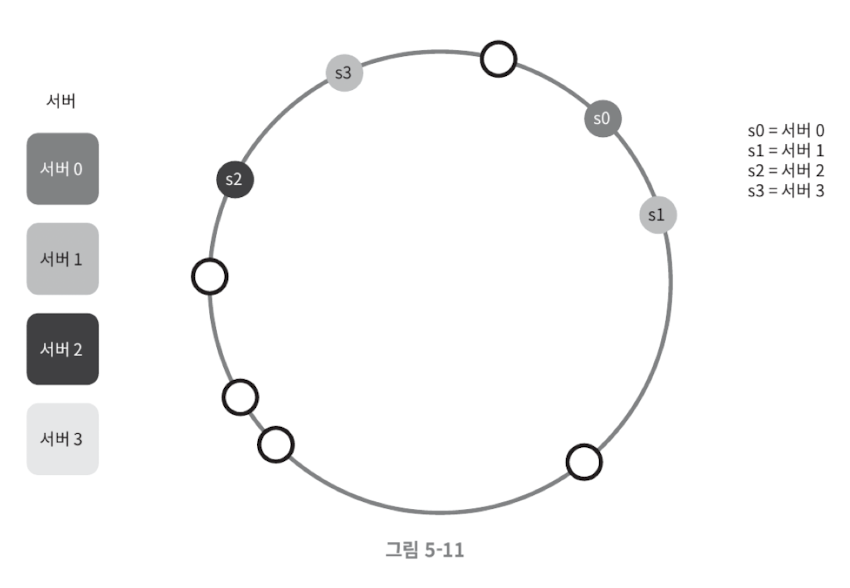
            
- 이 문제를 해결하기 위해 제안된 기법이 **가상 노드 또는 복제**라 불리는 기법이다.

### 5.2.8 가상 노드

- 가상 노드는 실제 노드 또는 서버를 가리키는 노드로서, **하나의 서버는 링 위에 여러 개의 가상 노드를 가질 수 있다.**
    - 아래 그림을 보면 서버 0과 서버1은 3개의 가상 노드를 갖는다. 여기서 숫자 3은 임의로 정한 것이며, 실제 시스템에서는 그보다 훨씬 큰 값이 사용된다.
    - 서버 0을 링에 배치하기 위해 s0 하나만 쓰는 대신, s0_0, s0_1, s0_2의 3개 가상 노드를 사용하였다. 마찬가지로 서버 1을 링에 배치할 때는 s1_0, s1_1, s1_2의 3개 가상 노드를 사용했다.
    - 따라서 각 서버는 하나가 아닌 여러 개 파티션을 관리해야 한다.
    - 아래 그림에서 s0으로 표시된 파티션은 서버 0이 관리하는 파티션이고, s1로 표시된 파티션은 서버 1이 관리하는 파티션이다.
    
    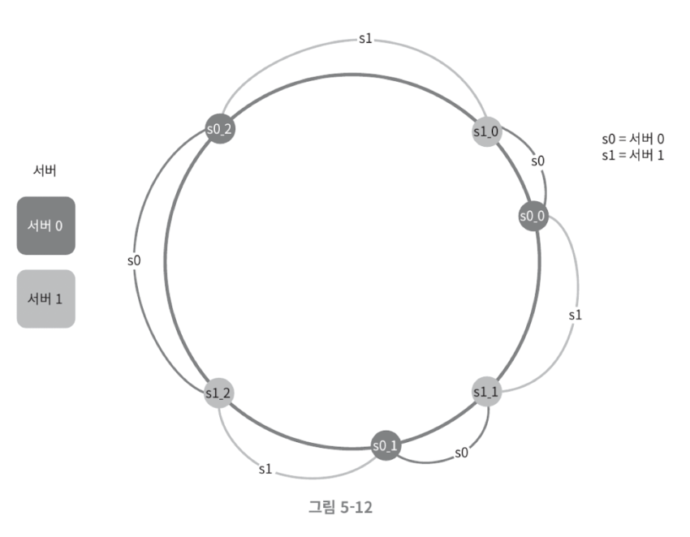
    
- 키의 위치로부터 시계방향으로 링을 탐색하다 만나는 최초의 가상 노드가 해당 키가 저장될 서버가 된다. 아래 그림은 그에 해당하는 예제다.
    - k0가 저장되는 서버는 k0의 위치로부터 링을 시계방향으로 탐색하다 만나는 최초의 가상 노드 s1_1가 나타내는 서버, 즉, 서버1이다.

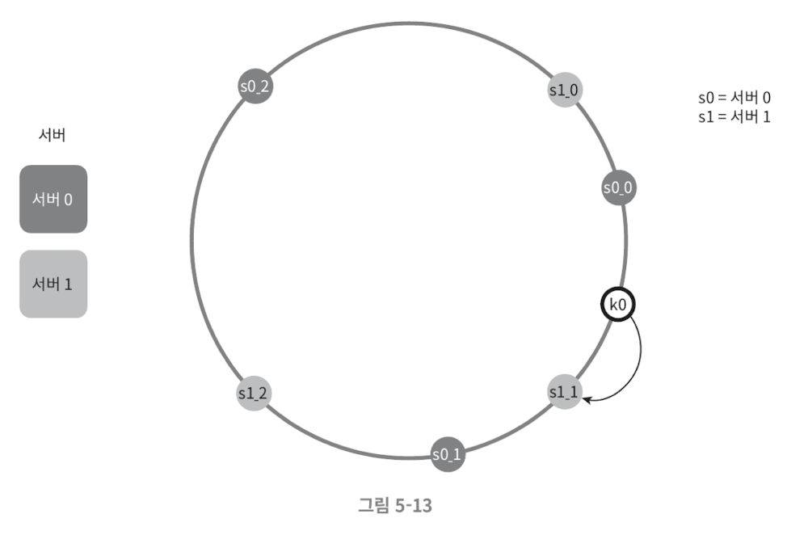

- 가상 노드의 개수를 늘리면 키의 분포는 점점 균등해진다.
    - 표준 편차가 작아져서 데이터가 고르게 분포되기 때문이다.
        - 표준 편차는 데이터가 어떻게 퍼져 나갔는지를 보이는 척도다.
    - 하지만 타협적 결정이 필요하다. 가상 노드의 개수를 늘리면, 가상 노드 데이터를 저장할 공간은 더 많이 필요하기 될 것이기 때문이다. 따라서 시스템 요구사항에 맞도록 가상 노드 개수를 적절히 조정해야 한다.

### 5.2.9 재배치할 키 결정

- 서버가 추가되거나 제거되면 데이터 일부는 재배치해야 한다. **어느 범위의 키들이 재배치되어야 할까?**
    - 아래 그림처럼 서버 4가 추가되었다고 해보자.
    - 이에 영향 받은 범위는 s4(새로 추가된 노드)부터 그 반시계 방향에 있는 첫 번째 서버 s3까지다. 즉, s3부터 s4 사이에 있는 키들을 s4로 재배치해야 한다.
        
        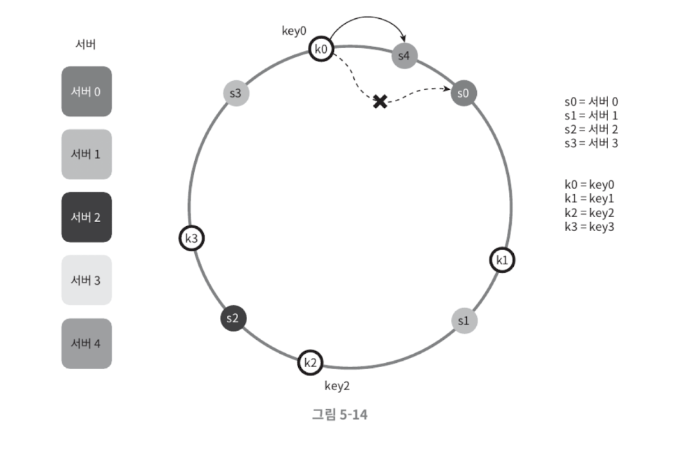
        
    - 서버 s1이 아래 그림과 같이 삭제되면 s1부터(삭제된 노드) 그 반시계 방향에 있는 최초 서버 s0 사이에 있는 키들이 s2로 재배치되어야 한다.
        
        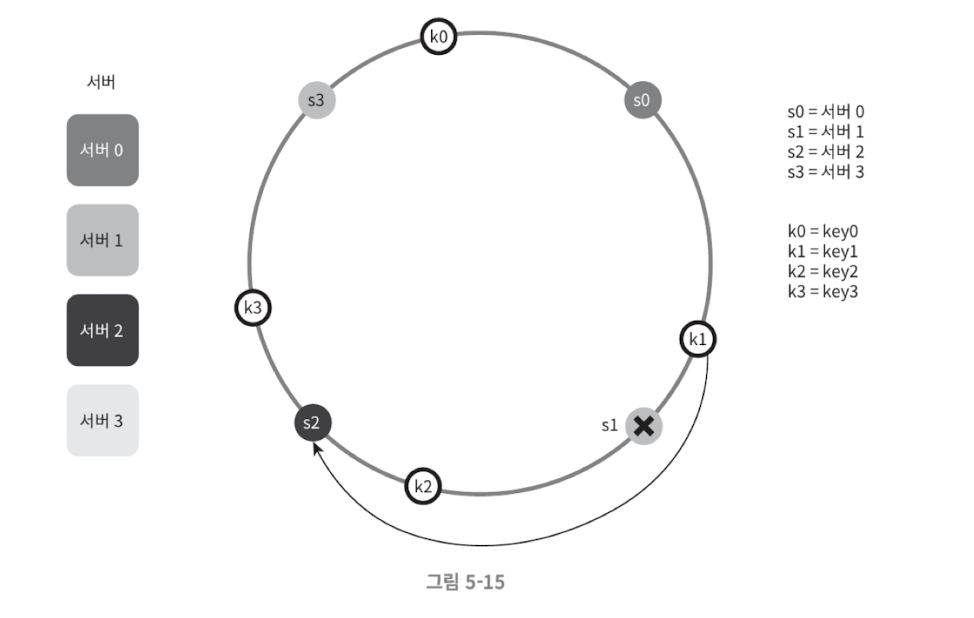
        

### 5.2.10 안정 해시의 이점

- 서버가 추가되거나 삭제될 때 재배치되는 키의 수가 최소화된다.
- 데이터가 보다 균등하게 분포하게 되므로 수평적 규모 확장성을 달성하기 쉽다.
- 핫스팟 키 문제를 줄인다. 특정한 샤드에 대한 접근이 지나치게 빈번하면 서버 과부하 문제가 생길 수 있다.

# 6. 키-값 저장소 설계

- 키-값 저장소는 키-값 데이터베이스라고도 불리는 비관계형 데이터베이스(NoSQL)이다.
    - 이 저장소에 저장되는 값은 고유 식별자를 키로 가져야 한다.
- 키와 값 사이의 이런 연결 관계를 “키-값”쌍이라고 지칭한다.
- 키-값 쌍에서의 키는 유일해야하고, 해당 키에 매달린 값은 키를 통해서만 접근할 수 있다.
    - 키는 일반 텍스트일 수도 있고 해시 값일수도 있다. 성능 상의 이유로 키는 짧을 수록 좋다.
        - ex) 일반 텍스트 키: “last_logged_in_at”, 해키 키: “253DDEC4”
- 키-값 쌍에서의 값은 문자열일 수도 있고 리스트일 수도 있고 객체일 수도 있다. 키-값 저장소는 보통 값으로 무엇이 오든 상관하지 않는다. 키-값 저장소로 널리 알려진 것으로는 레디스 같은 것들이 있다.
    - 아래는 키-값 저장소에 보관된 데이터의 사례다.
    
    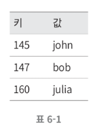
    
    - put(key, value): 키-값 쌍을 저장소에 저장한다.
    - get(key): 인자로 주어진 키에 매달린 값을 꺼낸다.

## 6.1 문제 이해 및 설계 범위 확정

- 완벽한 설계란 없다. **읽기, 쓰기 그리고 메모리 사용량 사이에 어떤 균형**을 찾고, **데이터의 일관성과 가용성 사이에서 타협적 결정을 내린 설계**를 만들었다면 쓸만한 답안일 것이다.
- 다음 특성을 갖는 키-값 저장소 설계
    - 키-값 쌍의 크기는 10KB 이하
    - 큰 데이터를 저장할 수 있어야 한다.
    - 높은 가용성 제공(장애가 있어도 빨리 대응)
    - 높은 규모 확장성(트래픽 양에 따라 자동적으로 서버 증설/삭제 이루어져야 함)
    - 데이터 일관성 수준은 조정 가능해야 한다.
    - 응답 지연시간이 짧아야 한다.

## 6.2 단일 서버 키-값 저장소

- 한 대 서버만 사용하는 키-값 저장소를 설계하는 것은 쉽다.
    - 가장 직관적인 방법: 키-값 쌍 전부를 메모리에 해시 테이블로 저장
    - 그러나 이 접근법은 빠른 속도를 보장하긴 하지만, 모든 데이터를 메모리 안에 두는 것이 불가능할 수도 있다는 약점을 갖고 있다.
    - 이 문제 해결을 위한 개선책
        - 데이터 압축
        - 자주 쓰이는 데이터만 메모리에 두고 나머지는 디스크에 저장
- 그러나 이렇게 개선한다고 해도 한 대 서버로 부족한 때가 곧 찾아온다.
    - 많은 데이터를 저장하려면 분산 키-값 저장소를 만들 필요가 있다.

## 6.3 분산 키-값 저장소

- 분산 키-값 저장소는 분산 해시 테이블이라고도 불린다.
    - 키-값 쌍을 여러 서버에 분산시키기 때문.
- 분산 시스템을 설계할 때는 CAP 정리를 이해하고 있어야 한다.

### 6.3.1 CAP 정리

- CAP 정리는 데이터 일관성, 가용성, 파티션 감내라는 세 가지 요구사항을 동시에 만족하는 분산 시스템을 설계하는 것은 불가능하다는 정리다.
    - 데이터 일관성: 분산 시스템에 접속하는 모든 클라이언트는 어떤 노드에 접속했느냐에 관계없이 **언제나 같은 데이터를 보게 되어야 한다.**
    - 가용성: 분산 시스템에 접속하는 클라이언트는 **일부 노드에 장애가 발생하더라도 항상 응답을 받을 수 있어야 한다.**
    - 파티션 감내: 파티션은 두 노드 사이에 통신 장애가 발생하였음을 의미한다. 파티션 감내는 **네트워크에 파티션이 생기더라도 시스템은 계속 동작하여야 한다**는 것을 뜻한다.
- 아래 그림과 같이 이들 가운데 어떤 두 가지를 충족하려면 나머지 하나는 반드시 희생되어야 한다는 것을 의미한다.
    
    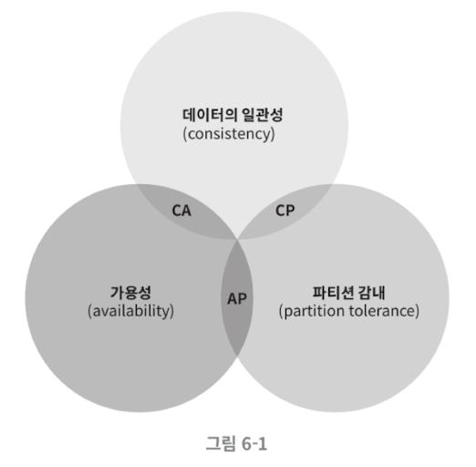
    
- 키-값 저장소는 앞서 제시한 세 가지 요구사항 가운데 어느 두 가지를 만족하느냐에 따라 다음과 같이 분류할 수 있다.
    - CP 시스템: 일관성과 파티션 감내를 지원하는 키-값 저장소. 가용성을 희생.
    - AP 시스템: 가용성과 파티션 감내를 지원하는 키-값 저장소. 데이터 일관성을 희생.
    - CA 시스템: 일관성과 가용성을 지원하는 키-값 저장소. 파티션 감내는 지원하지 않는다. 그러나 통상 네트워크 장애는 피할 수 없는 일로 여겨지므로, 분산 시스템은 반드시 파티션 문제를 감내할 수 있도록 설계되어야 한다. 그러므로 **CA 시스템은 실세계 존재하지 않는다.**
- 사례로 이해하기
    - 분산 시스템에서 데이터는 보통 여러 노드에 복제되어 보관된다.
        - 세 대의 복제 노드 n1, n2, n3에 데이터를 복제하여 보관하는 상황을 아래 그림과 같이 가정해 보자.
        - **이상적 상태**
            - 이상적 환경이라면 네트워크가 파티션되는 상황은 절대로 일어나지 않는다.
            - n1에 기록된 데이터는 자동으로 n2, n3에 복제된다.
            - 데이터 일관성과 가용성도 만족된다.
            
            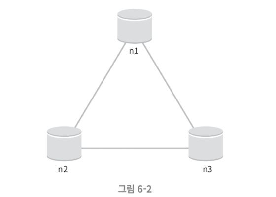
            
        - **실세계의 분산 시스템**
            - 분산 시스템은 파티션 문제를 피할 수 없다.
            - 파티션 문제가 발생하면 우리는 일관성과 가용성 사이에서 하나를 선택해야 한다.
            - 아래 그림은 n3에 장애가 발생하여 n1 및 n2와 통신할 수 없는 상황을 보여주고 있다.
                - 클라이언트가 n1 또는 n2에 기록한 데이터는 n3에 전달되지 않는다. n3에 기록되었으나 아직 n1 및 n2로 전달되지 않은 데이터가 있다면 n1과 n2는 오래된 사본을 갖고 있을 것이다.
                
                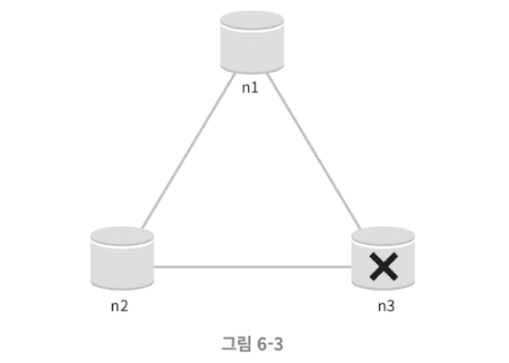
                
            - 가용성 대신 일관성 선택(CP 시스템)
                - 세 서버 사이에 생길 수 있는 데이터 문제를 피하기 위해 n1과 n2에 대해 쓰기 연산을 중단시켜야 한다. 그럼 가용성이 깨진다. 은행권 시스템에서 보통 이용.
            - 일관성 대신 가용성 선택(AP 시스템)
                - 낡은 데이터를 반환할 위험이 있더라도 계속 읽기 연산을 허용해야 한다. n1, n2는 계속 쓰기 연산을 허용할 것이고, 파티션 문제가 해결된 뒤에 새 데이터를 n3에 전송할 것이다.
            - 분산 키-값 저장소를 만들 때는 그 요구사항에 맞도록 CAP 정리를 적용해야 한다.

### 6.3.2 시스템 컴포넌트

- **데이터 파티션**
    - 대규모 애플리케이션의 경우 전체 데이터를 한 대 서버에 욱여넣는 것은 불가능하므로, 데이터를 작은 파티션들로 분할한 다음 여러 대 서버에 저장하는 것이 필요하다.
    - 데이터를 파티션 단위로 나눌 때 고려해야 할 사항
        - 데이터를 여러 서버에 **고르게** 분산할 수 있는가
        - 노드가 추가되거나 삭제될 때 데이터의 이동을 최소화할 수 있는가
    - 안정 해시는 이런 문제를 푸는 데 적합한 기술이다.
        - 규모 확장 자동화: 시스템 부하에 따라 서버가 자동으로 추가되거나 삭제되도록 만들 수 있다.
        - 다양성: 각 서버의 용량에 맞게 가상 노드의 수를 조정할 수 있다. 즉, 고성능 서버는 더 많은 가상 노드를 갖도록 설정할 수 있다.
- **데이터 다중화**
    - 높은 가용성과 안정성을 확보하기 위해 데이터를 N개 서버에 비동기적으로 다중화할 필요가 있다.
        - N: 튜닝 가능한 값
    - N개 서버를 선정하는 방법
        - 어떤 키를 해시 링 위에 배치한 후, 그 지점으로부터 시계 방향으로 링을 순회하면서 만나는 첫 N개 서버에 데이터 사본을 보관한다.
            - N=3일때, 아래 그림의 예제에서 key0은 s1, s2, s3에 저장된다.
                
                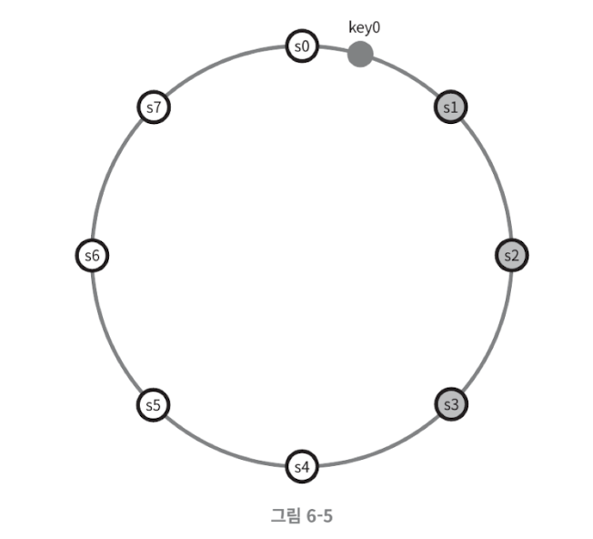
                
        - 가상 노드를 사용한다면 위와 같이 선택한 N개의 노드가 대응될 실제 물리 서버의 개수가 N보다 작아질 수 있다. 이 문제를 피하려면 노드를 선택할 때 **같은 물리 서버를 중복 선택하지 않도록** 해야 한다.
- **데이터 일관성**
    - 여러 노드에 다중화된 데이터는 적절히 동기화 되어야 한다.
    - 정족수 합의 프로토콜을 사용하면 읽기/쓰기 연산 모두에 일관성을 보장할 수 있다.
        - N=사본 개수
        - W=쓰기 연산에 대한 정족수. 쓰기 연산이 성공한 것으로 간주되려면 적어도 W개의 서버로부터 쓰기 연산이 성공했다는 응답을 받아야 한다.
        - R=읽기 연산에 대한 정족수. 읽기 연산이 성공한 것으로 간주되려면 적어도 R개의 서버로부터 읽기 연산이 성공했다는 응답을 받아야 한다.
    - N=3인 경우 아래 그림을 살펴보자.
    
    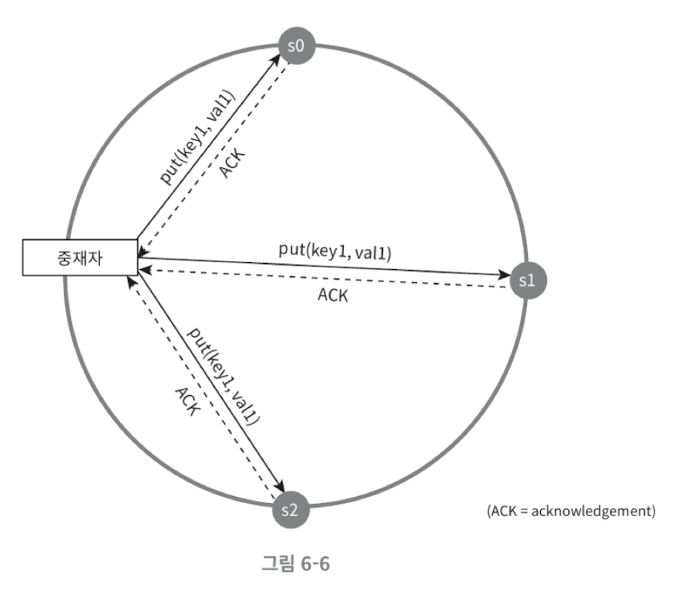
    
    - W = 1은 데이터가 한 대 서버에만 기록된다는 뜻이 아니다.
        - W = 1의 의미는 **쓰기 연산이 성공했다고 판단하기 위해 중재자는 최소 한 대 서버로부터 쓰기 성공 응답을 받아야 한다는 뜻이다.**
    - 위 그림과 같이 데이터가 s0, s1, s2에 다중화 되는 상황을 살펴보자.
        - W = 1일때 s1로부터 성공 응답을 받았다면 s0, s2로부터의 응답은 기다릴 필요가 없다.
        - 중재자는 클라이언트와 노드 사이에서 **proxy 역할을 한다.**
    - W, R, N 값을 정하는 것은 응답 지연과 데이터 일관성 사이의 타협점을 찾는 과정이다.
        - W=1, R=1일때 → 중재자는 한 대 서버로부터의 응답만 받으면 되니 응답속도는 빠를 것이다.
        - W>1 or R>1일때 → 시스템이 보여주는 데이터 일관성의 수준은 향상, 중재자의 응답 속도는 가장 느린 서버로부터의 응답을 기다려야 하므로 느려질 것.
        - W + R > N일때 → 강한 일관성이 보장. 일관성을 보증할 최신 데이터를 가진 노드가 최소 하나 이상은 겹칠 것이기 때문이다.
    - N, W, R 어떻게 정해야 할까?
        - R=1 W=N: 빠른 읽기 연산에 최적화된 시스템
        - W=1, R=N: 빠른 쓰기 연산에 최적화된 시스템
        - W+R>N: 강한 일관성이 보장됨 (보통 N=3, W=R=2)
        - W+R≤N: 강한 일관성이 보장되지 않음
- **일관성 모델**
    - `강한 일관성`: 모든 읽기 연산은 가장 최근에 갱신된 결과를 반환한다. 다시 말해서 클라이언트는 절대로 낡은 데이터를 보지 못한다.
        - 모든 사본에 현재 쓰기 연산의 결과가 반영될 때까지 해당 데이터에 대한 읽기/쓰기를 금지한다.
        - 고가용성 시스템에는 적합하지 않다. 새로운 요청의 처리가 중단되기 때문이다.
    - `약한 일관성`: 읽기 연산은 가장 최근에 갱신된 결과를 반환하지 못할 수 있다.
    - `최종 일관성`: 약한 일관성의 한 형태로, 갱신 결과가 결국에는 모든 사본에 반영(즉, 동기화)되는 모델이다.
        - 쓰기 연산이 병렬적으로 발생하면 시스템에 저장된 값의 일관성이 깨질 수 있는데, 이 문제는 클라이언트가 해결해야 한다.
- **일관성 불일치 해소: 데이터 버저닝**
    - 데이터를 다중화하면 가용성은 높아지지만 사본 간 일관성이 깨질 가능성은 높아진다.
    - 버저닝과 벡터 시계는 그 문제를 해소하기 위해 등장한 기술이다.
        - 버저닝은 데이터를 변경할 때마다 해당 데이터의 새로운 버전을 만드는 것을 의미한다. 따라서 각 버전의 데이터는 변경 불가능하다.
    - 버저닝에 대해 알아보기 전, 우선 데이터 일관성이 어떻게 깨지는지 예제를 통해 알아보자.
        - 아래 그림과 같이 어떤 데이터의 사본이 노드 n1과 n2에 보관되어 있다고 하자. 이 데이터를 가져오려는 서버 1과 서버 2는 get(”name”) 연산의 결과로 같은 값을 얻는다.
            
            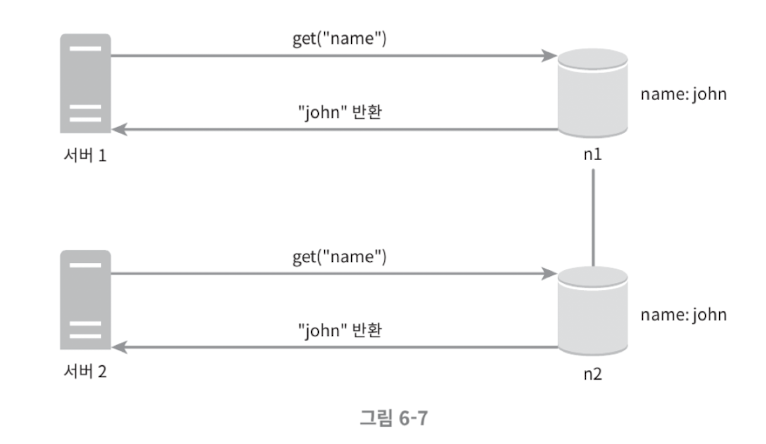
            
        - 이제 아래 그림과 같이 서버 1은 “name”에 매달린 값을 “johnSanFrancisco”로 바꾸고, 서버 2는 “johnNewYork”로 바꾼다고 하자.
        - 그리고 이 두 연산은 동시에 이뤄진다고 하자.
        - 이제 우리는 충돌하는 두 값을 갖게 되었다. 그 각각을 버전 v1, v2라고 하자.
            
            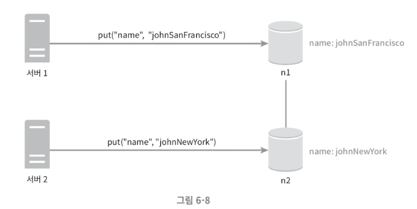
            
    - 이 변경이 이루어진 이후에 원래 값은 무시할 수 있다. 변경이 끝난 옛날 값이어서다.
    - 하지만 마지막 두 버전 v1과 v2 사이의 충돌은 해소하기 어려워 보인다.
    - 이 문제를 해결하려면, 충돌을 발견하고 자동으로 해결해 낼 버저닝 시스템이 필요하다.
    - 벡터 시계는 이런 문제를 푸는데 보편적으로 사용되는 기술이다. 지금부터 그 동작 원리를 살펴보자.
        - 벡터 시계는 [서버, 버전]의 순서쌍을 데이터에 매단 것이다.
        - 어떤 버전이 선행 버전인지, 후행 버전인지, 아니면 다른 버전과 충돌이 있는지 판별하는데 쓰인다.
        - 벡터 시계는 D([S1, v1], [S2, v2], …, [Sn, vn])와 같이 표현한다고 가정하자.
        - 여기서 D는 데이터이고, vi는 버전 카운터, Si는 서버 번호이다. 만일 데이터 D를 서버 Si에 기록하면, 시스템은 아래 작업 가운데 하나를 수행해야 한다.
            - [Si, vi]가 있으면 vi를 증가시킨다.
            - 그렇지 않으면 새 항목 [Si, 1]를 만든다.
        - 이 추상적 로직이 실제로 어떻게 수행되는지를 아래 그림의 구체적 사례를 통해 알아보자.
            
            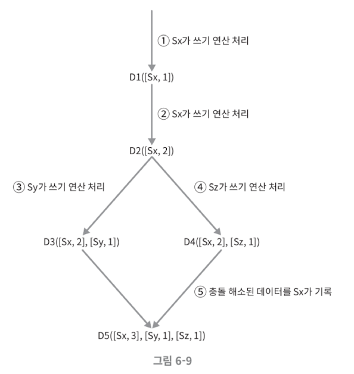
            
            1. 클라이언트가 데이터 D1을 시스템에 기록한다. 이 쓰기 연산을 처리한 서버는 Sx이다. 따라서 벡터 시계는 D1[(Sx, 1)]으로 변한다.
            2. 다른 클라이언트가 데이터 D1을 읽고 D2로 업데이트한 다음 기록한다. D2는 D1에 대한 변경이므로 D1을 덮어쓴다. 이때 쓰기 연산은 같은 서버 Sx가 처리한다고 가정하자. 벡터 시계는 D2([Sx, 2])로 바뀔 것이다.
            3. 다른 클라이언트가 D2를 읽어 D3로 갱신한 다음 기록한다. 이 쓰기 연산은 Sy가 처리한다고 가정하자. 벡터 시계 상태는 D3([Sx, 2], [Sy, 1])로 바뀐다.
            4. 또 다른 클라이언트가 D2를 읽고 D4로 갱신한 다음 기록한다. 이때 쓰기 연산은 서버 Sz가 처리한다고 가정하자. 벡터 시계는 D4([Sx, 2], [Sz, 1])일 것이다.
            5. 어떤 클라이언트가 D3과 D4를 읽으면 데이터 간 충돌이 있다는 것을 알게 된다. D2를 Sy와 Sz가 각기 다른 값으로 바꾸었기 때문이다. 이 충돌은 클라이언트가 해소한 후에 서버에 기록한다. 이 쓰기 연산을 처리한 서버는 Sx였다고 하자. 벡터 시계는 D5([Sx, 3], [Sy, 1], [Sz, 1])로 바뀐다. 충돌이 일어났다는 것을 어떻게 감지하는지는 잠시 후에 더 자세히 살펴볼 것이다.
    - 벡터 시계를 사용하면 어떤 버전 X가 버전 Y의 이전 버전인지(따라서 충돌이 없는지) 쉽게 판단할 수 있다. 버전 Y에 포함된 모든 구성요소의 값이 X에 포함된 모든 구성요소 값보다 같거나 큰지만 보면 된다.
        - 예를 들어 벡터 시계 D([s0, 1], [s1, 1])은 D([s0, 1], [s1, 2])의 이전 버전이다. 따라서 두 데이터 사이에 충돌은 없다.
    - 어떤 버전 X와 Y 사이에 충돌이 있는지 보려면 Y의 벡터 시계 구성요소 가운데 X의 벡터 시계 동일 서버 구성요소보다 작은 값을 갖는 것이 있는지 보면 된다.
        - 예를 들어, D([s0, s1], [s1, 2])와 D([s0, 2], [s1, 1])는 서로 충돌한다.
    - 그러나 벡터 시계를 사용해 충돌을 감지하고 해소하는 방법에는 두 가지 분명한 단점이 있다.
        1. 충돌 감지 및 해소 로직이 클라이언트에 들어가야 하므로, 클라이언트 구현이 복잡해진다.
        2. [서버: 버전]의 순서쌍 개수가 굉장히 빨리 늘어난다는 것이다. 이 문제를 해결하려면 그 길이에 어떤 임계치를 설정하고, 임계치 이상으로 길이가 길어지면 오래된 순서쌍을 벡터 시계에서 제거하도록 해야 한다.
            - 그러나 이렇게 하면 버전 간 선후 관계가 정확하게 결정될 수 없기 때문에 충돌 해소 과정의 효율성이 낮아지게 된다.
            - 하지만 실제 서비스에서 그런 문제가 벌어지는 것을 발견한 적이 없다고 하므로, 대부분의 기업에서 벡터시계는 적용해도 괜찮은 솔루션이다.
- **장애 처리**
    - 대다수 대규모 시스템에서 장애는 그저 불가피하기만 한 것이 아니라 아주 흔하게 벌어지는 사건이다. 따라서 장애를 어떻게 처리할 것이냐 하는 것은 굉장히 중요한 문제다.
    - 장애 감지
        - 분산 시스템에서는 그저 한 대 서버가 “지금 서버 A가 죽었습니다”라고 한다해서 바로 서버 A를 장애처리 하지는 않는다. 보통 두 대 이상의 서버가 똑같이 서버 A의 장애를 보고해야 해당 서버에 실제로 장애가 발생했다고 간주하게 된다.
        - 아래 그림과 같이 모든 노드 사이에 멀티캐스팅 채널을 구축하는 것이 서버 장애를 감지하는 가장 쉬운 방법이지만 서버가 많을 땐 비효율적이다.
            
            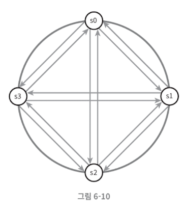
            
        - 가십 프로토콜 같은 분산형 장애 감지 솔루션을 채택하는 편이 보다 효율적이다.
            - 동작 원리
                - 각 노드는 멤버십 목록을 유지한다. 멤버십 목록은 각 멤버 ID와 그 박동 카운터 쌍의 목록이다.
                - 각 노드는 주기적으로 자신의 박동 카운터를 증가시킨다.
                - 각 노드는 무작위로 선정된 노드들에게 주기적으로 자기 박동 카운터 목록을 보낸다.
                - 박동 카운터 목록을 받은 노드는 멤버십 목록을 최신 값으로 갱신한다.
                - 어떤 멤버의 박동 카운터 값이 지정된 시간 동안 갱신되지 않으면 해당 멤버는 장애 상태인 것으로 간주한다.
                    
                    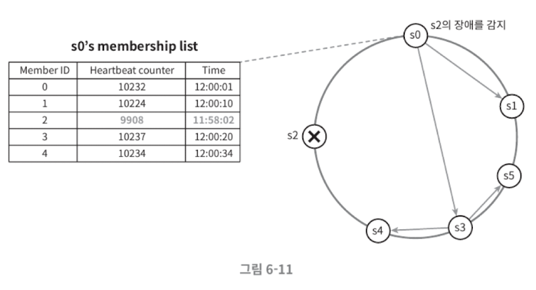
                    
                    - 노드 s0은 그림 좌측의 테이블과 같은 멤버십 목록을 가진 상태다.
                    - 노드 s0은 노드 s2(멤버 ID=2)의 박통 카운터가 오랫동안 증가되지 않았다는 것을 발견한다.
                    - 노드 s0은 노드 s2를 포함하는 박동 카운터 목록을 무작위로 선택된 다른 노드에게 전달한다.
                    - 노드 s2의 박동 카운터가 오랫동안 증가되지 않았음을 발견한 모든 노드는 해당 노드를 장애 노드로 표시한다.
    - 일시적 장애 처리
        - 가십 프로토콜로 장애를 감지한 시스템은 가용성을 보장하기 위해 필요한 조치를 해야 한다.
        - 엄격한 정족수 접근법: 읽기와 쓰기 연산 금지
        - 느슨한 정족수 접근법: 이 조건 완화하여 가용성을 높인다. 정족수 요구사항을 강제하는 대신, 쓰기 연산을 수행할 W개의 건강한 서버와 읽기 연산을 수행할 R개의 건강한 서버를 해시 링에서 고른다. 이때 장애 상태인 서버는 무시한다.
        - 네트워크나 서버 문제로 장애 상태인 서버로 가는 요청은 다른 서버가 잠시 맡아 처리한다. 그동안 발생한 변경사항은 해당 서버가 복구되었을 때 일괄 반영하여 데이터 일관성을 보존한다. 이를 위해 임시로 쓰기 연산을 처리한 서버에는 그에 관한 단서를 남겨둔다. 따라서 이런 장애 처리 방안을 단서 후 임시 위탁 기법이라 부른다.
        - 아래 그림의 예제를 보자. 장애 상태인 노드 s2에 대한 읽기 및 쓰기 연산은 일시적으로 노드 s3가 처리한다.
            - s2가 복구되면, s3은 갱신된 데이터를 s2로 인계할 것이다.
                
                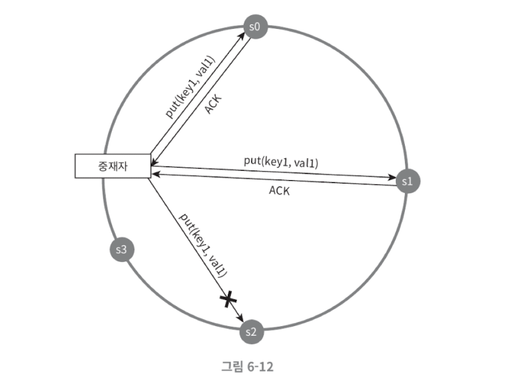
                
    - 영구 장애 처리
        - 단서 후 임시 위탁 기법은 일시적 장애를 처리하기 위한 것
        - 영구적인 노드의 장애 상태는 어떻게 처리해야 할까?
            - 그런 상황을 처리하기 위해 우리는 반-엔트로피 프로토콜을 구현하여 사본들을 동기화할 것.
            - 반-엔트로피 프로토콜은 사본들을 비교하여 최신 버전으로 갱신하는 과정을 포함한다.
            - 사본 간의 일관성이 망가진 상태를 탐지하고 전송 데이터의 양을 줄이기 위해서는 머클 트리를 사용할 것이다.
                - 머클 트리: 해시 트리라고도 불리는 머클 트리는 각 노드에 그 자식 노드들에 보관된 값의 해시 또는 자식 노드들의 레이블로부터 계산된 해시값을 레이블로 붙여두는 트리다.
                - 해시 트리를 사용하면 대규모 자료 구조의 내용을 효과적이면서도 보안상 안전한 방법으로 검증할 수 있다.
        - 키 공간이 1~12까지 일 때 머클 트리를 만드는 예제 살펴보자.
            - 1단계: 키 공간을 아래 그림과 같이 버킷으로 나눈다.
                
                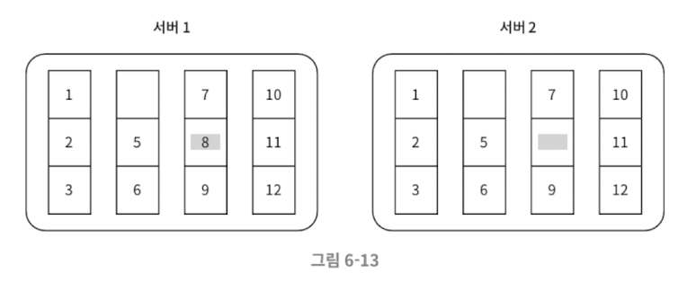
                
            - 2단계: 버킷에 포함된 각각의 키에 균등 분포 해시 함수를 적용하여 해시 값을 계산한다.
                
                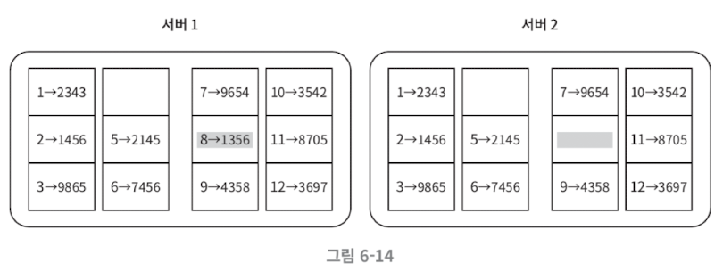
                
            - 3단계: 버킷별로 해시값을 계산한 후, 해당 해시 값을 레이블로 갖는 노드를 만든다.
                
                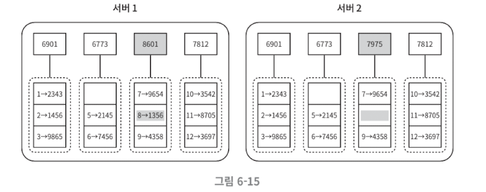
                
            - 4단계: 자식 노드의 레이블로부터 새로운 해시 값을 계산하여, 이진 트리를 상향식으로 구성해 나간다.
                
                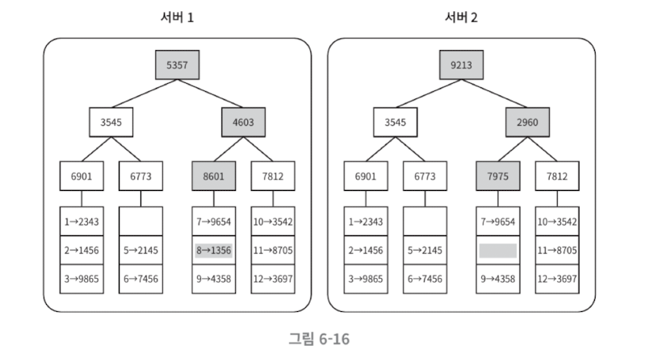
                
        - 이 두 머클 트리의 비교는 루트 노드의 해시값을 비교하는 것으로 시작한다.
            - 루트 노드의 해시 값이 일치한다면 두 서버는 같은 데이터를 갖는 것이다.
            - 그 값이 다른 경우에는 왼쪽 자식 노드의 해시 값을 비교하고, 그 다음으로 오른쪽 자식 노드의 해시 값을 비교한다.
            - 이렇게 하면서 아래쪽으로 탐색해 나가다 보면 다른 데이터를 갖는 버킷을 찾을 수 있으므로, 그 버킷들만 동기화하면 된다.
        - 머클 트리를 사용하면 동기화해야 하는 데이터의 양은 실제로 존재하는 차이의 크기에 비례할 뿐, 두 서버에 보관된 데이터의 총량과는 무관해진다.
        - 하지만 실제로 쓰이는 시스템의 경우 버킷 하나의 크기가 꽤 크다는 것은 알아두어야 한다.
        - 가능한 구성 가운데 하나를 예로 들면 10억 개의 키를 백만 개의 버킷으로 관리하는 것인데, 그 경우 하나의 버킷은 1,000개 키를 관리하게 된다.
    - 데이터 센터 장애 처리
        - 여러 데이터 센터에 데이터를 다중화하는 것이 중요하다.
- **시스템 아키텍처 다이어그램**
    
    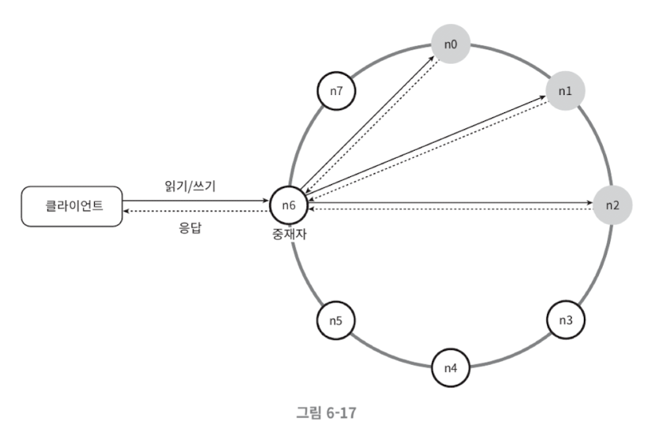
    
    - 클라이언트는 키-값 저장소가 제공하는 두 가지 단순한 API, 즉 get(key) 및 put(key, value)와 통신한다.
    - 중재자는 클라이언트에게 키-값 저장소에 대한 프락시 역할을 하는 노드다.
    - 노드는 안정 해시의 해시 링 위에 분포한다.
    - 노드를 자동으로 추가 또는 삭제할 수 있도록, 시스템은 완전히 분산된다.
    - 데이터는 여러 노드에 다중화된다.
    - 모든 노드가 같은 책임을 지므로, SPOF는 존재하지 않는다.
    - 완전히 분산된 설계를 채택하였으므로, 모든 노드는 아래 그림에 제시된 기능 전부를 지원해야 한다.
        
        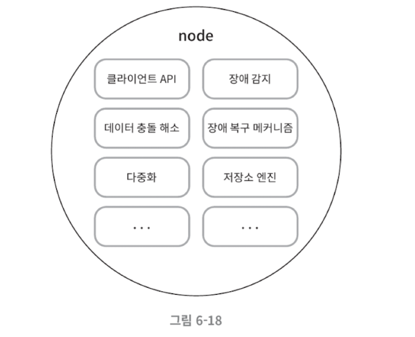
        
- **쓰기 경로**
    1. 쓰기 요청이 특정 노드에 전달되면, 해당 요청이 커밋 로그 파일에 기록된다.
    2. 데이터가 메모리 캐시에 기록된다.
    3. 메모리 캐시가 가득차거나 사전에 정의된 어떤 임계치에 도달하면 데이터는 디스크에 있는 SSTable에 기록된다. SSTable은 Sorted-String Table의 약어로, <키, 값>의 순서쌍을 정렬된 리스트 형태로 관리하는 테이블이다.
    
    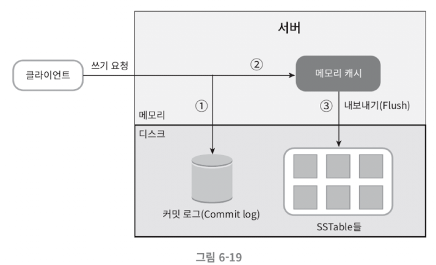
    
- **읽기 경로**
    - 읽기 요청을 받은 노드는 데이터가 메모리 캐시에 있는지부터 살핀다.
    - 있는 경우에는 아래 그림과 같이 해당 데이터를 클라이언트에게 반환한다.
        
        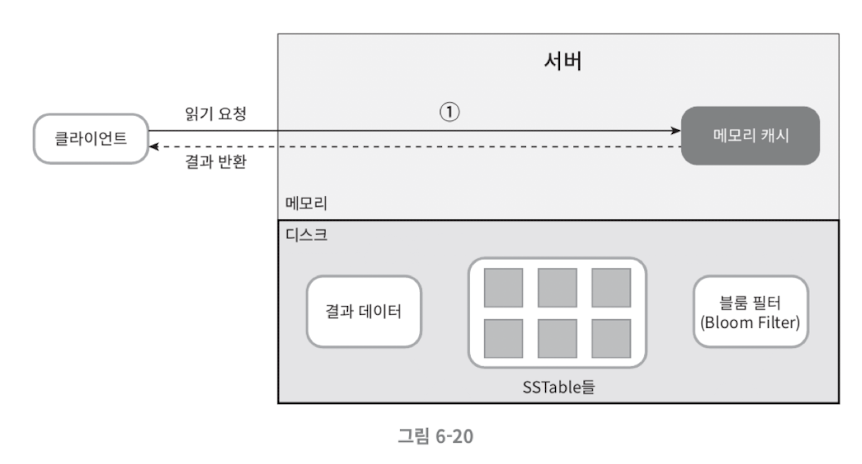
        
    - 데이터가 메모리에 없는 경우에는 디스크에서 가져와야 한다. 어느 SSTable에 찾는 키가 있는지 알아낼 효율적인 방법이 필요할 것이다. 이런 문제를 푸는데는 블룸 필터가 흔히 사용된다.
        - 데이터가 메모리에 없을 때 읽기 연산이 처리되는 경로는 보면 아래 그림과 같다.
            
            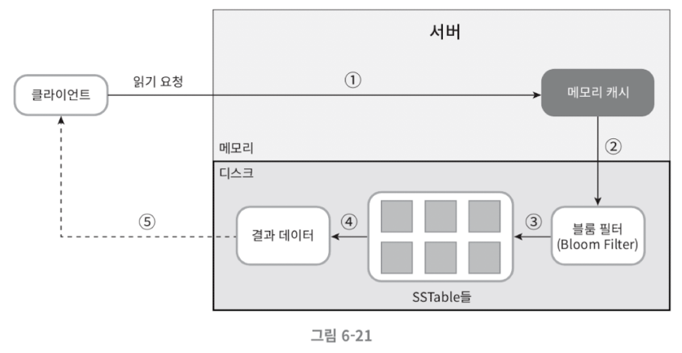
            
        1. 데이터가 메모리 있는지 검사한다. 없으면 2로 간다.
        2. 데이터가 메모리에 없으므로 블룸 필터를 검사한다.
        3. 블룸 필터를 통해 어떤 SSTable 키가 보관되어 있는지 알아낸다.
        4. SSTable에서 데이터를 가져온다.
        5. 해당 데이터를 클라이언트에게 반환한다.