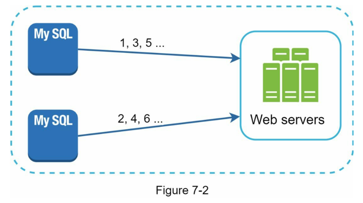
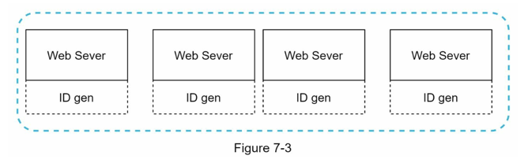
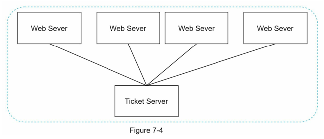
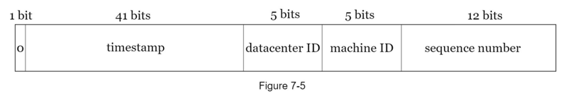
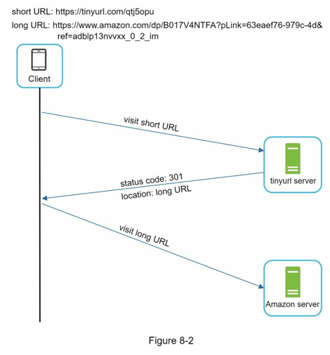
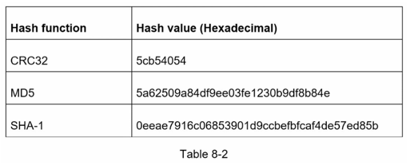
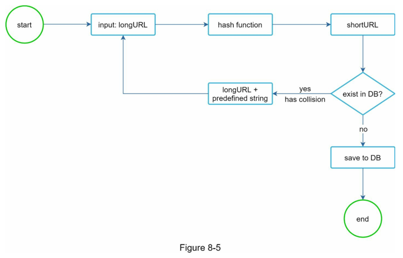
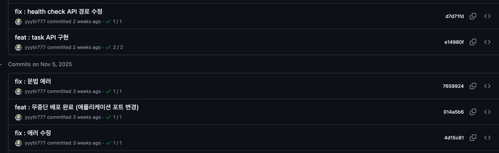
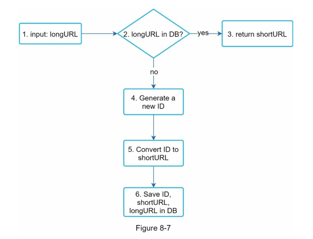
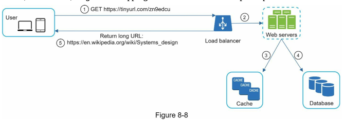

_## 7장 : 분산 시스템을 위한 유일 ID 생성기 설계
- 단일 서버 환경인 MySQL 서버에서는, AUTO_INCREMENT 락을 이용하여 유니크한 ID를 생성하는 기능을 사용한다.
- 하지만 다양한 서버가 존재하는 분산 시스템에서는, 한 대의 서버로 해당 기능을 딜레이 없이 사용하기가 어렵다
- 해당 챕터에서는 다중 서버 환경에서 지연 시간 없이 유일 ID 생성기 설계에 대해 설명한다.

### 1단계 : 문제 이해 및 설계 범위 확정
- ID는 유일해야하며, 정렬 가능해야함
- ID값은 시간이 흐름에 따라 커지지만 항상 1씩 증가하지는 않음
- ID값은 숫자로만 이루어짐
- 초당 10,000개의 ID를 생성할 수 있어야함

### 2단계 : 개략적 설계안 제시 및 동의 구하기
- 분산 시스템에서 유일성이 보장되는 ID생성하는 여러 방식이 존재

#### 1. 다중 마스터 복제
- MySQL의 auto_increment 기능을 사용
- 아래와 같은 구성을 갖음

- 다음 ID값을 생성할 때는 1씩 증가시키는 것이 아니라, k만큼 증가시킴
- 여기서 k는 현재 사용 중인 데이터베이스 개수를 의미한다.
- 사용 중인 데이터베이스 개수 만큼 ID를 생성하면, 겹치지 않음

> #### 장점
> - 서버 증설에 문제 없음 (초당 생산 가능 ID수를 유연하게 조절 가능)
> #### 단점
> - 여러 데이터 센터에 걸쳐 규모를 늘리기 어려움
> - 유일성은 보장되지만, 시간 흐름에 맞춰 커지도록 보장 X
> - 서버 추가·삭제 시 핸들링이 어려움

#### UUID
- `UUID` : 컴퓨터 시스템에서 저장되는 정보를 유일하게 식별하기 위한 128비트짜리 수
- 생성되는 `UUID`끼리는 충돌 가능성이 낮음
- `09c93e62-50b4-468d-bf8a-c07e1040bfb2`와 같은 값을 가짐

> #### 예시
> - 중복 `UUID` 1개가 생길 확률은 초당 10억 개의 `UUID`를 100년 동안 계속해서 만들어야함
> - [reference : Universally_unique_identifier](https://en.wikipedia.org/wiki/Universally_unique_identifier)

> #### 장점
> - 간단하게 `UUID`만들 수 있음 (`String id = UUID.randomUUID().toString()`)
> - 각 서버가 다른 컴포넌트에 의존 없이 독립적으로 `UUID`를 생성함 -> 규모 확장이 쉬움
> #### 단점
> - 128비트라는 긴 문자열을 가짐 (문제의 요구사항은 64비트이다.)
> - `UUID`를 시간 순으로 정렬할 수 없음
> - 숫자가 아닌 값이 포함될 수 없음

#### 티켓 서버
- 분산 기본 키를 만들기 위해 플리커를 사용
- 즉, 유일한 ID를 만들어 내는 서버를 만들어 사용

> #### 장점
> - 유일성이 보장되는 ID를 쉽게 만들 수 있음
> - 구현하기 쉬움 & 중소 규모 애플리케이션에 적합
> #### 단점
> - 티켓 서버가 하나만 존재하므로, 단일 실패 지점이 됨
> - 해당 티켓 서버에 장애가 발생하면, 해당 서버를 사용하는 모든 시스템에 문제가 발생

#### 트위터 스노플레이크 접근법
- 스노플레이크라는 독창적인 ID 생성 로직 존재
- 해당 기법으로 문제의 요구사항을 모두 만족 가능

> ### 스노플레이크 구조
> 
> - **사인 비트** : 1개의 비트를 할당
>   - 지금은 쓸모가 없지만, 나중을 위해 유보
>   - 음수와 양수 구분을 위해 사용 가능
> - **타임스탬프** : 41비트를 할당
>   - 기원 시각 이후로 몇 ms가 지났는지를 표현
> - **데이터 센터 ID** : 5비트를 할당
>   - 총 32개의 데이터센터를 인식할 수 있음
> - **서버 ID** : 5비트를 할당
>   - 한 데이터센터 당 32개의 서버를 사용할 수 있음
> - **일련번호** : 12비트를 할당
>   - 각 서버에서는 ID를 생성할 때마다 1씩 증가
>   - 1ms가 지나면, 해당 값은 0으로 초기화
>   - 즉, 1ms에 $2^{12}$개의 ID를 생성할 수 있음

### 3단계 : 상세 설계
- 스노우플레이크 접근법 채택

#### 타임스탬프
- 스노우플레이크에서 41비트를 차지
- 즉, 표현할 수 있는 최댓값은 $2^{41}-1 = 2199023255551$밀리초 = 69년 이다.
- 기원 시간으로부터 69년이 지나면, ID 체계를 변경해야함

#### 일련번호
- 일련번호는 12비트이므로, $2^{12} = 4096$개의 값을 가질 수 있음
- 즉, 1초에 4096 * 1000 = 4,096,000개의 ID를 생성할 수 있음

### 4단계 : 마무리
- 이외에도 아래와 같은 기능을 논의할 수 있다.

#### 시계 동기화
- 모든 서버에 대해 전부 같은 시계를 사용한다고 가정함
- 하지만 서버가 물리적으로 독립된 여러 장비에서 실행되는 경우 유효하지 않을 수 있음
- `NTP(Network Time Protocol)`을 통해 이러한 문제를 해결할 수 있음

#### 각 절 길이 최적화
- 동시성이 낮고 수명이 긴 애플리케이션이라면, 일련번호를 줄이고, 타임스탬프의 길이를 늘리는 방법 존재

#### 고가용성
- ID 생성기는 필수불가결이므로 높은 가용성을 제공해야함

---

## 8장 : URL 단축기 설계
- 고전적인 시스템 설계 문제이다.
> ### 대표적 기능 : 구글폼
> - https://docs.google.com/forms/d/e/1FAIpQLSd0l3tSO9gUiXZ0Lk6QjZgajV8ohi8NXlHMeI2d4_99m_lJAQ/viewform?usp=dialog
> - 이러한 길이의 URL을,
> - https://forms.gle/Yn2wcddfvts4hkSQ8
> - 이렇게 줄여주는 기능이다. (도메인이 달라짐)
> - 단축된 URL을 통해 URL 단축기 서버에 접속하고, 해당 서버에서 단축된 URL을 key값으로 하는 origin URL로 리다이렉트한다.

### 1단계 : 문제 이해 및 설계 범위 확정
- 입력된 URL을 통해, 단축된 URL을 제공함, 이때 단축된 URL로 접속 시, 원래 URL로 이동함
- 매일 1억 개의 단축 URL을 만들 수 있어야함
- 문자는 숫자와 영문자만 사용할 수 있음
- 단축된 URL에 대해 삭제, 수정은 불가

#### 개략적 추청
- 쓰기 연산 : 매일 1억 개의 단축 URL 생성
- 초당 쓰기 연산 : 1160개/1s
- 읽기 연산 : 읽기 연산과 쓰기 연산의 비율이 10 : 1이라고 가정하면
  - 11,600개/1s
- 해당 서비스를 10년 운영한다 가정하면, 3560억 개의 레코드를 보관해야함
- 즉, 36.5TB의 저장공간 필요

### 2단계 : 개략적 설계안 제시 및 동의 구하기
#### API 엔드포인트
- API 단축기는 두 개의 엔드포인트를 필요로 함
##### 1. URL 단축용 엔드포인트
- 해당 엔드포인트에 단축할 URL을 인자로 넣어 POST요청을 보냄
- `POST /api/v1/data/shorten`
  - 인자 : {longUrl : longURLString}
  - 반환 : 단축 URL
##### 2. URL 리다이렉션용 엔드포인트
- 단축 URL에 대해 HTTP요청이 오면 원래 URL로 리다이렉트함
- `GET /api/v1/shortUrl`
  - 반환 : 원래 URL

#### URL 리디렉션
- 단축 URL을 받은 서버는, 해당 URL을 원래 URL로 변경하여 301응답의 `Location`헤더에 넣어 반환함

- 이때 301응답과 302응답 간의 차이가 존재한다.
##### 301 Permanently Moved
- 해당 응답은 HTTP 처리 책임이 영구적으로 `Location`헤더에 반환된 URL로 이전되었다는 응답이다.
- 영구적으로 이전되어, 해당 응답을 캐시 처히하여 추후 단축 URL로 요청을 보낼 때 캐시된 원래 URL로 요청을 보낸다.
- 장점 :
  - 서버 부하를 줄일 수 있음
##### 302 Found
- 해당 응답은 HTTP의 요청이 일시적으로 `Locaiton`헤더의 URL에 의해 처리되어야 한다는 응답이다.
- 즉, 클라이언트의 요청은 반드시 단축 URL서버에 보낸 후, 원래 URL로 리다이렉트된다.
- 장점 :
  - 클릭 발생률이나 발생 위치를 추적할 수 있음

#### URL 단축
- URL 단축의 큰 쟁점은 긴 URL을 해시 값으로 대응시킬 해시 함수를 찾는 것이다.
- 해시 함수에 대한 요구사항은 다음과 같다.
  - 입력으로 주어지는 긴 URL이 다른 값이면 해시 값도 달라야 함
  - 계산된 해시 값은 원래의 긴 URL로 복원될 수 있어야 함

### 3단계 : 상세 설계

#### 데이터 모델
- 모든 데이터를 해시 테이블에 두는 방법이 있지만, 용량의 한계로 이는 불가능함
- 이에 <단축 URL, 원래 URL> 쌍을 RDBMS에 저장하는 방식을 채택

#### 해시 함수
- 긴 URL을 단축 URL로 반환하는데 사용
> ##### 해시 값 길이
> - 단축 URL은 [0-9a-zA-Z]로 이루어진다.
> - 즉, 사용할 수 있는 문자의 개수는 62개다.
> - $65^{n} >= 365,000,000,000$을 만족하는 n의 최솟값은 n = 7이다.

- 해시 함수 구현에 대해 2가지 방식이 존재한다.
##### 1. 해시 후 충돌 해소
- 해시 함수로 `CRC32`, `MD5`, `SHA-1`같은 기존의 해시함수를 사용할 수 있다.

- 하지만 가장 짧은 해시값은 7보다 크다.
- 이를 해결하기 위한 2가지 방식이 있다.
> ##### 1. 해시 값에서 처음 7개 글자만 사용
> - 이를 통해 결과가 충돌할 가능성이 높아지지만, 충돌 시 미리 정한 문자열을 붙여 이를 해소 가능하다.
> 
> ##### 2. 블룸 필터 사용
> - 블룸 필터는 어떤 집합에 특정 원소가 있는지 없는지 검사하는 기술

- 위 예시는 깃허브에서도 찾아볼 수 있음
- 커밋을 생성할 때마다 SHA-1 해시 함수를 통해 해시 값을 생성함
- 이때 모든 해시 값을 사용하지 않고 일부만 사용하여 커밋을 구분함

- 위 사진의 해시값은 전체

- 위 사진은 전체 해시값에서 일부만 사용 but 구별은 잘됨

##### 2. base-62 변환
- 진법 변환은 URL단축기를 구현할 때 흔히 사용됨
- 총 62개의 문자가 사용되므로,10진수를 62진수로 변환하여 문자열 생성 가능

| 해시 후 충돌 해소 전략             | base-62 변환                    |
|---------------------------|-------------------------------|
| 단축 URL의 길이가 고정            | 단축 URL의 길이가 가변 (값이 커지면 같이 커짐) |
| 유일성 보장되는 ID를 생성할 필요 없음    | 유일성 보장 ID 생성기가 필요             |
| 충돌 가능 -> 해소 필요            | 유일성 보장 이후 적용 가능하므로 충돌 불가능     |
| 다음에 쓸 수 있는 단축 URL을 알 수 없음 | 다음에 사용될 단축 URL을 유추할 수 있음      |

#### URL 단축기 상세 설계
- base-62 변환을 사용해, 아래와 같은 방식으로 설계 가능

- 이때 ID 생성기의 역할이 중요한데, 분산 환경에서도 유일한 ID를 생성할 수 있어야 함
- 7장에서 유일한 ID 생성기 참고

#### URL 리디렉션 상세 설계

- URL 단축기 서버는 읽기 연산이 자주 일어나므로, 자주 조회하는 <단축 URL, 원래 URL> 쌍을 캐시에 저장할 수 있다. 

### 4단계 : 마무리
- 아래와 같은 사항을 추가로 고려할 수 있다.

#### 처리율 제한 장치
- 엄청난 양의 URL 조회가 일어날 수 있음
- 이에 처리율 제한 장치를 통해 조회량을 줄일 수 있음

#### 웹 서버 규모 확장
- URL 단축기 서버는 독립적으로 기능할 수 잇으므로 확장에 용이하다.

#### 데이터베이스 규모 확장
- 데이터베이스를 다중화하거나, 샤딩을 통해 DB 규모 확장을 이룰 수 있다.

#### 데이터 분석 솔루션
- 어떤 링크를 사용자가 많이 클릭했는지, 언제 클릭하는지 등을 분석할 수 있다.