# 7. 분산 시스템을 위한 유일 ID 생성기 설계

- `auto_increment` 속성이 설정된 관계형 데이터베이스의 기본 키를 쓰면 되지 않을까?
    - 분산 환경에서 이 접근법은 통하지 않을 것이다.
    - 데이터베이스 서버 한 대로는 그 요구를 감당할 수 없고, 여러 데이터베이스 서버를 쓰는 경우에는 지연 시간(delay)을 낮추기가 무척 힘들 것이기 때문이다.
- 유일성이 보장되는 ID의 몇 가지 예를 보자.
    
    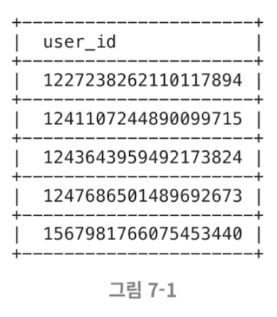
    

## 7.1 1단계: 문제 이해 및 설계 범위 확정

- **요구사항**
    - ID는 유일해야 한다.
    - ID는 숫자로만 구성되어야 한다.
    - ID는 64비트로 표현될 수 있는 값이어야 한다.
    - ID는 발급 날짜에 따라 정렬 가능해야 한다.
    - 초당 10,000 ID를 생성할 수 있어야 한다.

## 7.2 2단계: 개략적 설계안 제시 및 동의 구하기

- **분산 시스템에서 유일성이 보장되는 ID를 만드는 방법**
    - **다중 마스터 복제**
        
        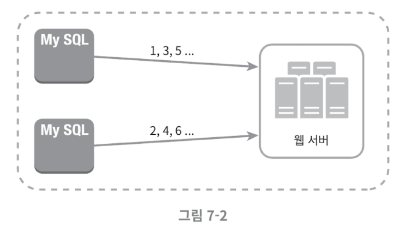
        
        - `auto_increment` 기능을 활용한다.
        - 다만 다음 ID 값을 구할 때 1만큼 증가시켜 얻는 것이 아니라 k만큼 증가시킨다.
            - k는 현재 사용 중인 데이터베이스 서버 수다.
            - 위와 같은 그림의 경우 k=2이다.
        - 장점: 규모 확장성 문제를 어느정도 해결할 수 있다. 데이터베이스 수를 늘리면 초당 생성 가능 ID 수도 늘릴 수 있기 때문이다.
        - 단점:
            - 여러 데이터 센터에 걸쳐 규모를 늘리기 어렵다.
            - ID의 유일성은 보장되겠지만 그 값이 시간 흐름에 맞춰 커지도록 보장할 수는 없다.
            - 서버를 추가하거나 삭제할 때도 잘 동작하도록 만들기 어렵다.
    - **UUID**
        - UUID는 유일성이 보장되는 ID를 만드는 또 하나의 간단한 방법이다. UUID는 컴퓨터 시스템에 저장되는 정보를 유일하게 식별하기 위한 128비트짜리 수다.
        - UUID 값은 충돌 가능성이 지극히 낮다.
        - UUID 값은 09c93e62-50b4-468d-bf8a-c07e1040bfb2와 같은 형태를 띤다.
        - UUID는 서버 간 조율 없이 독립적으로 생성 가능하다.
            
            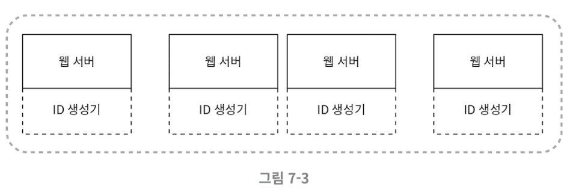
            
        - 위 그림은 UUID를 사용하는 시스템의 구조다.
            - 이 구조에서 각 웹 서버는 별도의 ID 생성기를 사용해 독립적으로 ID를 만들어낸다.
        - 장점
            - UUID를 만드는 것은 단순하다. 서버 사이의 조율이 필요 없으므로 동기화 이슈도 없다.
            - 각 서버가 자기가 쓸 ID를 알아서 만드는 구조이므로 규모 확장도 쉽다.
        - 단점
            - ID가 128비트로 길다. 이번 장에서 다루는 요구사항은 64비트다.
            - ID를 시간순으로 정렬할 수 없다.
            - ID에 숫자 아닌 값이 포함될 수 있다.
    - **티켓 서버**
        
        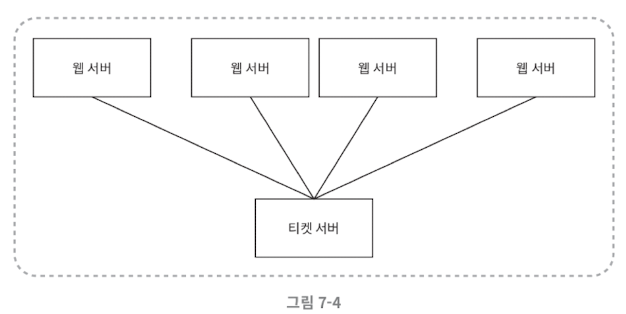
        
        - 이 아이디어의 핵심은 `auto_increment` 기능을 갖춘 데이터베이스 서버, 즉 티켓 서버를 중앙 집중형으로 하나만 사용하는 것이다.
        - 장점
            - 유일성이 보장되는 오직 숫자로만 구성된 ID를 쉽게 만들 수 있다.
            - 구현하기 쉽고, 중소 규모 애플리케이션에 적합하다.
        - 단점
            - 티켓 서버가 SPOF(Single-Point-of-Failure)가 된다. 이 서버에 장애가 발생하면 해당 서버를 이용하는 모든 시스템이 영향을 받는다. 이 이슈를 피하려면 티켓 서버를 여러 대 준비해야 한다. 하지만 그렇게 하면 데이터 동기화 같은 새로운 문제가 발생할 것이다.
    - **트위터 스노플레이크 접근법**
        - 트위터에서 사용하는 방법.
        - 우선 ID를 바로 생성하는 대신, divide and conquer을 먼저 적용해 보자.
            - 생성해야 하는 ID의 구조를 여러 절로 분할한다.
                
                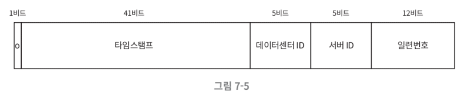
                
            - 사인(sign) 비트: 1비트를 할당한다. 음수와 양수를 구별하는 데 사용한다.
            - 타임스탬프: 41비트를 할당한다. 기원 시각 이후로 몇 밀리초가 경과했는지를 나타내는 값이다.
            - 데이터센터 ID: 5비트를 할당한다. 따라서 32개 데이터센터를 지원할 수 있다.
            - 서버 ID: 5비트를 할당한다. 따라서 데이터센터당 32개 서버를 사용할 수 있다.
            - 일련번호: 12비트를 할당한다. 각 서버에서는 ID를 생성할 때마다 이 일련 번호를 1만큼 증가시킨다. 이 값은 1밀리초가 경과할 때마다 0으로 초기화된다.

## 7.3 3단계: 상세 설계

- 데이터센터 ID와 서버 ID는 시스템이 시작할 때 결정되며, 일반적으로 시스템 운영 중에는 바뀌지 않는다.
    - 데이터센터 ID와 서버 ID를 잘못 변경하게 되면 ID 충돌이 발생할 수 있으므로, 그런 작업을 해야 할 때는 신중해야 한다.
- 타임스탬프나 일련번호는 ID 생성기가 돌고 있는 중에 만들어지는 값이다.
    - **타임스탬프**
        - 시간이 흐름에 따라 점점 큰 값을 갖는다. 따라서 시간 순으로 정렬 가능하게 된다.
            
            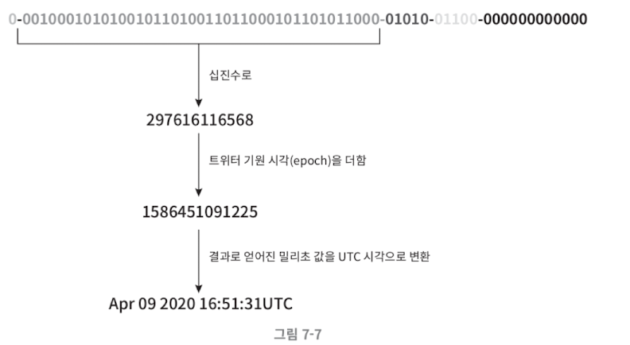
            
            - 위 그림은 앞서 살펴본 ID 구조를 따르는 값의 이진 표현 형태로부터 UTC 시각을 추출하는 예제다.
            - 41비트로 표현할 수 있는 타임스탬프의 최댓값은 2^(41)-1 밀리초 = 약 69년이다.
            - 따라서 이 ID 생성기는 69년동안만 정상 동작하는데, 기원 시각을 현재에 가깝게 맞춰서 오버플로가 발생하는 시점을 늦춰놓는다.
            - 69년이 지나면 기원 시각을 바꾸거나 ID 체계를 다른 것으로 이전하여야 한다.
    - **일련번호**
        - 2^12=4096개의 값을 가질 수 있다.
        - 어떤 서버가 같은 밀리초 동안 하나 이상의 ID를 만들어 낸 경우에만 0보다 큰 값을 갖게 된다.

## 7.4 4단계: 마무리

- 추가로 논의할 만한 사항
    - 시계 동기화
        - 이번 설계에서는 ID 생성 서버들이 전부 같은 시계를 사용한다고 가정햇는데, 이런 가정은 하나의 서버가 여러 코어에서 실행될 경우 유효하지 않을 수 있다.
        - 여러 서버가 물리적으로 독립된 여러 장비에서 실행되는 경우에도 마찬가지다.
        - NTP는 이 문제를 해결하는 가장 보편적 수단이다.
    - 각 절의 길이 최적화
        - 동시성이 낮고 수명이 긴 애플리케이션이라면 일련번호 절의 길이를 줄이고 타임스탬프 절의 길이를 늘리는 것이 효과적일 수도 있다.
    - 고가용성: ID 생성기는 필수 불가결 컴포넌트이므로 아주 높은 가용성을 제공해야 한다.

# 8. URL 단축기 설계

## 8.1 1단계: 문제 이해 및 설계 범위 확정

- 시스템의 기본적 기능
    1. URL 단축: 주어진 긴 URL을 훨씬 짧게 줄인다.
    2. URL 리디렉션: 축약된 URL로 HTTP 요청이 오면 원래 URL로 안내한다.
    3. 높은 가용성과 규모 확장성, 그리고 장애 감내가 요구된다.
- 개략적 추정
    - 쓰기  연산: 매일 1억 개의 단축 URL 생성
    - 초당 쓰기 연산: 1억/24/3600=1160
    - 읽기 연산: 읽기 연산과 쓰기 연산 비율이 10:1이라고 할 때, 읽기 연산은 초당 11,600회 발생. (1160x10=11,600)
    - URL 단축 서비스를 10년간 운영한다고 가정하면 1억x365x10=3650억 개의 레코드를 보관해야 함.
    - 축약 전 URL 평균 길이는 100
    - 따라서 10년 동안 필요한 저장 용량은 3650억 x 100 바이트 = 36.5TB

## 8.2 2단계: 개략적 설계안 제시 및 동의 구하기

### 8.2.1 API 엔드포인트

- 클라이언트는 서버가 제공하는 API 엔드포인트를 통해 서버와 통신한다. 이 엔드포인트를 REST 스타일로 설계할 것이다.
- URL 단축기는 기본적으로 두 개의 엔드포인트를 필요로 한다.
    1. **URL 단축용 엔드포인트**: 새 단축 URL을 생성하고자 하는 클라이언트는 이 엔드포인트에 단축할 URL을 인자로 실어서 POST 요청을 보내야 한다.
        
        `POST /api/v1/data/shorten` 
        
        - 인자: {longUrl: longURLstring}
        - 반환: 단축 URL
    2. **URL 디리렉션용 엔드포인트**: 단축 URL에 대해서 HTTP 요청이 오면 원래 URL로 보내주기 위한 용도의 엔드포인트
        
        `GET /api/v1/shortUrl` 
        
        - 반환: HTTP 리디렉션 목적지가 될 원래 URL

### 8.2.2 URL 리디렉션

- 아래 그림은 브라우저에 단축 URL을 입력하면 무슨 일이 생기는지 보여준다.
    
    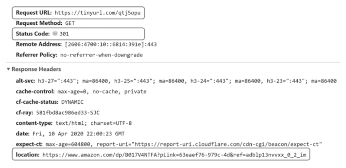
    
    - 단축 URL을 받은 서버는 그 URL을 원래 URL로 바꾸어서 301 응답의 Location 헤더에 넣어 반환한다.
- 아래 그림은 클라이언트와 서버 사이의 통신 절차를 더 자세히 보여주는 그림이다.
    
    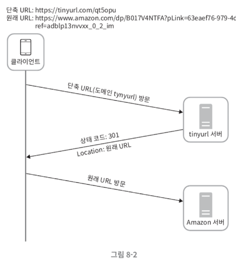
    
    - 여기서 유의할 것은 301 응답과 302 응답의 차이다. 둘 다 리디렉션 응답이긴 하지만 차이가 있다.
        - **`301 Permanently Moved`**: 해당 URL에 대한 HTTP 요청의 처리 책임이 영구적으로 Location 헤더에 반환된 URL로 이전되었다는 응답이다. 영구적으로 이전되었으므로, 브라우저는 이 응답을 캐시한다. 따라서 추후 같은 단축 URL에 요청을 보낼 필요가 있을 때 브랑줜느 캐시된 원래 URL로 요청을 보내게 된다.
        - **`302 Found`**: 이 응답은 주어진 URL로의 요청이 ‘일시적으로’ Location 헤더가 지정하는 URL에 의해 처리되어야 한다는 응답이다. 따라서 클라이언트의 요청은 언제나 단축 URL 서버에 먼저 보내진 후에 원래 URL로 리디렉션 되어야 한다.
    - 서버 부하를 줄이는 것이 중요하다면 301을 사용하는 것이 좋다.
    - 트래픽 분석이 중요할 때는 302를 쓰는 쪽이 클릭 발생률이나 발생 위치를 추적하는 데 더 유리하다.
- URL 리디렉션을 구현하는 가장 직관적인 방법은 **해시 테이블**을 사용하는 것이다.
    - 해시 테이블에 <단축 URL, 원래 URL>의 쌍을 저장한다고 가정하면, URL 리디렉션은 다음과 같이 구현될 수 있다.
        - 원래 URL = hashTable.get(단축 URL)
        - 301 또는 302 응답 Location 헤더에 원래 URL을 넣은 후 전송

### 8.2.3 URL 단축플로

- 단축 URL이 [www.tinyurl.com/{hashValue}](http://www.tinyurl.com/{hashValue}) 같은 형태라고 하자.
- 중요한 것은 긴 URL을 이 해시 값으로 대응시킬 해시 함수 fx를 찾는 일이다.
    
    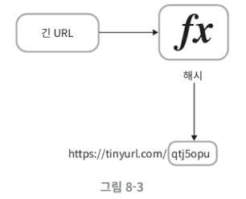
    
- 이 해시 함수는 다음 요구사항을 만족해야 한다.
    - 입력으로 주어지는 긴 URL이 다른 값이면 해시 값도 달라야 한다.
    - 계산된 해시 값은 원래 입력으로 주어졌던 긴 URL로 복원될 수 있어야 한다.

## 8.3 3단계: 상세 설계

### 8.3.1 데이터 모델

- 모든 것을 해시 테이블에 두는 건 실제 시스템에 쓸 수 없다. 메모리는 유한하고 비싸기 때문이다.
- 더 나은 방법은 <단축 URL, 원래 URL>의 순서쌍을 관계형 데이터베이스에 저장하는 것이다.
- 아래 그림은 이 테이블의 간단한 설계 사례다.
    
    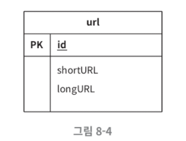
    
    - 이 테이블은 단순화된 것으로, id, shortURL, longURL 3개의 칼럼을 갖는다.

### 8.3.2 해시 함수

- 해시 함수는 원래 URL을 단축 URL로 변환하는 데 쓰인다.
- 해시 함수가 계산하는 단축 URL 값을 hashValue라고 지칭하겠다.
- **해시 값 길이**
    - hashValue [0-9, a-z, A-Z]의 문자들로 구성된다.
        - 따라서 사용할 수 있는 문자의 개수는 62개다.
    - hashValue의 길이를 정하기 위해서는 `62^n ≥ 3650억`인 n의 최솟값을 찾아야 한다.
        
        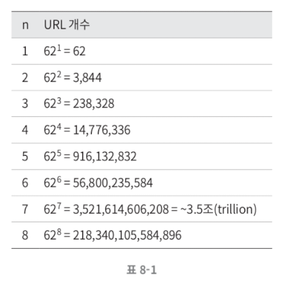
        
        - 위 표는 hashValue의 길이와 해시 함수가 만들 수 있는 URL 개수 사이의 관계를 나타낸다.
        - n=7이면 3.5조 개의 URL을 만들 수 있다.
- **해시 함수 구현 기술**
    - **해시 후 충돌 해소**
        - 긴 URL을 줄이려면 원래 URL을 7글자 문자열로 줄이는 해시 함수가 필요하다.
        - 쉬운 방법은 잘 알려진 해시 함수를 이용하는 것이다.
            
            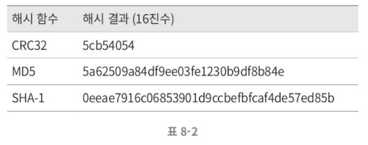
            
        - 그런데 위 표에서 정리한 바와 같이, CRC32가 계산한 가장 짧은 해시값조차도 7보다 길다. 어떻게 하면 줄일 수 있을까?
            1. 계산된 해시 값에서 처음 7개 글자만 이용하는 것
                1. 해시 결과가 서로 충돌할 확률이 높아진다.
                2. 실제로 충돌이 발생했을 때는, 충돌이 해소될 때까지 사전에 정한 문자열을 해시값에 덧붙인다.
                3. 충돌은 해소할 수 있지만 단축 URL을 생성할 때 한 번 이상 데이터베이스 질의를 해야 하므로 오버헤드가 크다.
                
                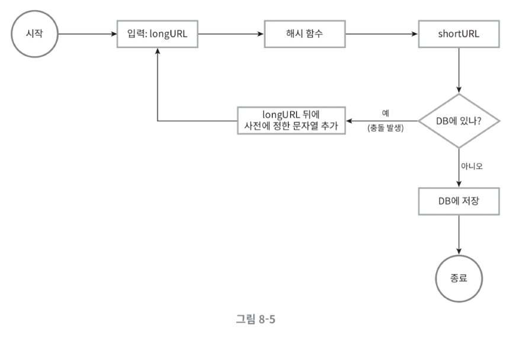
                
            2. 데이터베이스 대신 블룸 필터를 사용한다.
                1. 블룸 필터는 어떤 집합에 특정 원소가 있는지 검사할 수 있도록 하는, 확률론에 기초한 공간 효율이 좋은 기술이다.
    - **base-62 변환**
        - 진법 변환(base conversion)은 URL 단축기를 구현할 때 흔히 사용되는 접근법 중 하나다.
        - 이 기법은 수의 표현 방식이 다른 두 시스템이 같은 수를 공유하여야 하는 경우에 유용하다.
        - 62진법을 쓰는 이유는 hashValue에 사용할 수 있는 문자 개수가 62개이기 때문이다.
        - base-62 변환이 이루어지는 과정
            - 10진수로 11157, 즉 11157_10을 62진수로 변환해 보자.
            - 11157_10 = 2x62^2 + 55x62^1 + 59x62^0 = [2, 55, 59] ⇒ [2, T, X] ⇒ 2TX_62다.
                
                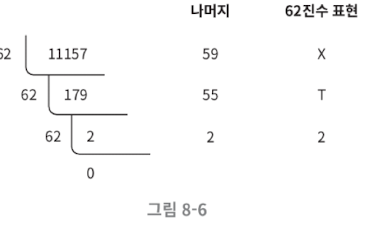
                
            - 따라서 단축 URL은 [`https://tinyurl.com/2TX`](https://tinyurl.com/2TX가)가 된다.
    - **두 접근법 비교**
        
        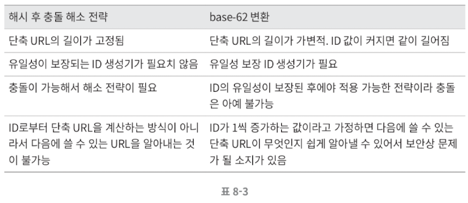
        

### 8.3.3 URL 단축기 상세 설계

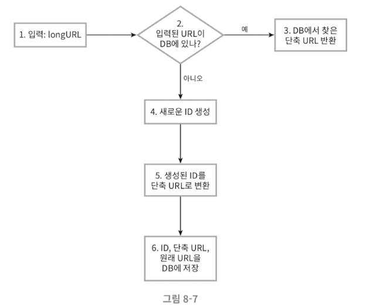

1. 입력으로 긴 URL을 받는다.
2. 데이터베이스에 해당 URL이 있는지 검사한다.
3. 데이터베이스에 있다면 해당 URL에 대한 단축 URL을 만든 적이 있는 것이다. 따라서 데이터베이스에서 해당 단축 URL을 가져와서 클라이언트에게 반환한다.
4. 데이터베이스에 없는 경우엔 해당 URL은 새로 접수된 것이므로 유일한 ID를 생성한다. 이 ID는 데이터베이스의 기본 키로 사용된다.
5. 62진법 변환을 적용, ID를 단축 URL로 만든다.
6. ID, 단축 URL, 원래 URL로 새 데이터베이스 레코드를 만든 후 단축 URL을 클라이언트에 전달한다.

- 또 다른 예제
    
    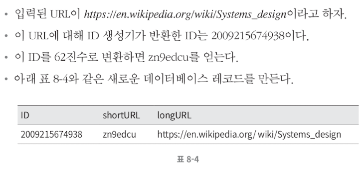
    
- ID 생성기의 주된 용도는 단축 URL을 만들 때 사용할 ID를 만드는 것이고, 이 ID는 전역적 유일성이 보장되는 것이어야 한다.
- 고도로 분산된 환경에서 이런 생성기를 만드는 것은 매우 어렵다.
    - 분산 ID 생성기를 구현하는 방법은 7장을 참고하자.

### 8.3.4 리디렉션 상세 설계

- 아래 그림은 URL 리디렉션 메커니즘의 설계다.
- 쓰기보다 읽기를 더 자주하는 시스템이라, <단축 URL, 원래 URL>의 쌍을 캐시에 저장하여 성능을 높였다.
    
    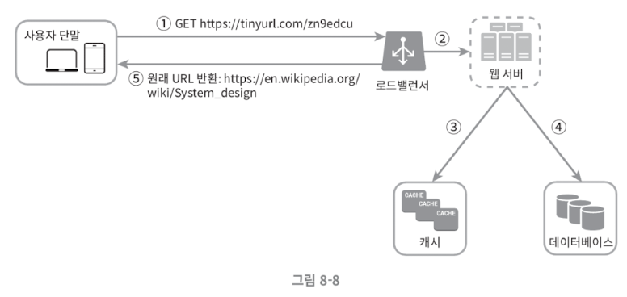
    
    - 로드밸런서의 동작 흐름
        1. 사용자가 단축 URL을 클린한다.
        2. 로드밸런서가 해당 클릭으로 발생한 요청을 웹 서버에 전달한다.
        3. 단축 URL이 이미 캐시에 있는 경우에는 원래 URL을 바로 꺼내서 클라이언트에게 전달한다.
        4. 캐시에 해당 단축 URL이 없는 경우에는 데이터베이스에서 꺼낸다. 데이터베이스에 없다면 아마 사용자가 잘못된 단축 URL을 입력한 경우일 것이다.
        5. 데이터베이스에서 꺼낸 URL을 캐시에 넣은 후 사용자에게 반환한다.

## 8.4 4단계: 마무리

- 추가로 논의할 만한 사항
    - 처리율 제한 장치
        - 엄청난 양의 URL 단축 요청이 밀려들 경우 무력화될 수 있는 잠재적 보안 결함을 갖고 있다.
        - 처리율 제한 정치를 두면, IP 주소를 비롯한 필터링 규칙들을 이용해 요청을 걸러낼 수 있다.
        - 4장을 참고하자.
    - 웹 서버의 규모 확장
        - 본 설계에 포함된 웹 계층은 무상태 계층이므로, 웹 서버를 자유롭게 증설하거나 삭제할 수 있다.
    - 데이터베이스의 규모 확장
        - 데이터베이스를 다중화하거나 샤딩하여 규모 확장성을 달성할 수 있다.
    - 데이터 분석 솔루션
        - URL 단축기에 데이터 분석 솔루션을 통합해 두면 어떤 링크를 얼마나 많은 사용자가 클릭했는지, 언제 주로 클릭했는지 등 중요한 정보를 알아낼 수 있다.
    - 가용성, 데이터 일관성, 안정성