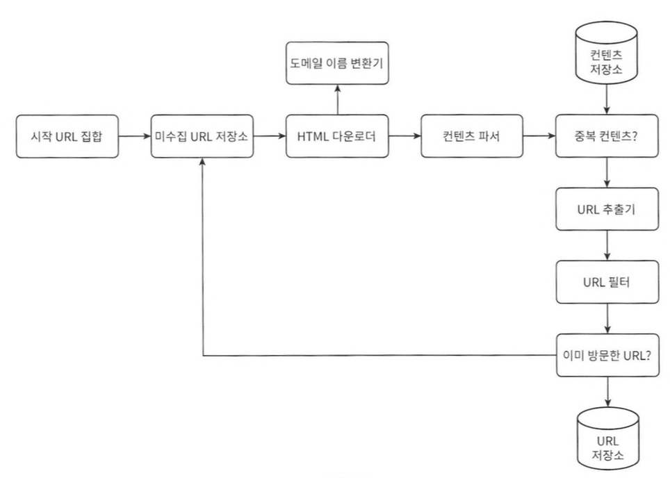
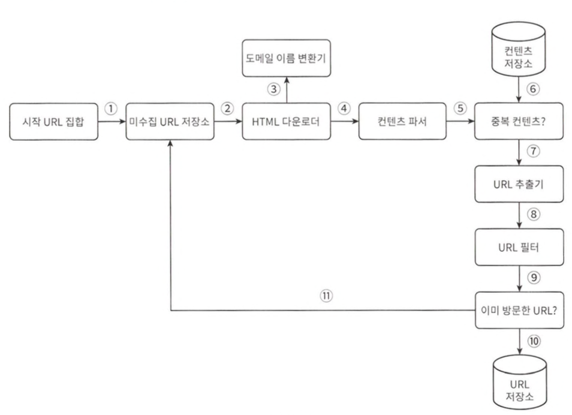
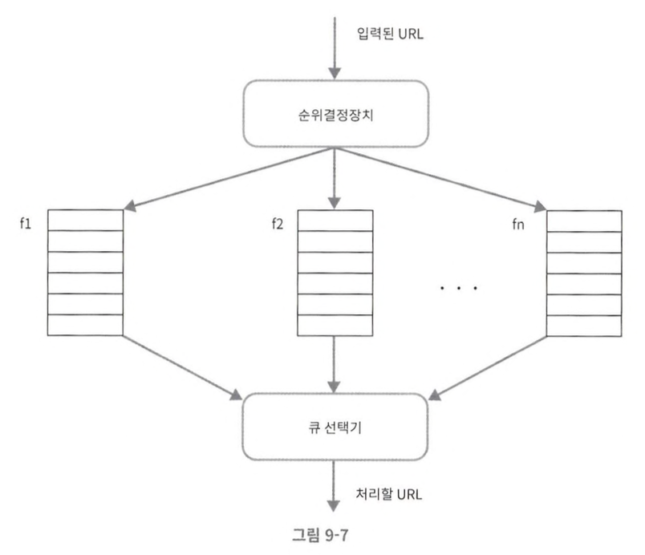
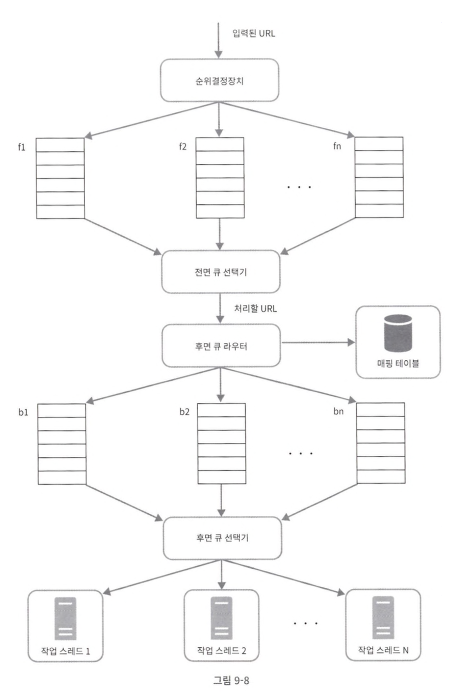
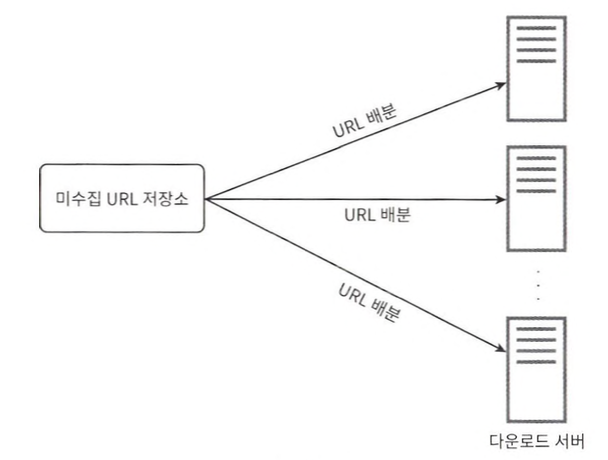
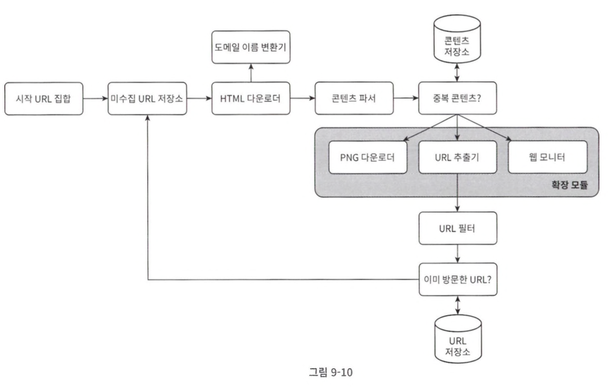
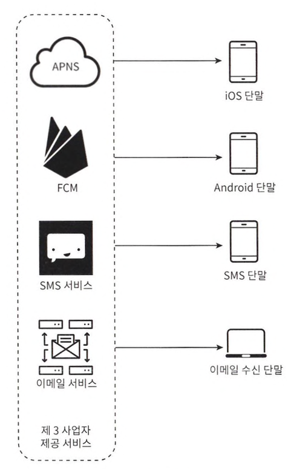
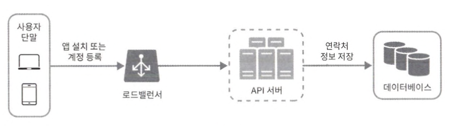
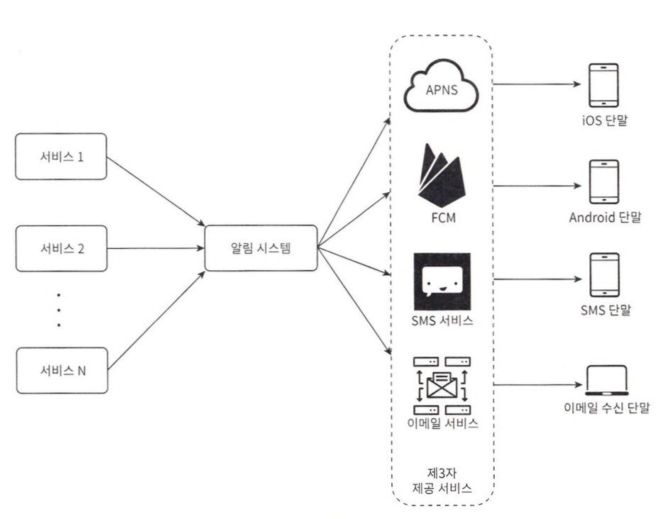
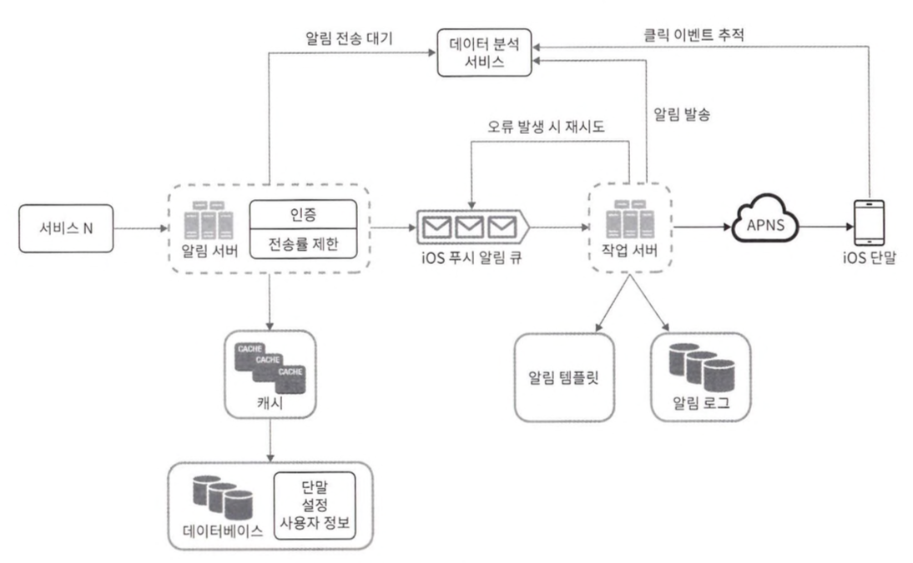

# 9장 웹크롤러 설계
- 검색 엔진 인덱싱 : 구글봇처럼ㅁ 웹 페이지를 모아 로컬 인덱스를 생성하여 사용자가 검색할 수 있게 하는 것
- 웹 아카이빙 :정보를 장기 보관하기 윟해 웹사이트 자체를 백업하는 것
- 웹 마이닝 : 인터넷에서 유용한 지식을 도출해낼 수 있는 것.
- 웹 모니터링 : 저작권이나 상표권이 침해되는 사례를 찾는 것
## 1단계 : 문제 이해 및 설계 범위 확정
- 요구사항
	- 규모 : 매달 10억개의 페이지 수집
	- QPS : 400 페이지 수집. 최대 부하 시 800 QPS 감당
	- 저장 용량 : 페이지당 평균 500KB -> 30PB 필요
- 웹크롤러 4가지 속성
	- 규모 확장성 : 병행성을 활용하여 여러 스레드나 서버가 동시 작업을 수행해야 한다.
	- 안정성 : 비정상적 입력이나 환경에 잘 대응할 수 있어야 한다.
	- 예절 : 수집 대상 웹사이트에 짧은 시간동안 너무 많은 요청을 보내면 안된다.
	- 확장성 : 새로운 형태의 콘텐츠를 지원하기 쉬워야 한다.

## 2단계 : 개략적 설계안

#### 시작 URL 집합
- 웹크롤러가 크롤링을 시작하는 출발점
- 가능한 한 많은 링크를 탐색할 수 있도록 하는 URL을 고르는 것이 바람직하다.
- URL 공간을 작은 부분 집합으로 나누는 전략 사용
#### 미수집 URL 저장소
- 다운로드할 URL, 다운로드된 URL 두가지로 나눠 관리한다.
- 다운로드할 URL을 저장 관리하는 컴포넌트를 미수집 URL 저장소
#### HTML 다운로더
- 저장소에서 URL을 꺼내 실제 웹페이지 다운.
- DNS를 통해 URL을 IP 주소로 변환
#### 콘텐츠 파서
- 다운로드한 HTML이 올바른 형식인지 검증하고 파싱
- 이상한 페이지가 저장소 공간 낭비하는 것 방지
#### 중복 콘텐츠
- 약 29%가 중복 콘텐츠이다.
- 데이터를 저장하기 전 해시 값 등을 비교하여 이미 저장된 내용을 버린다.
#### 콘텐츠 저장소
- 중복이 아닌 콘텐츠를 저장한다.
- 대부분 디스크에 저장하고 인기 있는 데이터만 메모리에 둔다.
#### URL 추출기
- HTML 문서 내의 `<a>` 태그 등에서 링크를 골라낸다.
- 상대경로는 절대경로로 변환한다.
#### URL 필터
- 특정 확장자, 오류 URL, 접근 제외 목록 등을 걸러낸다.
#### 이미 방문한 URL 판별
- 블룸 필터나 해시 테이블을 사용하여 이미 방문했거나 미수집 저장소에 대기중인 URL인지 확인한다.
- 무한 루프를 지하고 서버 부하를 줄여준다.
#### URL 저장소
- 새로 발견된 URL은 저장하고, 동시에 미수집 URL 저장소로 보내 다음 다운로드 대상으로 삼는다.

## 3단계 :상세설계
### DFS vs BFS
- 웹은 그래프의 깊이가 얼마나 깊을지 알 수 없다. 따라서 계속 파고드는 DFS는 적합하지 않다.
- BFS에도 두 가지 문제가 있다.
	- 한 페이지에서 나오는 링크의 상당수가 같은 서버로 되돌아간다. 이를 병렬 요청하게 되면 과부하에 걸리게 된다.
	- URL 간에 우선순위를 두지 않는다. 모든 웹 페이지가 같은 수준의 품질과 중요성을 갖지 않기ㅣ 때문에 척도에 따라 우선순위를 구별할 필요가 있다.
### 미수집 URL 저장소 설계
- 큐 라우터 : 같은 호스트에 속한 URL은 언제나 같은 큐로 가도록 보장하는 역할
- 매핑 테이블 : 호스트 이름과 큐 사이의 관계를 보관하는 테이블
- FIFO 큐 : 같은 호스트에 속한 URL이 항상 같은 큐에 보관된다.
- 큐 선택기 : 큐 선택기는 큐를 순회하며 URL을 꺼내 해당 큐에서 나온 URL을 다운로드 하도록 지정된 작업 스레드에 전달하는 역할
- 작업 스레드 : 전달된 URL이 순차적으로 처리되고, 작업들 사이에 일정한 지연시간을 둘 수 있다.
#### 우선순위

- 순위결정장치 : URL을 입력으로 받아 우선순위 계산
- 큐 : 우선순위가 으면 선택될 확률도 올라간다.
- 순위결정장치 : URL을 입력으로 받아 우선순위 계산
- 큐 : 우선순위가 으면 선택될 확률도 올라간다.
- 큐 선택기 : 임의 큐에서 처리할 URL을 꺼내는 역할. 순위가 높은 큐에서 더 자주 꺼낸다.
- 전면큐 : 우선순위 결정 과정을 처리한다.
- 후면큐 : 크롤러가 예의 바르게 동작하도록 보증한다.

- 신선도
	- 데이터의 신선함을 유지하기 위해 이미 다운로드한 페이지라고 해도 주기적으로 재수집을 해야한다.
	- 전략은 아래와 같다.
		- 웹 페이지의 변경 이력 활용
		- 우선순위 활용하여 중요한 페이지는 더 자주 재수집
#### 미수집 URL 저장소를 위한 지속성 저장장치
- 대부분의 URL을 디스크에 두고 IO 비용을 줄이기 위해 메모리 버퍼에 큐를 둔다..
- 버퍼에 있는 데이터가 주기적으로 디스크에 기록한다.
### HTML 다운로더
- Robots.txt
	- 로봇 제외 규약 파일을 추가적으로 다시 다운로드하여 캐시에 보관한다.
- 성능 최적화
	- 분산 크롤링
		- 크롤링 작업을 여러 서버에 분산
		- 각 서버가 여러 스레드를 돌려 다운로드 작업을 처리한다.
		
	- 도메인 이름 변환 결과 캐시
		- DNS 조회 결과로 얻어진 도메인 이름과 IP 주소 사이의 관계를 캐시에 보관해 놓고 크론 잡으로 주기적으로 갱신함면 성능을 높일 수 있다.
	- 지역성
		- 크롤링 서버를 대상 웹사이트가 위치한 지역에 분산 배치하여 다운로드 시간을 줄인다.
	- 짧은 타임아웃
		- 응답이 없거나 느린 서버는 대기를 중단하고 다음으로 넘어간다.
- 안정성
	- 안정 해시 : 다운로더 서버들에 부하를 균등하게 분산하고, 서버가 추가/삭제될 때 재분배를 최소화하기 위해 사용
	- 크롤링 상태 및 수집 데이터 저장 : 장애 발생 시 쉽게 복구할 수 있도록 크롤링 상태와 수집된 데이터를 지속적 저장장치에 기록해두는 것
	- 예외처리 : 에외가 발생하여도 전체 시스템이 중단되지 않도록 한다.
	- 데이터 검ㅁ증 : 시스템 오류를 방지하기 위한 중요 수단 중 하나
- 확장성
	
- 문제 있는 콘텐츠 감지 및 회피
	- 중복 콘텐츠
		- 약 30%는 중복
		- 해시나 체크섬을 사용하여 중복 콘텐츠 탐지
	- 거미 덫
		- 무한 루프에 빠뜨리도록 설계한 웹 페이지
		- 사람이 수작업으로 덫을 확인하고 찾아낸 후 사이트를 크롤러 탐색 대상에서 제외하거나 URL 필터 목록에 걸어둔다.
	- 데이터 노이즈
		- 광고나 스크립트 코드, 스팸 URL 등
## 4단계 : 마무리
- 서버 측 렌더링
	- 많은 웹사이트가 자바 스크립트, AJAX 등의 기술을 사용해 링크를 즉석에서 만든다.
	- 파싱 전 동적 렌더링을 수행하여 해결한다.
- 원치 않는 페이지 필터링
	- 크롤링에 소요되는 자원이 유한하기 때문에 스팸 방지 컴포넌트를 두어 품질 낮은 페이지를 거른다.
- 데이터베이스 다중화 및 샤딩
	- 데이터 계층의 안정성과 규모 확장성을 위해 데이터를 복제하거나 쪼개어 저장한다.
- 수평적 규모 확장성
	- 서버가 상태 정보를 유지하지 않도록 무생태로 설계한다.

# 10장 알림 시스템 설계
## 1단계 : 문제 이해 및 설계 범위 확정
- 핵심 요구사항
	- 지원알림 : 푸시 알림, SMS, 이ㅣ메일
	- 시스템 성격 : 연성 실시간. 부하가 높을 때 약간의 지연 허용
	- 지원 단말 : iOS, 안드로이드, 컴퓨터
	- 알림 생성 주체 : 클라이언트 앱 또는 서버 측 스케줄링
	- 사용자 설정 : 알림 수신 거부 기능 지원
	- 규모 : 하루 1000만 건 푸시, 100만 건 SMS, 500만 건의 이메일
## 2단계 : 개략적 설계안
### 알림 유형별 지원 방안
#### iOS 푸시 알림
- 알림 제공자 : 알림 요청을 만들어 애플 푸시 알림 서비스로 보내는 주체
	- 알림 요청을 만들기 위해 다음과 같은 데이터 필요
		- 단말 토큰 : 알림 요청을 보내는 데 필요한 고유 식별자
		- 페이로드 : 알림 내용을 담은 JSON 딕셔너리
- APNS : 애플이 제공하는 원격 서비스
- iOS단말 : 푸시 알림 수신 사용자 단말
#### 안드로이드 푸시 알림
- APNS 대신 FCM 사용
#### SMS 메시지
- 트월리오, 넥스모와 같은 제3 사업자의 서비스 이용
#### 이메일
- 센드그리드, 메일침프 등을 사용한다.

### 연락처 정보 수집 절차

- 앱을 설치하거나 계정을 처음 등록 시 API 서버가 정보를 수집하여 DB에 저장한다.
- DB 설계 : 1:N 관계
### 알림 전송 및 수신 절차
- 초안 : 단일 서버
	- 1~N까지 서비스 : 각각이 마이크로서비스일 수도 있고, 크론잡일 수도 있고, 분산 시스템 컴포넌트일 수도 있다.
	- 알림 시스템 : 1~N에 알림 전송을 위한 API를 제공해야 하고, 제3자 서비스에 전달할 알림 페이로드를 만들 수 있어야 한다.
	- 제3자 서비스 : 사용자에게 알림을 실제로 전달하는 역할을 한다. 이때 확장성에 유의해야 한다. 또한 특정 시장에서 사용할 수 없는 서비스를 파악해야 한다.
	
	- 설계의 문제점
		- SPOF : 알림 서버 장애 시 전체 서비스 장애로 이어진다.
		- 규모 확장성 : 한대 서비스로 푸시 알림에 관계된 모든 것을 처리한다. 데이터베이스나 캐시와 같은 주요 컴포넌트를 개별적으로 늘릴 방법이 없다.
		- 성능 병목 : 알림을 처리하고 보내는 것이 자원을 많이 필요로 하는 작업일 수 있다.
- 개선 버전
	- 데이터베이스와 캐시를 알림 시스템의 주 서버에서 분리
	- 알림 서버 증설 및 수평적 규모 확장
	- 메시지 큐를 이용해 시스템 컴포넌트 사이 강한 결합 끊기
	
	- 알림 서버
		- 알림 전송 API : 스팸 방지를 위해 사내 서비스 또는 인증된 클라이언트만 이용 가능하다.
		- 알림 검증 : 이메일 주소, 전화번호 등에 대한 기본적 검증
		- 데이터베이스 또는 캐시 질의 : 알림에 포함시킬 데이터를 가져오는 기능
		- 알림 전송 : 알림 데이터를 메시지 큐에 넣는다.
	- 캐시 : 사용자 정보, 단말 정보 등을 캐시
	- 데이터베이스 : 사용자, 알림, 설정 등의 정보 저장
	- 메시지 큐
		- 시스템 컴포넌트 간 의존성을 제거하기 위해 사용
		- 알림의 종류별로 별도 메시지 큐 사용하여 하나가 장애가 발생하여도 다른 알림은 정상 동작
	- 작업 서버 : 메시지 큐에서 전송할 알림을 꺼내 제3자 서비스로 전달
	- 제3자 서비스
	- 단말
## 3단계 : 상세 설계
### 안정성
- 데이터 손실 방지
	- 알림은 지연될 수 있어도 소실되어서는 안된다.
	- 알림 데이터를 DB에 저장하고 알림 로그를 남겨 재시도 매커니즘을 구현한다.
- 알림 중복 전송 방지
	- 종종 같은 알림이 중복되어 전송될 수 있다.
	- 빈도를 줄이기 위해 중복 탐지 메커니즘을 도입한다.
		- 보내야할 알림 도착 시 그 이벤트 ID 검ㅁ사, 이전에 본 적 있는 이벤트인 경우 버린다.
### 추가 필요한 컴포넌트 및 고려사항
- 알림 템플릿
	- 유사한 형식의 알림을 매번 새로 만들지 않도록 인자만 바꾸는 틀을 사용한다.
- 알림 설정
	- 특정 종류의 알림을 보내기 전에 해당 사용자가 해당 알림을 켰는지 확인한다.
- 전송률 제한
	- 너무 많은 알림을 보내지 않도록 하기 위해 사용자가 받을 수 있는 알림 빈도를 제한한다.
- 재시도 방법
	- 알림ㅁ 전송 실패 시 해당 알림을 재시도 전용 큐에 넣는다.
- 푸시 알림과 보안
	- 인증된, 혹은 승인된 클라이언트만 해당 API를 사용하여 알림을 보내도록 한다.
- 큐 모니터링
	- 큐에 쌓인 알림의 개수가 너무 크면 이벤트를 빠르게 처리하지 못하는 것임므로 서버를 증설할 필요가 있다.
- 이벤트 추적
	- 알림 시스템을 만들기 위해 데이터 분석 서비스와통합한다.
### 수정된 설계안

## 4단계 : 마무리
- 안정성 : 메시지 전송 실패율을 낮추기 위해 안정적 재시도 메커니즘 도입
- 보안 : appKey, appSecret 등의 매커니즘 이용
- 이벤트 추적 및 모니터링 : 알림이 만들어지고 전송되기 까지 과정을 추적하고 시스템 상태를 모니터링하기 위해 알림 전송의 각 단곔마다 이벤트를 추적하고 모니터링하는 시스템 통합
- 사용자 설정 : 사용자가 알림 수신 설정을 조정
- 전송률 제한 : 사용자에게 알림을 보내는 빈도 제한