# 9️⃣ : 웹 크롤러 설계
- 웹 크롤러 : 웹의 콘텐츠를 찾아내는 것
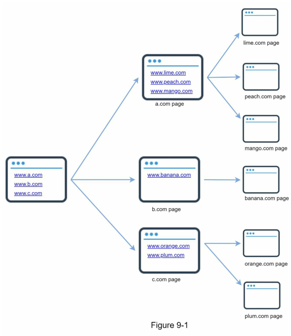
- 위와 같이 특정 웹페이지의 HTML에서 찾을 수 있는 URL을 계속해서 순회함


> ### 크롤링의 목적
> 1. 검색 엔진 인덱싱
> - 크롤러의 가장 보편적 사용 목적
> - 크롤러를 통해 로컬 인덱스를 생성
> - 이를 통해 검색 성능이 좋아짐
>
> 2. 웹 아카이빙
> - 장기보관을 목적
> 
> 3. 웹 마이닝
> - 인터넷의 유용한 지식을 도출
>
> 4. 웹 모니터링
> - 크롤링을 통해 인터넷에서 저작권이나 상표권이 침해되는 사례를 모니터링


## 1단계 | 문제 이해 및 설계 범위 확정
> ### 웹 크롤러의 기본 알고리즘
> 1. URL집합이 입력으로 주어짐
>    - 해당 URL이 가리키는 모든 웹페이지(HTML)을 다운로드함
> 2. 다운받은 웹페이지에서, 다시 URL을 추출
> 3. 추출된 URL을 다운로드할 URL 리스트에  추가하고 해당 과정을 반복함

- 검색 엔진 인덱싱에 사용됨
- 매달 10억개의 페이지를 수집함
- 새로 생성되거나 수정된 페이지도 고려해야함
- 5년간 페이지 저장
- 중복된 콘텐츠는 무시됨
- **규모 확장성** : 병행성을 활용하여 효율적인 크롤링 가능
- **안정성** : 잘못된 HTML에 대해 대응할 수 있어야 함
- **예절** : 대상 웹사이트에 짧은 시간동안 많은 요청을 보내선 안됨
- **확장성** : 다양한 형태의 파일에 대응할 수 있어야 함

### 개략적 규모 추정
- 매달 10억 개의 웹페이지를 다운로드 => 초당 400페이지를 크롤링
- 웹 페이지 크기가 500K라고 가정할 때, 매달 500TB의 저장공간 필요
- 5년 동안, 30PB의 저장공간 필요

## 2단계 | 개략적 설계안 제시 및 동의 구하기
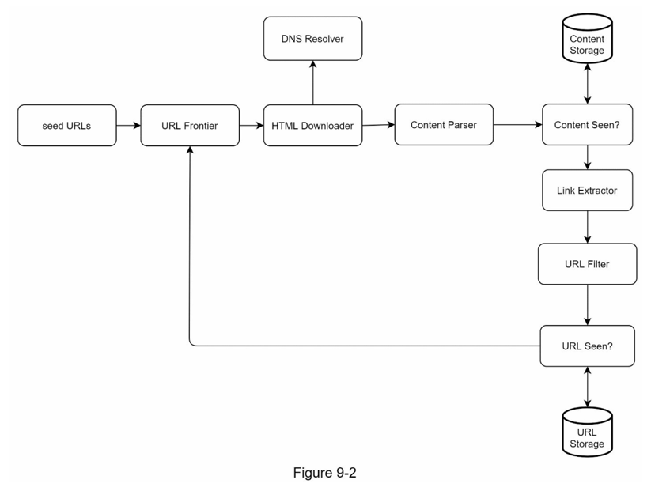
- 위와 같은 설계안 제시 가능
- 다양한 컴포넌트 존재 (밑에서 후술)

### 시작 URL 집합 (seed URLs)
- 시작 URL 집합 : 웹 크롤링의 시작점
- 특정 웹페이지의 모든 페이지를 순회하려면, 해당 도메인이 붙은 모든 페이지의 URL을 시작URL로 써야함
  - 특정 웹페이지의 링크를 타고 내려가는 구조이기에, 어떤 URL은 탐색이 안될수도 있기 때문
- 모든 URL을 시작URL로 넣는 것은 한계가 있음
  - 이에 가능한 한 많은 링크를 탐색할 수 있도록 부분집합으로 나누는 전략 사용


### 미수집 URL 저장소 (URL Frontier)
- 특정 웹페이지에 대해 `다운로드할 URL`, `다운로드된 URL`로 나눈다.
- 이때 `다운로드할 URL`을 미수집 URL 저장소에 저장한다. 

### HTML 다운로더 (HTML downloader)
- HTML 다운로더는 URL에 대한 HTML을 다운로드한다.
- 이때 URL은 미수집 URL 저장소에서 제공한다.

### 도메인 이름 변환기 (DNS Resolver)
- URL을 IP주소로 변환하는 기능이 필요
- 도메인 이름 변환기를 통해 IP주소를 가져온다.
- 근데 크롤링 시 URL로도 가능하지 않나...?

### 콘텐츠 파서 (Content Parser)
- 웹페이지를 다운로드 완료했을 때, 해당 페이지에 대한 파싱과 검증이 진행되어야 함
- 악성 코드가 들어있는 페이지일 수 있으며, 저장공간을 낭비하게 됨
- 크롤링 서버에서 콘텐츠 파서를 구현하면 크롤링 과정이 느려질 수 있음 -> 이에 독립된 컴포넌트에서 진행


### 중복 콘텐츠인가? (Content Seen?)
- 약 30%의 페이지가 중복된 콘텐츠라고 함
- 이에 중복된 페이지를 저장하게 되면 저장소가 낭비됨
- 가장 직관적인 방법은 두 HTML문서를 하나하나 비교하는 것
  - 비교 대상의 문서의 수가 많아질수록 느리고 비효율적임
  - 이에, 웹페이지의 해시 값을 비교하여 해결 가능

### 콘텐츠 저장소 (Content Storage)
- 다운로드한 HTML을 보관하는 저장소
- 데이터의 유형, 크기, 저장소 접근 등을 고려해야함
- 데이터의 양이 많으므로 디스크에 콘텐츠를 저장
- 인기있는 콘텐츠(자주 조회되는)는 메모리에 두어 지연시간을 줄임

### URL 추출기 (Link Extractor)
- HTML파일에서 링크들을 추출함
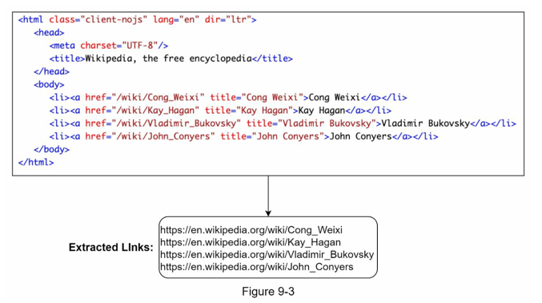
- 상대 경로인 경우, 절대경로로 URL변경

### URL 필터 (URL Filter)
- URL 추출기에서 추출한 URL에 대해, 특정 확장자나 콘텐츠를 배제함
- 또한, 오류가 발생하거나, 접근 제외 목록에 포함된 URL을 막음

### 이미 방문한 URL? (URL Seen?)
- 추출한 URL에 대해, 이미 방문한 URL일수도 있다.
- 이에 이미 방문한 URL인지 추적하여 중복 로직을 방지할 수 있음
- 이를 구현하기 위해, 블룸 필터 or 해시 테이블이 많이 쓰임

### URL 저장소 (URL Storage)
- 이미 방문한 URL을 저장하는 보관소

### 웹 크롤러 작업 흐름
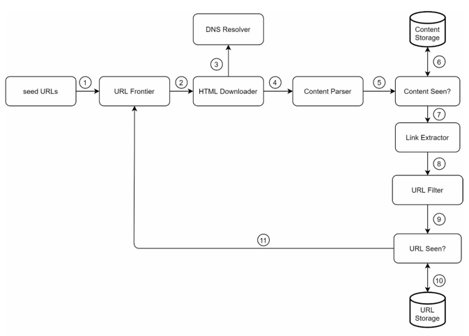

1. 시작 URL을 미수집 URL 저장소에 저장
2. HTML 다운로더는 미수집 URL 저장소에서 URL을 가져옴
3. DNS Resolver를 통해 IP주소를 알아내고, 해당 IP주소로 접속해 웹페이지(HTML)을 다운받음
4. 콘텐츠 파서는 HTML을 분석하여 유효한지 확인
5. 중복 컨텐츠인지 확인하는 절차 시작
6. 해당 페이지가 저장소에 있는지 확인
   - 이미 저장소에 있으면, 무시
   - 저장소에 없으면, 저장 및 URL 추출기로 전달
7. URL 추출기는 HTML에서 링크를 추출
8. 추출한 링크를 필터로 전달
9. 필터링 후, 중복 URL 판별 단계로 전달
10. URL 저장소에 이미 있는지 확인
    - 이미 저장소에 존재하는 URL이면 무시
    - 저장소에 존재하지 않으면 미수집 URL 저장소에 저장

## 3단계 | 상세 설계
- 해당 단계에서는 위 컴포넌트에 대한 구현 기술을 설명함

### DFS를 쓸 것인가, BFS를 쓸 것인가
- 페이지를 노드, URL를 엣지로 간주하면, 유향 그래프가 형성됨
- 해당 그래프를 순회할 때, DFS 혹은 BFS 알고리즘을 활용

> #### DFS in 크롤링
> - 크롤링에서 DFS는 좋은 선택이 아님
> - 페이지가 클 수록, depth가 끊임없이 커질 수 있고, 어느정도로 깊이 내려가는지 알기 어려움

> #### BFS in 크롤링
> - DFS의 단점으로, 크롤링에서 BFS를 사용함
> - 하지만, 2가지 단점이 존재
> 1. `예의 없는` 크롤러 문제
>    - 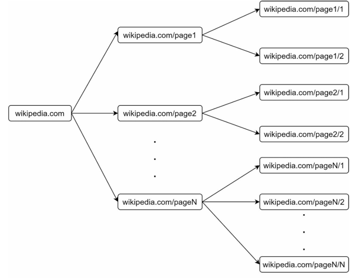
>    - 한 페이지의 크롤링이 끝나면, 이전 페이지로 돌아감
>    - 이 과정에서, 같은 링크에 대한 중복된 요청이 발생
>    - 즉, 서버는 수많은 중복된 요청으로 과부하에 걸릴 수 있음
> 
> 2. URL간의 우선순위 존재 X
>    - 표준 BFS는 URL간의 우선순위를 두지 않음
>    - 하지만 크롤링 시 웹 페이지의 중요도를 설정해야함

- BFS로 크롤링 시, 위와 같은 문제가 있지만 바로 후술할 미수집 URL 저장소를 활용하여 해결 가능하다.


### 미수집 URL 저장소
- 미수집 URL 저장소를 활용하여 위에서 언급한 BFS 문제를 해결할 수 있음
- URL에 대해 예의를 갖춘 크롤러, 우선순위를 갖춘 크롤러를 구현해야함

#### 예의
- 크롤러는 대상 서버로 짧은 시간에 많은 요청을 보내선 안됨
- 서버에서 디도스 공격으로 간주할 수도 있음
- 이에 지켜야 할 원칙은, **동일 웹사이트에 대해서는 한 번만 요청을 보내야 함**이다. (이 문장을 동시에 같은URL로 여러 요청을 보내지 마라 라고 해석해야할 것 같습니다.)
- 즉, 같은 웹사이트에 대한 태스크는 일정한 시간차를 두고 실행하도록 해야한다.

> 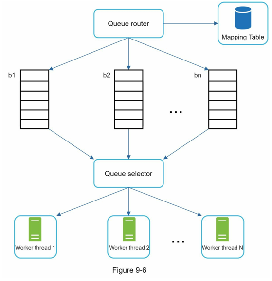
> - 위 구조가 일정한 시간차를 두도록 하는 아키텍처이다.
> - 웹사이트의 호스트와, 크롤링을 진행하는 worker 사이에 큐를 두어 구현한다.
> - **큐 라우터** : 동일한 호스트의 URL은 언제나 같은 큐로 보낸다.
> - **매핑 테이블** : 어떤 URL을 어떤 큐로 보낼지에 대한 정보를 저장한다.
>   - 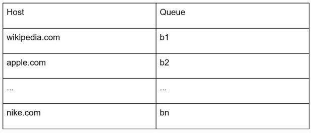
> - **FIFO 큐** : 같은 호스트의 URL은 항상 같은 큐에 저장
> - **큐 선택기** : 큐를 순회하며 URL을 꺼냄.
>   - 특정 URL을 다운로드하도록 설정한 worker에 작업 전달
> - **작업 스레드(worker)** : 전달받은 URL의 웹페이지를 다운로드
>   - 전달된 URL은 순차적으로 처리됨
>   - **작업들 사이에 일정한 지연시간을 둘 수 있음**

#### 우선순위
- 애플의 홈페이지와, 애플 제품에 대한 사용자 의견에 대한 페이지의 중요도는 다를 것이다. (홈페이지 > 사용자 의견 페이지)
  - 즉, 애플의 홈페이지를 먼저 다운로드 해야함
- 이러한 URL에 대해, 우선순위를 설정할 수 있다. (예의있는 크롤링 구현과 비슷한 구조이다.)

> 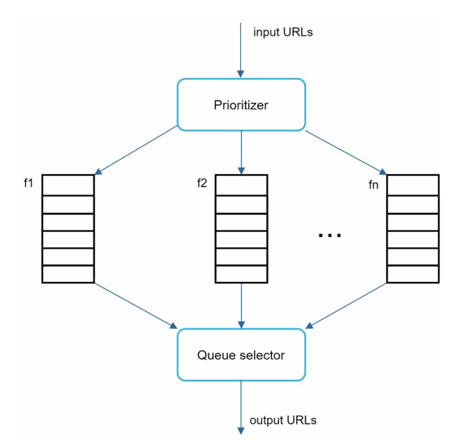
> - **순위결정장치(Prioritizer)** : URL을 입력으로 받아 우선순위를 계산
> - **큐** : 우선순위별로 큐를 할당. 우선순위가 높으면 선택받을 확률 증가
> - **큐 선택기** : 큐에서 처리할 URL을 꺼내온다.
>   - 이때, 우선순위가 높은 큐에서 URL을 꺼내올 확률이 높다.
> - 즉, 중요한 URL이 먼저 처리되는 구조로 설계되었다.

- 두 구조를 합쳐 아래와 같은 구조를 사용한다.
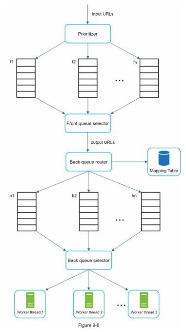
- 위가 우선순위 구조, 아래가 예의구조이다.

#### 신선도
- 웹페이지는 수시로 변경되기에, 최신 데이터(신선도)를 유지하기 위해 다운로드한 페이지에 대해 주기적으로 검사를 해야함
- 하지만 모든 URL을 검사하고 수집하는건 많은 자원 소모
- 이에 아래와 같은 방식으로 타협
  - 웹 페이지 변경 이력 활용
  - 우선순위를 활용하여 중요한 페이지를 자주 재수집

#### 미수집 URL 저장소를 위한 지속성 저장장치
- 검색 엔진을 위한 크롤링의 경우 URL이 수억 개에 달함
- 이에 모든 URL을 메모리에 저장하는 건 좋지 못한 선택
- 이에 대부분의 URL은 디스크에 저장하지만, 메모리 버퍼에 큐를 두는 절충안 사용

### HTML 다운로더
- 특정 URL에 대한 HTML을 다운로드하는 컴포넌트

#### Robots.txt
- 웹사이트가 크롤러와 소통하는 표준 방식
- 해당 파일에 크롤링 규칙이 존재하기에, 이를 먼저 확인하고 크롤링해야함
```plain
User-agent: Googlebot
Disallow: /creatorhub/*
Disallow: /rss/people/*/reviews
Disallow: /gp/pdp/rss/*/reviews
Disallow: /gp/cdp/member-reviews/
Disallow: /gp/aw/cr/
```
- 다음과 같은 경로의 내용은 다운받을 수 없다.
- 아래는 [링커리어](https://linkareer.com/robots.txt)의 robots.txt이다.
```plain

User-agent: *
Allow: /

User-agent: Bingbot
Crawl-delay: 1
Allow:/

Sitemap: https://linkareer.com/sitemap/sitemapindex.xml
```
- 모든 경로에 대해 Allow임을 확인할 수 있다.


#### 성능 최적화
- HTML 다운로더에서는 성능 최적화도 중요
- 아래와 같은 최적화 방식 존재

##### 1. 분산 크롤링
- 크롤링 작업을 여러 서버에서 맡아 최적화할 수 있다.

##### 2. 도메인 이름 변환 결과 캐시
- DNS Resolver에서 IP주소를 받아오는 작업은 100ms ~ 200ms 정도 걸림
- 이에 도메인 이름과 해당 IP주소를 캐시하여 사용하면 성능 향상 이뤄짐

##### 3. 지역성
- 크롤링 작업을 수행하는 서버의 위치를 분산시킨다.
- 대상 서버와 가까우면 페이지 다운로드 시간이 줄어듦

##### 4. 짧은 타임아웃
- 특정 서버는 응답이 느릴 수 있음
- 이에 오랫동안 대기하면 병목이 발생하므로, 어느정도 기다리고 무시할지 짧은 타임아웃을 설정하면 좋음

#### 안정성
- 안정성 또한 시스템 설계 시 고려해야할 중요한 부분
- **안정 해시**: 다운로더 서버를 추가하여 부하를 분산할 때 사용가능 (5장)
- **크롤링 상태 및 수집 데이터 저장** : 장애가 발생한 경우에도 쉽게 복구 가능해야함
  - 상태와 수집된 데이터를 지속적으로 기록해야함
  - 이를 통해 중단된 작업이 있더라도 쉽게 재시작 가능
- **예외 처리** : 예외가 발생해도 서버의 다운 없이 진행되어야함
- **데이터 검증** : 시스템 오류를 방지

#### 확장성
- 시스템 설계 시 새로운 형태의 콘텐츠를 지원할 수 있도록 확장성에 유의해야함
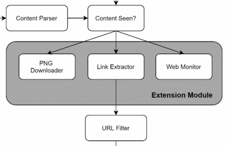
- png 다운로더 : png파일을 다운로드 하는 모듈
- web monitor : 저작권이나 상표권이 침해되는 일을 막음

### 문제 있는 컨텐츠 감지 및 회피
#### 1. 중복 콘텐츠
- 웹 콘텐츠의 30%가량은 중복 콘텐츠
- 이에 해시 or 체크섬을 활용하여 중복을 탐지할 수 있음


#### 2. 거미 덫
- 크롤러를 무한 루프에 빠뜨리는 함정
- 다음과 같은 링크가 해당됨
- `spidertrapexample.com/foo/bar/foo/bar/foo/bar/···`
- 이는 URL 길이에 제한을 걸어 해결 가능
- 하지만 모든 함정을 피할 수는 없음..
- 수작업으로 URL 필터 목록에 등록해야함

#### 3. 데이터 노이즈
- 어떤 콘텐츠는 아예 가치가 없을 수 있음 (가능하면 제외해야함)

## 4단계 | 마무리
- 추가로 논의해보면 좋을 것
1. 서버측 렌더링
   - 많은 페이지가 자바스크립트로 링크를 동적으로 만들어냄
   - 이에 서버에서 렌더링하여 해결해야함
2. 원치 않은 페이지 필터링
   - 크롤링에 소모되는 자원은 유한함
   - 이에 필요없는 페이지는 걸러낼 수 있으면 좋음
3. 데이터베이스 다중화 및 샤딩
   - 데이터 계층의 안정성, 가용성이 향상된
4. 수평적 규모 확장성
   - 크롤링을 위해 서버가 수백 수천 대가 필요할 수 있음
   - 이에 각 서버를 무상태로 만들어야 함
5. 가용성·일관성·안정성
   - 대형 시스템을 구축하기 위한 필수적 요소
6. 데이터 분석 솔루션
   - 이렇게 수집한 데이터를 잘 분석할 수 있어야 함

# 🔟 : 알림 시스템 설계
- 알림 시스템은 모바일 푸시 알림에 한정하지 않고, SMS, 이메일의 알림도 존재

## 1단계 | 문제 이해 및 설계 범위 확정
- 푸시알림·SMS·이메일 알림 지원
- 실시간 시스템 (약간의 지연은 수용)
- iOS, Android, 랩톱/데스크탑 지원
- 클라이언트 또는 서버에서 알림을 생성
- 천만 건의 푸시 알림, 백만 건의 SMS, 5백만 건의 이메일

## 2단계 | 개략적 설계안 제시 및 동의 구하기
### 알림 유형별 지원 방안 
- iOS, 안드로이드, SMS, 이메일 유형이 있다.

#### iOS 푸시 알림
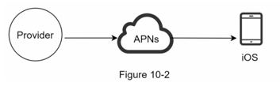
- 위 그림처럼 세 가지의 컴포넌트가 있다.
- **알림 제공자** : 알림을 만들어, 애플 푸시 알림 서비스(APNS: Apple Push Notification Service)로 보낸다.
  - 요청을 만들기 위해, 아래와 같은 값이 필요하다.
  - **단말 토큰** : 알림 요청을 보내기 위한, 고유 식벼자
  - **페이로드** : 알림 내용을 담은 JSON 데이터
    ```json
    {
      "apps": {
        "alert": {
          "title": "Game Request",
          "body": "Bob wants to play chess",
          "action-loc-key": "PLAY"
        },
        "badge": 5
      }
    }
    ```
- **APNS** : 애플이 제공하는 원격 서비스
  - 푸시 알림을 iOS 단말로 전달
- **iOS** : 푸시 알림을 수신하는 사용자 단말

#### 안드로이드 푸시 알림
- iOS와 비슷하나, APNS대신 FCM을 사용함
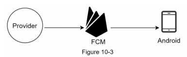

#### SMS 메세지
- SMS관련 사업자의 서비스를 사용 (ex. Twilio, Nexmo 등.. coolsms)
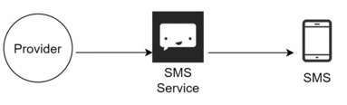

#### 이메일
- 상용 이메일 서비스 사용 (직접 이메일 서버를 구축하는 경우도 존재)
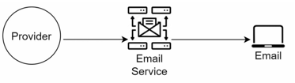

> 알림 서비스는 어떤 서비스를 사용하냐에 따라 달라짐

#### 연락처 정보 수집 절차
- 알림을 보내기 위해선, 모바일 단말 토큰, 이메일, 전화번호 등의 정보 필요
- 이에 사용자가 계정을 등록할 때, API서버에서 사용자 정보를 저장
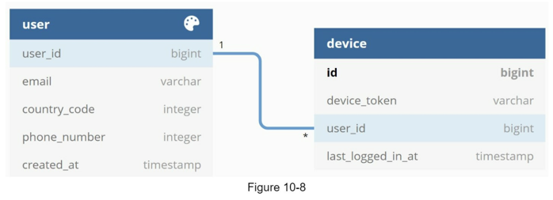
- 다음과 같이 테이블 구조를 설계할 수 있음 (단말이 여러 개 일 때)
- 단말이 하나 일 때는 user테이블에 넣는 방법도 존재

#### 알림 전송 및 수신 절차
##### 개략적 설계안 (초안)
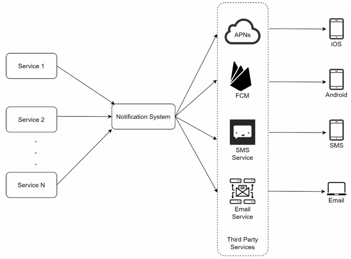
- **1부터 N까지의 서비스** : 알림을 보내려는 주체
- **알림 시스템** : 알림 전송/수신의 핵심
  - 1~N개의 서비스에서 알림 전송 API를 받아야 함
  - 알림 API를 통해 제3자 알림 시스템에 알림 페이로드를 전달함
- **제3자 서비스** : 해당 서비스는 실제로 단말에 알림을 전달
  - 다양한 서비스를 사용할 수 있어야 함 (확장성)        
- **단말** : 자기 단말에서 알림을 수신함

> ##### 문제점
> - 위 설계에는 문제가 존재
> 1. SPOF
> - 알림 서비스에 서버가 하나밖에 없음
> - 장애가 생기면, 전체의 장애로 이어짐
> 2. 규모 확장성
> - 한 대의 서버로 알림 서비스를 처리하므로, 중요 컴포넌트의 규모를 늘릴 수 없음
> 3. 성능 병목
> - 사용자 트래픽이 많이 몰리면, 시스템에서 과부하가 걸릴 수 있음

##### 개략적 설계안 (개선된 버전)
> - 데이터베이스와 캐시를 시스템의 서버에서 분리
>     - 규모 확장성 해결
> - 알림 서버 증설 및 수평적 규모 확장
>     - SPOF 해결
> - 메세지 큐를 통해 컴포넌트의 결합을 끊음
>     - 성능 병목 해결

- 초안의 문제점을 개선한 설계안이다.
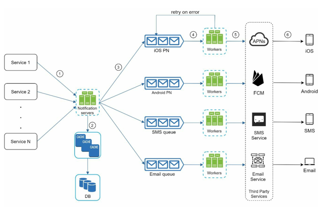

- **알림 서버** :
  - 알림 전송 API : 인증된 클라이언트만 사용
  - 알림 검증 : 이메일, 전화번호 등 검증 이뤄짐
  - 데이터베이스, 캐시 질의 : 알림에 포함시킬 데이터 가져옴
  - 알림 전송 : 알림데이터를 메세지 큐에 넣음
    - 이를 통해 컴포넌트 결합을 느슨하게 함
- **캐시** : 정보를 캐시
- **메시지 큐** : 
  - 컴포넌트 간의 의존성을 제거함
  - 다량의 알림 요청이 왔을 때, 버퍼 역할도 함
- **작업 서버** : 메세지 큐에서 알림을 꺼내, 제3자 서비스로 전달

## 3단계 | 상세 설계
### 안정성
#### 데이터 손실 방지
- 고려해야할 가장 중요한 점은 알림이 소실되면 안된다는 점
- 이에 재시도 메커니즘을 구현해야함
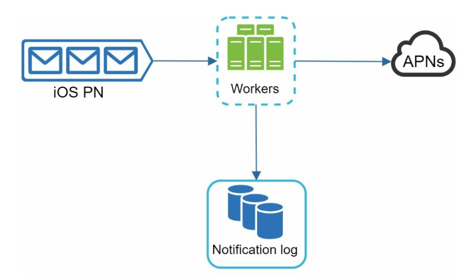
- 위와 같이 알림 로그 DB를 만들어 구현 가능


#### 알림 중복 전송 방지
- 메세지 큐로 알림을 전송하기에 여러 번 반복되는 것을 완전히 막을 수는 없음 (분산시스템 특성)
- 간단한 로직 사례
  1. 보내야 할 알림이 도착
  2. 해당 알림ID 검사
  3. 중복된 이벤트면 무시
  4. 본 적이 없는 이벤트이면 알림 발송

### 추가로 필요한 컴포넌트 및 고려사항
#### 알림 템플릿
- 하루 수백만 건의 알림을 처리하는 건 자원을 많이 먹음
- 이에 템플릿을 따로 만들어 지정된 형식에 알람을 맞춤
```text
지금 [item_name]을 주문 또는 예약하세요!
```

#### 알림 설정
- 사용자가 알림 설정을 자세히 조정할 수 있도록 해야함
- `알림을 받을 것인지 여부`, `어떤 알림을 받을 것인지`

#### 전송률 제한
- 너무 많은 알림이 사용자에게 가면 알림을 아예 끌 수도 있으니, 알림의 빈도를 제한하도록 해야함

#### 재시도 방법
- 제3자 서비스가 전송에 실패하면, 해당 알림을 재시도 전용 큐에 넣어야함

#### 푸시알림과 보안
- iOS, 안드로이드의 경우, secret키를 사용하므로, 승인된 클라이언트만 API를 보낼 수 있도록 해야함

#### 큐 모니터링
- 알림 전송 요청이 메시지 큐에 얼마나 쌓였는지가 중요 지표가 됨
- 해당 지표를 통해 서버를 증설할지를 판단할 수 있음

#### 이벤트 추적
- 알림 확인율, 클릭율과 같은 메트릭은 사용자 분석을 위해 추적할 수 있어야 함

### 수정된 설계안
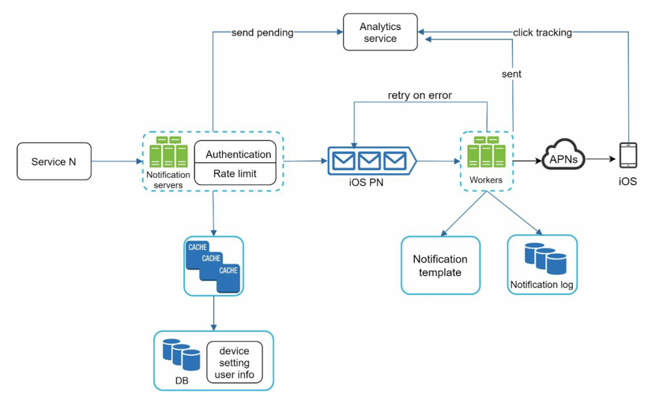
> #### 추가된 것
> - 알림 서버에 인증과, 전송률 제한 기능 추가
> - 전송 실패에 대응할 재시도 기능 추가
>   - 이에 지정된 횟수만큼 재시도
> - 전송 템플릿을 추가하여 생성 과정을 단순화
> - 모니터링 및 추적 시스템 추가