# 9. 웹 크롤러 설계

- **웹 크롤러란?**
    - 검색 엔진에서 널리 쓰이는 기술.
    - 웹에 새로 올라오거나 갱신된 콘텐츠를 찾아내는 것이 주된 목적이다.
    - 몇 개 웹 페이지에서 시작하여 그 링크를 따라 나가면서 새로운 콘텐츠를 수집한다.
- **크롤러의 이용**
    - **검색 엔진 인덱싱**: 크롤러의 가장 보편적인 용례. 크롤러는 웹 페이지를 모아 검색 엔진을 위한 로컬 인덱스를 만든다.
        - 예: Googlebot
    - **웹 아카이빙**: 나중에 사용할 목적으로 장기보관하기 위해 웹에서 정보를 모으는 절차를 말한다. 많은 국립 도서관이 크롤러를 돌려 웹 사이트를 아카이빙하고 있다.
    - **웹 마이닝**: 웹의 폭발적 성장세는 데이터 마이닝 업계에 전례 없는 기회다. 웹 마이닝을 통해 인터넷에서 유용한 지식을 도출해 낼 수 있는 것이다. 일례로, 유명 금융 기업들은 크롤러를 사용해 주주 총회 자료나 연차 보고서를 다운받아 기업의 핵심 사업 방향을 알아내기도 한다.
    - **웹 모니터링**: 크롤러를 사용하면 인터넷에서 저작권이나 상표권이 침해되는 사례를 모니터링할 수 있다. 일례로 디지마크는 웹 크롤러를 사용해 해적판 저작물을 찾아내서 보고한다.

웹 크롤러의 복잡도는 웹 크롤러가 처리해야 하는 데이터의 규모에 따라 달라진다. 몇 시간이면 끝낼 수 있는 작은 학급 프로젝트 수준일 수도 있고, 별도의 엔지니어링 팀을 꾸려서 지속적으로 관리하고 개선해야 하는 초대형 프로젝트가 될 수도 있다. 따라서 우선 우리가 설계할 웹 크롤러가 감당해야 하는 데이터의 규모와 기능들을 알아내야만 한다.

## 9.1 1단계: 문제 이해 및 설계 범위 확장

- **웹 크롤러의 알고리즘 (매우 간단한 버전)**
    1. URL 집합이 입력으로 주어지면, 해당 URL들이 가리키는 모든 웹 페이지를 다운로드 한다.
    2. 다운받은 웹 페이지에서 URL을 추출한다.
    3. 추출된 URL들을 다운로드할 URL 목록에 추가하고 위의 과정을 처음부터 반복한다.
- **좋은 웹 크롤러가 만족시켜야 할 속성**
    - **규모 확장성**: 병행성을 활용하면 보다 효과적으로 웹 크롤링이 가능하다.
    - **안정성**: 비정상적 입력이나 환경에 잘 대응할 수 있어야 한다.
    - **예절**: 크롤러는 수집 대상 웹 사이트에 짧은 시간 동안 너무 많은 요청을 보내서는 안 된다.
    - **확장성**: 새로운 형태의 콘텐츠를 지원하기가 쉬워야 한다. 예를 들어, 이미지 파일도 크롤링하고 싶다고 해 보자. 이를 위해 전체 시스템을 새로 설계해야 한다면 곤란할 것이다.

### 9.1.1 개략적 규모 추정

- **요구사항**
    - 매달 10억 개의 웹 페이지를 다운로드 한다.
    - QPS = 10억/30일/24시간/3600초 = 대략 400페이지/초
    - 최대(Peak) QPS = 2xQPS = 800
    - 웹 페이지의 크기 평균은 500k라고 가정
    - 10억 페이지 x 500k = 500TB/월.
    - 1개월치 데이터를 보관하는 데는 500TB, 5년간 보관한다고 가정하면 결국 400TB x 12개월 x 5년 = 30PB의 저장용량 필요

## 9.2 2단계: 개략적 설계안 제시 및 동의 구하기

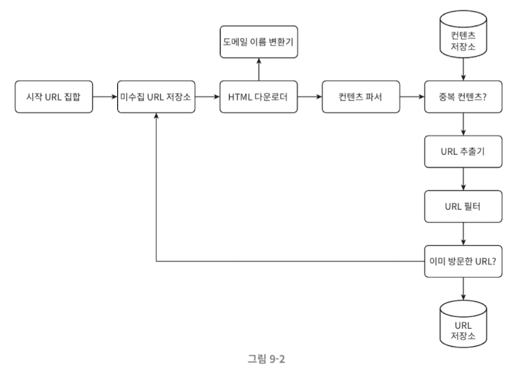

### **9.2.1 시작 URL 집합**

- 웹 크롤러가 크롤링을 시작하는 출발점.
- 예를 들어, 어떤 대학 웹사이트로부터 찾아 나갈 수 있는 모든 웹 페이지를 크롤링하는 가장 직관적인 방법은 해당 대학의 도메인 이름이 붙은 모든 페이지의 URL을 시작 URL로 쓰는 것이다.
- 전체 웹을 크롤링해야 하는 경우에는 시작 URL을 고를 때 좀 더 창의적일 필요가 있다. 크롤러가 가능한 한 많은 링크를 탐색할 수 있도록 하는 URL을 고르는 것이 바람직할 것이다.
    - 일반적으로는 전체 URL 공간을 작은 부분집합으로 나누는 전략을 쓴다. 지역적인 특색, 그러니까 나라별로 인기 있는 웹 사이트가 다르다는 점에 착안하는 것이다.
    - 또 다른 방법은 주제별로 다른 시작 URL을 사용하는 것이다. 예를 들어 URL 공간을 쇼핑, 스포츠, 건강 등등의 주제별로 세분화하고 그 각각에 다른 시작 URL을 쓰는 것이다.
- 정답은 없다! 의도가 중요

### **9.2.2 미수집 URL 저장소**

- 대부분의 현대적 웹 크롤러는 크롤링 상태를 두 가지로 나눠 관리한다.
    
    **(1) 다운로드할 URL**
    
    - 다운로드할 URL을 저장 관리하는 컴포넌트를 미수집 URL 저장소라고 부른다. FIFO 큐라고 생각하면 된다.
    
    **(2) 다운로드된 URL**
    

### **9.2.3 HTML 다운로더**

- 인터넷에서 웹 페이지를 다운로드하는 컴포넌트. 다운로드할 페이지의 URL은 미수집 URL 저장소가 제공한다.

### **9.2.4 도메인 이름 변환기**

- 웹 페이지를 다운받으려면 URL을 IP 주소로 변환하는 절차가 필요하다. HTML 다운로더는 도메인 이름 변환기를 사용하여 URL에 대응되는 IP 주소를 알아낸다.

### **9.2.5 콘텐츠 파서**

- 웹 페이지를 다운로드하면 **파싱과 검증 절차**를 거쳐야 한다.
- 이상한 웹 페이지는 문제를 일으킬 수 있는데다 저장 공간만 낭비하게 되기 때문이다.
- 크롤링 서버 안에 콘텐츠 파서를 구현하면 크롤링 과정이 느려지게 될 수 있으므로, 독립된 컴포넌트로 만들었다.

### **9.2.6 중복 콘텐츠인가?**

- 웹에 공개된 연구 결과에 따르면, 29% 가량의 웹 페이지 콘텐츠는 중복이다. 따라서 같은 콘텐츠를 여러 번 저장할 수 있게 된다.
- 이 문제를 해결하기 위한 자료구조를 도입하여 데이터 중복을 줄이고 데이터 처리에 소요되는 시간을 주린다. 이미 시스템에 저장된 콘텐츠임을 알아내기 쉽게 하는 것이다.
- 두 HTML 문서를 비교하는 가장 간단한 방법은 그 두 문서를 문자열로 보고 비교하는 것이겠지만, 비교 대상 문서의 수가 10억에 달하는 경우에는 느리고 비효율적이어서 적용하기 곤란할 것이다. 효과적인 방법은 웹 페이지의 **해시 값**을 비교하는 것이다.

### **9.2.7 콘텐츠 저장소**

- HTML 문서를 보관하는 시스템이다. 저장소를 구현하는 데 쓰일 기술을 고를 때는 저장할 데이터의 유형, 크기, 저장소 접근 빈도, 데이터의 유효 기간 등을 종합적으로 고려애햐 한다.
- 디스크의 메모리를 동시에 사용하는 저장소를 택할 것이다.
    - 데이터 양이 너무 많으므로 대부분의 콘텐츠를 디스크에 저장한다.
    - 인기 있는 콘텐츠는 메모리에 두어 접근 시간을 줄일 것이다.

### **9.2.8 URL 추출기**

- HTML 페이지를 파싱하여 링크들을 골라내는 역할을 한다.
- 상대 경로는 전부 절대 경로로 변환한다.

### **9.2.9 URL 필터**

- 특정한 콘텐츠 타입이나 파일 확장자를 갇는 URL, 접속 시 오류가 발생하는 URL, 접근 제외 목록에 포함된 URL 등을 크롤링 대상에서 배제하는 역할을 한다.

### **9.2.10 이미 방문한 URL?**

- 이 단계를 구현하기 위해서 이미 방문한 URL이나 미수집 URL 저장소에 보관된 URL을 추적할 수 있도록 하는 자료구조를 사용할 것이다.
- 이미 방문한 적이 있는 URL인지 추적하면 같은 URL을 여러 번 처리하는 일을 방지할 수 있으므로 서버 부하를 줄이고 시스템이 무한 루프에 빠지는 일을 방지할 수 있다.
- 해당 자료 구조로는 블룸 필터나 해시 테이블이 널리 쓰인다. 블룸 필터나 해시 테이블의 구현 방법에 대해서는 여기서 구체적으로 다루지 않겠다.

### **9.2.11 URL 저장소**

- 이미 방문된 URL을 보관하는 저장소

### 9.2.12 웹 크롤러 작업 흐름

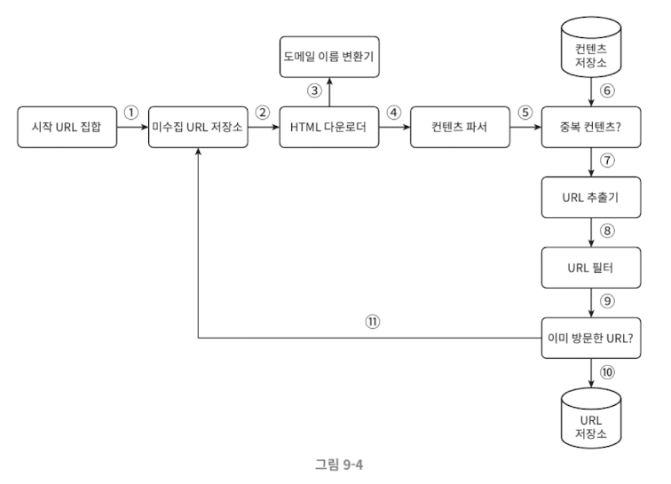

1. 시작 URL을 미수집 URL 저장소에 저장
2. HTML 다운로더가 미수집 URL 저장소에서 URL을 하나 꺼냄
3. 도메인 이름 변환기를 통해 URL → IP 주소 변환
4. 해당 IP로 접속해 HTML 다운로드
5. 콘텐츠 파서가 HTML을 파싱하고 형식 검증
6. 중복 콘텐츠인지 확인
    - 이미 저장소에 있는 콘텐츠라면 **버림**
    - 새로운 콘텐츠라면 **콘텐츠 저장소에 저장**
7. URL 추출기가 HTML에서 링크 수집
8. URL 필터로 불필요한 URL 제거
9. 남은 URL을 중복 URL 판별 단계로 전달
10. URL 저장소를 통해 이미 방문한 URL인지 확인
    - 이미 있으면 버림
11. 새로운 URL이면
    - URL 저장소에 저장
    - 동시에 미수집 URL 저장소에도 전달

## 9.3 3단계: 상세 설계

### 9.3.1 DFS vs BFS

- 웹은 **유향 그래프(directed graph)** 로 모델링할 수 있다.
    - 페이지 → `node`
    - 하이퍼링크(URL) → `edge`
- **DFS(깊이 우선 탐색)의 문제점**
    - 특정 경로로 **지나치게 깊게 들어갈 위험**
    - 그래프 크기가 매우 클 경우
        - 어느 깊이까지 가야 할지 알 수 없음
        - 일부 사이트에 편중된 크롤링 발생
    - 실무에서는 **좋은 선택이 아닐 가능성이 큼**
- **BFS(너비 우선 탐색)의 장점**
    - 웹 크롤러는 일반적으로 BFS 사용
    - FIFO 큐 기반
    - URL을 한쪽에서 넣고, 반대쪽에서 꺼냄
    - **웹 전체를 비교적 공평하게 탐색** → 따라서 기본 설계는 BFS가 표준

### 9.3.2 미수집 URL 저장소

- 미수집 URL 저장소는 앞으로 다운로드할 URL을 보관하는 핵심 컴포넌트다.
- **단순 BFS의 한계**
    - 같은 서버(예: wikipedia.com)에 속한 링크가 한 페이지에서 수백 개씩 나옴
    - 병렬로 처리하면
        - 동일 서버에 초당 수천 요청
        - 서버 과부하
        - 무례한(impolite) 크롤러
        - 심하면 DoS 공격으로 오해받을 수 있음

### 9.3.3 예의 문제

- **예의 없는 크롤러란?**
    - 짧은 시간에 동일 서버로 너무 많은 요청을 보내는 크롤러
    - 웹 서버를 마비시킬 수 있음
- **예의를 지키는 원칙**
    - **같은 웹 사이트에는 한 번에 한 페이지만 요청**
    - 같은 사이트의 페이지 요청 사이에 **시간 지연(delay)** 필요

### 9.3.4 큐 라우터 기반 설계

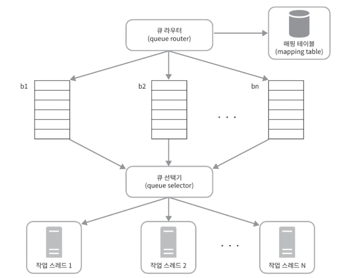

- 예의 문제를 해결하기 위해 호스트(hostname) 기준 큐 분리 전략을 사용한다.
- **구성 요소**
    - **큐 라우터 (queue router)**
        - URL의 hostname을 기준으로 항상 **같은 호스트는 같은 큐**로 보냄
    - **매핑 테이블 (mapping table)**
        - hostname → 큐(b1, b2, … bn) 관계 저장
        - 예: wikipedia.com → b1, apple.com → b2
    - **FIFO 큐 (b1 ~ bn)**
        - 같은 호스트 URL은 반드시 같은 큐에만 저장
        - 큐 내부는 FIFO
    - **큐 선택기 (queue selector)**
        - 여러 큐를 순회하면서 하나씩 URL을 꺼내 작업 스레드에 전달
    - **작업 스레드(worker thread)**
        - 전달받은 URL을 다운로드
        - 작업 사이에 **지연 시간(delay)** 적용 가능
- 이 구조로 서버 부하를 분산하고 예의를 확보한다.

### 9.3.5 URL 우선순위 문제

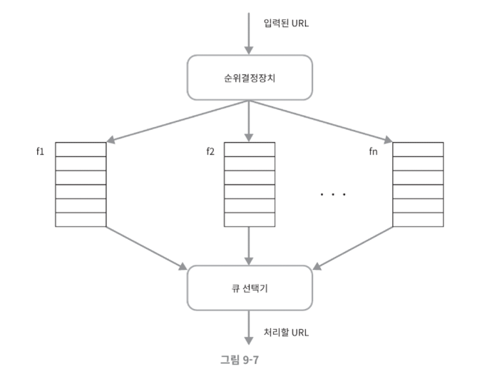

- **BFS의 또 다른 문제**
    - 모든 페이지를 **동일한 중요도**로 취급
    - 현실에서는
        - 페이지 중요도 다름
        - 업데이트 빈도 다름
        - 트래픽 다름
- **해결: 순위결정장치 (prioritizer)**
    - URL을 입력으로 받아 **우선순위 계산**
    - 여러 개의 큐(f1, f2, … fn)로 분배
    - 우선순위가 높을수록 **더 자주 선택**
- **우선순위 기준 예시**
    - PageRank
    - 트래픽
    - 업데이트 빈도
    - 도메인 중요도

### 9.3.6 전면 큐 + 후면 큐 구조

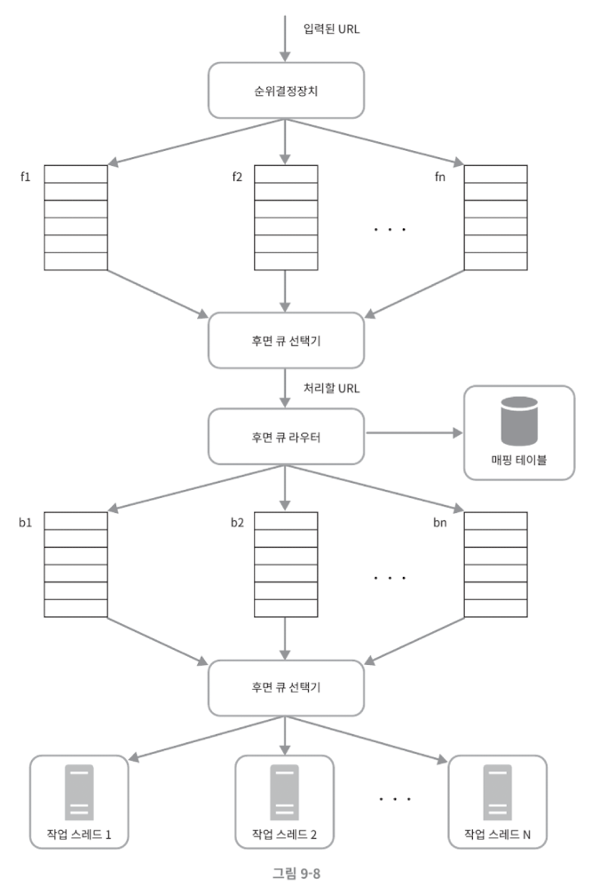

- **전면 큐 (front queue)**
    - URL의 **중요도 판단**
    - 우선순위 기반 분배
- **후면 큐 (back queue)**
    - 예의 보장
    - hostname 기준 큐 분리
    - 실제 다운로드 대기열
- **전체 흐름**
    - 입력 URL→ 순위결정장치 → 전면 큐 → 큐 선택기 → 후면 큐 라우터 → 후면 큐 → 작업 스레드
    - **중요도 + 예의 동시 만족**

### 9.3.7 신선도(Freshness)와 재수집

- 웹 페이지는 수시로 생성, 삭제, 변경된다.
- **문제**
    - 모든 URL을 계속 재수집하면 자원 낭비, 비효율
- **최적화 전략**
    - 페이지 변경 이력 활용
    - 우선순위가 높은 페이지는 더 자주 재수집

### 9.3.8 미수집 URL 저장소의 지속성 저장장치

- **문제**
    - URL 수: 수억~수십억
    - 전부 메모리에 저장 X
    - 전부 디스크에 저장 X (병목 발생)
- **해결: 하이브리드 접근**
    - 대부분의 URL → 디스크
    - 활성 URL → 메모리 버퍼
    - 버퍼 내용은 주기적으로 디스크에 기록

### 9.3.9. HTML 다운로더 상세 설계

- HTML 다운로더는 HTTP 프로토콜을 통해 웹 페이지를 다운로드한다.
- **Robots.txt**
    - 웹사이트와 크롤러 간의 **표준 규약**
    - 크롤링 전에 반드시 확인해야 함
    - 허용/차단 경로 명시
- **Robots.txt 캐싱**
    - 매번 다운로드 X
    - 주기적으로 갱신하여 캐시 사용

### 9.3.10 HTML 다운로더 성능 최적화

- **분산 크롤링**
    - 크롤링 서버를 여러 대로 분산
    - URL 공간도 서버별로 분할
    - 각 서버는 여러 스레드 사용
- **DNS 결과 캐시**
    - DNS 요청은 느림 + 블로킹
    - IP 결과 캐싱
    - cron job으로 주기적 갱신
- **지역성(Locality)**
    - 크롤링 서버를 대상 서버와 지리적으로 가깝게 배치
    - 다운로드 지연 감소
- **짧은 타임아웃**
    - 응답 없는 서버에 오래 대기 X
    - 일정 시간 지나면 중단 후 다음 URL

### 9.3.11 안정성 설계

- **안정 해시 (Consistent Hashing)**
    - 다운로드 서버 추가/제거 시
    - URL 재배치 최소화
- **크롤링 상태 저장**
    - 장애 발생 시에도 복구 가능
    - 중단된 지점부터 재시작 가능
- **예외 처리**
    - 에러는 필연적
    - 한 컴포넌트 에러로 전체 중단 X
- **데이터 검증**
    - 잘못된 데이터가 시스템 오류로 이어지지 않도록 사전 검증

### 9.3.12 확장성 (Extensibility)

- 새로운 콘텐츠 타입 지원 필요
- 예:
    - PNG 다운로더 (플러그인)
    - 웹 모니터 (저작권 침해 감지)
- **모듈 추가만으로 기능 확장 가능하도록 설계**

### 9.3.13 문제 있는 콘텐츠 감지 및 회피

- **중복 콘텐츠**
    - 전체 웹의 약 30%
    - 해시/체크섬으로 탐지
- **거미 덫 (Spider Trap)**
    - 무한 디렉터리 구조
        - 예: `/foo/bar/foo/bar/foo/bar/...`
    - 완전한 해결책 X
    - URL 길이 제한
    - 수동 블랙리스트
- **데이터 노이즈 (가능하면 수집 대상에서 제외)**
    - 광고
    - 스팸
    - 스크립트 코드
    - 가치 없는 콘텐츠

## 9.4 4단계: 마무리

- **좋은 웹 크롤러의 핵심 특성**
    - 확장성
    - 안정성
    - 예의
    - 확장성(콘텐츠 타입)
- **대규모 웹 크롤러 설계**
    - 단순 알고리즘 문제가 아님
    - 네트워크, 저장소, 분산 시스템, 운영 고려 필수
    - 완벽한 설계는 없음 → 지속적 개선 필요

# 10. 알림 시스템 설계

## 10.1 1단계: 문제 이해 및 설계 범위 확정

- 알림 시스템 설계 문제는 **정답이 정해져 있지 않은 시스템 설계 문제**다.
- 따라서 면접 상황에서는 요구사항을 명확히 하기 위한 질문이 필수적이다.
- **요구사항 질의 정리**
    - **지원 알림 종류**
        - 푸시 알림
        - SMS 메시지
        - 이메일
    - **실시간성**
        - 연성 실시간(soft real-time)
        - 즉시 전달이 이상적이지만, 고부하 상황에서 약간의 지연은 허용
    - **지원 단말**
        - iOS 단말
        - Android 단말
        - 웹 / 데스크톱
    - **알림 생성 주체**
        - 클라이언트 애플리케이션
        - 서버 스케줄링 작업
    - **알림 수신 거부(opt-out)**
        - 사용자는 알림 수신을 끌 수 있어야 함
    - **규모**
        - 하루 기준
            - 수천만 건의 모바일 푸시 알림
            - 백만 건의 SMS
            - 수백만 건의 이메일

## 10.2 2단계: 개략적 설계안 제시 및 동의 구하기

### 10.2.1 알림 유형별 지원 방안

- i**OS 푸시 알림**
    - iOS 푸시 알림을 보내기 위해 필요한 구성 요소는 세 가지다.
        
        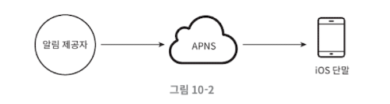
        
        1. **알림 제공자(provider)**
            - 알림 제공자는 **notification request**를 생성하여 APNS로 전송한다.
            - 이를 위해 다음 데이터가 필요하다.
                - **단말 토큰(device token):** 알림을 받을 iOS 단말을 식별하는 고유 값
                - **페이로드(payload):** JSON 형태의 알림 내용
                    - 예시
                        
                        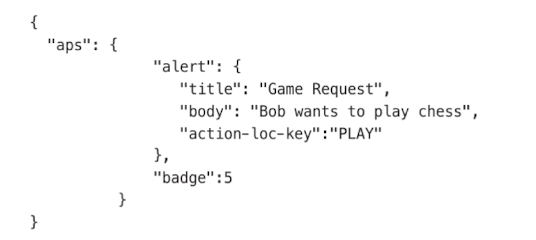
                        
        2. **APNS (Apple Push Notification Service)**
            - APNS는 애플이 제공하는 원격 서비스로, 알림을 실제 iOS 단말로 전달하는 역할을 담당한다.
        3. **iOS 단말**
- **Android 푸시 알림**
    
    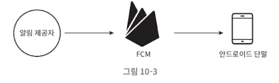
    
    - Android 푸시 알림은 iOS와 거의 동일한 구조를 가진다.
    - 차이점은 다음 하나뿐이다.
        - APNS 대신 **FCM (Firebase Cloud Messaging)** 사용
- **SMS 메시지**
    
    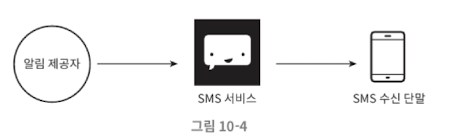
    
    - SMS 전송은 대부분 **외부 제3자 서비스**를 사용한다.
    - 특징: 상용 서비스, 사용량 기반 과금, 안정적인 전송 보장
- **이메일**
    
    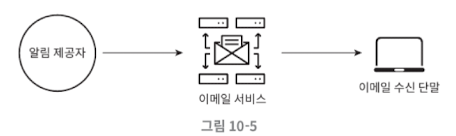
    
    - 대부분의 회사는 자체 이메일 서버를 운영할 수 있지만, 실무에서는 **상용 이메일 서비스**를 더 많이 사용한다.
    - 대표 서비스: SendGrid, Mailchimp
    - 장점: 높은 전송 성공률, 데이터 분석(analytics) 기능 제공

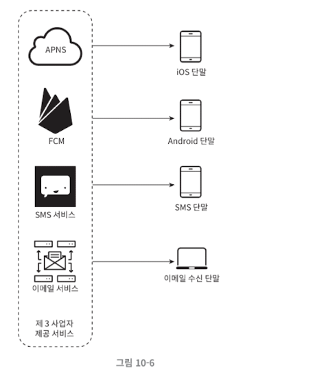

### 10.2.2 연락처 정보 수집 절차

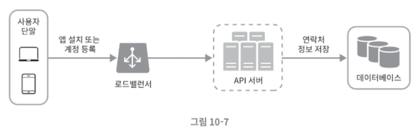

- 알림을 보내려면 모바일 단말 토큰, 전화번호, 이메일 주소 등의 정보가 필요하다.
- **수집 흐름**
    1. 사용자가 앱 설치 또는 회원 가입
    2. API 서버가 사용자 정보를 수집
    3. 데이터베이스에 저장
        - 설계 포인트
            - 한 사용자는 여러 단말을 가질 수 있음
            - 알림은 모든 단말로 전송되어야 함

### 10.2.3 알림 전송 및 수신 절차

- **개략적 설계안 (초안)**
    
    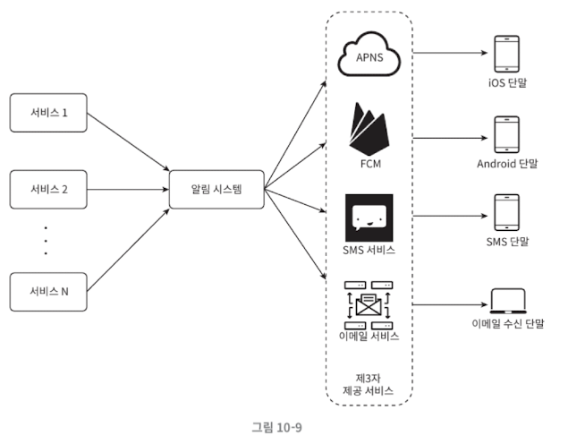
    
    - **1부터 N까지의 서비스**
        - 이 서비스 각각은 마이크로서비스(microservice)일 수도 있고, 크론잡(cronjob)일 수도 있고, 분산 시스템 컴포넌트일 수도 있다.
        - 사용자에게 납기일을 알려주고자 하는 과금 서비스(billing service), 배송 알림을 보내려는 쇼핑몰 웹사이트 등이 그 예다.
    - **알림 시스템(notification system)**
        - 알림 시스템은 알림 전송/수신 처리의 핵심이다.
        - 우선은 1개 서버만 사용하는 시스템이라고 가정해 보자. 이 시스템은 서비스 1~N에 알림 전송을 위한 API를 제공해야 하고, 제3자 서비스에 전달할 알림 페이로드(payload)를 만들어 낼 수 있어야 한다.
    - **제3자 서비스(third party services)**
        - 이 서비스들은 사용자에게 알림을 실제로 전달하는 역할을 한다.
        - **제3자 서비스와의 통합을 진행할 때 유의할 것**
            - **확장성(extensibility)**
                - 쉽게 새로운 서비스를 통합하거나 기존 서비스를 제거할 수 있어야 한다는 뜻이다.
            - **어떤 서비스는 다른 시장에서는 사용할 수 없을 수도 있다는 것**
                - 가령 FCM은 중국에서는 사용할 수 없다. 따라서 중국 시장에서는 제이푸시(Jpush), 푸시와이(PushY) 같은 서비스를 사용해야만 한다.
- **초안 설계의 문제점**
    - **SPOF(Single-Point-Of-Failure)**: 알림 서비스에 서버가 하나밖에 없다는 것은, 그 서버에 장애가 생기면 전체 서비스의 장애로 이어진다는 뜻이다.
    - **규모 확장성**: 한 대 서버로 푸시 알림에 관련된 모든 것을 처리하므로, 데이터베이스나 캐시 등 중요한 컴포넌트의 규모를 개별적으로 늘릴 방법이 없다.
- **개략적 설계안 (개선 버전)**
    
    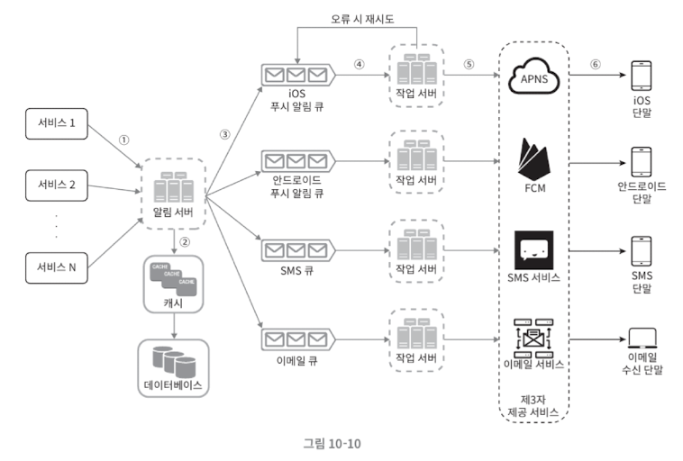
    
    - **개선 방향**
        - 데이터베이스와 캐시를 알림 시스템의 주 서버에서 분리한다.
        - 알림 서버를 증설하고 자동으로 수평적 규모 확장이 이루어질 수 있도록 한다.
        - 메시지 큐를 이용해 시스템 컴포넌트 사이의 강한 결합을 끊는다.
    - **1부터 N까지의 서비스**: 알림 시스템 서버의 API를 통해 알림을 보낼 서비스들.
    - **알림 서버(notification server)**:
        - **알림 전송 API**: 스팸 방지를 위해 보통 사내 서비스 또는 인증된 클라이언트만 이용 가능.
        - **알림 검증(validation)**: 이메일 주소, 전화번호 등에 대한 기본적 검증을 수행
        - **데이터베이스 또는 캐시 질의**: 알림에 포함시킬 데이터를 가져오는 기능
        - **알림 전송**: 알림 데이터를 메시지 큐에 넣는다. 본 설계안의 경우 하나 이상의 메시지 큐를 사용하므로 알림을 병렬적으로 처리할 수 있다.
        - **캐시(cache)**: 사용자 정보, 단말 정보, 알림 템플릿(template) 등을 캐시
        - **데이터베이스(DB)**: 사용자, 알림, 설정 등 다양한 정보를 저장
        - **메시지 큐(message queue)**
            - 시스템 컴포넌트 간 의존성을 제거하기 위해 사용한다.
            - 다량의 알림이 전송되어야 하는 경우를 대비한 버퍼 역할도 한다.
            - 본 설계안에서는 알림의 종류별로 별도의 메시지 큐를 사용하였다. 따라서 제3자 서비스 가운데 하나에 장애가 발생해도 다른 종류의 알림은 정상 동작하게 된다.
        - **작업 서버(workers)**: 메시지 큐에서 전송할 알림을 꺼내 제3자 서비스로 전달하는 역할을 담당하는 서버.
    - **알림 전송 과정**
        - API를 호출하여 알림 서버로 알림을 보낸다.
        - 알림 서버는 사용자 정보, 단말 토큰, 알림 설정 같은 메타데이터(metadata)를 캐시나 데이터베이스에서 가져온다.
        - 알림 서버는 전송할 알림에 맞는 이벤트를 만들어서 해당 이벤트를 위한 큐에 넣는다. 가령 iOS 푸시 알림 이벤트는 iOS 푸시 알림 큐에 넣어야 한다.
        - 작업 서버는 메시지 큐에서 알림 이벤트를 꺼낸다.
        - 작업 서버는 알림을 제3자 서비스로 보낸다.
        - 제3자 서비스는 사용자 단말로 알림을 전송한다.

## 10.3 3단계: 상세 설계

### 10.3.1 안정성

- **데이터 손실 방지**
    - 알림 전송 시스템의 가장 중요한 요구사항 가운데 하나는 **어떤 상황에서도 알림이 소실되면 안 된다는 것**이다.
    - 알림이 지연되거나 순서가 틀려도 괜찮지만, 사라지면 곤란하다는 것이다.
    - 이 요구사항을 만족하려면 알림 시스템은 **알림 데이터를 데이터베이스에 보관하고 재시도 메커니즘을 구현**해야 한다.
        - 그림 10-11과 같이 알림 로그(notification log) 데이터베이스를 유지하는 것이 한 가지 방법이다.
            
            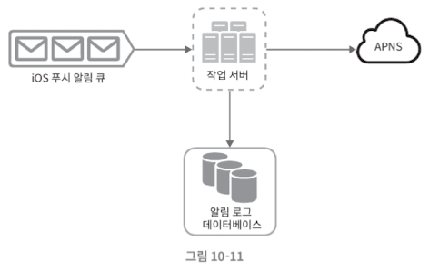
            
- **알림 중복 전송 방지**
    - 같은 알림이 여러 번 반복되는 것을 완전히 막는 것은 가능하지 않다. 대부분의 경우 알림은 딱 한 번만 전송되겠지만, 분산 시스템의 특성상 가끔은 같은 알림이 중복되어 전송되기도 할 것이다. 그 빈도를 줄이려면 중복을 탐지하는 메커니즘을 도입하고, 오류를 신중하게 처리해야 한다. 다음은 간단한 중복 방지 로직의 사례다.
    - 보내야 할 알림이 도착하면 그 이벤트 ID를 검사하여 이전에 본 적이 있는 이벤트인지 살핀다. 중복된 이벤트라면 버리고, 그렇지 않으면 알림을 발송한다.

### 10.3.2 추가로 필요한 컴포넌트 및 고려사항

- **알림 템플릿**
    - 대형 알림 시스템은 하루에도 수백만 건 이상의 알림을 처리한다. 그런데 그 알림 메시지 대부분은 형식이 비슷하다. 알림 템플릿은 이런 유사성을 고려하여, 알림 메시지의 모든 부분을 처음부터 다시 만들 필요 없도록 해 준다. **알림 템플릿은 인자(parameter)나 스타일, 추적 링크(tracking link)를 조정하기만 하면 사전에 지정한 형식에 맞춰 알림을 만들어 내는 틀**이다.
    - 템플릿을 사용하면 전송될 알림들의 형식을 일관성 있게 유지할 수 있고, 오류 가능성뿐 아니라 알림 작성에 드는 시간도 줄일 수 있다.
- **알림 설정**
    - 사용자는 이미 너무 많은 알림을 받고 있어서 쉽게 피로함을 느낀다.
    - 따라서 많은 웹사이트와 앱에서는 사용자가 알림 설정을 상세히 조정할 수 있도록 하고 있다.
    - 이 정보는 알림 설정 테이블에 보관되며, 이 테이블에는 아마 다음과 같은 필드들이 필요할 것이다.
        - user_id (bigint)
        - channel (varchar) # 알림이 전송될 채널, 푸시 알림, 이메일, SMS 등
        - opt_in (boolean) # 해당 채널로 알림을 받을 것인지의 여부
    - 이와 같은 설정을 도입한 뒤에는 특정 종류의 알림을 보내기 전에 반드시 해당 사용자가 해당 알림을 켜 두었는지 확인해야 한다.
- 전**송률 제한**
    - 사용자에게 너무 많은 알림을 보내지 않도록 하는 한 가지 방법은, 한 사용자가 받을 수 있는 알림의 빈도를 제한하는 것이다.
    - 이것이 중요한 이유는, 알림을 너무 많이 보내기 시작하면 사용자가 알림 기능을 아예 꺼 버릴 수도 있기 때문이다.
- **재시도 방법**
    - 제3자 서비스가 알림 전송에 실패하면, 해당 알림을 재시도 전용 큐에 넣는다.
    - 같은 문제가 계속해서 발생하면 개발자에게 통지한다(alert).
- **푸시 알림과 보안**
    - iOS와 안드로이드 앱의 경우, 알림 전송 API는 appKey와 appSecret을 사용하여 보안을 유지한다.
    - 따라서 인증된(authenticated), 혹은 승인된(verified) 클라이언트만 해당 API를 사용하여 알림을 보낼 수 있다.
- **큐 모니터링**
    - 알림 시스템을 모니터링할 때 중요한 메트릭(metric) 하나는 큐에 쌓인 알림의 개수다.
    - 이 수가 너무 크면 작업 서버들이 이벤트를 빠르게 처리하고 있지 못하다는 뜻이다.
    - 그런 경우에는 작업 서버를 증설하는 게 바람직할 것이다.
- **이벤트 추적**
    - 알림 확인율, 클릭율, 실제 앱 사용으로 이어지는 비율 같은 메트릭은 사용자를 이해하는 데 중요하다.
    - 데이터 분석 서비스(analytics)는 보통 이벤트 추적 기능도 제공한다.
    - 따라서 보통 알림 시스템을 만들면 데이터 분석 서비스와도 통합해야만 한다.

### 10.3.3 수정된 설계안

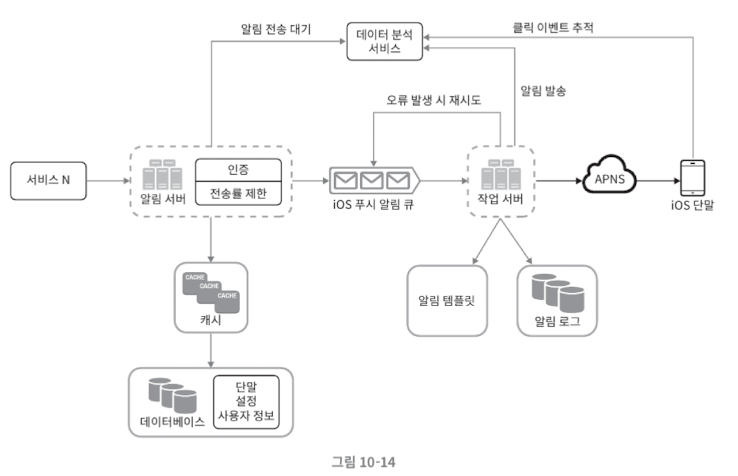

- 인증과 전송률 제한 기능 추가
- 재시도 기능 추가
    - 실패한 알림은 다시 큐에 넣고 지정된 횟수만큼 재시도한다.
- 전송 템플릿 사용
- 모니터링 추적 시스템 추가

## 10.4 4단계: 마무리

- 안정성(reliability): 메시지 전송 실패율을 낮추기 위해 안정적인 재시도 메커니즘을 도입하였다.
- 보안(security): 인증된 클라이언트만 알림을 보낼 수 있도록 appKey, appSecret 등의 메커니즘을 이용하였다.
- 이벤트 추적 및 모니터링: 알림이 만들어진 후 성공적으로 전송되기까지의 과정을 추적하고 시스템 상태를 모니터링하기 위해 알림 전송의 각 단계마다 이벤트를 추적하고 모니터링할 수 있는 시스템을 통합하였다.
- 사용자 설정: 사용자가 알림 수신 설정을 조정할 수 있도록 하였다. 따라서 알림을 보내기 전 반드시 해당 설정을 확인하도록 시스템 설계를 변경하였다.
- 전송율 제한: 사용자에게 알림을 보내는 빈도(frequency)를 제한할 수 있도록 하였다.