## 11장 : 뉴스 피드 시스템 설계
- 뉴스 피드 : 홈페이지 중앙에 지속적으로 업데이트 되는 스토리, 사용자 정보, 비디오 등을 포함
- 예) 페이스북 피드, 인스타그램 피드 등

### 1단계. 문제 이해 및 설계 범위 확정
1. 사용자는 뉴스 피드 페이지에 새로운 포스트를 발행하고, 친구들의 포스트를 볼 수 있어야 함
2. 시간 흐름의 역순으로 포스트를 표시
3. 한 명당 최대 5,000명의 친구를 가질 수 있음
4. 하루 천만 명이 방문 (10M DAU)
5. 포스트에 미디어 파일이 포함될 수 있음

### 2단계. 개략적 설계안 제시 및 동의 구하기

1️⃣피드 발행 API
- 새로운 포스트를 포스팅하는 API이다.
- HTTP POST 형태로 요청을 보낸다.
- `POST /v1/me/feed`
- 인자
  - body : 포스팅 내용
  - Authorization : 인증 토큰

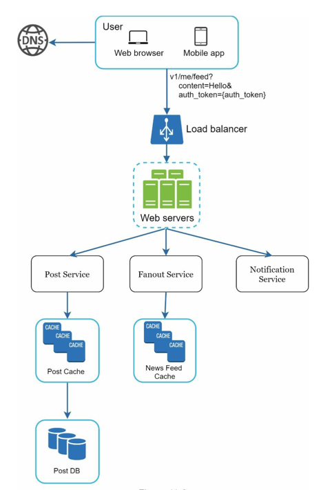

- Post Service (포스팅 저장 서비스) : 포스트를 db, 캐시에 저장
- Fanout Service (포스팅 전송 서비스) : 새 포스팅을 친구의 피드에 푸시
- Notification Service (알림 서비스) : 새 포스팅이 올라왔음을 친구들에게 전송

2️⃣피드 읽기 API
- 뉴스 피드를 가져오는 API이다.
- HTTP GET 형태로 요청을 보낸다.
- `GET /v1/me/feed`
- 인자
  - Authorization : 인증 토큰

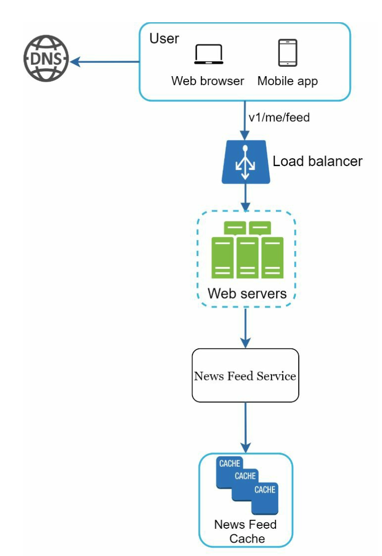

- News Feed Service (뉴스 피드 서비스) : 캐시에서 뉴스 피드를 가져옴
- News Feed Cache (뉴스 피드 캐시) : 뉴스 피드를 렌더링할 때 필요한 피드ID를 저장

### 3단계. 상세 설계

#### 1️⃣ 피드 발행 흐름 상세 설계

#### 웹 서버
- 인증 처리 및 처리율 제한 기능 수행
- 인증 토큰을 Authorization 헤더에 넣어야지만 사용자가 피드 발행이 가능함

#### 포스팅 전송(팬아웃) 서비스
- 포스팅 전송(팬아웃) : 어떤 사용자의 새 포스팅을 그 사용자와 친구관계에 있는 모든 사용자에게 전달하는 과정
- 두 가지의 모델이 존재
  - 쓰기 시점에 팬아웃 (푸시 모델)
  - 읽기 시점에 팬아웃 (풀 모델)

> #### 1. 쓰기 시점에 팬아웃
> - 새로운 포스트가 생성될 때 뉴스 피드를 갱산
> 
> #### 장점
> - 뉴스 피드가 실시간으로 갱신됨
> - 친구들에게 해당 피드가 즉시 전송됨
> - 뉴스 피드를 읽어들이는데 드는 시간이 짧음
>
> #### 단점
> - 친구가 많은 사용자의 경우 많은 사용자의 뉴스 피드를 업데이트 하는 건 많은 시간이 소요됨
> - 서비스를 사용하지 않는 사용자까지 갱신되므로 자원이 낭비됨

> #### 2. 읽기 시점에 팬아웃
> - 피드를 읽는 시점에 뉴스 피드를 갱신 (요청 할 때마다 갱신)
> 
> #### 장점
> - 서비스를 거의 사용하지 않는 사용자에 경우에 자원을 소모하지 않음
> - 많은 사용자의 뉴스 피드를 업데이트 할 필요 없음
>
> #### 단점
> - 뉴스 피드를 읽는데 많은 시간이 소요

- 이러한 모델의 장단점을 고려하여, 대부분에 사용자에 대해서는 쓰기 시점의 팬아웃 모델을 사용하고,
- 친구가 아주 많은 사용자에 한해 요청마다 갱신하는 읽기 시점의 팬아웃 모델을 사용할 수 있다.
- 이러한 두 가지 방법을 결합하여 장점은 취하고 단점은 커버될 수 있다.

> ### 팬아웃 서비스 흐름
> 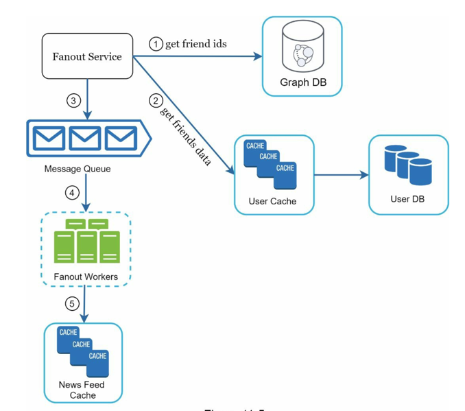
>
> 1. 그래프 데이터베이스에서 친구ID 목록을 가져옴
>    - 그래프 데이터베이스는 친구관계같은 그래프 자료구조를 관리하기 적합
> 2. 사용자 정보 캐시에서 친구ID를 통해 친구들의 정보를 가져옴
>    - 사용자 설정 필터에 따라, 친구들의 정보를 걸러냄
> 3. 친구 목록과 새 스토리의 포스팅ID를 메시지 큐에 넣음
> 4. 팬아웃 서버에서 메시지 큐의 데이터를 꺼내 뉴스 피드 캐시에 넣음
>    - 이때 모든 포스팅 정보를 넣지 않고, 최신순으로 일부만 저장함
>    - 대부분의 사요앚들은 모든 스토리를 훑어보지 않고, 용량 측면에서도 도움이 됨

#### 2️⃣피드 읽기 흐름 상세 설계
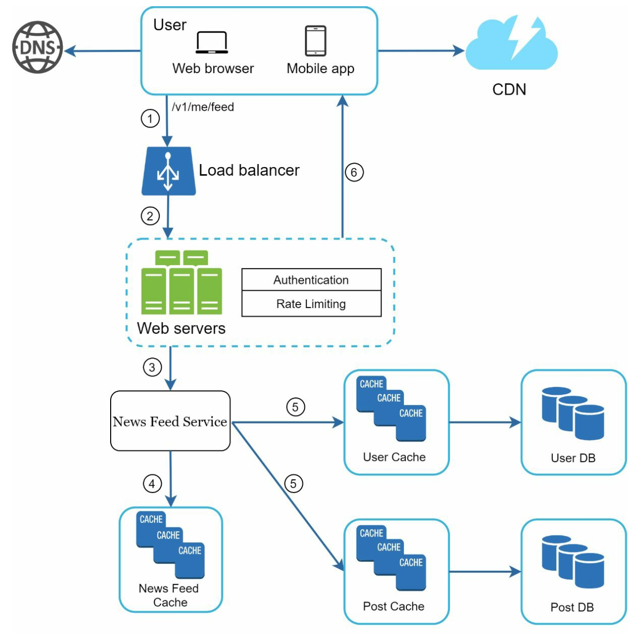

1. 사용자가 API요청을 보냄
2. 로드밸런서가 서버로 요청을 포워딩함
3. 웹 서버는 피드를 가져오기 위해 뉴스 피드 서비스를 호출
4. 뉴스 피드 서비스는 뉴스 피드 캐시에서 포스팅ID목록을 가져옴
5. 포스팅에서 사용되는 사용자의 정보를 가져와 완전한 뉴스 데이터 피드를 만듬
6. JSON형태로 클라이언트에게 보냄

#### 캐시 구조
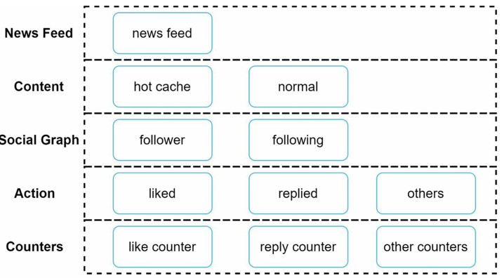

- 캐시를 위와 같이 5계층으로 나눔

### 4단계. 마무리
- 아래와 같은 주제들을 추가로 다룰 수 있다.
#### 데이터베이스 측면
- 수직적 규모 확장 vs 수평적 규모 확장
- SQL vs NoSQL
- master-slave 다중화 등...

- 웹 계층의 무상태 운영
- 데이터 캐싱 방식
- 메시지 큐를 사용한 컴포넌트의 결합도 낮추기 등....

## 12장 : 채팅 시스템 설계

### 1단계. 문제 이해 및 설계 범위 확장
1. 모바일, 웹 모두 지원해야 함
2. 하루 5천만 명을 처리해야 함 (50,000,000 DAU)
3. 최대 100명까지의 그룹 채팅이 가능
4. 1:1 채팅, 그룹 채팅, 사용자 접속 상태 표시를 지원해야함
5. 텍스트 메시지만 지원
6. 100,000자 이하

### 2단계. 개략적 설계안 제시 및 동의 구하기
- 아래 기능을 제공해야 함
  - 클라이언트로부터 메시지 수신
  - 메시지 수신자 결정 및 전달
  - 수신자가 접속 상태가 아닌 경우는 접속할 때까지 해당 메시지 보관
- 이때 메시지 전송은 HTTP로 처리가 가능하지만,
- 메시지 수신 시나리오는 복잡하기에 HTTP로는 한계가 있다.
  - 이에 폴링, 롱 폴링, 웹소텟 등의 기술을 사용하여 채팅 기술을 구현한다.

#### 폴링 (Polling)
- 폴링은 클라이언트가 서버에게 새 메시지가 왔는지 주기적으로 물어보는 방법이다.
- 폴링을 사용하면 폴링 비용이 발생하고, 답해줄 메시지가 없는 경우엔 리소스를 낭비한다는 단점이 있다

#### 롱 폴링 (Long Polling)
- 폴링의 비효율적인 특징을 보완하기 위한 방식이다.
- 클라이언트는 새 메시지가 반환거되나 타임아웃 될 때까지 연결을 유지한다.
- 클라이언트는 새 메시지를 받으면 연결을 종료하고 새로운 요청을 보내 절차를 다시 시작한다.
- 이를 통해 서버의 리소스를 절약할 수 있다.
- 하지만 아래와 같은 단점이 있다.
  - 메시지 송신 클라이언트와 수신 클라이언트가 서로 접속한 채팅 서버가 다를 수 있다.
  - 또한, 서버 입장에서는 클라이언트가 연결을 해제했는지 아닌지 알 수가 없다.

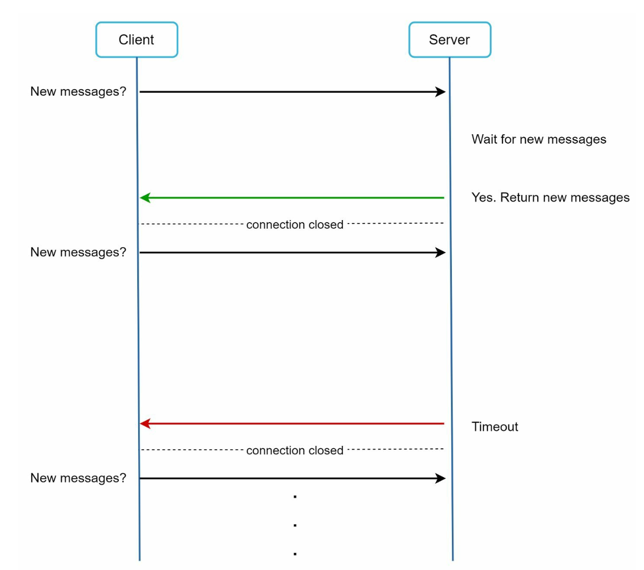

#### 웹소켓
- 서버가 클라이언트에게 비동기 메시지를 보낼 때 가장 보편적인 기술이다.
- 처음 연결 시에는 HTTP를 사용하며, 핸드셰이크 이후 웹소켓 연결로 변환된다.
- 연결은 클라이언트가 먼저 요청하며, 80, 443같은 HTTP 프로토콜의 포트를 그대로 사용한다.
- 다만 연결은 항구적으로 유지되기 때문에 서버에서는 이를 효율적으로 관리해야한다.

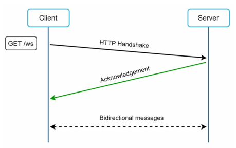

### 개략적 설계안
- 채팅 시스템을 세 파트로 나눌 수 있다.
1. 무상태 서비스 : 인증, 서비스, 그룹 관리 등
2. 상태 유지 : 채팅 서비스
3. 알림 서비스 연동 : 푸시 알림

#### 무상태 서비스
- 회원관리(로그인, 회원가입) 등을 처리하는 요청/응답 서버

#### 상태 유지
- 채팅 자체는 상태 유지가 필수적 (어떤 클라이언트가 어떤 클라이언트로 메시지를 발행해야 하는지 판단해야하기 때문)

#### 제3자 서비스 연동 (알림 서비스)
- 새 메시지를 받은 클라이언트가 앱을 실행 중이지 않다면, 알림을 받도록 해야함

#### 규모 확장성
- 위의 기능을 모두 한 대의 서버로 구현이 가능하다.
- 동시 접속자가 백만 명이고 접속당 10K의 메모리가 필요하다고 가정한다면,
- 총 10GB의 메모리를 필요로 한다.
- 이러한 설계는 단일 서버 장애를 안겨주기에 이를 기능별로 나누어 아키텍처를 설계할 필요가 있다.

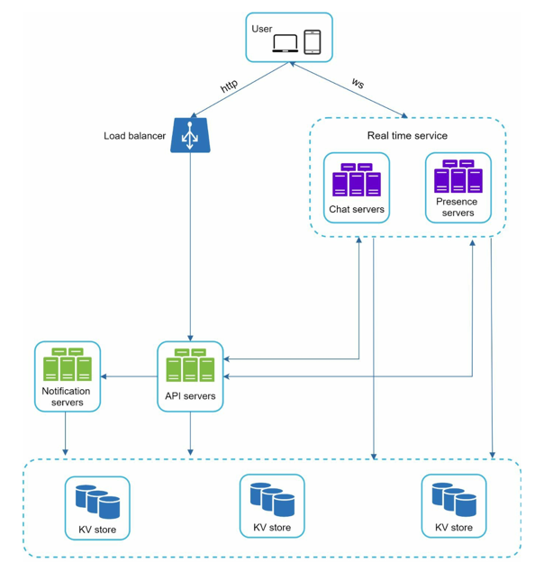

- 이때 KV store(키-값 저장소)는 채팅 이력을 보관한다.

#### 저장소
- 채팅 시스템에서는 두 가지의 유형의 데이터가 저장된다.
1. 사용자의 데이터
2. 채팅 이력
- 이때 채팅 이력의 읽기/쓰기 비율이 1:1이다.
- 이러한 특징을 고려했을 때, 키-값 저장소를 DB로 선택하는 것이 바람직하다.
  1. 수평적 규모 확장이 쉬움
  2. 데이터 접근 지연시간이 낮음
  3. 많은 채팅 서비스가 키-값 저장소를 사용 (Cassandra, HBase.. 등)

#### 데이터 모델
- 메시지 데이터를 두 가지 유형으로 저장할 수 있다.

> ##### 1:1 채팅을 위한 테이블
> - 테이블의 기본 키를 message_id로 설정한다.
> 
> ##### 그룹 채팅을 위한 테이블
> - 테이블의 기본 키를 (channel_id, message_id)의 복합 키를 사용한다.
> - `channel_id`를 통해 같은 채팅 그룹임을 명시하는 기능을 수행한다.

#### 메시지 ID
- 데이터베이스 메시지 테이블의 ID를 설정하는 것도 중요한 사항이다.
- 정렬이 가능해야하며, 시간에 따라 커지는 ID여야 한다.
- 이러한 요구조건을 만족시키는 옵션은 RDBMS의 AUTO-INCREMENT이지만, NoSQL에서는 이를 지원하지 않는다.
- 이에 snowflake와 같은 ID생성기를 통해 요구사항을 만족할 수 있다.

### 3단계. 상세 설계

#### 서비스 탐색
- 클라이언트에게 적합한 채팅 서버로 포워딩을 진행해야함
- 이때 고려되는 기준으로는 클라이언트의 위치, 서버의 용량 등이 있다.
- 아파치 주키퍼라는 오픈소스를 통해 서비스 탐색이 가능하며, API서버에서 사용자 인증을 처리하면 적합한 채팅 서버를 선택한다

#### 메세지 흐름

##### 1:1 채팅 메시지 일때 처리 흐름
- 아래 그림과 같이 메시지가 처리된다.

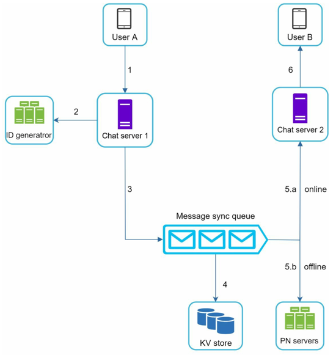

1. 사용자A가 서버1로 전송
4. 서버1은 메시지를 메시지 동기화 큐로 전송  
5.a 사용자 B가 접속중인 경우 해당 채팅 서버로 전송  
5.b 사용작 B가 접속하지 않은 경우 푸시 알림 메시지를 푸시 알림 서버로 보냄
6. 사용자 B가 접속한 채팅 서버는 사용자 B에게 전송 메시지 전송

##### 여러 단말 사이의 메시지 동기화
- 한 사용자에 대해 여러 단말이 존재할 때, 동기화하는 방식이다.

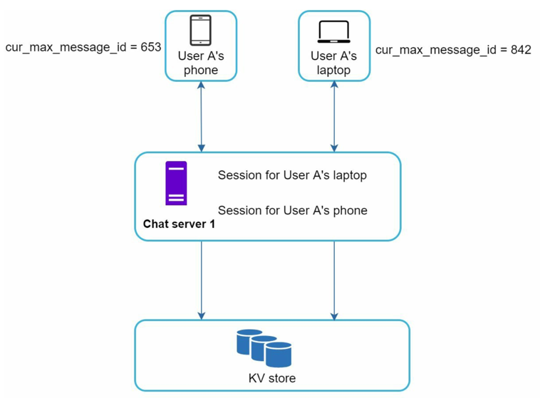

1. 각 단말은 `cur_max_message_id`라는 변수를 유지한다.
2. 이때, 수신자 ID가 현재 로그인한 사용자ID와 같고, 키-값 저장소에 보관된 메시지의 ID가 `cur_max_message_id`보다 클 때, 새 메시지로 간주한다.

##### 소규모 그룹 채팅에서의 메시지 흐름
- 1:1 채팅에 비해 복잡한 흐름을 가지고 있다.

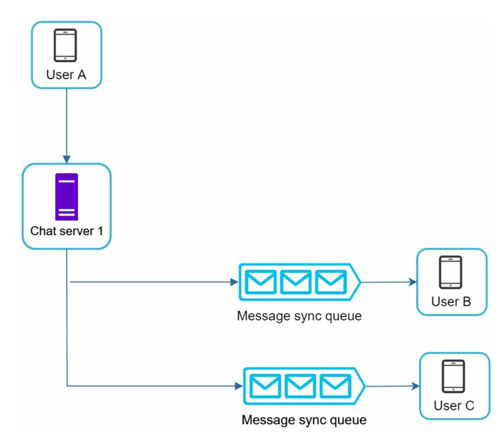

- 한 그룹에 A, B, C 세 명의 사용자가 있다고 가정하자,
- 사용자 A가 메시지를 보내면, B, C의 메시지 큐에 메시지를 복사한다.
- 그룹이 크지 않기에 수신자별로 메시지를 복사하는 것이 가능하다.
- 만약 대규모의 그룹 채팅이라면, 해당 방식은 지양해야 한다.

#### 접속상태 표시
- 접속상태 서버를 통해 사용자의 상태를 관리할 수 있다. (웹소켓 실시간 서비스의 일부)

##### 사용자 로그인
- 사용자 웹소켓 연결 시, 접속상태 서버는 A의 상태와 타임스탬프 값을 키-값 저장소에 저장한다.
- 해당 절차 후, 해당 사용자는 접속 중인 것으로 표시된다.

##### 로그아웃
- 사용자 로그아웃 시, 키-값 저장소에 저장된 사용자 상태를 OFFLINE으로 변환하여 사용자의 상태를 변경한다.

##### 접속 장애
- 다양한 사용자의 접속 환경에 의해 접속상태가 일관적인 상태를 유지하지 못하는 경우가 많다.
- 이에 클라이언트로 하여금 주기적으로 박동 이벤트를 보내 마지막 이벤트를 받은 지 X초 이내에 박동 이벤트를 받으면 해당 상태를 유지하고,
- 받지 못하면 OFFLINE으로 처리하는 로직을 사용한다.

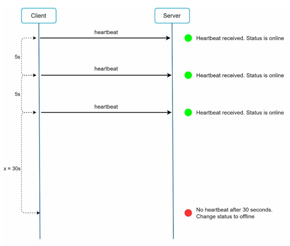

- 위 그림은 30초 동안 서버가 박동 이벤트를 받지 못해, 오프라인으로 변경되는 시나리오이다.

##### 상태 정보의 전송
- 사용자A의 상태 정보를 친구 관계의 사용자에게 전달하는 방식이 존재한다.
- 상태정보 서버는 발행-구독 모델을 사용하여 각 친구관계마다 채널을 만든다.
- 이러한 각 채널을 통해 상태정보 변화를 쉽게 전달 가능해진다.
- 이 방식은 소규모 그룹채팅에서 효율적이며,
- 그룹 하나에 100,000명의 사용자가 존재한다면, 상태변호 1건 당 100,000개의 이벤트를 발행하게 되므로 성능에 악영향을 줄 수 있다.

### 4단계. 마무리
- 위에서 서술한 방식 말고도, 고려할만한 다양한 쟁점이 존재한다.
  - 사진, 비디오 같은 미디어 파일을 지원
  - 종단 간 암호화
  - 캐시
  - 로딩 속도 개선
  - 오류 처리 : 채팅 서버 오류 처리 및 메시지 전송 실패 시 재전송 로직