# 11. 뉴스 피드 시스템 설계

## 11.1 뉴스 피드란?

- 홈페이지 중앙에 사용자의 홈 화면 중앙에 지속적으로 업데이트되는 스토리 목록
- 상태 업데이트, 사진, 비디오, 링크, 앱 활동(app activity), 친구, 페이지, 그룹의 게시물 등을 포함

## 11.2 1단계: 문제 이해 및 설계 범위 확정

- **요구사항**
    - 지원 플랫폼: **모바일 앱 + 웹 모두 지원**
    - 핵심 기능
        - 사용자는 **새 스토리를 게시**할 수 있어야 함
        - 사용자는 **친구들의 스토리를 볼 수 있어야 함**
    - 정렬 방식
        - 단순화를 위해 **시간 역순** 사용
    - 사용자 규모
        - 사용자 1명당 최대 친구 수: **5,000명**
        - DAU: **1천만 명**
    - 콘텐츠 유형
        - 이미지, 비디오 등 **미디어 파일 포함 가능**

## 11.3 2단계: 개략적 설계안 제시

뉴스 피드 시스템은 크게 **두 부분**으로 나뉜다.

- **피드 발행 (Feed Publishing)**
    - 사용자가 스토리를 포스팅하면 해당 데이터를 캐시와 데이터베이스에 기록
    - 친구들의 뉴스 피드로 전달
- **뉴스 피드 생성 (Feed Building)**
    - 사용자가 피드를 읽을 때 친구들의 포스팅을 모아 시간 역순으로 정렬하여 제공

### 11.3.1 뉴스 피드 API

- **피드 발행**
    - 새 스토리를 포스팅하기 위한 API.
    - HTTP POST 형태로 요청을 보내면 된다.
        - `POST /v1/me/feed`
    - 인자:
        - 바디(body): 포스팅 내용에 해당한다.
        - Authorization 헤더: API 호출을 인증하기 위해 사용한다.
- **피드 읽기 API**
    - 뉴스 피드를 가져오는 API
        - `GET /v1/me/feed`
    - 인자:
        - Authorization 헤더: API 호출을 인증하기 위해 사용한다.

### 11.3.2 피드 발행

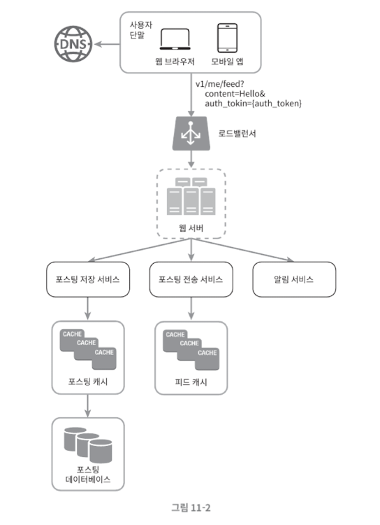

- 사용자: 모바일 앱이나 브라우저에서 새 포스팅을 올리는 주체
- 로드밸런서: 트래픽을 웹 서버들로 분산한다.
- 웹 서버: HTTP 요청을 내부 서비스로 중계하는 역할을 담당한다.
- 포스팅 저장 서비스: 새 포스팅을 데이터베이스와 캐시에 저장한다.
- 포스팅 전송 서비스: 새 포스팅을 친구의 뉴스 피드에 푸시한다. 뉴스 피드 데이터는 캐시에 보관하여 빠르게 읽어갈 수 있도록 한다.
- 알림 서비스: 친구들에게 새 포스팅이 올라왔음을 알리거나, 푸시 알림을 보내는 역할을 담당한다.

### 11.3.3 피드 생성

- 사용자: 뉴스 피드를 읽는 주체
- 로드 밸런서: 트래픽을 웹 서버들로 분산
- 웹 서버: 트래픽을 뉴스 피드 서비스로 보낸다.
- 뉴스 피드 서비스: 캐시에서 뉴스 피드를 가져오는 서비스
- 뉴스 피드 캐시: 뉴스 피드를 렌더링할 때 필요한 피드 ID를 보관한다.

## 11.4 3단계: 상세 설계

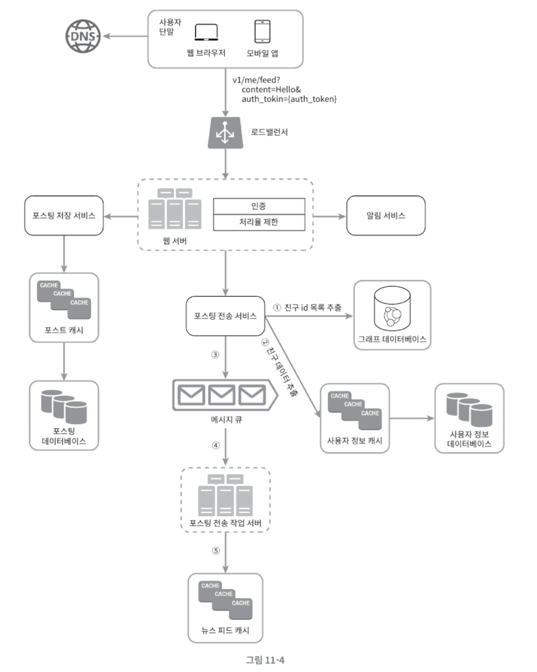

### 11.4.1 웹 서버의 역할

웹 서버는 단순 중계 역할을 넘어서 다음 기능을 수행한다.

- 클라이언트와 통신
- 인증 처리
    - Authorization 헤더에 올바른 토큰이 있는 사용자만 포스팅 가능
- 처리율 제한
    - 스팸 방지
    - 유해 콘텐츠 확산 방지
- 특정 기간 동안 한 사용자가 올릴 수 있는 포스팅 수 제한

> **보안 + 안정성 + 서비스 품질을 동시에 책임지는 계층**
> 

### 11.4.2 포스팅 전송(팬아웃) 서비스

- 팬아웃이란 한 사용자의 새 포스팅을 그 사용자와 친구 관계에 있는 모든 사용자에게 전달하는 과정
- 팬아웃에는 **두 가지 모델**이 있다.
    
    **1) 쓰기 시점 팬아웃 모델**
    
    - 포스팅을 **작성하는 시점**에 뉴스 피드를 갱신
    - 포스팅 완료 즉시 친구들의 뉴스 피드 캐시에 반영
    - 장점
        - 뉴스 피드가 실시간으로 갱신됨
        - 친구들에게 즉시 전달
        - 피드가 미리 계산되어 있어 **읽기 속도 빠름**
    - 단점
        - 친구 수가 많은 사용자의 경우:
            - 친구 목록 조회 + 모든 친구의 피드 갱신 필요
            - 처리 비용이 매우 큼 → **핫키 문제**
        - 비활성 사용자 피드까지 갱신 → 컴퓨팅 자원 낭비
    
    **2) 읽기 시점 팬아웃 모델**
    
    - 사용자가 **뉴스 피드를 읽는 시점**에 생성
    - 요청 기반(on-demand) 방식
    - 장점
        - 비활성 사용자에게 유리
        - 로그인 전까지는 컴퓨팅 자원 소모 없음
        - 친구별 푸시 작업이 없어 핫키 문제 없음
    - 단점
        - 뉴스 피드 조회 시 계산량이 많아 **지연 발생 가능**
- 본 설계안은 **두 모델을 결합**한다.
    - 대부분의 사용자: **쓰기 시점 팬아웃**
    - 친구/팔로워가 매우 많은 사용자: **읽기 시점 팬아웃**
    - **안정 해시**
        - 요청과 데이터를 균등 분산
        - 핫키 문제 완화
    - **성능과 안정성의 균형을 위한 전략적 선택**

### 11.4.3 팬아웃 서비스 동작 순서

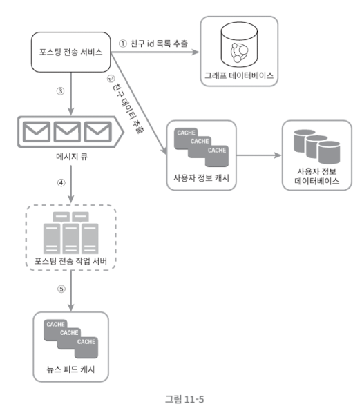

1. **그래프 데이터베이스**
    - 친구 ID 목록 조회
    - 친구 관계 및 친구 추천 관리에 적합
2. **사용자 정보 캐시**
    - 친구들의 정보 조회
    - 사용자 설정에 따라 필터링
        - 뮤트된 친구
        - 특정 사용자에게만 공개된 포스팅
3. **메시지 큐**
    - (친구 ID 목록 + 포스팅 ID)를 큐에 저장
4. **팬아웃 작업 서버**
    - 메시지 큐에서 데이터 소비
    - 뉴스 피드 캐시에 저장
        - **뉴스 피드 캐시?**
            - (post_id, user_id) 쌍만 저장
            - 전체 포스팅/사용자 정보 저장 X
            - 이유
                - 메모리 사용량 최소화
                - 대부분 사용자는 **최신 스토리만 조회**
                - 캐시 미스 확률 낮음
            - 캐시 크기 제한 및 조정 가능

### 11.4.4 피드 읽기 흐름 상세 설계

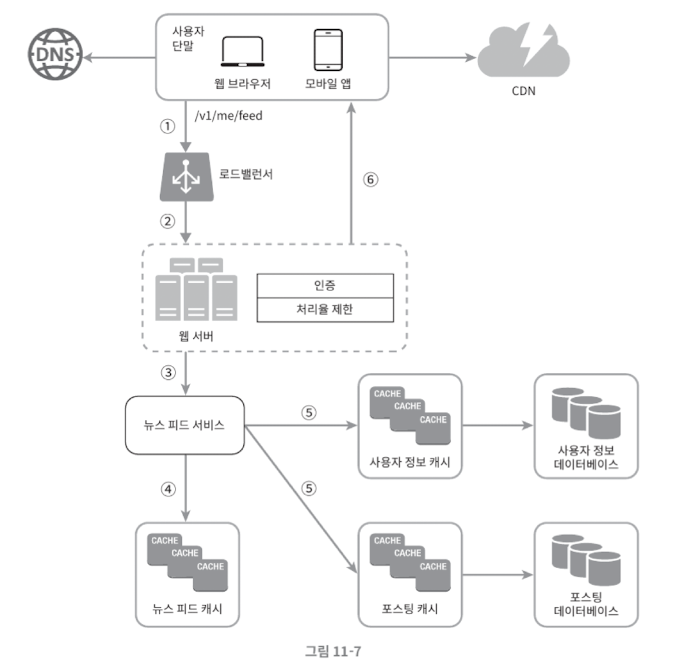

1. 클라이언트 → 뉴스 피드 읽기 요청
2. 로드 밸런서 → 웹 서버 전달
3. 웹 서버 → 뉴스 피드 서비스 호출
4. 뉴스 피드 서비스 → 뉴스 피드 캐시에서 포스팅 ID 목록 조회
5. 사용자 캐시 + 포스팅 캐시 → 사용자 이름, 사용자 사진, 포스팅 콘텐츠, 이미지 정보를 통해 완전한 뉴스 피드 만듬
6. 완성된 뉴스 피드를 JSON으로 반환 → 클라이언트가 렌더링

### 11.4.5 캐시 구조

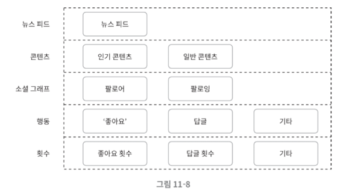

- **뉴스 피드 캐시**
    - 뉴스 피드 ID 저장
- **콘텐츠 캐시**
    - 포스팅 데이터 저장
    - 인기 콘텐츠는 별도 관리
- **소셜 그래프 캐시**
    - 팔로워 / 팔로잉 관계
- **행동 캐시**
    - 좋아요, 댓글 등 사용자 행동
- **카운터 캐시**
    - 좋아요 수
    - 댓글 수
    - 팔로워 수
    - 팔로잉 수

## 11.5 4단계: 마무리

- 뉴스 피드 시스템은 피드 발행, 피드 생성 두 부분으로 구성된다.
- 정답은 없고 요구사항, 트래픽 패턴, 사용자 특성에 따라 설계가 달라진다.
- **트레이드오프를 이해하고 왜 그 선택을 했는지 설명할 수 있는 것이 중요하다.**

# 12. 채팅 시스템 설계

## 12.1 1단계: 문제 이해 및 설계 범위 확정

- 요구사항
    - 응답 지연이 낮은 1:1 채팅
    - 최대 100명 그룹 채팅
    - 사용자 접속 상태 표시
    - 하나의 계정으로 여러 단말 동시 접속
    - 푸시 알림
    - DAU 5천만 명 처리 가능

## 12.2 2단계: 개략적 설계안 제시 및 동의 구하기

### 12.2.1 기본 구조

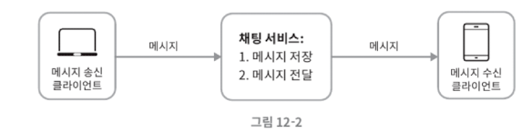

- 클라이언트는 모바일 앱 또는 웹 앱
- 클라이언트끼리는 직접 통신하지 않음
- 모든 메시지는 중앙의 채팅 서비스를 통해 전달
    - 이 구조는 보안과 확장성 측면에서 유리
- 클라이언트는 메시지를 서버로 전송하고, 서버는 해당 메시지를 적절한 수신자에게 전달하거나 저장한다.

### 12.2.2 **통신 방식 선택**

- **요청 응답 기반 통신**
    - 구현이 간단하며 안정적
    - 메시지를 서버로 보내는 동작 자체는 이 방식으로 처리 가능
    - 연결을 재사용하는 설정을 사용하면 성능도 어느 정도 확보 가능
    - 그러나 서버가 클라이언트에게 실시간으로 메시지를 전달하기에는 구조적인 한계가 있다.
- **폴링 방식**
    
    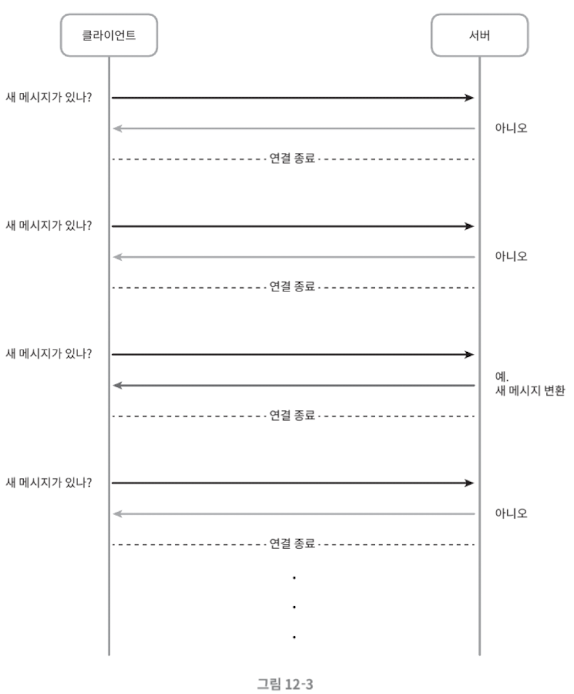
    
    - 클라이언트가 일정 주기로 서버에 새 메시지가 있는지 확인하는 구조
    - 이 방식은 이해하기 쉽지만, 메시지가 없는 경우에도 지속적인 요청이 발생해 서버 자원이 낭비된다.
- **롱 폴링 방식**
    
    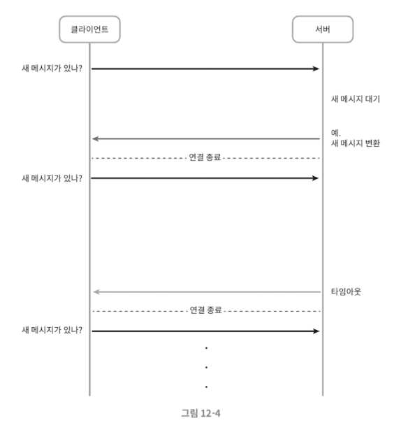
    
    - 롱 폴링은 클라이언트의 요청을 서버가 즉시 응답하지 않고, 새 메시지가 생기거나 일정 시간이 지나면 응답하는 방식
    - 폴링보다는 효율적이지만, 연결 관리가 복잡하고 서버 부하 분산 환경에서는 관리가 어렵다.
- **웹소켓 방식**
    
    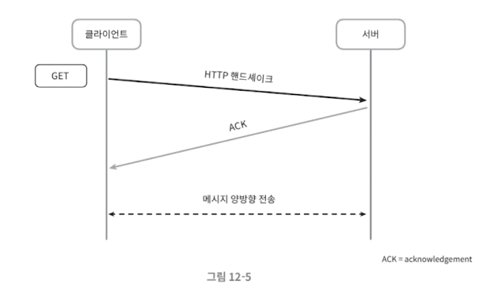
    
    연결 과정
    
    - 웹소켓은 서버와 클라이언트가 하나의 연결을 지속적으로 유지하며 양방향 통신을 할 수 있는 방식
    - 서버가 클라이언트에게 즉시 메시지를 전달할 수 있어 실시간 서비스에 적합하다.
        
        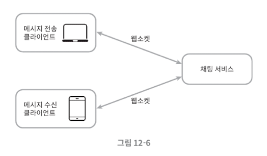
        
        메세지 전송
        

### 12.2.3 전체 아키텍처 개요

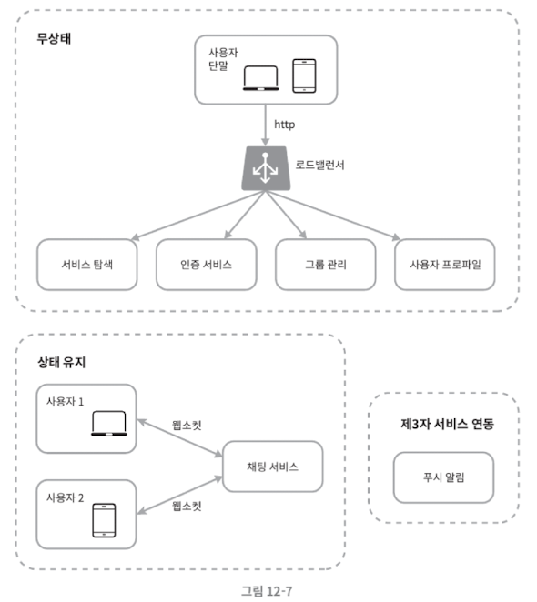

- **무상태 서비스**
    - 무상태 서비스는 로그인, 회원 관리, 사용자 프로필, 친구 목록 관리와 같은 기능을 담당한다.
    - 이 서비스들은 요청 응답 방식으로 동작하며, 서버가 클라이언트의 연결 상태를 기억하지 않는다.
    - 이러한 서비스는 부하 분산 환경에 적합하며, 필요에 따라 쉽게 확장할 수 있다.
- **상태 유지 서비스**
    - **채팅 서비스**
        - 채팅 서비스는 클라이언트와 지속적인 연결을 유지한다.
        - 각 클라이언트는 하나의 채팅 서버에 연결되며, 이 연결을 통해 메시지를 주고받는다.
        - 시스템 전체에서 상태를 유지해야 하는 핵심 서비스다.
    - **접속 상태 서비스**
        - 접속 상태 서비스는 사용자의 온라인 여부와 마지막 활동 시각을 관리한다.
        - 이 정보는 다른 사용자에게 접속 상태를 표시하는 데 사용된다.
- **외부 서비스 연동**
    - 채팅 애플리케이션에서는 푸시 알림이 중요한 역할을 한다.
    - 사용자가 애플리케이션을 실행하지 않고 있는 경우에도 새 메시지를 알릴 수 있어야 하기 때문이다.
    - 이를 위해 외부 푸시 알림 서비스와 연동한다.
- **규모 확장성**
    - 초기에는 소수의 서버로 운영할 수 있지만, 사용자가 증가함에 따라 서버 수를 점진적으로 늘릴 수 있어야 한다. 하나의 서버에 모든 연결을 집중시키는 구조는 장애에 취약하므로 피해야 한다.
    - 설계의 핵심은 처음부터 완벽한 대규모 구조를 만드는 것이 아니라, 자연스럽게 확장 가능한 구조를 만드는 것이다.

### 12.2.4 데이터 저장소 설계

- **데이터 유형 구분**
    - 사용자 정보, 설정, 친구 관계와 같은 데이터는 정합성이 중요하다.
        - 이러한 데이터는 관계형 데이터베이스에 저장한다.
    - 반면 채팅 메시지는 양이 매우 많고, 대부분 최근 데이터 위주로 조회된다.
- **채팅 메시지 데이터 특성**
    - 채팅 메시지는 하루에도 막대한 양이 생성된다.
    - 사용자는 대부분 최근 메시지만 확인하며, 오래된 메시지는 거의 조회하지 않는다.
    - 읽기와 쓰기 비율은 대체로 비슷하다.
- **저장소 선택**
    - 이러한 특성을 고려하면, 채팅 메시지는 수평 확장이 쉽고 대량 데이터를 처리하는 데 유리한 키 기반 저장소에 저장하는 것이 적합하다.

### 12.2.5 데이터 모델 설계

- **일대일 채팅 메시지**
    - 일대일 채팅 메시지는 메시지 식별자를 기준으로 저장한다.
    - 메시지 생성 시각만으로는 정확한 순서를 보장하기 어렵기 때문에, 식별자를 정렬 기준으로 사용한다.
- **그룹 채팅 메시지**
    - 그룹 채팅 메시지는 채널 식별자와 메시지 식별자를 함께 사용한다.
    - 채널 식별자는 데이터를 분산 저장하는 기준이 되며, 특정 그룹의 메시지를 효율적으로 조회할 수 있게 해준다.
- **메시지 식별자 설계**
    - 메시지 식별자는 고유해야 하며, 같은 채널 내에서는 시간 순서를 보장해야 한다.
    - 전역적으로 순서를 맞출 필요는 없으므로, 채널 단위로 순서를 보장하는 방식이 구현과 운영 측면에서 효율적이다.

## 12.3 3단계: 상세 설계

### 12.3.1 서비스 탐색

- 서비스 탐색의 목적은 클라이언트에게 가장 적합한 채팅 서버를 전달하는 것이다.
- 사용자는 채팅 서버에 직접 연결하기 전에, 어떤 서버를 사용해야 하는지 안내받는다.
- 채팅 서버를 선택할 때 고려하는 기준은 다음과 같다.
    - 클라이언트의 위치
    - 서버의 처리 용량
- 이를 위해 모든 채팅 서버는 중앙 시스템에 자신의 정보를 등록해 둔다.
- 클라이언트의 접속 요청이 들어오면, 사전에 정의된 기준에 따라 최적의 채팅 서버를 선택해 반환한다.
- 서비스 탐색 절차는 다음과 같이 진행된다.
    
    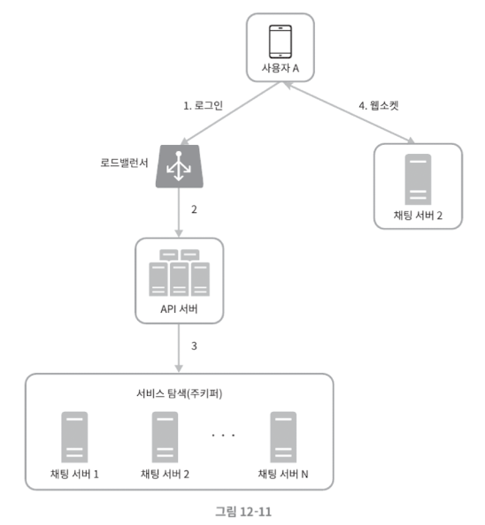
    
    1. 사용자가 시스템에 로그인을 시도한다.
    2. 로드밸런서는 로그인 요청을 API 서버 중 하나로 전달한다.
    3. API 서버는 사용자 인증을 처리한 뒤 서비스 탐색 기능을 호출한다.
    4. 해당 사용자를 담당할 최적의 채팅 서버를 선택한다.
    5. 클라이언트는 선택된 채팅 서버와 연결을 맺는다.
    6. 이 과정이 끝나면 클라이언트와 채팅 서버 사이에 실시간 연결이 생성된다.

### 12.3.2 메시지 전달 흐름

- **일대일 채팅 메시지 처리 흐름**
    
    
    
    - 사용자가 메시지를 전송하면 채팅 서버는 메시지 식별자를 생성하고 메시지를 메세지 동기화 큐로 전송한 후 키-값 저장소에 보관한다.
    - 이후 수신자가 접속 중인지 확인한 뒤, 접속 중이면 즉시 전달하고 접속 중이 아니면 저장 후 알림을 전송한다.
- **여러 단말 사이의 메시지 동기화**
    
    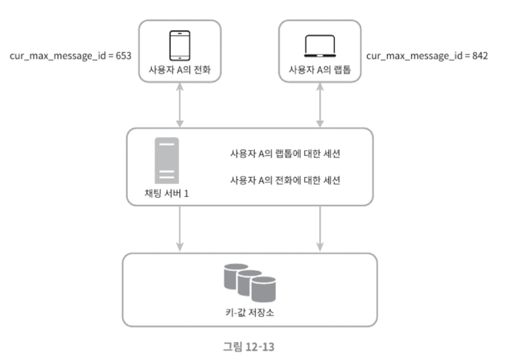
    
    - 하나의 사용자가 여러 단말을 사용할 수 있으므로, 각 단말은 마지막으로 읽은 메시지 식별자를 관리한다.
    - 각 단말은 현재까지 확인한 가장 최신 메시지의 식별자를 변수로 유지한다.
    - 새로운 메시지를 판단하는 기준은 두 가지 조건을 동시에 만족하는지 여부다.
        - 메시지의 수신자 식별자가 현재 로그인한 사용자와 일치해야 한다.
        - 저장소에 보관된 메시지의 식별자가 단말이 기억하고 있는 최신 메시지 식별자보다 커야 한다.
    - 이 방식에서는 단말마다 별도의 기준값만 관리하면 되기 때문에, 저장소에서 새 메시지를 가져오는 동기화 작업을 단순하게 구현할 수 있다.
- **소규모 그룹 채팅에서의 메시지 흐름**
    
    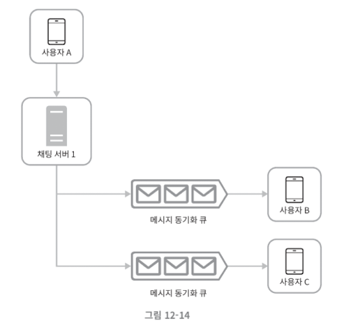
    
    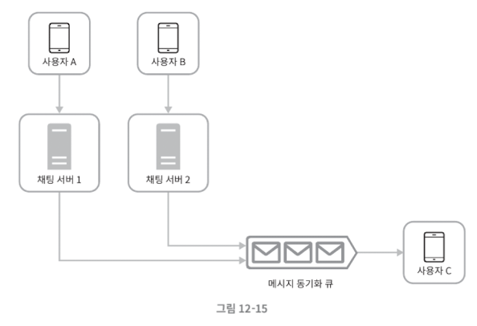
    
    - 그룹 채팅은 일대일 채팅보다 처리 흐름이 복잡하다.
    - 예를 들어 사용자 A, B, C가 참여한 그룹 채팅을 가정해 보자.
        - 사용자 A가 메시지를 보내면, 해당 메시지는 그룹에 속한 각 사용자에 대해 메시지 동기화 큐에 복사된다.
        - 이 큐는 사용자별 수신함과 같은 역할을 한다.
    - 이 접근 방식의 특징은 다음과 같다.
        - 사용자는 자신의 큐만 확인하면 되므로 흐름이 단순하다.
        - 그룹 크기가 작다면 메시지를 사용자별로 복사하는 비용이 문제가 되지 않는다.
    - 실제로 일부 메신저 서비스는 이 방식을 사용하며, 그룹 채팅 인원을 제한한다.
    - 다만 그룹 규모가 매우 커질 경우, 모든 사용자 큐에 동일한 메시지를 복사하는 방식은 비효율적일 수 있다.
    - 수신자 관점에서 보면, 한 사용자는 여러 발신자로부터 메시지를 받을 수 있어야 하므로 메시지 동기화 큐는 다중 발신자를 처리할 수 있어야 한다.

### **12.3.3 접속 상태 관리**

- 접속 상태 전용 서버를 통해 실시간 통신을 기반으로 사용자의 상태 변화를 관리한다.
- **사용자 로그인 시 접속 상태 처리**
    
    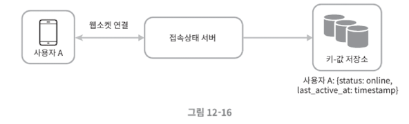
    
    - 클라이언트와 실시간 서비스 사이에 연결이 생성된다.
    - 접속 상태 서버는 사용자의 상태를 온라인으로 설정한다.
    - 마지막 활동 시각을 키 기반 저장소에 기록한다.
    - 이 과정이 끝나면 사용자 화면에는 접속 중 상태가 표시된다.
- **로그아웃 시 접속 상태 처리**
    
    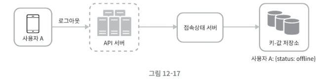
    
    - 사용자 상태를 오프라인으로 변경한다.
    - 저장소에 기록된 상태 정보도 함께 갱신한다.
    - 이에 따라 사용자 화면에서도 접속 중이 아님이 표시된다.
- **접속 장애 대응**
    
    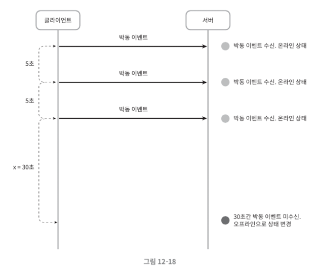
    
    - 네트워크 연결은 항상 안정적이지 않다. 일시적인 연결 끊김이 발생할 경우, 즉시 오프라인으로 표시하는 것은 바람직하지 않다. 이를 해결하기 위해 박동 검사를 사용한다.
        - 클라이언트는 주기적으로 접속 상태 서버에 신호를 보낸다.
        - 서버는 마지막 신호 수신 시점을 기준으로 상태를 판단한다.
        - 일정 시간 동안 신호가 없을 경우에만 오프라인으로 변경한다.
    - 이 방식은 불필요한 상태 변경을 줄이고 사용자 경험을 개선한다.
- **상태 정보의 전송**
    
    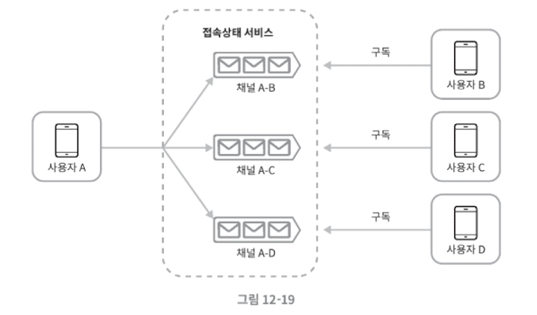
    
    - 사용자의 접속 상태 변화는 친구 관계에 있는 사용자에게 전달되어야 한다.
    - 이를 위해 접속 상태 서버는 발행과 구독 방식을 사용한다.
    - 각 사용자는 친구 관계에 따라 구독 채널을 갖고, 상태 변화가 발생하면 해당 채널을 통해 알림을 받는다.
    - 실시간 통신에는 지속 연결 방식을 사용한다.
    - 이 방식은 친구 수나 그룹 규모가 작을 때 효과적이다.
    - 규모가 커질 경우에는 상태 정보를 수동으로 갱신하도록 유도하는 방식이 더 적합할 수 있다.

## 12.4 4단계: 마무리

- **더 논의해도 좋을 내용**
    - 미디어 메시지 지원을 위한 저장 전략
    - 대용량 파일 처리 방식
    - 메시지 압축과 미리보기 생성
    - 대규모 그룹 채팅에서의 확장성 문제