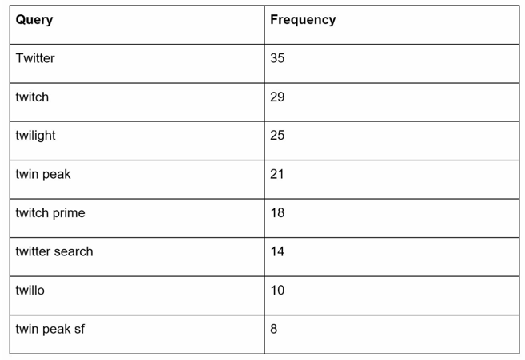
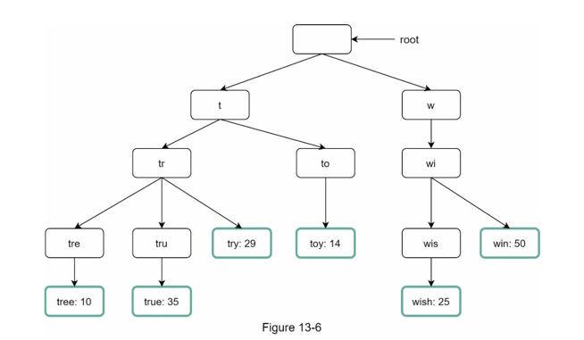
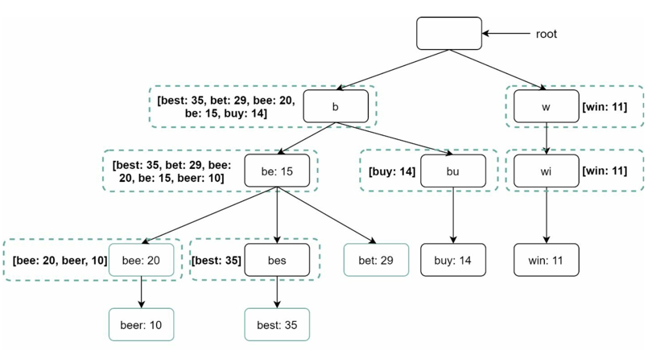
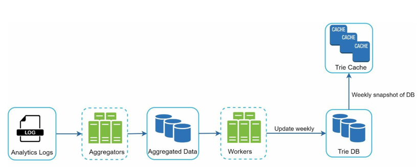
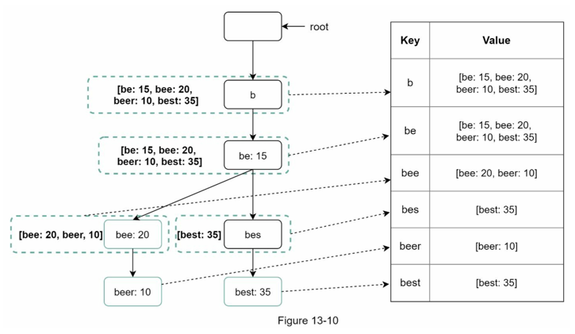
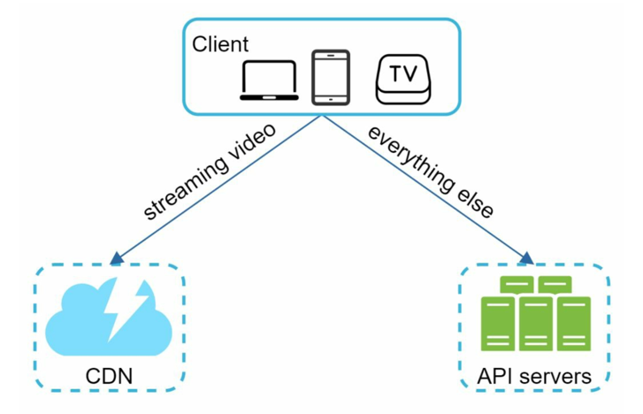
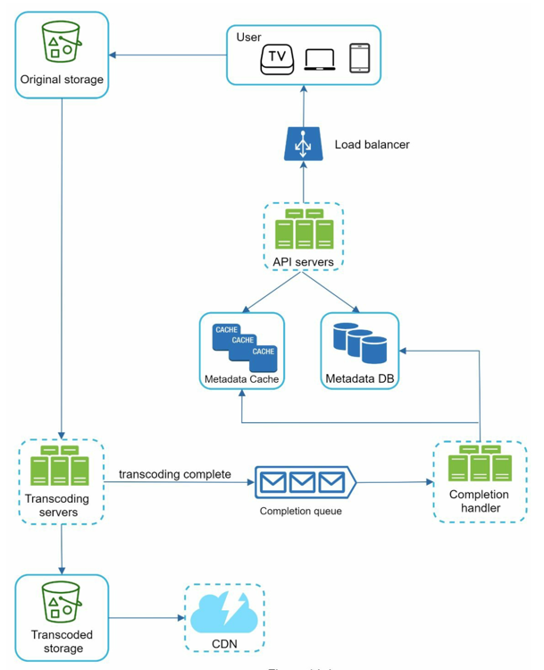
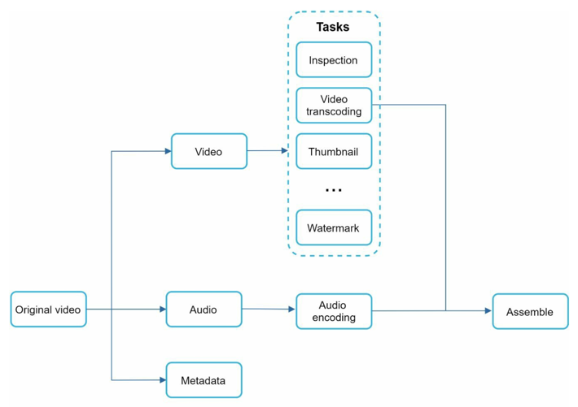
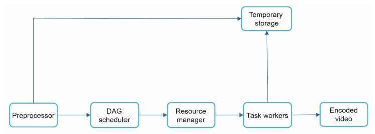
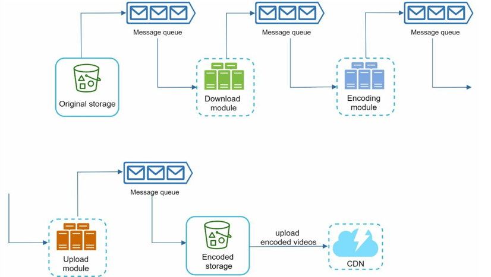

## 13. 검색어 자동완성 시스템 
- 웹사이트 검색창에 단어를 입력하면 입력 중인 글자에 맞는 연관 검색어가 표시되는 기능을 검색어 자동 완성 시스템이라고 부름
- 이러한 기능은 많은 웹 사이트에서 사용되는 기술로, 13장에서는 가장 많이 검색된 k개를 출력하는 시스템을 설계한다.

#### 요구사항
- 빠른 응답속도 : 사용자가 검색어를 입력할 때마다 그때그때 연관검색어가 표시될 수 있어야 함 (100ms(0.1s) 이내)
- 연관성 : 사용자가 입력한 단어와 연관된 것이어야 함
- 정렬 : 정렬 결과는 인기도 등의 확실한 기준이 있어야 함
- 규모 확장성 : 대량의 트래픽을 고려하여 확장 가능해야 함
- 고가용성 : 장애가 발생하거나, 예상치 못한 문제가 생겼을 때 계속 시스템은 사용 가능해야 함

#### 개략적 규모 추정
- 일간 능동 사용자 (DAU)는 천만 명으로 가정
- 한 사용자는 10건의 검색 진행
- 질의 시 평균 20바이트의 데이터를 입력
- 사용자가 `dinner`라는 단어를 입력 시, 아래와 같은 쿼리가 순차적으로 전송됨
  - `search?q=d`
  - `search?q=di`
  - `search?q=din`
  - `search?q=dinn`
  - `search?q=dinne`
  - `search?q=dinner`
- 매일 0.4GB의 신규 데이터가 저장됨

### 개략적 설계
- 자동 검색 시스템은 크게 **데이터 수집 서비스**와, **질의 서비스**로 나뉨

#### 1. 데이터 수집 서비스
- 사용자가 입력한 질의를 실시간으로 수집하는 시스템
- 질의문과, 조회빈도를 저장하는 key-value 테이블(=저장소)로 데이터를 수집
- `twitch`, `twitter`, `twitter`, `twillo`를 순차대로 검색 시, 아래와 같이 테이블이 변경됨
  

#### 2. 질의 서비스
- 사용자가 입력한 질의에 대해 상의 n개의 자동완성 데이터를 가져오는 시스템



- 위와 같은 테이블이 있을 때, 사용자가 `tw`를 입력했다고 가정하자.
```sql
SELECT * 
FROM frequency_table
WHERE query LIKE `prefix%`
ORDER BY frequency DESC
LIMIT 5
```
- 다음의 쿼리로 상의 5개의 결과를 질의할 수 있다.
- 이는 데이터의 양이 적을 때는 문제가 없지만, 대용량의 데이터 존재 시 데이터베이스 병목이 발생할 수 있으므로 좀 더 나은 시스템을 필요로 한다.


### 상세 설계
- 위에서 설계한 개략적인 아키텍처를 최적화한 방안을 서술

#### 트라이 자료구조
- 관계형 데이터베이스를 사용해 질의 서비스를 구현하는건 데이터베이스 병목이 발생
- 트라이 자료구조를 통해 문제를 해결 가능

#### 트라이 (Trie)
- 트리 형태의 자료구조
- 루트 노드는 빈 문자열을 나타냄
- 각 노드는 최대 26개의 자식 노드를 가짐 (알파벳 기준)
- 각 트리 노드는 단어 혹은 접두어를 나타냄


#### 트라이의 시간복잡도
> - `p` : 접두어의 길이
> - `n` : 트라이 안에 있는 노드 개수
> - `c` : 주어진 노드의 자식 노드 개수
- 해당 접두어를 표현하는 노드 찾기 : $O(p)$
- 해당 노드의 모든 하위 트리를 탐색 : $O(c)$
- 탐색한 노드 중 유효한 검색 문자열을 가진 노드를 정렬하여, 가장 인기 있는 검색어 k개를 찾음 : $O(c·logc)$
> 총 시간 복잡도 : $O(p) + O(c) + O(c·logc)$

- 이때 전체 노드를 다 탐색하는 경우가 발생할 수 있음
- 이를 방지하기 위해 아래와 같은 대응책이 존재

##### 1. 접두어 최대 길이 제한
- 사용자가 긴 검색어를 입력하는 일은 없으므로 최대 길이를 제한한다면, 접두어 노드를 찾는 시간 복잡도는 $O(p)$에서 $O(상숫값)$으로 설정됨

##### 2. 노드에 인기 검색어 캐시
- 각 노드에 k개의 인기 검색어를 저장해 두면 전체 트라이를 순회하지 않아 시간을 절약할 수 있음
- 하지만 각 노드마다 질의어를 저장할 공간이 필요하다는 단점도 존



#### 데이터 수집 서비스
- 지금까지의 설계안은 검색할 때마다 데이터가 수정되는 시스템이다.
- 이러한 설계는 수천만 건의 검색 요청에 따라 트라이 자료구조가 갱신되면 서비스가 느려질 수 있다.
- 즉, 한 번 트라이가 만들어지면 인기 검색어가 급격하게 바뀔 일은 없기에 자주 갱신하지 않는 시스템 설계가 필요함


- 위 다이어그램처럼 사용자가 질의한 문자열을 로그로 취합한 후, 이를 매주 한 번씩 트라이 자료구조에 업데이트하는 방식을 설계할 수 있다.
- 이러한 설계는 트라이 자료구조의 수정을 최소로 하고 서비스의 성능을 높일 수 있음

##### 트라이 데이터베이스
- 트라이 자료구조를 저장할 데이터베이스로 두 가지의 선택지가 있다.
1. 문서 저장소 : 매주 트라이가 갱신되므로, 트라이를 직렬화하여 데이터베이스에 저장하는 방식이 있다.
    - 사용할 수 있는 데이터베이스로 NoSQL인 MongoDB가 있다.
2. 키-값 저장소 : 트라이 자료구조는 테이블 형태로 변환할 수 있다.
   - 이에 트라이 각 노드의 접두어를 해시 테이블 키로 변환하고, 노드에 보관된 모든 데이터를 값으로 변환한다.
   - 


#### 질의 서비스
- 개략적 설계안에서 설계한 질의 서비스는 데이터베이스 쿼리를 통해 결과를 가져온다.
- 이는 데이터베이스 병목이 발생할 수 있으므로 아래와 같은 개선안이 있다.
1. 캐시 사용
2. AJAX 요청 : 페이지를 새로고침 하지 않는 요청
3. 브라우저 캐싱 : 한 번 요청을 보내면 해당 요청의 최근 검색어는 일정 시간동안 유지됨
4. 데이터 샘플링 : N개의 데이터 중 1개만 로깅처리

#### 저장소 규모 확장
- 시스템이 거대해져 트라이의 크기가 한 서버에 넣기에 너무 큰 경우가 발생할 수 있다
- 이에 데이터베이스를 샤딩하여 데이터베이스 규모를 확장할 수 있다.
- 하지만 샤딩된 데이터베이스 중 한 쪽에만 질의가 몰려서는 안되므로 이를 고려하여 적절한 데이터의 배치가 필요하다.

### 마무리 (추가로 고려할 수 있는 요구사항)
- 언어의 다중화 -> 트라이에 유니코드 데이터를 저장할 수 있도록 하기
- 국가별 인기 검색어 순위 -> 국가별 다른 트라이 사용
- 실시간으로 변하는 검색어 반영

---

## 14. 유튜브 설계
- 14장에서는 비디오 플랫폼 시스템을 설계한다.
- 빠른 비디오 업로드
- 원활한 비디오 재생
- 재생 품질 선택
- 낮은 인프라 비용
- 높은 가용성 · 규모 확장성 · 안정성
- 모바일, 앱, 웹 등 지원

### 개략적 규모 추정
- 일간 능동 사용자(DAU) : 5백만
- 사용자 한 명당 5개의 비디오 시청
- CDN비용 : 매일 $150,000

### 개략적 설계안
- 비디오 플랫폼 서비스를 위해 CDN과, BLOB저장소를 활용할 수 있다.
- CDN은 클라우드 서비스를 활용할 수 있지만
- BLOB저장소는 모든 것을 처음부터 만들어야 한다
- 즉, 비디오 스트리밍 서비스를 CDN을 통해 제공하는 것이 적절한 설계안이다.


- 비디오는 CDN에 저장, 재생버튼을 누르면 CDN에서 스트리밍됨
- 나머지 요청은 API서버 처리 (피드 추천, 비디오 업로드 URL 생성, 데이터베이스·캐시 갱신 등)

#### 비디오 업로드 절차


- 위 과정에서 두 가지의 프로세스가 동시에 처리됨
1. 비디오 업로드 (트랜스코딩 서버)
2. 비디오 메타데이터 갱신 (API 서버)

> #### 비디오 업로드
> - 트랜스코딩(비디오 인코딩)을 하는 이유? : 단말이나 대역폭 요구사항에 맞는 비디오 스트림을 제공하기 위함
> 1. 비디오를 원본 저장소에 저장
> 2. 트랜스코딩 서버는 해당 비디오를 가져와 트랜스 코딩 진행
> 3. 트랜스코딩이 완료되면, 아래 두 절차가 동시에 실행 <br>
>    3a. 완료된 비디오를 트랜스코딩 비디오 저장소에 저장 <br>
>    3b. 트랜스코딩 완료 이벤트를 이벤트 큐에 넣음 <br>
>       3b.1 트랜스코딩 비디오 저장소에서 CDN으로 비디오 업로드 <br>
>       3b.2 완료 큐에서 완료 이벤트를 꺼내 비디오의 메타데이터를 DB와 캐시에 저장 (갱신)
> 4. API서버가 클라이언트에게 비디오가 업로드 되었다고 알림

> #### 메타데이터 갱신
> - 비디오가 업로드되는 동안, 클라이언트는 비디오 메타데이터 갱신 요청을 API서버에 요청


#### 비디오 스트리밍 절차
- 비디오 실행 버튼을 누르면 스트리밍이 시작됨
- 스트리밍은 비디오가 지속적으로 스트림을 전송받아 영상을 재생하는 것
  - 데이터를 저장하지 않고 전송받는 즉시 실행함
- **스트리밍 프로토콜** : 스트리밍을 처리하기 위한 프로토콜
  - `MPEG-DASH`, `HLS`, `HDS` 등이 존재
  - 모두 HTTP기반의 프로토콜

### 상세 설계
- 상세 설계에서는 **비디오 업로드**, **비디오 스트리밍**부분을 최적화하는 방안 설명

#### 비디오 트랜스코딩
- 비디오의 포맷과, 비트레이트에 따라 영상의 크기의 큰 편차를 보임
- 여러 단말에서 비디오를 실행하기 위해, 하나의 비디오를 여러 개의 포맷으로 인코딩(트랜스코딩)하는 작업이 필수
- 끊임없는 비디오 전송을 위해서는 저화질·고화질을 아우르는 비디오가 필요
- 사용자의 네트워크 환경에 따라 자동으로 화질을 변경하는 것이 바람직함

#### 유향 비순환 그래프 (DAG) 모델
- 사용자의 다양한 요구조건과 병렬성을 갖추기 위해, 유향 비순환 그래프를 도입할 수 있다.

- 위와 같이 비디오 트랜스코딩에 대해 순차적으로 처리되는 작업을 설계한 DAG모델이 있다.


#### 비디오 트랜스코딩 아키텍처

- 비디오를 인코딩하는 아키텍처이다.
- 5가지의 컴포넌트가 존재한다.

> #### 1. 전처리기
> - 비디오를 GOP로 분할
> - 사용자의 요구사항에 따라 필요한 DAG 과정을 만듦
> - 데이터 캐시 : 인코딩이 실패할 경우를 대비해 임시 저장소에 저장한다.
>
> #### 2. DAG 스케줄러
> - DAG 그래프를 단계별로 분할하여 자원 관리자의 작업 큐에 넣음
> 
> #### 3. 자원 관리자
> - 자원 배분을 효율적으로 수행한다.
> - 작업 큐, 작업 서버 큐, 실행 큐 3개의 작업에 대해 최적의 작업/서버를 골라 효율적으로 작업을 처리할 수 있도록 한다.


#### 시스템 최적화
- 위에서 설계한 시스템을 최적화하는 방안이 존재한다.
- 속도, 안전성, 비용 측면에서의 최적화를 살펴볼 수 있다.

##### 속도 최적화
1. 비디오 병렬 업로드
- 비디오를 한 번의 연결로 올리는 것은 시간이 오래 걸림
- 이에 GOP단위로 분할하여 병렬적으로 업로드하면 업로드의 속도가 빨라짐

2. CDN을 사용자 근처에 위치
- 사용자와 가까운 CDN에서 비디오를 스트리밍할 수 있도록 다양한 지역의 CDN을 사용

3. 절차를 병렬화
- 컴포넌트 간의 느슨한 결합을 통해 병렬성을 높일 수 있음
- 시스템 간 결합도를 낮추기 위해 컴포넌트 간의 메시지 큐 도입

- 각각의 컴포넌트들은 이전의 컴포넌트에서 작업이 끝날 때까지 기다릴 필요 없이 각자 할당된 메시지 큐의 작업을 받아 수행한다.

##### 안전성 최적화
1. 미리 사인된 업로드 URL (pre-signed URL)
- 허가받은 사용자만이 미디어를 업로드할 수 있도록 하는 방법
  1. 사용자는 API서버에서 인증을 받고 검증 완료된 URL을 응답을 받음
  2. 사용자는 해당 URL에 요청을 보내 미디어를 업로드할 수 있음
- 이를 통해 무분별한 비디오의 업로드를 막을 수 있음

2. 비디오 보호
- 비디오의 저작권을 지키기 위한 방식 존재
  1. 디지털 저작권 관리
  2. AES 암호화
  3. 워터마크

##### 비용 최적화
- 모든 비디오를 CDN을 통해 서빙하면 CDN의 비용을 감당하기 힘듬
- 이에 인기있는 비디오만 CDN에서 처리, 사용되지 않는 비디오는 일반 비디오 서버에서 가져올 수 있도록 함
- 더 정교한 최적화를 위해 콘텐츠 인기도 · 이용 패턴 등을 분석하여 유의미한 비용 절감을 달성할 수 있다.


#### 오류 처리
- 비디오 스트리밍 서비스에서 발생할 수 있는 오류와 오류 처리방안은 다음과 같다.
  - 업로드 오류 : 몇 회 재시도
  - 비디오 분할 (GOP) 오류 : 전체 비디오를 서버로 전송 후 서버에서 분할
  - 트랜스코딩 오류 : 재시도
  - 전처리 오류 : DAG 그래프를 재생성
  - DAG 스케줄러 오류 : 작업을 다시 스케줄링

### 마무리 (추가로 고려할 수 있는 요구사항)
- API계층 · 데이터베이스 계층의 규모 확장성 확보
- 라이브 스트리밍 지원 (UDP 사용?)
- 비디오 삭제
 
