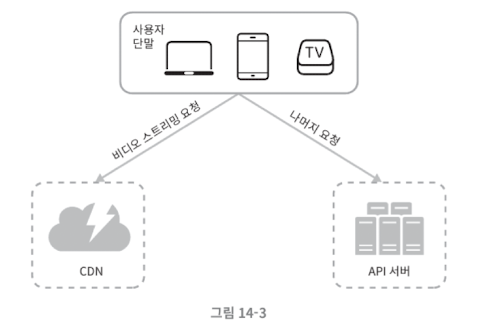
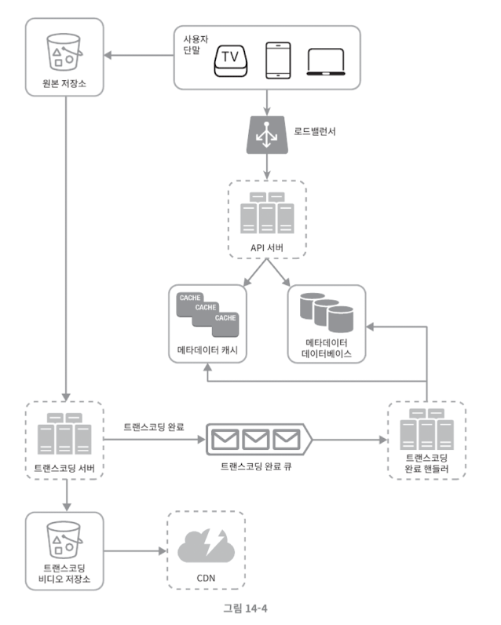
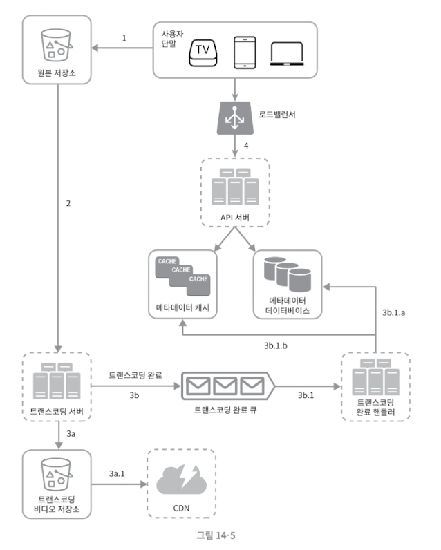

# 검색어 자동 완성 시스템

## 1단계: 문제 이해 및 설계 범위 확정

### **요구사항**

- **빠른 응답 속도:** 시스템 응답 속도는 100밀리초 이내여야 함.
- **연관성:** 자동완성 키워드는 입력한 단어와 연관되어야 함.
- **정렬:** 인기도 등의 순위 모델에 의해 정렬되어야 함.
- **규모 확장성:** 많은 트래픽을 감당할 수 있도록 확장 가능해야 함.
- **고가용성:** 시스템 일부 장애에도 계속 사용 가능해야 함.

### **개략적 규모 추정**

- **DAU:** 천만명
- **평균 검색 횟수:** 인당 매일 10건.
- **데이터 입력:** 1회 검색당 평균 20바이트 데이터 입력(질의당 평균 20회 요청 발생).
- QPS(초당 질의 수): 약 24,000건 (10,000,000 x 10 질의/일 x 20자/24시간/3600초)
- 최대 QPS: 약 48,000건
- 신규 데이터: 매일 약 0.4GB(10,000,000 x 10 x 20 x 20%)

## 2단계: 개략적 설계안 제시 및 동의 구하기

### 데이터 수집 서비스

- 사용자가 입력한 질의를 실시간으로 수집하는 시스템
- 데이터가 많은 애플리케이션에 실시간 시스템은 바람직하지 않지만, 초안으로는 괜찮음.

### 질의 서비스

- 주어진 질의에 5개의 인기 검색어를 정렬해 내놓는 서비스

### 빈도 테이블

- 초기에는 질의문과 사용 빈도를 저장하는 빈도 테이블을 사용
- 예시
    - `SELECT * FROM frequency_table WHERE query LIKE 'prefix%' ORDER BY frequency DESC LIMIT 5`
- 데이터 양이 적을 때는 괜찮으나, 많아지면 데이터베이스가 병목이 될 수 있음

## 3단계: 상세 설계

### **트라이(Trie) 자료구조**

- 트라이는 문자열을 꺼내는 데 효율적인 트리 형태의 자료구조
- **기본 알고리즘**
    1. 해당 접두어를 표현하는 노드를 찾음 (O(p), p는 접두어 길이)
    2. 해당 노드 하위 트리를 탐색하여 모든 유효 노드를 찾음 (O(c), c는 자식 노드 개수).
    3. 유효 노드를 정렬하여 인기 검색어 k개를 찾음 (O(c log c))

### **최적화 방안**

- **접두어 최대 길이 제한:** 검색어의 최대 길이를 제한하여 O(p)를 O(1)로 단축.
- **노드에 인기 검색어 캐시:** 각 노드에 인기 검색어 k개를 미리 저장하여 전체 트리를 탐색하는 일을 방지 (O(1)).

### **데이터 수집 서비스**

- 사용자가 타이핑할 때마다 트라이를 갱신하는 것은 실용적이지 않음
- **데이터 분석 서비스 로그:** 원본 데이터를 보관 (수정 X, 인덱스 X).
- **로그 취합 서버:** 로그를 잘 취합하여 주기적으로 처리.
- **작업 서버:** 주기적으로 비동기적 작업을 실행하여 트라이 자료구조를 만들고 트라이 데이터베이스에 저장.
- **트라이 캐시:** 분산 캐시 시스템으로 읽기 성능 높임.
- **트라이 데이터베이스:** 새 트라이를 매주 만들므로 문저 저장소나 키-값 저장소활용 가능.

### **질의 서비스**

1. 검색 질의가 로드밸런서로 전송됨
2. 로드밸런서는 해당 질의를 API 서버로 보냄
3. API 서버는 트라이 캐시에서 데이터를 가져와 응답 구성
4. 캐시 미스 시 데이터베이스에서 가져와 캐시를 채움

### **추가 최적화**

- **AJAX 요청:** 페이지 새로고침 없이 자동완성 목록을 가져옴
- **브라우저 캐싱:** `cache-control: private, max-age=3600` 등을 통해 제안 결과 보관
- **데이터 샘플링:** 모든 질의를 로깅하지 않고 N개 요청 중 1개만 로깅하여 자원 절약

### **트라이 갱신**

- 매주 한 번 갱신: 새로운 트라이를 만든 후 기존 트라이와 교체
- 개별 노드 갱신: 성능이 좋지 않으나 트라이가 작을 때 고려 가능

### **검색어 삭제**

- 혐오성, 폭력적 질의 등은 필터 계층을 두어 부적절한 질의가 반환되지 않도록 처리

### **저장소 규모 확장 (Sharding)**

- 첫 글자 기준으로 샤딩
    - `a`부터 `m`까지는 1번 서버, 나머지는 2번 서버
- 문제점
    - 데이터가 균등하게 배분되지 않음(예: `c`로 시작하는 단어가 많음)
- 해결
    - 샤드 관리자가 과거 데이터 패턴을 분석하여 어떤 검색어가 어느 샤드에 저장될지 관리

## 4단계: 마무리

### **다국어 지원**

- 유니코드 데이터를 저장하여 처리

### **국가별 인기 순위**

- 국가별로 다른 트라이를 사용하고 CDN에 저장하여 응답 속도 개선

### **실시간 검색어 추이 반영**

- 현재 설계는 주기적 갱신이므로 실시간 트렌드 반영에는 부적합
- 샤딩을 통해 작업 대상 데이터 양을 줄이거나, 스트림 프로세싱 시스템이 필요

# 유튜브 설계

## 1단계: 문제 이해 및 설계 범위 확정

### 설계 초점

- 빠른 비디오 업로드
- 원활한 비디오 재생
- 재생 품질 선택 기능
- 낮은 인프라 비용
- 높은 가용성과 규모 확장성, 안정성
- 지원 클라이언트: 모바일 앱, 웹 브라우저, 스마트 TV

### 개략적 규모 추정

- **일간 능동 사용자(DAU)**: 5백만
- **사용자 행태**: 한 사용자는 하루에 평균 5개의 비디오 시청
- **업로드 비중**: 10%의 사용자가 하루에 1비디오 업로드
- **저장 용량**: 비디오 평균 크기는 300MB. 매일 새로 요구되는 저장 용량 = 5백만 x 10% x 300MB = 150TB
- **CDN 비용**: 아마존 클라우드프론트를 기준, 100% 트래픽이 미국에서 발생한다고 가정하면 1GB당 $0.02의 요금 발생. 매일 발생하는 요금은 5백만 x 5비디오 x 0.3GB x $0.02 = $150,000

## 2단계: 개략적 설계안 제시 및 동의 구하기

### 시스템 구성 요소

- **단말:** 컴퓨터, 모바일 폰, 스마트 TV를 통해서 유튜브 시청 가능
- **CDN:** 비디오는 CDN에 저장함. 재생 버튼을 누르면 CDN으로부터 스트리밍이 이루어짐.
- **API 서버**: 비디오 스트리밍을 제외한 모든 요청(피드 추천, 업로드 URL 생성, 메타데이터 갱신 등)을 처리

### 비디오 업로드 절차 컴포넌트 구성

- **사용자**: 단말을 통해 유튜브를 시청하는 이용자.
- **로드밸런서**: API 서버 각각으로 고르게 요청을 분산하는 역할을 담당함
- **메타데이터 데이터베이스**: 비디오의 메타데이터를 보관함. 샤딩과 다중화를 적용하여 성능 및 가용성을 충족
- **메타데이터 캐시**: 성능을 높이기 위해 비디오 메타데이터와 사용자 객체를 캐시
- **원본 저장소**: 원본 비디오를 보관할 대형 이진 파일 저장소(BLOB) 시스템
- **트랜스코딩 서버**: 비디오 인코딩이라고도 하며, 비디오 포맷을 변환하여 단말이나 대역폭 요구사항에 맞는 최적의 스트림을 제공
- **트랜스코딩 비디오 저장소**: 트랜스코딩이 완료된 비디오를 저장하는 BLOB 저장소
- **CDN**: 비디오를 캐시하는 역할을 담당하며 스트리밍이 여기서 이루어짐
- **트랜스코딩 완료 큐**: 비디오 트랜스코딩 완료 이벤트들을 보관할 메시지 큐
- **트랜스코딩 완료 핸들러**: 완료 큐에서 이벤트 데이터를 꺼내 메타데이터 캐시와 DB를 갱신할 작업 서버들

### 비디오 업로드의 두 프로세스 (병렬 수행)

- **프로세스 a: 비디오 업로드**
1. 비디오를 원본 저장소에 업로드함
2. 트랜스코딩 서버는 원본 저장소에서 비디오를 가져와 트랜스코딩을 시작함
3. 완료되면 다음 절차가 병렬로 수행
    
    3a. 완료된 비디오를 트랜스코딩 저장소로 업로드 및 CDN에 올림
    
    3b. 트랜스코딩 완료 이벤트를 완료 큐에 넣고, 핸들러가 메타데이터 DB와 캐시를 갱신
    
4. API 서버가 단말에게 업로드 완료 및 스트리밍 준비 완료를 알린다.
- **프로세스 b: 메타데이터 갱신**
- 원본 저장소에 파일이 업로드되는 동안, 단말은 병렬로 비디오 메타데이터(이름, 크기, 포맷 등) 갱신 요청을 API 서버에 보냄
- API 서버는 이 정보로 메타데이터 캐시와 데이터베이스를 업데이트

### 비디오 스트리밍 절차

- 스트리밍은 비디오 다운로드가 완료되어야 영상을 볼 수 있는 불편함 없이, 원격지로부터 지속적으로 스트림을 전송받아 영상을 재생하는 것을 말함.
- 비디오는 CDN에서 바로 스트리밍되며, 사용자 단말에 가장 가까운 에지 서버가 전송을 담당하여 지연시간이 아주 낮음

## 3단계: 상세 설계

### 비디오 트랜스코딩

- **저장 공간 절약:** 가공되지 않은 원본 비디오는 저장 공간을 많이 차지합니다.
- **호환성:** 상당수의 단말과 브라우저는 특정 종류의 비디오 포맷만 지원하므로 여러 포맷으로 인코딩해 두는 것이 바람직
- **사용자 경험:** 네트워크 대역폭에 따라 고화질 또는 저화질 비디오를 끊김 없이 보내주어야 함
- **네트워크 상황 대응:** 모바일 단말의 수시로 변하는 네트워크 상황에 맞게 화질을 자동/수동으로 변경할 수 있어야 함

### 유항 비순환 그래프(DAG) 모델

- **검사:** 좋은 품질의 비디오인지, 손상은 없는지 확인
- **비디오 인코딩:** 다양한 해상도, 코덱, 비트레이트 조합으로 인코딩
- **썸네일:** 사용자가 업로드한 이미지나 비디오에서 자동 추출된 이미지로 만듬
- **워터마크:** 비디오에 대한 식별정보를 이미지 위에 오버레이 형태로 띄워 표시

### 비디오 트랜스코딩 아키텍처

- **전처리기:** 비디오 분할(GOP 단위), DAG 생성, 데이터 캐싱(GOP와 메타데이터 임시 저장)을 담당
- **DAG 스케줄러:** DAG 그래프를 몇 개 단계로 분할하여 자원 관리자의 작업 큐에 집어넣음
- **자원 관리자:** 작업 큐(우선순위 큐), 작업 서버 큐, 실행 큐 및 작업 스케줄러를 통해 자원 배분을 담당
- **작업 서버:** DAG에 정의된 작업(인코딩, 썸네일 등)을 실제로 수행
- **임시 저장소:** 비디오/오디오 데이터는 BLOB 저장소에, 메타데이터는 메모리에 캐시하여 사용하며 프로세싱 완료 후 삭제

### 시스템 최적화

- **속도 최적화: 비디오 병렬 업로드**
    - 비디오 전부를 한 번에 올리는 대신 GOP들로 분할하여 병렬로 업로드
- **속도 최적화: 업로드 센터 지정**
    - 사용자와 가까운 지역의 업로드 센터(본 설계에서는 CDN)를 이용
- **속도 최적화: 모든 절차 병렬화**
    - 메시지 큐를 도입하여 다운로드 모듈과 인코딩 모듈 간의 결합도를 낮추고 병렬 처리를 가능하게 함
- **안전성 최적화: 미리 사인된 업로드 URL**
    - 허가받은 사용자만이 비디오를 업로드할 수 있도록 pre-signed URL을 이용
- **안전성 최적화: 비디오 보호**
    - DRM 도입, AES 암호화, 워터마크 등을 통해 저작권을 보호
- **비용 최적화**
    - 인기 비디오는 CDN을 통해, 나머지는 비디오 서버를 통해 재생하는 롱테일 전략을 사용하며, 인기 없는 비디오는 인코딩을 생략하거나 특정 지역에만 배치하여 비용을 낮춤

### 3. 오류 처리

- **회복 가능 오류:** 특정 세그먼트 트랜스코딩 실패 등은 몇 번 재시도하여 해결
- **회복 불가능 오류:** 비디오 포맷 오류 등은 해당 비디오 작업을 중단하고 클라이언트에게 오류 코드를 반환
- **컴포넌트별 대응:** API 서버(무상태성), 메타데이터 캐시/DB(다중화), 전처리기(DAG 재생성), 자원 관리자(사본 이용) 등 각 장애 상황에 맞는 해결 방법을 적용

## 4단계 마무리

- **API 계층의 규모 확장성**
    - API 서버는 무상태 서버이므로 수평적 규모 확장이 가능함을 언급
- **데이터베이스 계층의 규모 확장성**
    - 데이터베이스의 다중화와 샤딩 방법에 대해 이야기
- **라이브 스트리밍**
    - 본 설계와 비슷하지만 응답 지연이 더 낮아야 하며 스트리밍 프로토콜 선정에 유의해야 함.
    - 병렬화 필요성은 상대적으로 떨어짐
- **비디오 삭제**
    - 저작권 위반이나 부적절한 비디오는 업로드 과정 혹은 사용자 신고를 통해 판별하고 내림