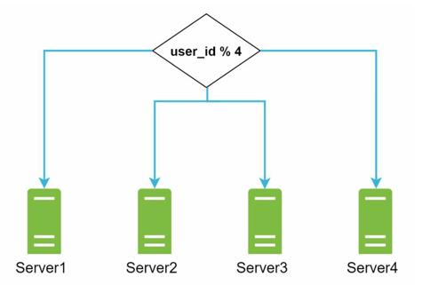
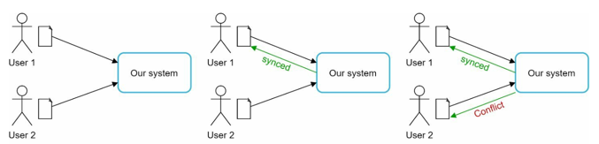
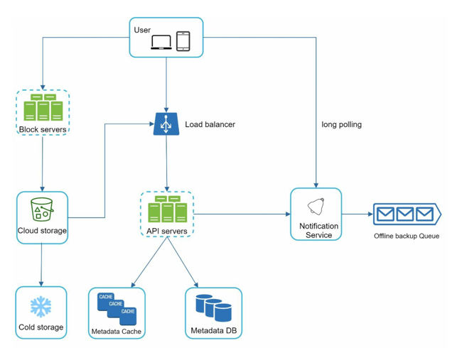
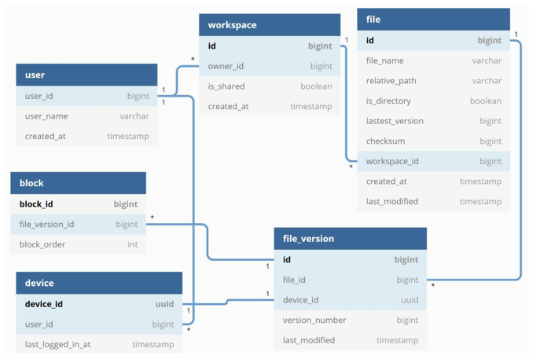
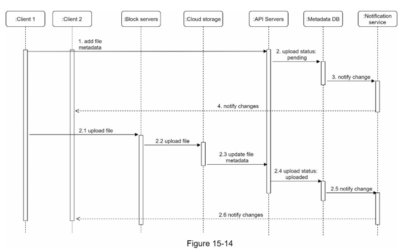
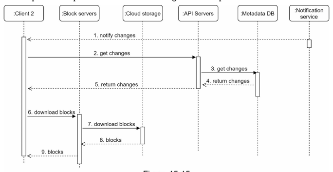

# 15.구글 드라이브 설계
- 파일 저장 및 동기화 서비스
- 문서 · 사진 · 비디오 · 기타 파일을 클라우드에 보관
- 해당 파일들은 어떤 단말에서도 사용 가능해야함

## 1단계 : 문제 이해 및 설계 범위 확정
#### 기능적 요구사항
- 파일 추가 및 다운도르
- 여러 단말에 파일 동기화
- 파일 갱신 이력 조회
- 파일 공유
- 파일 수정 시 알림 표시

#### 비기능적 요구사항
- 안정성
- 빠른 동기화 속도
- 네트워크 대역폭
- 규모 확장성
- 높은 가용성


## 2단계 : 개략적 설계안

### 파일 업로드 API
- `단순 업로드`, `이어 올리기` 두 가지 종류의 업로드를 지원해야 함
#### 단순 업로드
- 파일 크기가 작을 때 사용
#### 이어 올리기 
- 파일 사이즈가 크고 네트워크 문제로 업로드가 중단될 가능성이 높을 때 사용
- 예 : `/files/upload?uploadType=resumable`
- 인자
  - uploadType=resumable
  - data : 업로드할 로컬 파일
1. 이어 올리기 URL을 받기 위한 최초 요청
2. 데이터를 업로드하고 업로드 상태 모니터
3. 업로드 장애가 발생하면 장애 발생 시점부터 업로드 시작

### 파일 다운로드 API
- 예 : `/files/download`
- 인자
  - path : 다운로드할 파일의 경로
  - ```json
    {
      "path" : "/recipes/soup/best_soup.txt"
    }
    ```

### 파일 갱신 히스토리 API
- 예 : `/files/list_revisions`
- 인자
    - path : 갱신 히스토리를 가져올 파일의 경로
    - limit : 히스토리 길이의 최대치
    - ```json
      {
      "path" : "/recipes/soup/best_soup.txt",
      "limit" : 20
      }
      ```


### 한 대 서버의 제약 극복
- 서비스가 계속 사용되면, 언젠가는 파일 시스템이 꽉 차게 됨
- 이에 데이터를 샤딩하여 여러 서버에 나누어 저장하는 방법을 선택할 수 있음


<br>

- 이렇게 파일들을 여러 서버에 나누어 저장하는 방법 말고, AWS의 S3 버킷을 사용하는 방식도 존재
- AWS S3 버킷을 통해, 규모 확장성 · 가용성 · 보안 성능을 제공받을 수 있음
- 또한, 여러 지역에 걸친 다중화를 통해, 데이터 손실을 막고 가용성을 최대한 보장할 수 있음

<br>

- 이후 아래와 같은 컴포넌트를 추가하여 서비스를 완성함
- 로드밸런서 : 네트워크 트래픽을 분산하기 위한 컴포넌트
  - 트래픽을 고르게 분산하고, 특정 웹 서버에 문제가 발생하면 해당 서버를 자동으로 우회함
- 웹 서버
  - 로드밸런서를 추가하면, 더 쉽게 웹 서버를 등록할 수 있음
- 메타데이터 데이터베이스 : 데이터베잇를 파일 저장 서버와 분리하여 SPOF를 회피할 수 있음
  - 다중화, 샤딩 정책을 통해 가용성 · 규모 확장성을 지킬 수 있음

### 동기화 충돌
- 구글 드라이브에서, 두 명 이상의 사용자가 같은 파일을 동시에 업데이트하는 경우가 발생함
- 이때 발생하는 충돌을 해소할 수 있어야 함



- 먼저 처리되는 변경을 성공한 것으로 보고, 나중에 처리되는 변경에 대해 충돌이 발생한 것으로 표시하는 전략
- 즉, 두 가지 버전의 파일이 존재하게 됨
  1. 먼저 처리된, 정상적인 파일
  2. 나중에 처리된, conflict이 발생하는 파일
- 이를 어떻게 해결할지는 동기화 문제를 해결하는데 좋은 실마리가 됨
  - ref : [Differential Synchronization](https://neil.fraser.name/writing/sync/)


### 개략적 설계안


- 사용자 단말 : 웹, 모바일 등의 클라이언트
- 블록 저장소 서버 : 파일 블록을 클라우스에 업로드하는 서버
  - 파일을 여러 개의 블록으로 나눠 저장 (각 블록에는 고유한 해시값 할당)
  - 해당 해시값은 메타데이터 데이터베이스에 저장됨
  - 파일을 재구성하기 위해선, 원래 블록들을 하나로 합침
  - 하나의 블록에 경우 보통 4MB
- 클라우드 저장소 : 파일은 블록 단위로 나뉘어져 클라우드에 저장 (S3)
- 아카이빙 저장소 : 오래 사용되지 않은 파일인 비활성 데이터를 저장하기 위한 저장소 (읽기용 X)
- 로드밸런서 : 요청을 각 웹 서버에 고르게 분산
- 메타데이터 데이터베이스 : 사용자, 파일, 버전 등의 메타데이터 정보를 괄니
  - 실제 파일은 클라우드에 저장, 파일의 정보는 데이터베이스에 저장
- 메타데이터 캐시 : 데이터베이스를 캐시하기 위한 컴포넌트
- 알림 서비스 : 파일이 다운로드·업로드 되었음을 알리는 시스템
- 오프라인 사용자 백업 큐 : 클라이언트가 접속 중이 아니거나, 오프라인 상태일 때 최신 파일 정보를 큐에 두어 나중에 클라이언트가 접속했을 때 확인할 수 있는 컴포넌트


## 3단계 : 상세 설계

### 블록 저장소 서버
- 용량이 큰 파일들은 업데이트 이벤트가 발생할 때마다 전체 파일을 서버로 보내면 네트워크 대역폭을 많이 잡아먹게 됨
- 아래 두 가지 방식으로 최적화 가능
1. 델타 동기화
- 파일이 수정되면, 전체 파일이 아닌 수정된 블록만 동기화
2. 압축
- 블록 단위로 압축하여 데이터의 크기를 줄일 수 있음

<br>

- 이에 블록 저장소 서버는 파일을 업로드하는 일을 처리하는 컴포넌트
1. 주어진 파일을 작은 블록으로 분할
2. 각 블록을 압축
3. 클라우드 저장소로 보내기 전에 암호화
4. 클라우드 저장소로 보냄

### 높은 일관성 요구사항
- 각 단말마다 다른 결과는 허용할 수 없음
- 캐시에 보관된 사본과, 데이터베이스의 원본이 일치해야함
- 원본에 대해 변경이 발생하면, 캐시에 있는 사본을 무효화함
- NoSQL대신 강한 일관성을 보장하는 RDBMS를 선택해야함 

### 메타데이터 데이터베이스



### 업로드 절차
- 업로드 과정에서는 `파일 메타데이터 추가`와, `파일 클라우드 저장소에 업로드` 이 두가지 과정이 병렬적으로 수행됨
#### 파일 메타데이터 추가
1. 클라이언트의 메타데이터 추가 요청
2. 메타데이터를 데이터베이스에 저장하고 대기중 상태로 변경
3. 새 파일이 저장되었음을 알림 서비스에 통지
4. 알림 서비스는 클라이언트에 파일이 업로드되는 중임을 알림

#### 파일 클라우드 저장소에 업로드
1. 클라이언트가 파일 저장소 서버에 업로드
2. 블록 저장소 서버는 이를 블록 단위로 쪼개고, 압축화, 암호화 후 클라우드 저장소에 저장
3. 업로드 후, 완료 콜백 호출 -> API 서버로 전달
4. 메타데이터 데이터베이스의 대기중 상태를 완료로 변경
5. 알림 서비스에 파일 업로드가 되엇음을 알림
6. 관련 클라이언트에게 파일 업로드가 끝났음을 알림




### 다운로드 절차
- 파일이 추가되거나 편집되면 자동으로 실행
- 이때, 다른 클라이언트가 해당 파일이 변경되었음을 확인하는 방식에 2가지가 있다.
1. 클라이언트A가 접속중이고, 다른 클라이언트가 파일을 변경하면 A에게 변경 알림을 전송
2. 클라이언트A가 네트워크 접속 상태가 아니라면, 파일 변경 이벤트를 큐에 넣고, A가 접속 시 아림으로 전달




### 알림 서비스
- 알림 서비스의 목적은, 파일이 수정되었을 때 클라이언트에게 수정 이벤트를 알리기 위함이다.
- 서버에서 클라이언트에게 알림을 보내는 방식으로 `롱 폴링`, `웹소켓`방식이 있다.
- 이중 `롱 폴링`으로 책에서는 채택했는데, 사유로는 아래와 같다.
  1. 해당 시스템은 양방향 통신이 아닌, 서버 -> 클라이언트 통신이다.
  2. 실시간으로 알림이 필요하지 않아 단시간에 많은 알림을 보낼 일이 없다.
  
### 저장소 공간 절약
- 파일의 히스토리를 저장하고 안정성을 보장하기 위해선 여러 버전을 저장해야 한다.
- 하지만 모든 버전을 저장하게 되면 저장용량이 빠르게 소모된다.
- 이에 아래와 같은 3가지의 방법을 통해 비용을 절감한다.
1. 중복 제거 : 중복된 파일 블록을 제거하는 방법으로, 해시 값을 비교하여 일치 여부를 판단함
2. 지능정 백업 전략
   - 한도 설정 : 버전의 상한을 둠. 상한에 도달하면, 과거순대로 파일 변경 이력이 삭제됨
   - 중요한 버전만 관리 : 편집 중인 파일에 대해 일일히 버전으로 만들지 않고, 중요한 체크포인트에 대해 버전을 생성한다.
3. 자주 쓰이지 않는 데이터를 아카이빙 저장소로 옮김
   - AWS의 Glacier같은 아카이빙 저장소는 S3보다 저렴


### 장애 처리
- 고려 할 만한 장애로 아래와 같은 고려사항이 있음
- 로드밸런서 장애 : 부 로드밸런서 활성화
- 블록 저장소 서버 장애 : 다른 서버가 미완료 상태의 작업을 이어받음
- 클라우드 저장소 장애 : S3버킷을 여러 지역에 다중화하여, 다른 지역의 S3에서 파일을 가져옴
- API 서버 장애 : 무상태 서버이므로 로드밸런서가 장애 서버를 분리
- 메타데이터 캐시 장애 : 새 버서로 교체
- 메타데이터 데이터베이스 장애
  - 주 DB 장애 : 부DB 가운데 하나를 주 DB로 변경
  - 부 DB 장애 : 다른 부 DB가 읽기 연산을 처리
- 알림 서비스 장애 : 알림서버에서 롱 폴링 연결을 유지하기 위해 사용자와의 폴링 연결이 있음
  - 이에 새로 접속을 형성할 때 동시에 전체 사용자와의 접속은 오래 걸림
- 오프라인 사용자 백업 큐 장애 : 큐를 다중화하여, 클라이언트들은 백업 큐로 구독 관계를 재설정

